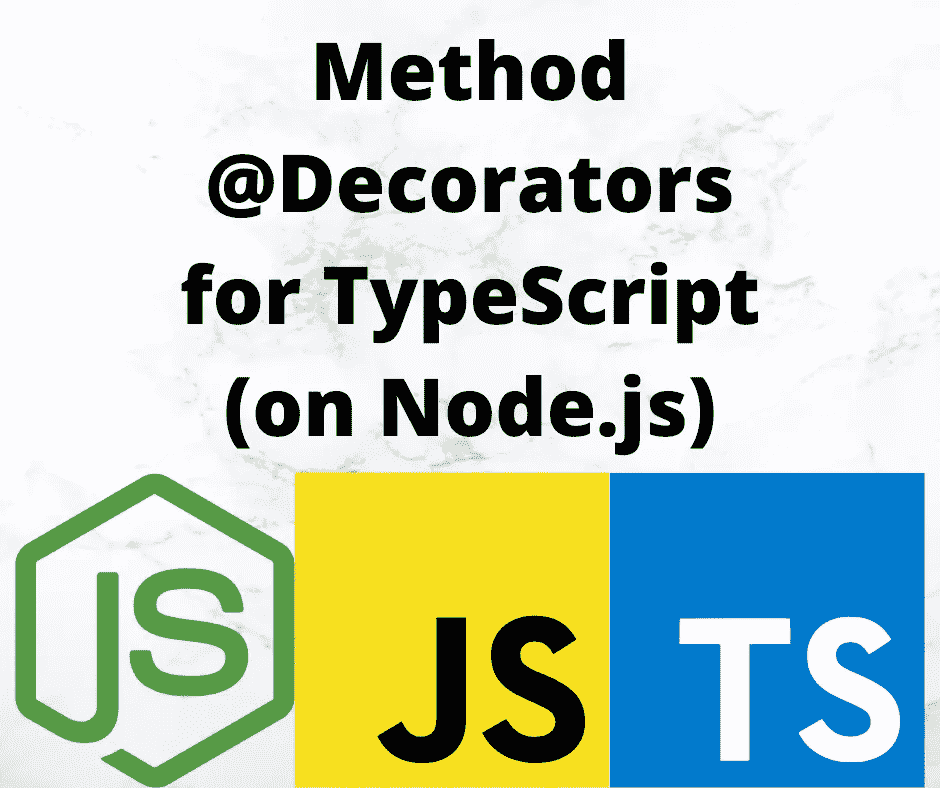

# 对 TypeScript 中的方法修饰符的深入介绍

> 原文：<https://javascript.plainenglish.io/a-deep-introduction-to-method-decorators-in-typescript-6045d52e10a6?source=collection_archive---------12----------------------->



Image by Author using corresponding project logos

Decorators 允许我们在 TypeScript 中向类或方法添加额外的信息，类似于 Java 中的注释。方法修饰符应用于 TypeScript 中的类中定义的方法。有了它们，我们可以记录关于方法的信息，或者修改方法的执行。

在本文中，我们将探索如何使用和创建方法装饰器。方法当然是我们附加在类上的函数，或者是从超类继承来的。

要使用 decorator，必须在 TypeScript 中启用它们，所以请务必[阅读本系列的 decorator 介绍文章](/deep-introduction-to-using-and-implementing-typescript-decorators-a9e876ad0d43)。

在实践中，方法装饰者看起来像这样:

```
class A {
     @MethodDecorator()
     fly(meters: number) {
         // code
     }
}
```

方法修饰符应用于方法，而不是函数的参数。[参数装饰器是一个不同的东西](/introduction-to-parameter-decorators-in-typescript-b0042b5474ed)，我们在别处讨论过。

本文是系列文章的一部分:

*   [装修工简介](/deep-introduction-to-using-and-implementing-typescript-decorators-a9e876ad0d43)
*   [类装修工](https://itnext.io/deep-introduction-to-class-decorators-in-typescript-23005ea5d035)
*   [物业装修工](/a-deep-introduction-to-property-decorators-in-typescript-8ef011169ec)
*   [访问器装饰器](/typescript-accessor-decorators-in-depth-take-control-over-get-and-set-accessor-methods-8b85c95124f9)
*   [参数装饰器](/introduction-to-parameter-decorators-in-typescript-b0042b5474ed)
*   **法条装饰者** *法条装饰者*
*   [混合装修工](/implement-hybrid-decorator-functions-in-typescript-f6d24bc5abb0)
*   [用装饰器使用反射和反射 API](/using-the-reflection-and-reflection-metadata-apis-with-typescript-decorators-c56ba9c690c7)
*   [运行时使用装饰器进行数据验证](/runtime-data-validation-in-typescript-using-decorators-and-reflection-metadata-3219fdf5dfb5)

要使用 decorator，必须在 TypeScript 中启用两个特性，所以请务必阅读本系列的 decorator 介绍文章。

# TypeScript 中的方法装饰函数

方法装饰器就在方法实例化之前被调用。传递给这些函数的参数是:

1.  静态成员的类的构造函数，或者实例成员的类的原型。
2.  给出属性名称的字符串
3.  成员的 *PropertyDescriptor* 函数

前两个 decorator 函数参数与其他几种 decorator 类型的参数相同。PropertyDescriptor 是一些其他装饰器类型中使用的相同对象，但用法略有不同。JavaScript 填充该对象的方式与填充访问器的方式不同。

# 探索 TypeScript 中的方法修饰符

第一步，让我们创建一个装饰器来打印参数值。

```
import * as util from 'util'; function logMethod(target: Object, propertyKey: string,
                    descriptor: PropertyDescriptor) {
     console.log(`logMethod`, {
         target, propertyKey, descriptor,
          targetKeys: Object.getOwnPropertyNames(target),
         function: descriptor.value,
         funcText: descriptor.value.toString()
     });
}class MethodExample {
     @logMethod
     method(x: number) {
         return x * 2;
     } 
}
```

这将打印出关于目标、描述符和描述符中的`value`字段的可用数据。对于`targetKeys`,我们感兴趣的是验证`target`是包含该方法的类。对于`function`，我们了解到`value`字段包含函数，使用`toString`可以让我们看到函数的文本。

要查看输出:

```
$ npx ts-node lib/methods/methods.ts
logMethod {
   target: {},
   propertyKey: 'method',
   descriptor: {
     value: [Function: method],
     writable: true,
     enumerable: false,
     configurable: true
   },
   targetKeys: [ 'constructor', 'method' ],
   function: [Function: method],
   funcText: 'method(x) {\n        return x * 2;\n    }' 
}
```

是的，`target`显然是包含这个方法的类，`value`字段是实际的函数。

# 窥探方法调用

因为该方法有一个 PropertyDescriptor，所以我们可以尝试重写该函数。就像我们对[访问器](https://techsparx.com/nodejs/typescript/decorators/accessors.html)所做的一样，让我们尝试一个新的装饰器，它可以让我们窥探函数的输入和输出值。

```
function MethodSpy(target: Object,
          propertyKey: string, descriptor: PropertyDescriptor) {
     const originalMethod = descriptor.value;
     descriptor.value = function (...args: any[]) {
         console.log(`MethodSpy before ${propertyKey}`, args);
         const result = originalMethod.apply(this, args);
         console.log(`MethodSpy after ${propertyKey}`, result);
         return result;
     } 
} class SpiedOn {
     @MethodSpy
     area(width: number, height: number) {
         return width * height;
     } @MethodSpy
     areaCircle(diameter: number) {
         return Math.PI * ((diameter / 2) ** 2);
     } 
} const spyon = new SpiedOn(); console.log(spyon.area(6, 10)); 
console.log(spyon.area(16, 20)); console.log(spyon.areaCircle(10)); console.log(spyon.areaCircle(20));
```

在函数内部，我们保存了`descriptor.value`的初始值，因为那是实际的成员函数。我们用另一个接受任意数量参数的函数来代替它。记住`...args`成为一个数组，包含传递给函数的参数。我们首先打印函数名和提供的参数。然后，我们调用原始方法，提供参数，并捕获结果。然后我们打印函数名和结果，最后返回结果。

然后运行脚本:

```
$ npx ts-node lib/methods/spy.ts  
MethodSpy before area [ 6, 10 ] 
MethodSpy after area 60 60 
MethodSpy before area [ 16, 20 ] 
MethodSpy after area 320 320 
MethodSpy before areaCircle [ 10 ] 
MethodSpy after areaCircle 78.53981633974483 
78.53981633974483 
MethodSpy before areaCircle [ 20 ] 
MethodSpy after areaCircle 314.1592653589793 
314.1592653589793
```

在每种情况下，在阶段之前的*中打印的值是一个数组，在*阶段之后的*中打印的值是每种方法的预期结果。*

由于它是如何编写的，我们可以很容易地将它应用于任何方法的任何装饰器。它甚至会自动选择方法名。

# 方法和参数装饰器一起工作

我们已经建议这两种类型的装饰器可以一起工作来产生一个有用的结果。我们想要尝试的概念是一个参数装饰器，如果没有提供可选参数，它可以提供一个默认值。

这就是它的含义:

```
class DefaultExample {
     @SetDefaults     volume(
         z: number,
         @ParamDefault<number>(10) x?: number,
         @ParamDefault<number>(15) y?: number,
         title?: string
     ) {
         const ret = {
             x, y, z, volume: x * y * z, title
         };
         console.log(`volume `, ret);
         return ret;
     } 
}
```

一个类，它有一个基于`x`、`y`和`z`值计算*音量*的方法。`@ParamDefault`装饰器将让我们指定一个默认值。注意，参数有一个`?`,表示它是可选的。因此，我们需要一些代码来检测何时没有提供参数，并进行替换。

由于`@ParamDefault`是一个参数装饰器，它除了将它的存在记录到一个数组中之外不能做任何事情，正如我们在研究参数装饰器时所讨论的。为了替换默认值，我们需要一些代码来执行这个类的实例。我们刚刚展示了方法装饰者可以覆盖方法的函数，以便针对类实例执行。计划是在实际函数之前注入一个要调用的函数，并使用注入的函数来设置任何默认值。

让我们看看如何实现这一切，从`ParamDefault`开始:

```
const paramDefaults = []; 
... 
function ParamDefault<T>(value: T) {
    return (target: Object, propertyKey: string | symbol,
                    parameterIndex: number ) => {
           paramDefaults.push({
                  target, propertyKey, parameterIndex, value 
           }); 
    } 
}
```

这存储了关于 decorator 参数的数据，以及要使用的默认值。`paramDefaults`数组存储这些数据。

```
function findDefaults(target: Object, propertyKey: string) {
     const ret = [];
     for (const def of paramDefaults) {
         if (target === def.target
          && propertyKey === def.propertyKey) {
             ret.push(def);
         }
     }
     return ret; 
} function SetDefaults(target: Object, propertyKey: string,
                          descriptor: PropertyDescriptor) {
     const originalMethod = descriptor.value;
     descriptor.value = function (...args: any[]) {
         console.log(`SetDefaults before ${propertyKey}`, args);
         for (const def of findDefaults(target, propertyKey)) {
             if (typeof args[def.parameterIndex] === 'undefined'
              || args[def.parameterIndex] === null) {
                 args[def.parameterIndex] = def.value;
             }
         }
         console.log(`SetDefaults after substitution ${propertyKey}`, args);
         const result = originalMethod.apply(this, args);
         console.log(`SetDefaults after ${propertyKey}`, result);
         return result;
     } 
}
```

`SetDefaults` decorator 函数安装了一个函数，它将根据所声明的默认值来处理替换值。`findDefaults`功能在`paramDefaults`中搜索与`target`和`propertyKey`匹配的所有项目。选择了缺省值后，我们可以查看实际的参数，看看是否有任何参数没有提供——我们将其定义为`undefined`或`null`。如果参数没有给出，那么进行替换，然后调用原始函数，并返回结果。

回到我们的例子，有四种组合可以尝试:

1.  未提供`x`和`y`值。
2.  仅`x`未提供。
3.  仅`y`未提供。
4.  `x`和`y`均已供应。

这处理了替换缺失参数值的所有四种可能性。此外，我们添加了另一个参数 title，在这里我们不提供缺省值，以验证缺少替换。最后，参数`z`是一个非可选参数，用于确保这些值得到正确处理。

这构成了我们的测试代码:

```
const de = new DefaultExample();
// both x and y missing 
console.log(de.volume(10)); 
console.log('----------------------'); 
// only x missing 
console.log(de.volume(20, null, 20, "Second")); 
console.log('----------------------'); 
// only y missing 
console.log(de.volume(30, 30, null)); 
console.log('----------------------'); 
// both x and y supplied 
console.log(de.volume(40, 40, 50, "Fourth"));
```

它处理刚才提到的四种情况，并确保为每个参数传递不同的值，以确保调用之间没有值的流失。

结果看起来像这样:

```
$ npx ts-node lib/methods/defaults.ts  
SetDefaults before volume [ 10 ] 
SetDefaults after substitution volume [ 10, 10, 15 ] 
volume  { x: 10, y: 15, z: 10, volume: 1500, title: undefined } 
SetDefaults after volume { x: 10, y: 15, z: 10, volume: 1500, title: undefined } 
{ x: 10, y: 15, z: 10, volume: 1500, title: undefined } 
---------------------- 
SetDefaults before volume [ 20, null, 20, 'Second' ] 
SetDefaults after substitution volume [ 20, 10, 20, 'Second' ] 
volume  { x: 10, y: 20, z: 20, volume: 4000, title: 'Second' } 
SetDefaults after volume { x: 10, y: 20, z: 20, volume: 4000, title: 'Second' } 
{ x: 10, y: 20, z: 20, volume: 4000, title: 'Second' } 
---------------------- 
SetDefaults before volume [ 30, 30, null ] 
SetDefaults after substitution volume [ 30, 30, 15 ] 
volume  { x: 30, y: 15, z: 30, volume: 13500, title: undefined } 
SetDefaults after volume { x: 30, y: 15, z: 30, volume: 13500, title: undefined } 
{ x: 30, y: 15, z: 30, volume: 13500, title: undefined } 
---------------------- 
SetDefaults before volume [ 40, 40, 50, 'Fourth' ] 
SetDefaults after substitution volume [ 40, 40, 50, 'Fourth' ] 
volume  { x: 40, y: 50, z: 40, volume: 80000, title: 'Fourth' } 
SetDefaults after volume { x: 40, y: 50, z: 40, volume: 80000, title: 'Fourth' } 
{ x: 40, y: 50, z: 40, volume: 80000, title: 'Fourth' }
```

虚线是为了清楚地阅读结果。

仔细查看这些结果，您会发现所有的替换都如预期的那样发生了。

# 摘要

我们已经实现了一个非常有趣的特性，用方法和参数装饰器的组合来替换缺省方法参数的能力。参数装饰器函数保存了关于默认值的数据，方法装饰器函数检测到缺少有默认值可用的参数。

# 关于作者

[***大卫·赫伦***](https://davidherron.com) *:大卫·赫伦是一名作家和软件工程师，专注于技术的明智使用。他对太阳能、风能和电动汽车等清洁能源技术特别感兴趣。David 在硅谷从事了近 30 年的软件工作，从电子邮件系统到视频流，再到 Java 编程语言，他已经出版了几本关于 Node.js 编程和电动汽车的书籍。*

*最初发表于*[*https://techsparx.com*](https://techsparx.com/nodejs/typescript/decorators/methods.html)*。*

*更多内容看* [***说白了就是***](https://plainenglish.io/) *。报名参加我们的* [***免费每周简讯***](http://newsletter.plainenglish.io/) *。关注我们* [***推特***](https://twitter.com/inPlainEngHQ) *和*[***LinkedIn***](https://www.linkedin.com/company/inplainenglish/)*。加入我们的* [***社区不和谐***](https://discord.gg/GtDtUAvyhW) *。*