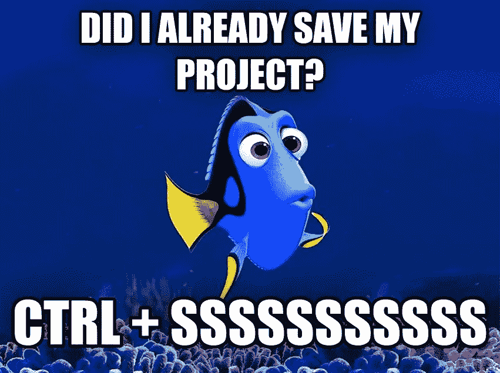
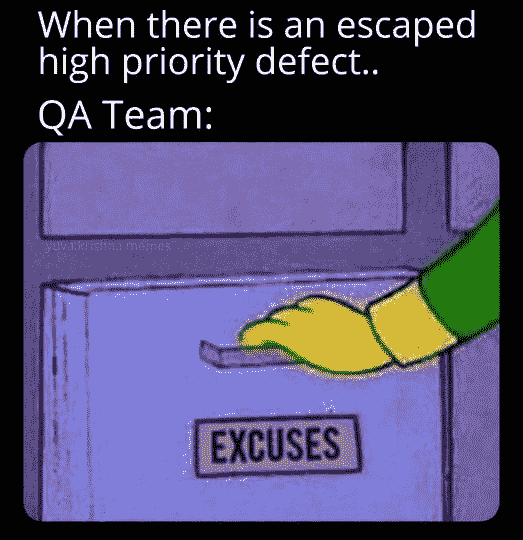

# 通过编程迷因带来的欢笑

> 原文：<https://javascript.plainenglish.io/a-dose-of-laughter-via-programming-memes-e09113d15349?source=collection_archive---------1----------------------->

## 任何开发人员都能理解的日常迷因。

Photo by [Bagas Muhammad](https://unsplash.com/@bagskai?utm_source=medium&utm_medium=referral) on [Unsplash](https://unsplash.com?utm_source=medium&utm_medium=referral)

你听过这样一句话吗，“笑是缓解压力的最佳良药？”

但是怎么做呢？心情不好的时候怎么笑或者微笑？

今天，我试图整理一些我在互联网和社交媒体上发现的与编程相关的笑话/迷因。这些笑话让我笑了，希望它也能让你笑。

> *我们走吧。准备好注射第一剂。*

# 人们会因为什么记住你？

Picture Credit:[https://www.facebook.com/yuva.krishna.memes](https://www.facebook.com/yuva.krishna.memes)

# 当你指导你的下级完成一些任务，让他们得到晋升…

Picture Credit: monkeyuser.com

# 我总是看到有人贴这种东西…

Picture Credit:[https://www.facebook.com/javascriptJS/](https://www.facebook.com/javascriptJS/?ref=page_internal)

# 真的吗？是我创造了这个吗？

Picture Credit:[https://www.facebook.com/javascriptJS/](https://www.facebook.com/javascriptJS/?ref=page_internal)

# 如果我有机会写产品需求…我肯定会做这样的事情…

Picture Credit:[https://www.facebook.com/javascriptJS](https://www.facebook.com/javascriptJS/?ref=page_internal)

# 需要 bug 来保护工作…

Picture Credit:[https://www.facebook.com/javascriptJS](https://www.facebook.com/javascriptJS/?ref=page_internal)

# 管理层或客户希望在 2 天内完成这项任务…所以这是一个优先事项。

Picture Credit:[https://www.facebook.com/groups/it.humor.and.memes](https://www.facebook.com/groups/it.humor.and.memes)

# 当你完成你的数据，还有 1 周的时间来重置周期…

Picture Credit:[https://www.facebook.com/groups/it.humor.and.memes](https://www.facebook.com/groups/it.humor.and.memes)

# 看起来像梁得到 CSS 应用为浮动右…

Picture Credit:[https://www.facebook.com/groups/it.humor.and.memes](https://www.facebook.com/groups/it.humor.and.memes)

# 当我们由于时间问题而不关注技术债务时…

Picture Credit:[https://www.monkeyuser.com/](https://www.monkeyuser.com/)

# 谁使用右 CTRL？

Picture Credit:[https://www.facebook.com/groups/it.humor.and.memes](https://www.facebook.com/groups/it.humor.and.memes)

# 当你意识到你需要记住你写的所有东西的时候…

Picture Credit:[https://www.facebook.com/groups/it.humor.and.memes](https://www.facebook.com/groups/it.humor.and.memes)

# 不存在有意义的提交消息…

Picture Credit:[https://programmerhumor.io/programming-memes](https://programmerhumor.io/programming-memes)

# 在办公室穿很好看的 t 恤，对吧？

Picture Credit:[https://www.facebook.com/groups/it.humor.and.memes](https://www.facebook.com/groups/it.humor.and.memes)

# 希望你喜欢这个内容，你也可以看看我以前的帖子。

# 测试您自己的应用程序…

[https://programmerhumor.io/programming-memes/testing-your-own-chatbot-like/](https://programmerhumor.io/programming-memes/testing-your-own-chatbot-like/)

【https://programmerhumor.io/】来源:

# 大多数冷静的人…

[https://programmerhumor.io/programming-memes/the-lag-is-real/](https://programmerhumor.io/programming-memes/the-lag-is-real/)

**来源:**[https://programmerhumor.io/](https://programmerhumor.io/programming-memes/testing-your-own-chatbot-like/)

# 你是不是按了两次才确定？

[https://www.reddit.com/r/ProgrammerHumor/comments/pf1hgl/keys_go_brrrrrr/](https://www.reddit.com/r/ProgrammerHumor/comments/pf1hgl/keys_go_brrrrrr/)

**来源:**[https://www.reddit.com/r/ProgrammerHumor/](https://www.reddit.com/r/ProgrammerHumor/comments/pf1hgl/keys_go_brrrrrr/)

# 代码重用…

[https://www.monkeyuser.com/2018/code-reuse/?sc=true&dir=random](https://www.monkeyuser.com/2018/code-reuse/?sc=true&dir=random)

**来源:**[https://www.monkeyuser.com/](https://www.monkeyuser.com/2018/code-reuse/?sc=true&dir=random)

# 有人经历过这种转变吗？

[https://www.monkeyuser.com/2018/sprint-break/?sc=true&dir=random](https://www.monkeyuser.com/2018/sprint-break/?sc=true&dir=random)

**来源:【https://www.monkeyuser.com/】T22**

# 当开发人员错过时，意味着没有适当的单元测试。当 QA 错过时…

[https://www.facebook.com/yuva.krishna.memes](https://www.facebook.com/yuva.krishna.memes)

# 这种感觉…

[https://www.facebook.com/yuva.krishna.memes](https://www.facebook.com/yuva.krishna.memes)

# 好建议…

[https://www.facebook.com/yuva.krishna.memes](https://www.facebook.com/yuva.krishna.memes)

# 希望这个梦想成真…

[https://www.facebook.com/yuva.krishna.memes](https://www.facebook.com/yuva.krishna.memes)

# 这是谁写的？我们来玩一个指责游戏吧… LOL

[https://www.facebook.com/yuva.krishna.memes](https://www.facebook.com/yuva.krishna.memes)

# 让我们有一个 PJ…

[https://www.reddit.com/r/ProgrammerHumor/](https://www.reddit.com/r/ProgrammerHumor/)

*更多内容请看*[***plain English . io***](https://plainenglish.io/)*。报名参加我们的* [***免费周报***](http://newsletter.plainenglish.io/) *。关注我们关于*[***Twitter***](https://twitter.com/inPlainEngHQ)*和*[***LinkedIn***](https://www.linkedin.com/company/inplainenglish/)*。查看我们的* [***社区不和谐***](https://discord.gg/GtDtUAvyhW) *加入我们的* [***人才集体***](https://inplainenglish.pallet.com/talent/welcome) *。*