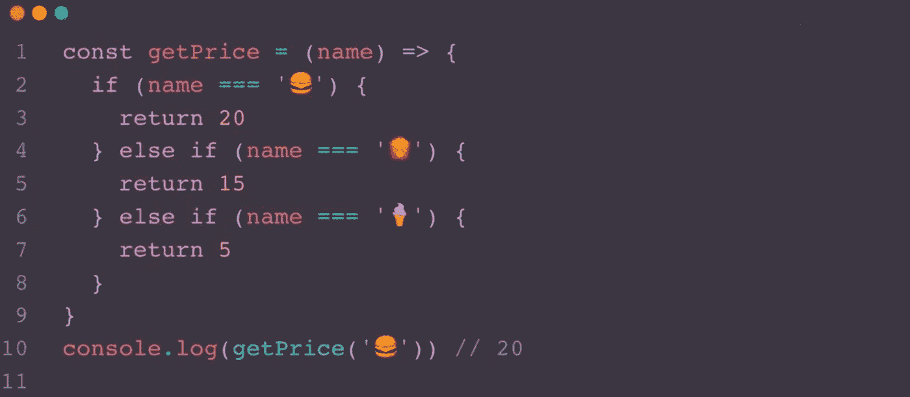
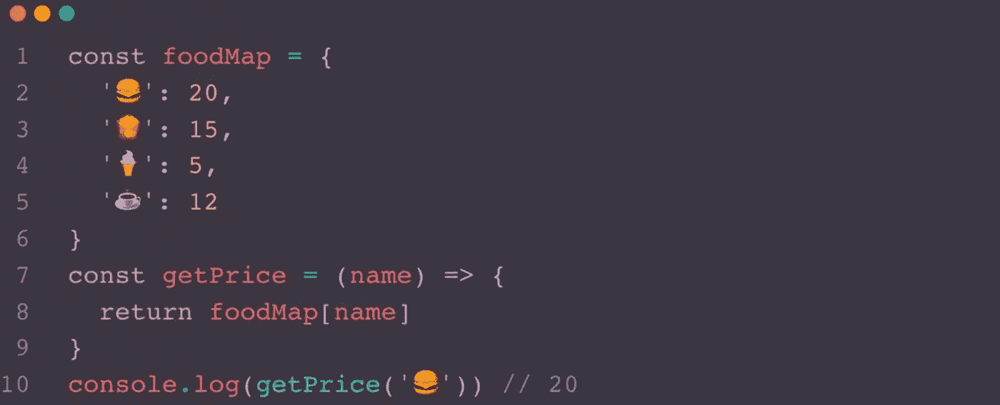
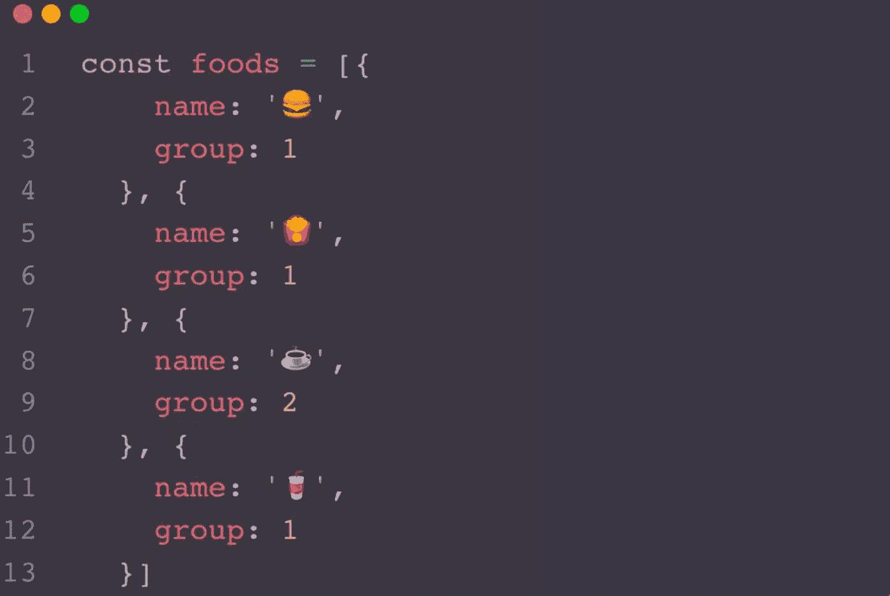
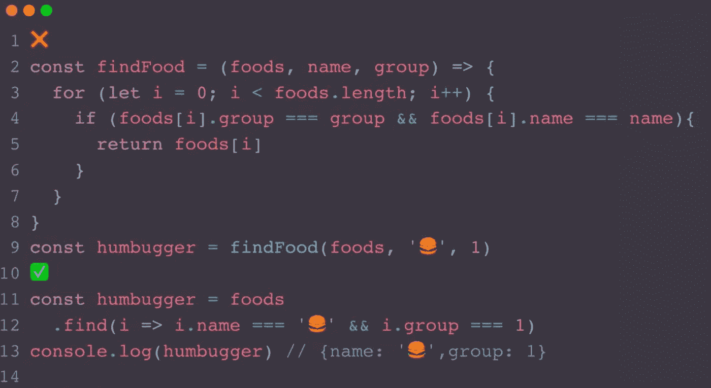
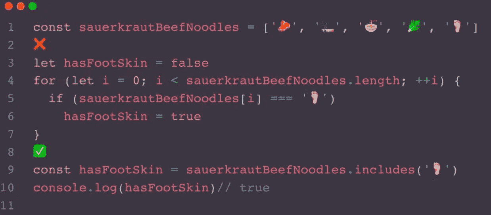
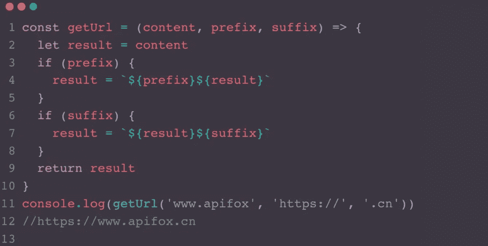
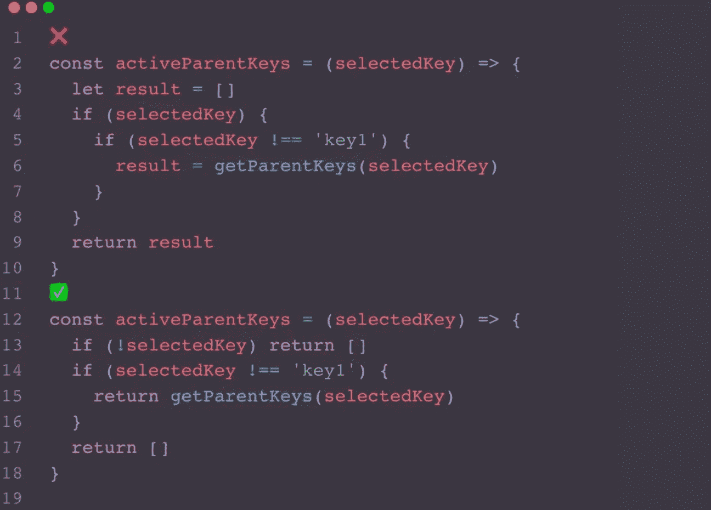
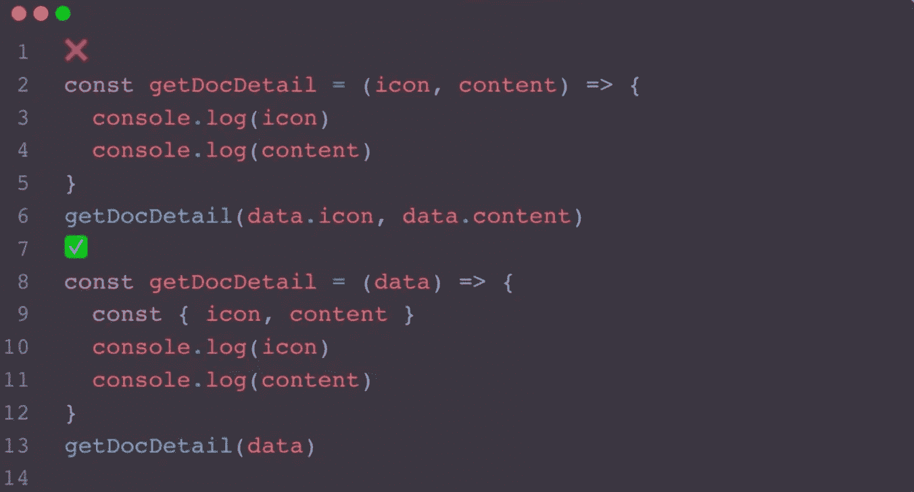
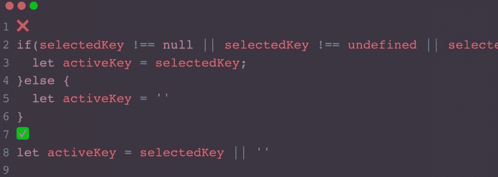

# 一些有用的 JavaScript 优化技巧，一看就知道

> 原文：<https://javascript.plainenglish.io/a-few-useful-javascript-optimization-hacks-that-you-can-learn-at-a-glance-e57d5ff90143?source=collection_archive---------13----------------------->

## 帮助优化 JavaScript 代码的简单而有用的技巧。

# 减少如果…否则面条代码

*   一旦我们开始编写两个以上的函数，就该考虑是否有更好的方法来优化它们了。
*   例如，如果我们需要根据麦当劳的名称来计算食物的价格，您可能需要使用更好的方法。

*   编写的方式，如上图，在代码体中会有大量的条件语句，而当我们下次要添加一个产品时就需要修改函数内的逻辑来添加另一个`if…else`语句，这在一定程度上也违背了当我们需要添加逻辑来尝试扩展软件实体以解决变更的需求时的开闭原则，而不是通过修改已有的代码来完成变更。
*   这是一种非常经典的优化方式，我们可以使用类似地图的机构数据来保存所有的商品，这里我们直接创建一个对象来存储。

*   这样下次我们需要添加一个商品的时候我们就不需要改变 getPrice 的逻辑了，当然，在这里，实际上大多数人喜欢直接在地方使用`foodMap`，我在这里只是举了一个简单的例子来表达这个想法。
*   那么这个时候就有同学会问，如果我不想键只字符串它，这个时候你可以使用新的 Map，想法是类似的，额外扩展一个实体来存储变化。

# 流水线操作而不是冗余循环

*   有这样一份麦当劳的食物清单。

*   如果你想找到属于第一组的食物，你会怎么找？
*   上面的方法是我们以前使用的方法，显然我们用 filter 和 map 代替 for 循环，不仅使代码更简洁，而且使语义更清晰，这样我们可以立即看到它首先过滤数组，然后重新组织它。

# 查找替换冗余循环

*   和上面的例子一样，如果我们想通过属性值在 food 对象的数组中查找特定的食物，find 就很有用。

# 包括替换冗余环路

*   和上面两个细节相似的是这些都是已有的函数，也就是说，我们不必重写内置函数，明智地使用它会节省很多时间。
*   众所周知，一碗康某福老聃酸菜牛肉面有酸菜、面条、牛肉粒、香烟和脚皮，那么我们想用函数来确认面条里面是否有脚皮我们怎么写会更简洁呢？

*   同样的，也不只是康某福的酸菜牛肉面可以这么杂耍；查找数组中特定元素的所有类似操作都可以使用 includes 函数调用。

# 结果返回值

我们平时写一些有返回值的函数经常为了返回值变量命名而纠结，甚至对于一些长函数不使用变量而是直接返回，这样的习惯其实是不好的，因为下次我们引用代码的时候也需要重新理清逻辑。

通常，在一个小函数中，我们可以使用 result 作为返回值。

# 提前返回

*   但是，上面使用 result 作为返回值并不适用于所有情况，经常会有一些时候我们需要提前结束函数体，以避免后面同事对程序的冗余读取。
*   下面的例子在`selectedKey`不存在的时候应该立即返回，这样你就不用继续读下面的代码了，否则，面对更复杂的函数会增加很多的阅读成本。

# 保持物品完整

*   往往在请求中，我们得到后端返回的数据，会根据一些属性进行处理，如果需要处理的属性较少的时候，很多同学会习惯使用第一种方法。
*   但实际上，这种习惯并不好，因为当你无法确定函数后来是否需要添加依赖属性时应该保持对象的完整性，正如我在上一篇文章中提到的，学会拥抱变化，如果`getDocDetail`不仅要使用图标和内容，还可能有标题、日期等属性，那么我们还不如直接将完整的对象传入，这样不仅增加了更短的参数列表，还使代码更具可读性。

# 聪明地使用运算符

*   当我们需要创建一个新的变量时，有时我们需要检查其值所引用的变量是否为 null 或未定义，因此我们可以使用简单的方法来编写它。

现在你知道了。感谢您的阅读。

*更多内容看* [***说白了。报名参加我们的***](https://plainenglish.io/) **[***免费周报***](http://newsletter.plainenglish.io/) *。关注我们关于*[***Twitter***](https://twitter.com/inPlainEngHQ)*和*[***LinkedIn***](https://www.linkedin.com/company/inplainenglish/)*。加入我们的* [***社区***](https://discord.gg/GtDtUAvyhW) *。***