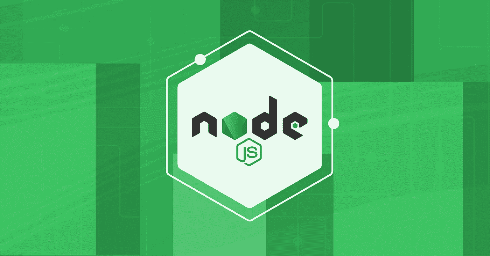
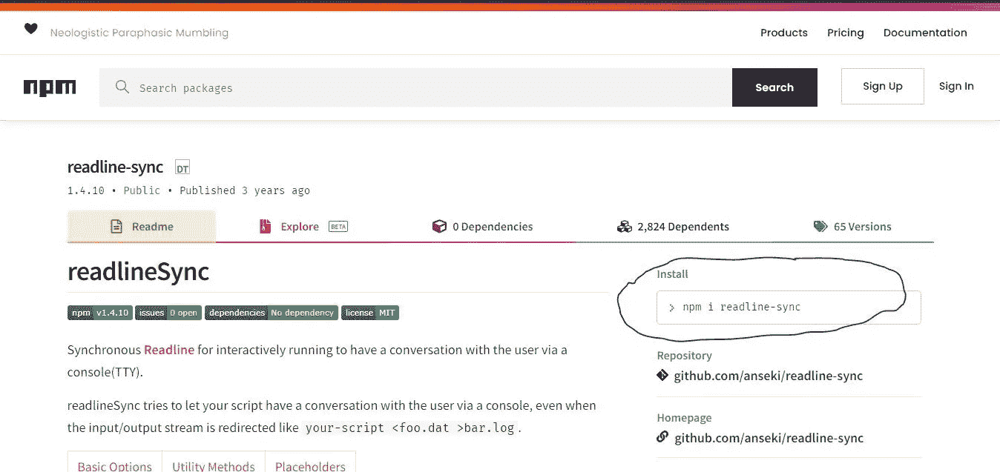
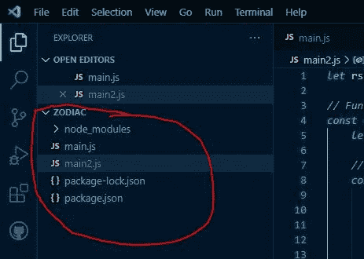
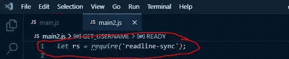
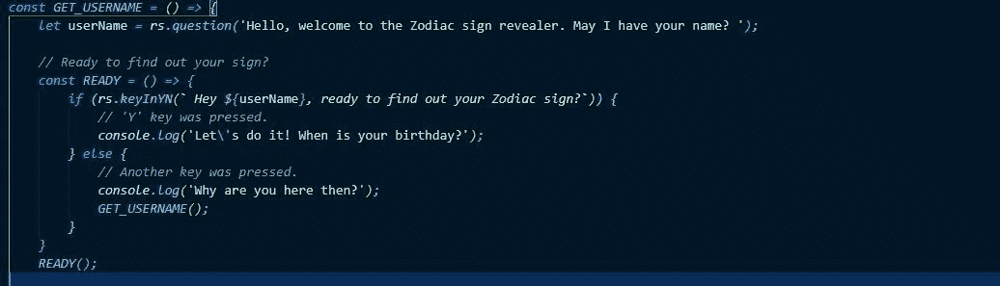
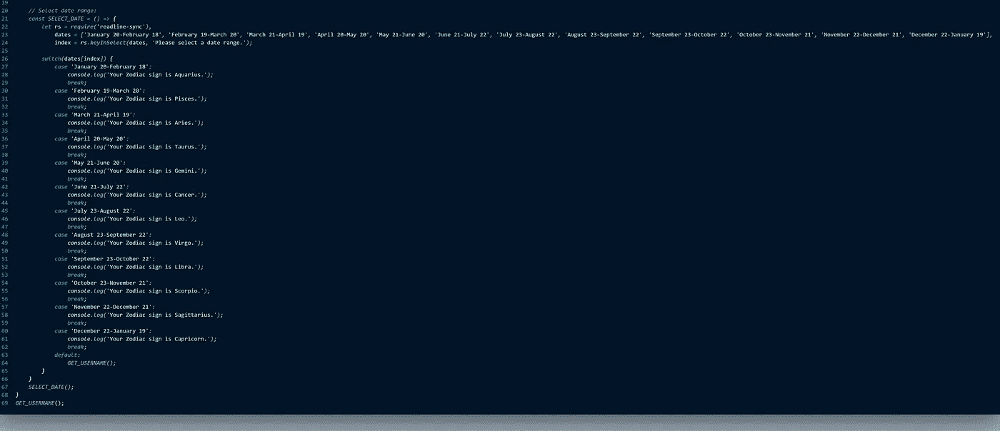
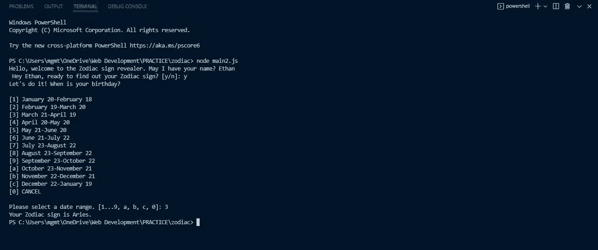

# 关于 Node.js 的几句话&一个如何使用 NPM 的 readline-sync 包的例子

> 原文：<https://javascript.plainenglish.io/a-few-words-on-node-js-an-example-on-how-to-use-npms-readline-sync-package-bc72156852a0?source=collection_archive---------17----------------------->

作为一名前端开发人员，我相信您已经听说过 Node.js。对于那些不知道的人，让我简单解释一下:Node.js 是一个开源的后端运行时环境，它在 web 浏览器之外执行 JavaScript 代码。通过使用 Node.js，开发人员可以使用 JavaScript 在服务器(后端)上运行脚本，然后将它们发送到用户的 web 浏览器。在将程序发布到网站之前，您可以在终端中看到程序是如何运行的。一些大公司使用这种软件，包括网飞、LinkedIn、SAP 和 PayPal 等等。

现在你至少对 Node.js 是什么有了基本的了解，是时候说说 NPM([npmjs.com](https://www.npmjs.com/))了。“Node Package Manager”的首字母缩写，NPM 是一个包含数十万个与 Node.js 兼容的代码包的库，让我们将你编写软件程序的过程比作制造汽车的过程。汽车公司不会自己制造大部分的汽车零件；那会非常耗时。相反，他们从其他专门制造汽车零部件的公司购买，并在制造过程中安装。

写一个软件程序就是这样。如果您必须自己编写每一行代码，那将会非常耗时，尤其是在处理大型复杂的程序时。打个比喻，NPM 是汽车零部件制造商。有这么多代码包可供选择，可能已经有一个组件可以集成，而不是自己编写，这样可以节省大量时间。

让我向你展示我是如何将 NPM 最常用的软件包之一 readline-sync 集成到我制作的一个确定用户星座的项目中的。在这个 GitHub 资源库中签出文件的全部内容:【https://github.com/EGROENE/JS-PRACTICE-Zodiac-Revealer 

**1。**首先，打开终端，确保你位于你想要使用的文件夹的根目录。如果您已经在 VS 代码中打开了这个文件夹，那么当您在 VS 代码中打开终端时，您应该自动位于根目录。一旦你到达那里，输入命令 **npm init** 并按下“回车”。

**2。接下来你会被问很多问题，你必须以适合你的特定程序的方式来回答它们，但是如果你正在做一些相当基本的事情，只要对所有问题都按“回车”键，直到你被问到“这样可以吗？”。键入“yes ”,然后按“Enter”。**

**3。**接下来，在 NPM 上找到 readline-sync 页面。要么准确搜索“readline-sync”并点击同名软件包，要么点击以下链接:【https://www.npmjs.com/package/readline-sync。从 readline-sync 页面复制下图中圈出的代码( **npm i readline-sync** )并将其粘贴到项目根目录下的终端中，然后按“Enter”键。在您的终端中，您现在应该会看到一条类似“添加了 1 个包，并在 4s 内审计了 2 个包”的消息，下面一行是“发现了 0 个漏洞”，下一行是您的根文件。

**4。检查你的文件目录。“package.json”和“package-lock.json”文件以及“node_modules”文件夹应该在那里。“package-lock.json”文件可能也在此文件夹中。如果您看到这些，您的 NPM 软件包已成功安装！**

**5。写你的 JavaScript 吧！确保按照 readline-sync 页面上显示的示例来执行您需要的任何操作。以下是我在这个项目中遵循的步骤:**

**a.** 初始化变量以将包实现到您的文件中:

**b.** 询问用户姓名&是否准备好找出他们的标志:

**c.** 提供日期范围，以便用户可以选择他们的生日。一旦用户选择了一个选项，就会出现一条消息，告诉他们他们的标志是什么。用户也可以按“0”取消并结束程序:

**6。**这是一个用户交互的例子，显示在内置终端的 VS 代码中:

**7。**正如你在上面看到的，为了运行程序，在终端输入命令 **node main2.js** 。用您想要运行的文件名替换“main2.js”。

同样，你可以完整地看到这个项目，也可以从下面的 GitHub 库下载我的文件:[https://github.com/EGROENE/JS-PRACTICE-Zodiac-Revealer](https://github.com/EGROENE/JS-PRACTICE-Zodiac-Revealer)。观看这里的演示:[https://youtu.be/uWHO3pqIsZ4](https://youtu.be/uWHO3pqIsZ4)。

我是一个使用 Node.js 的新手，所以这是一个关于你可以用 NPM 包做什么的比较基本的例子。如果你从中学到了什么，我很乐意听听你学到了什么。如果你有任何批评，积极的反馈，或新的信息要补充，我也很想听听你有什么要说的。另外，如果你喜欢阅读这样的文章，请考虑在这里关注我！我很乐意与您联系并分享想法。随着时间的推移，当我有时间的时候，我会写更多这样的文章。

感谢阅读！

*更多内容请看*[***plain English . io***](https://plainenglish.io/)*。报名参加我们的* [***免费周报***](http://newsletter.plainenglish.io/) *。关注我们关于*[***Twitter***](https://twitter.com/inPlainEngHQ)*和*[***LinkedIn***](https://www.linkedin.com/company/inplainenglish/)*。查看我们的* [***社区不和谐***](https://discord.gg/GtDtUAvyhW) *加入我们的* [***人才集体***](https://inplainenglish.pallet.com/talent/welcome) *。*