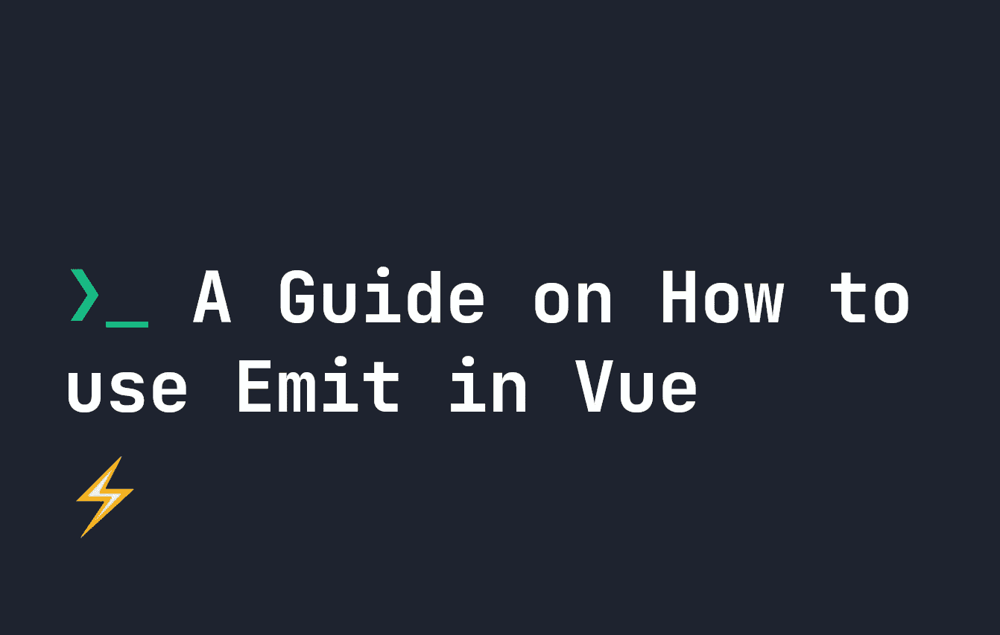
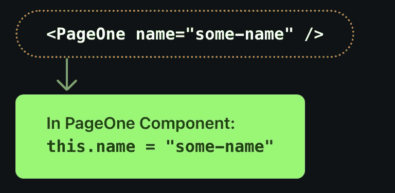

# 关于如何在 Vue.js 中使用 Emit 的指南

> 原文：<https://javascript.plainenglish.io/a-guide-on-how-to-use-emit-in-vue-js-d3dc668d9f6b?source=collection_archive---------10----------------------->



在 Vue.js 中，数据通常以单向方式从父组件传递到其子组件。这是用 [props](https://fjolt.com/article/vue-how-do-props-work) 传递的，props 是我们赋予[组件](https://fjolt.com/article/vue-using-components)的属性或特性。

例如，如果我们调用一个组件`PageOne`，它有一个名为`name`的属性，那么这个`name`属性将在`PageOne`组件本身中变得可用，让我们可以用它做我们想做的事情。这样，当我们在父组件或页面中声明数据时，数据将被传递给子组件:



在大多数情况下，道具允许我们用数据做所有需要做的事情。**然而，有时我们需要向上发出数据**——从子组件到其父组件。为此，我们使用了`$emit`，它允许我们向上发送数据，然后在触发`$emit`事件时触发父组件中的一个事件。

# $emit 如何在 Vue.js 中工作

在 Vue.js 中有三种方式来触发`$emit`,这取决于你是使用选项 API、组合 API 还是内联你的`$emit`事件。如果你不确定，[你可以在这里阅读组合 API 和选项 API 的区别。](https://fjolt.com/article/vue-composition-api-vs-options-api)

*   `this.$emit`在选项 API 内。
*   `$emit`如果在你的 HTML 模板中使用。
*   `defineEmits`和`emit`如果在组合 API 中使用。

让我们通过一个愚蠢的例子来看看这是如何工作的。假设我们有一个计数器组件，如下所示:

```
<template>
    <button @click="$emit('counterEvent')">Click Me</button>
</template>
```

这个组件存储在一个名为`Counter.vue`的文件中。我们的组件不能被更改，因为它在其他地方被使用，但是它确实有一个`$emit`事件在它被点击时被触发。这是完美的，因为我们可以在父组件中使用它。

那么，如果我们想在某个地方添加这个组件——例如，在我们的`App.vue`文件中——并使用它来显示我们的计数器的值。现在让我们试着这样做:

```
<template>
    <h1>{{ counter }}</h1>
    <Counter @counter-event="incrCounter"/>
</template><script>
import Counter from './Counter.vue'
export default {
    // Add our components
    components: {
      Counter
    },
    // Store our data
    data() {
        return {
            counter: 0
        }
    },
    methods: {
        incrCounter: function() {
            this.counter += 1;
        }
    }
}
</script>
```

让我们来分解一下——首先，我们包括我们的`Counter`。因为它有一个名为`counterEvent`的`$emit`事件，我们可以将它附加到我们的`Counter` HTML 中。每当`$emit`触发时，它将触发`counterEvent`，从而触发该属性中的函数。**在这里，我们随时运行**`**incrCounter**`**`**counterEvent**`**火灾。****

**通过这样做，我们还将我们的`counter`数据增加 1，因为这就是`incrCounter`所做的。因此，我们已经将 click 事件向上发送到父组件。**

# **烤肉串盒**

**您可能会注意到，当我们定义我们的`$emit`事件时，我们使用了 camel case ( `counterEvent`)，但是在跟踪事件时，我们使用了 kebab case ( `counter-event`)。**

**在 **Vue 3** 中，可以互换使用`counterEvent`和`counter-event`，因为 Vue 3 会自动将`counterEvent`转换为`counter-event`。在 **Vue 2** 中，该功能不存在，所以两者都使用`counter-event`即可。**

# **用$emit 传递数据**

**相反，我们希望我们的组件定义`counterEvent`应该增加多少。如果我们想这样做，我们可以向`$emit`函数传递第二个参数，即值:**

```
<template>
    <button @click="$emit('counterEvent', 2)">Click Me</button>
</template>
```

****这里是**，我们正在将值`2`传递给我们的`counterEvent`。让我们回到我们的`App.vue`文件。为了在`counterEvent`中利用这个值，我们需要把它写成一个函数。下面，`n`是数值:**

```
<template>
    <h1>{{ counter }}</h1>
    <Counter @counter-event="(n) => incrCounter(n)"/>
</template><script>
import Counter from './Counter.vue'
export default {
    // Add our components
    components: {
      Counter
    },
    // Store our data
    data() {
        return {
            counter: 0
        }
    },
    methods: {
        incrCounter: function(value) {
            this.counter += value;
        }
    }
}
</script>
```

**现在，我们的计数器将增加子组件中的值，从而允许我们将数据传递给父组件。正如您所料，这不仅限于数字，还可以包括任何数据结构——包括对象和字符串。**

# **将$emit 与选项 API 一起使用**

**我们已经展示了一个非常简单的例子，但是我们也可以使用一个函数来编写我们的`Counter.vue`子组件。下面是一个使用`this.$emit`的**选项 API** 的例子:**

```
<template>
    <button @click="emitFunction">Click Me</button>
</template><script>
export default {
  emits: [ 'counterEvent' ],
    methods: {
        emitFunction: function() {
            this.$emit('counterEvent', 2)
        }
    }
}
</script>
```

**这可能是一种稍微干净的使用`$emit`的方式，尤其是当你想在点击按钮的同时使用`$emit`做其他事情的时候。**

# **将您的发出事件添加到原型中**

**您可能会注意到，我们还在原型的`emits`中定义了我们的 emit 事件。这是一个很好的实践，原因有二:**

*   ****它通过显示在这个组件中哪些发射事件是可能的，让你自我记录代码**。**
*   ****它帮助您跟踪已被否决的发射**，因为如果使用了发射事件，但在`emits`数组中没有找到，Vue 将抛出一个错误。**

# **将$emit 与组合 API 一起使用**

**我们可以在组合 API 中使用`$emit`——唯一的区别是我们必须使用`defineEmits`来代替。**

```
<template>
    <button @click="emitFunction">Click Me</button>
</template><script setup>
import { defineEmits } from 'vue'const emit = defineEmits(['counterEvent']);
const emitFunction = function() {
    emit('counterEvent', 2)
}
</script>
```

**`defineEmits`用于定义所有允许的`emit`事件的完整列表。这里，我们只有一个，`counterEvent`。如果你有不止一个，你可以这样定义它们:**

```
const emit = defineEmits(['counterEvent', 'anotherEvent', 'finalEvent']);
```

**如果使用未在`defineEmits`中列出的发射事件，Vue 将抛出一个警告，类似于在选项 API 上使用`emits`。否则，您可以像往常一样使用`emit()`函数来发射，根本不需要使用**选项 API** 。**

# **最终想法和最佳实践**

**Emit 是一个强大的工具，可以在必要时将数据发送回父节点。这意味着 Vue.js 中的数据流可以是双向的。在定义`emit`代码时，两个主要的最佳实践是:**

*   **总是在`emits`或`defineEmits`中定义您的 emit 事件，这将帮助您保持代码的整洁和良好的文档记录**
*   **Vue 3 中通常的惯例是在 HTML 中使用 kebab 大小写(`this-is-kebab-case`)，在脚本中使用 camel 大小写(`thisIsCamelCase`)。因此，这里最好也遵循这个惯例。**

**我希望你喜欢这个关于`$emit`如何工作的指南。敬请关注更多 [Vue 内容](https://fjolt.com/category/vue)。**

***更多内容请看*[***plain English . io***](https://plainenglish.io/)*。报名参加我们的* [***免费周报***](http://newsletter.plainenglish.io/) *。关注我们关于*[***Twitter***](https://twitter.com/inPlainEngHQ)*和*[***LinkedIn***](https://www.linkedin.com/company/inplainenglish/)*。加入我们的* [***社区不和谐***](https://discord.gg/GtDtUAvyhW) *。***