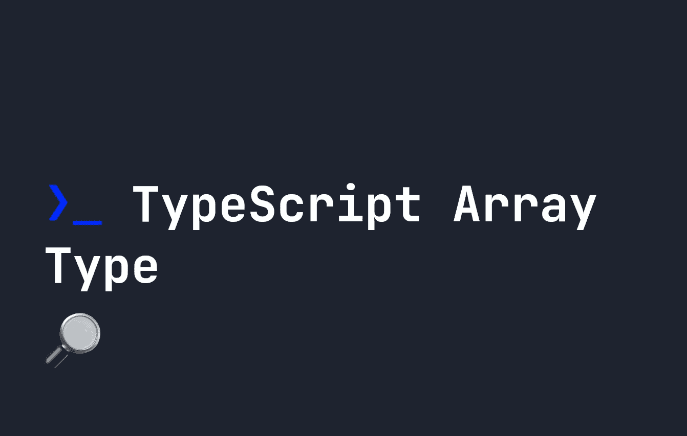

# 类型脚本数组类型指南

> 原文：<https://javascript.plainenglish.io/a-guide-to-typescript-array-type-bfdf59d8c516?source=collection_archive---------10----------------------->



数组在 TypeScript 中的工作方式和在 Javascript 中一样，唯一的区别是我们必须预先定义它们的类型。就其本质而言，数组是一个有序的数据列表。定义一个`Array` s 类型一开始可能会令人困惑，所以让我们看看它是如何工作的。

# 在 TypeScript 中定义数组类型

如果我们有一个数组，我们可以使用符号`type[]`在 TypeScript 中定义它的类型。例如，下面的变量`arrayType`应该是**字符串**的**数组**。

```
let arrayType:string[] = [ 'hello', 'there' ]
```

类似地，一组数字可以这样定义:

```
let myNumbers:number[] = [ 1, 2, 3, 4 ];
```

这也使任何未来的数组项符合该类型。例如，我们不能将一个`string`推到或者添加到一个定义为`number`类型的数组的末尾:

```
let myNumbers:number[] = [ 1, 2, 3, 4 ];
// Throws an error.
myNumbers.push("string");
```

# TypeScript 中的元组类型

[我已经在这里](https://fjolt.com/article/typescript-tuples)的 TypeScript 中写了关于元组的内容，但是它们是一种数组类型，具有指定类型的定义数量的项。例如，我们可以定义一个包含两个元素的数组，类型为`string`和`number`，这将被称为一个**元组**。这可以通过这样做来实现:

```
let myTuple:[ string, number ] = [ "hello", 20 ];
```

元组可以是任意长度，你可以在这里了解更多关于元组是如何定义的。

# 在 TypeScript 中将混合类型存储在数组中

有时，我们知道一个数组将由`number`或`string`元素组成，但我们不确定顺序，甚至不知道有多少。因此，**元组**在这里并不是正确的选择。相反，我们可以使用与以前相同的格式定义这样的数组，只让 TypeScript 知道它可以是多种类型。

例如，对于一个未知长度的数组，其中的任何项都可能是一个`number`或一个`string`，我们可以编写以下代码:

```
let type:(string | number)[] = [ 'hello', 'world', 20, 40, 'goodbye' ];
```

# 在 TypeScript 中对数组使用泛型类型格式

最后，还可以使用[通用类型](https://fjolt.com/article/typescript-generics)定义格式来定义 TypeScript 中的`Array`类型。例如，数字的`Array`可以这样定义:

```
let type:Array<number> = [ 0, 1, 2, 3, 4, 5 ]
```

或者，可以这样定义一个数组，其中的项可以是一个`string`或一个`number`:

```
let type:Array<string | number> = [ 'hello', 'world', 20, 40, 'goodbye' ];
```

# 结论

理解 TypeScript 中的数组类型是日常使用 TypeScript 的基础。我希望你喜欢这个指南，如果你想要更多的文字内容，你可以在这里找到。

*更多内容看* [***说白了。报名参加我们的***](https://plainenglish.io/) **[***免费周报***](http://newsletter.plainenglish.io/) *。关注我们关于*[***Twitter***](https://twitter.com/inPlainEngHQ)*和*[***LinkedIn***](https://www.linkedin.com/company/inplainenglish/)*。查看我们的* [***社区不和谐***](https://discord.gg/GtDtUAvyhW) *，加入我们的* [***人才集体***](https://inplainenglish.pallet.com/talent/welcome) *。***