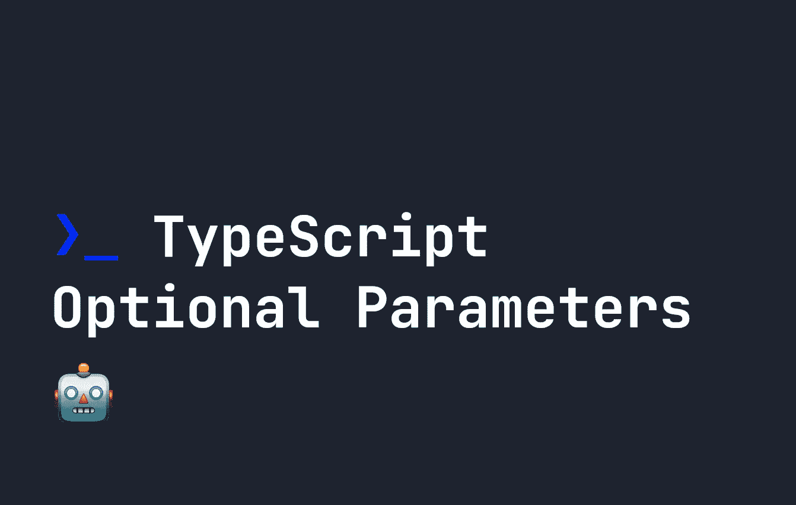

# TypeScript 可选参数指南

> 原文：<https://javascript.plainenglish.io/a-guide-to-typescript-optional-parameters-f2583cfe2c6e?source=collection_archive---------8----------------------->



在 JavaScript 中，如果一个函数有 4 个参数，而我们只用了 3 个，这没什么大不了的——JavaScript 只是忽略缺失的参数，并像运行`undefined`一样运行函数。

在 TypeScript 中，情况略有不同。如果您试图运行一个参数数量与实际数量不同的函数，您会得到一个错误。例如，考虑以下情况:

```
const myFunction = (a: string, b: string, c?: string) => {
    return a + " " + b + " " + c;
}

let runFunction = myFunction("Hello", "there");let runFunction = myFunction("Hello", "there");
```

上面的代码将抛出以下错误:

```
Expected 3 arguments, but got 2.
```

TypeScript 这样做是为了确保更少的错误，因为在调用的函数中遗漏一个参数有时会破坏函数。因此，我们需要明确告诉 TypeScript，我们在函数中定义的一个或多个参数是可选的。为了做到这一点，我们在参数后面使用了一个`?`，来表示它实际上是一个可选的**参数。**

例如，如果我们想让`c`在我们的原始函数中是可选的，我们可以写下面的代码——并且不会出错:

```
const myFunction = (a: string, b: string, c?: string) => {
    return a + " " + b + " " + c;
}

let runFunction = myFunction("Hello", "there");

console.log(runFunction);
```

现在我们的函数将按预期运行，但是，输出将是`Hello there undefined`。这可能不是您想要的行为，这正是 TypeScript 提供这些控件的原因——它可以通过要求某些参数来帮助防止不必要的结果。

但是，在 TypeScript 中，可选参数后面不能跟必需的参数。例如，下面的代码将不起作用:

```
const myFunction = (a: string, b?: string, c: string) => {
    return a + " " + b + " " + c;
}
```

它将产生以下错误:

```
A required parameter cannot follow an optional parameter.
```

我们可以将这种可选性与使用[类型的操作符](https://fjolt.com/article/typescript-typeof-operator)结合起来，以产生有意义的代码。例如，如果`c`是可选的且未定义，那么我们可以忽略它，就像这样:

```
const myFunction = (a: string, b: string, c?: string) => {

    if(typeof c === undefined) {
        return a + " " + b;
    }

    return a + " " + b + " " + c;
}

let runFunction = myFunction("Hello", "there");

console.log(runFunction);
```

现在我们代码的输出将是`Hello there`，但是我们也可以用`c`运行它来产生不同的输出，例如:

```
const myFunction = (a: string, b: string, c?: string) => {

    if(typeof c === undefined) {
        return a + " " + b;
    }

    return a + " " + b + " " + c;
}

let runFunction = myFunction("How", "are", "you?");

// Returns "How are you?"
console.log(runFunction);
```

*更多内容请看*[***plain English . io***](https://plainenglish.io/)*。报名参加我们的* [***免费周报***](http://newsletter.plainenglish.io/) *。关注我们关于*[***Twitter***](https://twitter.com/inPlainEngHQ)*和*[***LinkedIn***](https://www.linkedin.com/company/inplainenglish/)*。查看我们的* [***社区不和谐***](https://discord.gg/GtDtUAvyhW) *加入我们的* [***人才集体***](https://inplainenglish.pallet.com/talent/welcome) *。*