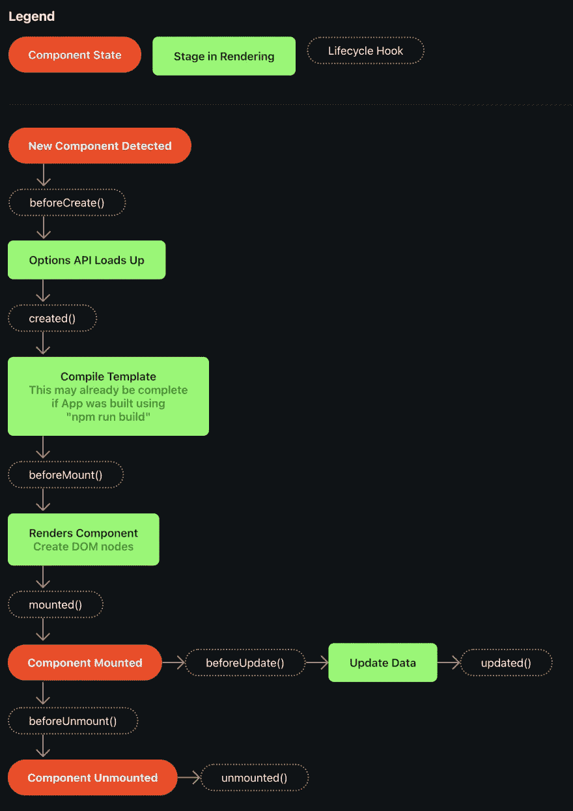

# 理解 Vue 生命周期挂钩的指南

> 原文：<https://javascript.plainenglish.io/a-guide-to-understanding-vue-lifecycle-hooks-dc6a34ce7ecb?source=collection_archive---------8----------------------->


像其他框架一样，Vue 有许多**生命周期挂钩**，允许我们将代码附加到创建或使用 Vue 应用程序时发生的特定事件上——例如，当组件加载时，当组件被添加到 DOM 时，或者当某些东西被删除时。

Vue 有很多生命周期挂钩，令人困惑的是每个挂钩的含义或作用。在本指南中，我们将介绍每个生命周期挂钩的作用，以及如何使用它们。

# 先决条件

如果你不熟悉 Vue，在做这个之前，你可能想看看[我的关于创建你的第一个 Vue 应用的指南](https://fjolt.com/article/vue-create-your-first-app)。或者，如果你对它稍微熟悉一点的话，你可以阅读我关于在 Vue 中创建待办事项列表的指南。

# Vue 中的生命周期挂钩

**这里需要注意的重要一点是，当涉及到生命周期挂钩时，Vue 有两种范例。一个是使用 Compositions API，这是在 Vue 3 中引入的，另一个是“ **Options API** ”，这是定义 Vue 组件的原型模式。在本指南中，我们将从**选项 API** 开始，然后在此基础上展示如何在组合 API 中工作。**

# 选项 API 示例

如果你不熟悉**选项 API** ，它是 Vue 的版本，看起来像下面的代码:

```
export default {
    name: 'Component Name',
    data() {
        return {
            phoneNumber: '123-123-123'
        }
    },
    mounted() { }
}
```

# 生命周期挂钩图

为了理解每个生命周期钩子何时触发，让我们看一个图表。下图描述了每个生命周期挂钩触发的时间。



# 运行生命周期挂钩

要使用 Options API 运行任何生命周期挂钩，可以将其添加到 Javascript 原型中。例如，如果您想使用`beforeCreate()`，即检测到新组件后触发的第一个钩子，您可以像这样添加它:

```
export default {
    name: 'Component Name',
    data() {
        return {
            someData: '123-123-123'
        }
    },
    mounted() {
        // Any code you want to fire immediately before the Options API loads up
    }
}
```

既然我们已经讨论了不同钩子何时出现，那么让我们来看看它们各自做什么，以及它们何时出现。

# 创建之前()

在组件初始化时调用。`data()`和计算属性此时不可用。这对于调用不调整组件数据的 API 很有用。如果你在这里更新`data()`，它将会在选项 API 加载后丢失。

# 已创建()

在实例处理完所有状态操作后调用。您可以访问反应数据、计算属性、方法和观察器。Vue 存储组件 HTML 的地方`$el`还不可用，因为 DOM 元素还没有创建。如果你想启动一个类似 API 的东西，或者更新`data()`，你可以在这里完成。

# 安装前()

这个钩子在渲染发生之前立即运行。模板已经被编译，所以它存储在内存中，但是它还没有被附加到页面上。还没有创建任何 DOM 元素。`$el`现阶段仍不可用。

在服务器端呈现站点时，不会调用这个函数。

# 已安装()

组件已安装并显示在页面上。`$el`现已可用，因此您现在可以从 Vue 访问和操作 DOM。这将仅在所有子组件完全安装后触发。当您想在 DOM 加载后对它做一些事情时，比如改变其中的一个特定元素，使用这个方法是很有用的。

在服务器端呈现站点时，不会调用这个函数。

# 更新前()

有时，您会通过在观察器中更新数据，或者通过用户交互来更改 Vue 组件中的数据。当你改变`data()`或者在你的组件中重新渲染时，一个**更新**事件将被触发。就在重新渲染发生之前，`beforeUpdate()`将启动。此事件之后，组件将被重新呈现，并使用最新数据进行更新。您可以使用这个钩子来访问 DOM 的当前状态，甚至从中更新`data()`。

在服务器端呈现站点时，不会调用这个函数。

# 已更新()

在一个更新被触发，并且 DOM 已经被更新以匹配最新的数据之后，`updated()`将被触发。这在重新渲染后立即发生。现在，如果您访问`$el`，或者任何关于 DOM 内容的内容，它将显示新的、重新呈现的版本。如果你有一个父组件，子组件`updated()`首先被调用，然后是父组件`updated()`钩子。

在服务器端呈现站点时，不会调用这个函数。

# 卸载前()

如果某个组件被删除，它将被卸载。在组件完全移除之前，`beforeUnmount()`启动。这个事件仍然可以访问 DOM 元素，以及与组件相关的任何东西。这在删除事件中很有用，例如，您可以使用该事件通知服务器用户删除了表中的一个节点。如果需要的话，您仍然可以访问`this.$el`，以及数据、观察器和方法。

在服务器端呈现站点时，不会调用这个函数。

# 卸载()

一旦完全删除，`unmount()`事件就会触发。这可以用来清理其他数据或事件侦听器或计时器，让它们知道该组件不再存在于页面上。如果需要的话，您仍然可以访问`this.$el`，以及数据、观察器和方法。

在服务器端呈现站点时，不会调用这个函数。

# 在组合 API 中使用 Vue 生命周期挂钩

如果你习惯使用**选项 API** ，上面的钩子会很有意义。如果你主要使用 Vue 3，你可能更习惯使用**组合 API** 。组合 API 是选项 API 的补充，但是我们使用钩子的方式略有不同。让我们来看看它是如何工作的。

# created()和 beforeCreated()替换为 setup()

在组合 API 中，`created()`和`beforeCreated()`是不可访问的。而是换成了`setup()`。这是有意义的，因为不需要加载“选项 API”。你原本放在`created()`或`beforeCreated()`中的任何代码，现在都可以安全地放入`setup()`

# 挂钩可以与 setup()一起使用

钩子仍然可以和 setup 一起使用，就像它们在 Options API 中一样，这非常直观。例如:

```
export default {
    data() {
        return {
            msg: 1
        }
    },
    setup() {
        console.log('Component setup complete')
    },
    mounted() {
        console.log(this.$el)
    },
}
```

然而，另一种方法是使用组合 API 函数在`setup()`函数本身中定义挂钩。如果我们这样做，钩子的命名会稍有不同:

*   `beforeMount()`变为`onBeforeMount()`
*   `mounted()`变为`onMounted()`
*   `beforeUpdate()`变为`onBeforeUpdate()`
*   `updated()`变为`onUpdated()`
*   `beforeUnmount()`变为`onBeforeUnmount()`
*   `unmounted()`变成了`onUnmounted()`

这些函数做的事情与我在上一节中描述的完全一样，但是它们的调用略有不同。所有这些钩子都必须在`setup()`函数中或者在`setup`脚本中被调用。例如，您必须在如下设置函数中运行钩子:

```
export default {
    setup() {
        // All hooks must go here
    }
}
```

或者，在带有`setup`属性的脚本标签中，如下所示:

```
<script setup>
// All hooks must go within this setup script
</script>
```

因此，如果您想使用这种方法调用钩子，您的代码应该是这样的:

```
export default {
    setup() {
        // All hooks must go here
        onBeforeMount(() => {
            // Code for beforeMount()
        });
        onBeforeUpdate(() => {
            // Code for beforeUpdate()
        })
    }
}
```

没有根本性的性能改进，也没有更好的理由。这只是另一种方式——在某些情况下，它会使你的代码更容易阅读和维护。对于其他实例，使用**选项 API** 可能会更好，所以使用您觉得更舒服的选项。

# 结论

Vue 的生命周期非常复杂，但它给了我们很多工具来运行代码、更新数据，并确保我们的组件以我们希望的方式显示。在本指南中，我们已经介绍了它是如何工作的，何时使用生命周期的每个部分，以及在生命周期挂钩方面，组合 API 与选项 API 的工作方式有何不同。

如果你喜欢这个，你可能会喜欢我的其他 Vue 内容。以下是一些相关链接:

*   [Vue 组件如何工作](https://fjolt.com/article/vue-using-components)
*   [如何在 Vue 中使用观察器](https://fjolt.com/article/vue-how-to-watch-for-changes)
*   [在 Vue 中创建 Websocket 服务器](https://fjolt.com/article/vue-how-to-set-up-a-websocket-server)

*更多内容请看* [***说白了。报名参加我们的***](https://plainenglish.io/) **[***免费周报***](http://newsletter.plainenglish.io/) *。关注我们*[***Twitter***](https://twitter.com/inPlainEngHQ)*和*[***LinkedIn***](https://www.linkedin.com/company/inplainenglish/)*。加入我们的* [***社区不和谐***](https://discord.gg/GtDtUAvyhW) *。***