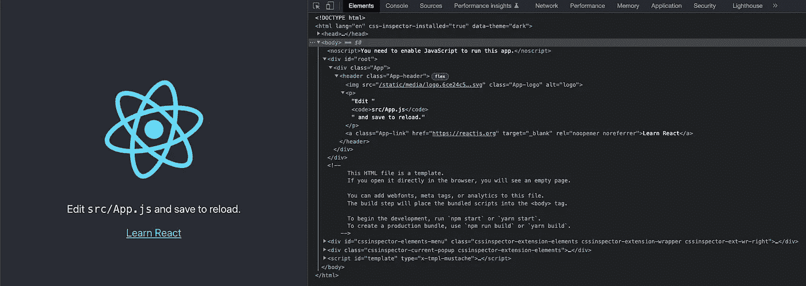
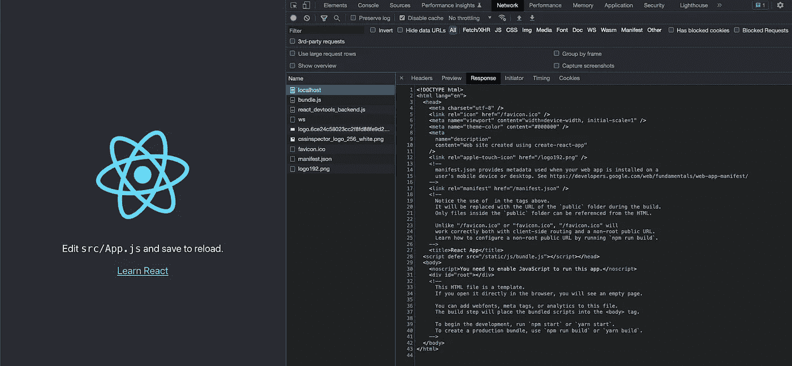
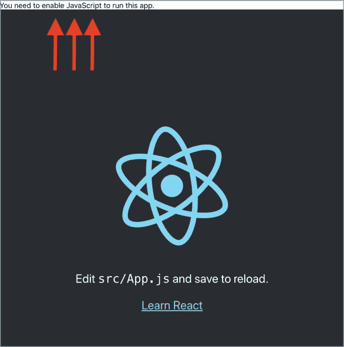
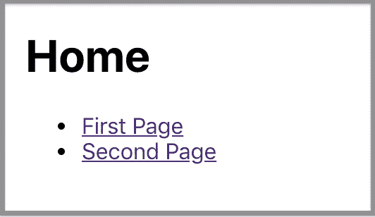
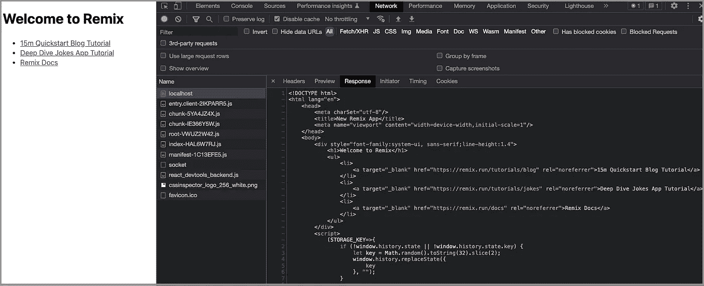
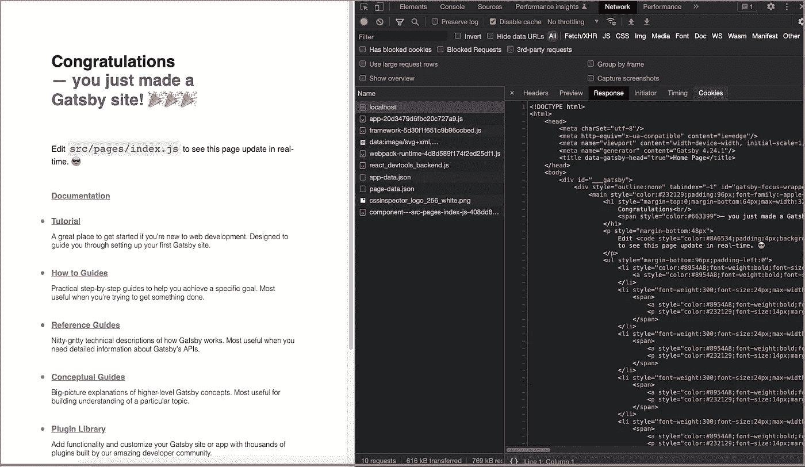

# 服务器端渲染 React 18 应用的实践指南

> 原文：<https://javascript.plainenglish.io/a-hands-on-guide-for-a-server-side-rendering-react-18-app-4e630aae274c?source=collection_archive---------0----------------------->

## 使用 React 18 探索 SSR，创建 React App 5 和 React Router 6


Photo by author

我们写了一篇关于[的文章，这是一篇关于服务器端渲染 React 应用](/a-hands-on-guide-for-a-server-side-rendering-react-app-dd1efa3ec0d8)的实践指南。两年过去了，从 [React 18](https://betterprogramming.pub/the-complete-guide-to-react-18-dd8763430345) 开始，服务器端渲染(SSR)已经发生了变化。这篇文章是对 SSR 的改写，有 React 18、 [Create React App 5](https://betterprogramming.pub/an-in-depth-guide-for-create-react-app-5-cra-5-b94b03c233f2) 和 [React Router 6](https://betterprogramming.pub/a-step-by-step-guide-on-react-router-6-8964c10af364#71a9-41181d1f934) 。

[创建生产就绪型 React 应用的实践指南](/a-hands-on-guide-for-creating-a-production-ready-react-app-864ad98e7497)描述了如何进行生产构建并将其部署到服务器。自然，下一步就是服务器端的渲染了。我们将通过将 Create React 应用程序转换为 SSR 应用程序来完成这个过程。

[Node.js](https://betterprogramming.pub/5-major-features-of-node-js-18-5f4a164cc9fc) 可以用来启动服务器。或者，在本文中使用`nodemon`。它是一个工具，通过在检测到文件更改时自动重启应用程序来帮助开发 Node.js 应用程序。

下面是全局安装`nodemon`的命令。

```
% npm install -g nodemon
```

# 术语

# 什么是客户端渲染(CSR)？

它是一种浏览器下载最小 HTML 页面，使用 JavaScript 渲染并填充内容的技术。

初始页面加载的 CSR 时间可能会更长，但后续加载会更快。它减轻了服务器的负担，并依靠 JavaScript 库的力量。然而，搜索引擎优化(SEO)很难，因为没有静态的内容可以抓取。

# 什么是服务器端渲染(SSR)？

它是一种浏览器下载完整的 HTML 页面的技术，该页面已经由服务器呈现。

SSR 的优势是为了 SEO。初始页面加载速度更快。但是它需要重新加载整个页面以进行后续更改。这可能会使服务器过载。

# 什么是单页应用程序(SPA)？

这是一个使用客户端渲染的应用程序。它在浏览器中直接动态地呈现每条路线，而不是每条路线都有不同的 HTML 页面。

# 什么是通用(同构)JavaScript？

它是一个运行在客户机和服务器上的 Javascript 应用程序。它在客户机上将 HTML 呈现为 SPA，还在服务器端呈现相同的 HTML，然后将其发送到浏览器进行显示。

我们为 CSR 编写 React 代码。相同的代码库可用于 SSR。React 是通用 JavaScript。

SSR 先于 CSR 存在。今天，随着通用 JavaScript 的出现，它又复活了。当今天提到 SSR 时，它很可能意味着带有通用 JavaScript 的 SSR。

# 创建 React 应用程序和 CSR

安装创建 React 应用程序:

```
% npx create-react-app react-ssr
% cd react-ssr
```

运行`npm start`。

在`Elements`选项卡中，它显示了 JavaScript 渲染的旋转标志的 HTML (JSX)和一些文本信息。



Image by author

这是一个典型的 CSR，HTML 内容由 JavaScript 呈现。从`Network`标签中，我们可以读取从服务器下载的内容。



Image by author

HTML 的主体有一个 JavaScript 包，但没有实际内容。SEO 很难获得任何有意义的信息。

以下是 HTML 代码:

# 使用 Express 部署生产版本

为了让 SSR 工作，我们需要部署一个生产构建。

[创建生产就绪型 React 应用的实践指南](https://medium.com/javascript-in-plain-english/a-hands-on-guide-for-creating-a-production-ready-react-app-864ad98e7497)为服务器端渲染奠定了基础。我们需要创建一个服务器来服务编译好的 React 代码。

这里是 [CJS 格式的](https://betterprogramming.pub/what-are-cjs-amd-umd-esm-system-and-iife-3633a112db62)文件，`server/index.js`:

或者，这里是 [ESM 格式](https://betterprogramming.pub/what-might-be-coming-in-npm-9-6985cf2678a6)文件，`server/index.mjs`:

执行`npm run build`创建生产版本。然后运行`nodemon server`或`nodemon server/index.mjs`将其部署到 Express 服务器。

在`Network`选项卡中，它显示了从服务器中检索到的内容:

有一个 JavaScript 包(第 12 行)带有空的标记内容(第 17 行)。因此，这是企业社会责任。

# 在 Express 服务器内部构建 SSR

在 Express 服务器中构建 SSR 需要 3 个步骤。

## 步骤 1:使用 ReactDOM.hydrateRoot()显示服务器呈现的标记。

`ReactDOM.hydrateRoot()` 类似于`ReactDOM.createRoot()`。它用于水合一个容器，该容器的 HTML 内容已经由`ReactDOMServer`对象呈现。它的语法是`hydrateRoot(container, element[, options])`，类似于`createRoot(container[, options])`。

由于`ReactDOM.hydrateRoot()`是在一个已经有服务器呈现的标记的节点上调用的，React 将保留它并只附加事件处理程序。这使得初始负载性能良好。

`ReactDOM.hydrateRoot()`(第 7 行)用于`src/index.js`:

## 步骤 2:使用 ReactDOMServer 对象将组件呈现为静态标记。

React 提供了`[ReactDOMServer](https://reactjs.org/docs/react-dom-server.html)`对象来将组件呈现给静态标记。它向浏览器发送一个已经填充了数据的页面。

React 代码是通用的 JavaScript，在客户端和服务器上都可以运行。

实现 SSR 有不同的方案和方法。`@babel/register`是简单的方法之一。它作为`[devDependencies](https://medium.com/better-programming/package-jsons-dependencies-in-depth-a1f0637a3129)`的一部分与`babel-plugin-transform-assets`一起安装。

```
"devDependencies": {
  "@babel/register": "^7.18.9",
  "babel-plugin-transform-assets": "^1.0.2"
}
```

`@babel/register`动态自动编译文件。我们可以配置它来转换 JSX 和资产。但是，它不支持动态编译本机 Node.js es 模块，因为目前没有稳定的 API 来拦截 ES 模块加载。因此，我们将使用 CJS 格式的文件来探索 SSR。

从 React 18 开始，`renderToString`仍然可以工作，但是支持`Suspense`有限。React 18 改版服务器端 API，放入`react-dom/server`。这些新的 API，包括`renderToPipeableStream`，在服务器和流媒体 SSR 上完全支持`Suspense`。

这是改进的`server/index.js`，具有 SSR 功能:

在第 1–15 行，我们通过`require`钩子设置了 Babel，它可以动态地自动编译文件。

在第 2 行，我们设置了两个预设:

*   `@babel/preset-env`，一个智能预设，它使用最新的 JavaScript，而不需要微观管理目标环境需要哪些语法转换。
*   `@babel/preset-react`，一个智能预设，自动导入 JSX 转换到的功能。

第 3–14 行是`babel-plugin-transform-assets`的插件。它设置了如何转换静态媒体文件的规则。如果没有这个，它会抛出`svg`标签的`SyntaxError: Unexpected token ‘<’`。

在第 16 行，`React`是必需的。

第 17 行需要`ReactDOMServer`。

在第 18 行，需要默认导出`src/App.js`。

`app.use()`(第 47 行)在`app.get()`(第 25 - 45 行)之后执行。否则，`app.use()`将为根路由服务静态文件，包括`index.html`，执行将没有机会到达`app.get()`中间件。

第 26 行显示了被调用的请求 URL。对于创建 React 应用程序，它们列出如下:

```
Request URL = /
Request URL = /static/js/main.b92cc87b.js
Request URL = /static/css/main.073c9b0a.css
Request URL = /static/media/logo.06e73328.svg
Request URL = /static/css/main.073c9b0a.css.map
Request URL = /static/js/main.b92cc87b.js.map
Request URL = /static/media/logo.6ce24c58023cc2f8fd88fe9d219db6c6.svg
Request URL = /favicon.ico
Request URL = /manifest.json
Request URL = /logo192.png
```

第 27–29 行确保只有根路径被`app.get()`渲染。静态资产将跳到第 47 行的下一个中间件。

在第 30 行，`ReactDOMServer.renderToString(element)`用于在服务器上生成 HTML。从理论上讲，它可以写成`ReactDOMServer.renderToString(<App />)`，但是这需要将 JSX 代码包含在一个与`@babel-register`配置不同的文件中。

第 31 行显示了服务器呈现的标记代码:

```
<div class="App"><header class="App-header"><p>Edit <code>src/App.js</code> and save to reload.</p><a class="App-link" href="[https://reactjs.org](https://reactjs.org)" target="_blank" rel="noopener noreferrer">Learn React</a></header></div>
```

33 号线装载产品`index.html`。

第 34–44 行读取`index.html`的内容。如果没有错误，服务器生成的标记(第 42 行)被呈现给根标签，然后最终的`index.html`响应初始加载。

执行`nodemon server`。从`Network`选项卡中，下载的脚本显示了服务器呈现的标记。

正文内容(第 15–29 行)包含完整的内容，SEO 可以使用它来获取有意义的信息。

如果从 bowser 关闭 JavaScript，代码会继续工作。



Image by author

这是 SSR。

## 步骤 3:处理页面特定的需求。

我们让单页 React 应用程序发挥了作用。多条路线的 app 怎么样？

首先，将`react-router-dom`作为`dependencies`之一安装。

```
"devDependencies": {
  "react-router-dom": "^6.4.2",
  ...
}
```

修改`src/App.js`如下:

在第 1 行，`React`被导入，这是 SSR 所需要的。

在第 2 行，导入的是`MemoryRouter`，而不是`BrowserRoute`。`BrowserRoute`在幕后使用 html 5[pushState history API](https://developer.mozilla.org/en-US/docs/Web/API/History_API#Adding_and_modifying_history_entries)，Node.js 不支持`MemoryRouter`将 URL 历史保存在内存中(不读写地址栏)。它在测试和非浏览器环境中很有用。我们应该使用`import { StaticRouter } from "react-router-dom/server"`。然而，它还没有准备好投入生产。

第 34–40 行使用`MemoryRouter`。

执行`npm run build`，然后运行`nodemon server`。转到`http://localhost:8080`，我们看到如下页面:



Image by author

SSR 可以工作，尽管地址栏中的 URL 不会更新。

# 对现有框架/库使用 SSR

路由工作有一个警告。还有其他事情需要处理，比如数据获取、Redux 等。服务器端的工作不像客户端那么简单。根据要求，每个页面可能都需要特别注意。

我们如何处理这么多的复杂情况？

嗯，我们不需要。现有的框架和库都有内置的 SSR 功能。

Remix 是一个全栈的 web 框架，专注于用户界面，并通过 web 基础工作。它包括 SSR 和其他开箱即用的特性，没有样板文件。

下面是 Remix 的客户端代码，它在下面代码的第 4 行使用了`hydrateRoot`:

下面是 Remix 的服务器代码，它在下面代码的第 4 行使用了`renderToPipeableStream`:

`[renderToPipeableStream(element, options)](https://reactjs.org/docs/react-dom-server.html#rendertopipeablestream)`在 React 18 中引入。它将一个 React 元素呈现给它的初始 HTML，并返回一个流，用`pipe(res)`方法来传输输出，用`abort()`来中止请求。它完全支持 HTML 的悬念和流，“延迟”的内容通过内嵌的`<script>`标签阻止“突然出现”。

从`Network`页签中，我们可以看到索引页的正文有该页的全部内容。是 SSR。



Image by author

[Gatsby](/a-complete-guide-to-gatsby-react-34039da49438) 、Next.js、NuxtJS、Quasar 和 SvelteKit 都提供了 SSR 和其他开箱即用的功能，没有样板文件，尽管它们对 SSR 的定义可能略有不同。

这里是 Gatsby 的索引页的`Network`选项卡，显然，主体具有页面的全部内容。



Image by author

Gatsby 是一个健壮而快速的静态站点生成器。它使用 React 在 web 上呈现静态内容。它允许改变静态 HTML 文件的内容。

如果页面只包含静态数据，静态呈现会更快。但是，如果响应是动态的，SSR 是更好的选择。有时，混合方法可能最适合这种情况。当请求文件时，SSR 按需发生。静态呈现在构建时发生一次。它们都是 SEO 友好的，而两个 HTML 的主体内容都有完整的内容。

# 结论

我们已经展示了如何为 Create React 应用程序设置 SSR。这些是步骤:

1.  使用`ReactDOM.hydrateRoot()`显示服务器呈现的标记。
2.  使用`ReactDOMServer`对象将组件呈现为静态标记。
3.  处理页面特定需求

我们使用`ReactDOMServer`对象将组件呈现为静态标记。它的 API 可以用于 SSR 和静态渲染。

对于一个真实的项目，最好的选择是使用现有的框架或库。

感谢阅读。

```
**Want to Connect?**If you are interested, check out [my directory of web development articles](https://jenniferfubook.medium.com/jennifer-fus-web-development-publications-1a887e4454af).
```

*注:感谢 Raja Nagendra Kumar 将本文的全部代码放入一个* [*存储库*](https://github.com/nagkumar/experiments/tree/main/fe/react/ssr) *，使用他在回复评论中建议的服务器端文件夹结构。*

*更多内容请看*[***plain English . io***](https://plainenglish.io/)*。报名参加我们的* [***免费周报***](http://newsletter.plainenglish.io/) *。关注我们关于*[***Twitter***](https://twitter.com/inPlainEngHQ)[***LinkedIn***](https://www.linkedin.com/company/inplainenglish/)*[***YouTube***](https://www.youtube.com/channel/UCtipWUghju290NWcn8jhyAw)*[***不和***](https://discord.gg/GtDtUAvyhW) *。对增长黑客感兴趣？检查* [***电路***](https://circuit.ooo/) *。***