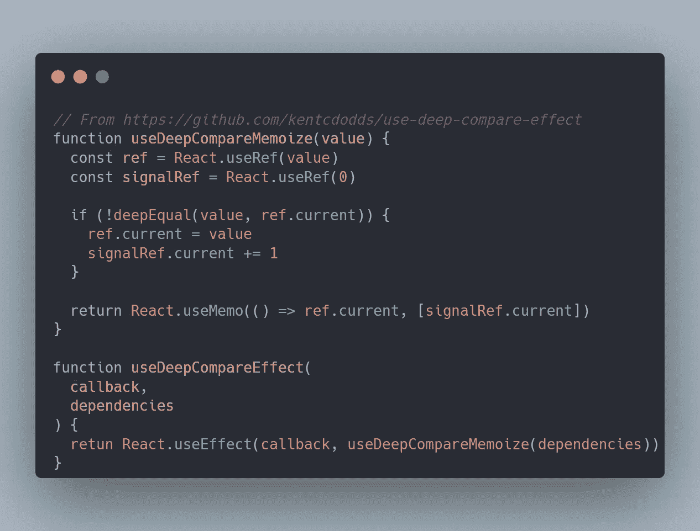

# React 钩子依赖的一个鲜为人知的技巧

> 原文：<https://javascript.plainenglish.io/a-less-known-trick-with-react-hook-dependencies-8dafaca7a150?source=collection_archive---------3----------------------->

## 一个非正统的 React 钩子技巧，用于声明你的依赖数组。


Photo by [Keagan Henman](https://unsplash.com/@henmankk?utm_source=medium&utm_medium=referral) on [Unsplash](https://unsplash.com?utm_source=medium&utm_medium=referral)

React 是为开发人员设计的，让他们想出自己的编写方式。有一个非正统的反作用钩子技巧，我觉得用起来不对，但从技术上来说，它确实完成了任务。目的是向大家介绍它，而不是说服大家使用它。

# **背景**

作为 React 开发人员，我们被教导当我们在任何钩子中使用依赖数组作为参数时，要确保像对象和数组这样的非原始数据类型的**引用相等性**。对这些数据类型的任何引用更改都会触发重新计算，因为 React 只进行浅层比较。

通常的做法是记住这些数据类型。另一种方法是结合使用`ref`、记忆化和深度相等函数，像[use-deep-compare-effect](https://github.com/kentcdodds/use-deep-compare-effect)所做的那样，强制进行深度比较检查。



Snippet of useDeepCompareEffect

其思想是记忆依赖数组及其值。整个数组保存在一个`ref`中，只有当传入的数组与前一个不完全相等时才会被更新。`signalRef`用于通知`useMemo`值已经改变，并返回新值给我们。

# 诀窍是

您知道字符串化对象和数组也可以获得几乎相同的结果吗？提出这个问题的不是别人，正是 React 的代言人丹·阿布拉莫夫本人。

字符串化值将非原始数据类型转换为原始数据类型，我们可以安全地允许 React 进行比较。

## **优点:**

*   **更便宜** 一个`JSON.stringify`只需要更少的开销。

```
const obj = { name: "Fabian", age: 99 }useDeepCompareEffect(() => doSomething(obj), [obj])
// is the same as
useEffect(() => doSomething(obj), [JSON.stringify(obj)])
```

*   **处理嵌套对象或派生值** 这些仅仅是概念性的例子。

```
// Nested fields
const obj = { address: { street: "", building: "" } }useEffect(() => doSomething(obj.address), [JSON.stringify(obj.address)])// Derived values
useEffect(() => doSomething(orders),
[JSON.stringify(orders.map(o => o.id))])
```

## 缺点:

*   **受限于 JSON.stringify**
    的能力，我们必须理解[JSON . stringify 对不同的数据类型做了什么](https://developer.mozilla.org/en-US/docs/Web/JavaScript/Reference/Global_Objects/JSON/stringify#description)。Like 函数不能被字符串化来检查它们的相等性。
*   **要求对象字段和数组值的顺序相同** 我们只是检查两个字符串是否相同。`objA`和`objB`可以有相同的属性。但是如果一个属性在`objA`中被列为第一个，在`objB`中被列为最后一个，那么一旦被字符串化，它们就被认为是不同的。
*   **抱怨表情复杂**
    这种伎俩违背了`react-hooks/exhaustive-deps` ESLint 法则。可以忽略它，也可以通过声明一个变量来满足它。
*   **促进依赖关系的模糊性**
    我们需要仔细处理这个表达式，以理解我们到底依赖什么以及为什么依赖。这需要更多的精神资源，尤其是当涉及派生的价值时。
*   **只适合浅层对象和数组**
    任何复杂的数据结构像大型嵌套对象或者多维数组对于`JSON.stringify`来说处理起来都比较慢。

# 最后的话

我们应该清楚我们想要达到的目标。我们希望获得正确的依赖关系的常见原因是确保副作用在需要时重新运行并优化性能。

正如肯特·c·多兹在他的文章中所说:

*性能优化不是免费的。它们总是伴随着成本，但并不总是伴随着抵消成本的收益。*

不打破逻辑的额外重播不一定会痛。不会带来显著价值的优化可以跳过。我们应该谨慎使用这些技术，以避免产生比我们正在解决的问题更多的开销。

[](https://medium.com/@fabianlee/membership) [## 通过我的推荐链接加入 Medium—Fabian Lee

### 作为一个媒体会员，你的会员费的一部分会给你阅读的作家，你可以完全接触到每一个故事…

medium.com](https://medium.com/@fabianlee/membership) 

*更多内容看* [***说白了就是***](https://plainenglish.io/) *。报名参加我们的* [***免费每周简讯***](http://newsletter.plainenglish.io/) *。关注我们关于* [***推特***](https://twitter.com/inPlainEngHQ) ， [***领英***](https://www.linkedin.com/company/inplainenglish/) ，*和* [***不和***](https://discord.gg/GtDtUAvyhW) *。*