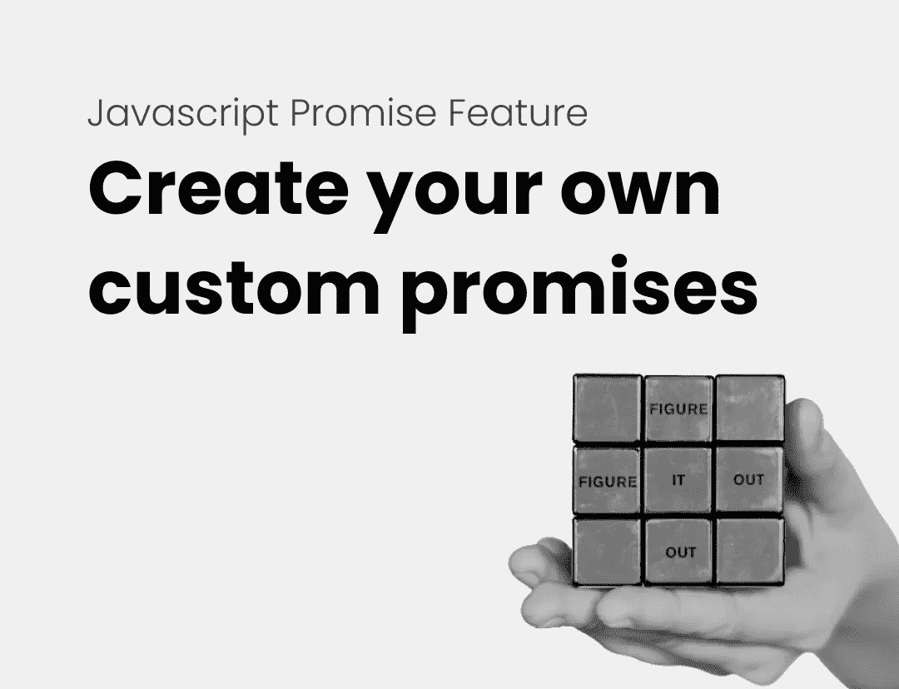
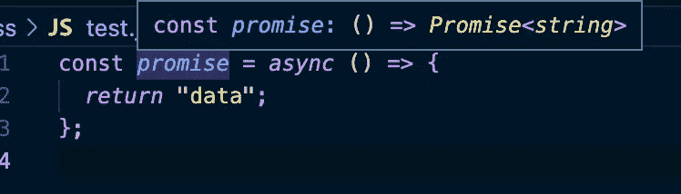
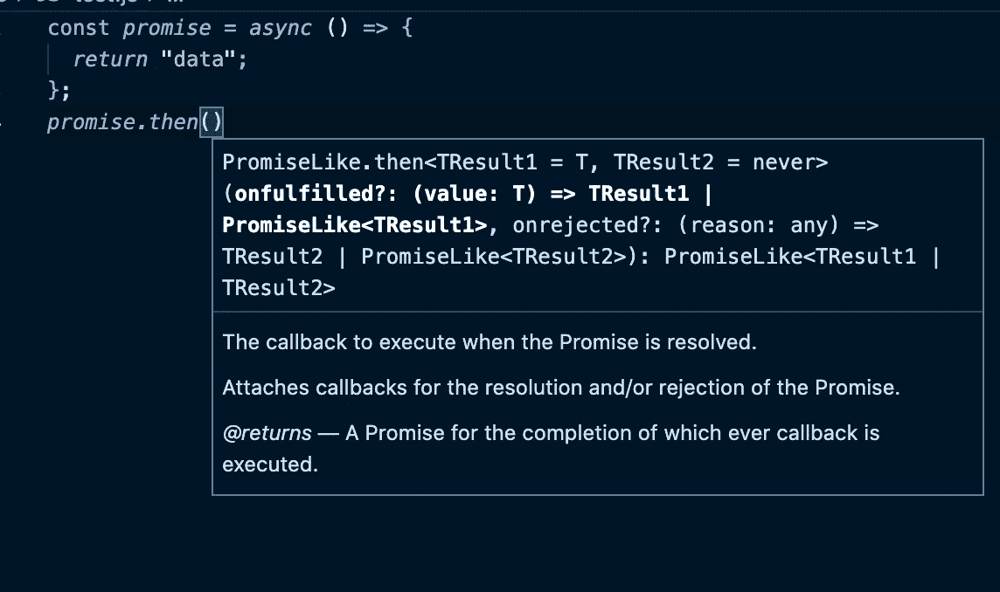

# 一个鲜为人知的 JavaScript Promise 特性

> 原文：<https://javascript.plainenglish.io/a-little-known-javascript-promise-feature-8a37d096ef2c?source=collection_archive---------8----------------------->

## 您知道您可以创建自己的定制承诺吗？



Image by author and by [carla](https://unsplash.com/photos/LrlyZzX6Sws) on usplash

*你好，如果你想体验灵媒，请考虑支持我和所有其他作家，注册成为* [***会员***](https://medium.com/@anton.franzen/membership) *每月 5 美元，以保持独立写作的活力，* [***在此注册；)***](https://medium.com/@anton.franzen/membership)

除了支持他人，Medium 还可以通过写作和在这里找到家的强大、积极参与的社区来支持你。

承诺最酷的一点是，你可以为他们做`await`或者对承诺做`.then`。这两种方法都是在承诺完成后执行代码的有效方法。

如果你觉得自己对回调、承诺、异步等待不太确定，请查看我的文章，我会深入解释这一切:

[](https://betterprogramming.pub/callbacks-vs-promises-vs-async-await-a-step-by-step-guide-f93d13447604) [## 回调 vs .承诺 vs .异步 Await:逐步指南

### 引擎盖下也有点。

better 编程. pub](https://betterprogramming.pub/callbacks-vs-promises-vs-async-await-a-step-by-step-guide-f93d13447604) 

**这是一个用本机 promise 构造器作出的承诺:**

```
const promise = new Promise((resolve, reject) => {
res('data')
})
const data = await promise // 'data'
```

所以，是的，这一切都很酷，但你知道一个`async`功能就像一个承诺吗？

是的，或者更准确地说，它*返回*一个承诺。

所以，如果我们写一个异步函数，我们可以为它做`.then()` 或`await`，就像我们为承诺本身做的一样！

但是请记住，异步函数不是一种承诺；它只是返回一个承诺。

而且，因为我们知道它返回一个承诺，我们可以做与承诺相同的事情，如`.then()`和`await`等等。

**这里有一个例子:**

```
const promise = async () => {return 'data'
}
const data = await promise() // 'data'
```

**我们也可以这样使用**`**.then**`**:**

```
const *promise* = *async* ()=>{
*return* "data";
};*promise*()*.then*((data) => *console.log*(data)); // 'data'
```

如果你不相信我，看看这个



Image by author



Image by author

如你所见，它返回一个承诺。✅

如果您认为您必须用 promise 构造函数创建一个 promise 来编写异步代码，那么现在您可以为它创建一个异步函数。当然，承诺有它的位置，异步函数也是如此。

您可能每天都这样做，但我一开始没有意识到异步函数实际上只是返回一个承诺，无论它返回什么都与承诺解析时相同。

如果你喜欢这件作品，我希望你也会喜欢:

[](/stop-learning-from-react-tutorials-that-suck-5e2031d9bdc7) [## 停止从糟糕的 React 教程中学习

### 不受欢迎的观点

javascript.plainenglish.io](/stop-learning-from-react-tutorials-that-suck-5e2031d9bdc7) [](https://betterprogramming.pub/callbacks-vs-promises-vs-async-await-a-step-by-step-guide-f93d13447604) [## 回调 vs .承诺 vs .异步 Await:逐步指南

### 引擎盖下也有点。

better 编程. pub](https://betterprogramming.pub/callbacks-vs-promises-vs-async-await-a-step-by-step-guide-f93d13447604) [](/deep-dive-into-javascript-closures-a-step-by-step-tutorial-89cf0731a4c5) [## 深入研究 JavaScript 闭包:分步教程

### 从理论和实践的角度理解闭包。

javascript.plainenglish.io](/deep-dive-into-javascript-closures-a-step-by-step-tutorial-89cf0731a4c5) 

*更多内容请看*[***plain English . io***](https://plainenglish.io/)*。报名参加我们的* [***免费周报***](http://newsletter.plainenglish.io/) *。关注我们关于*[***Twitter***](https://twitter.com/inPlainEngHQ)*和*[***LinkedIn***](https://www.linkedin.com/company/inplainenglish/)*。加入我们的* [***社区不和谐***](https://discord.gg/GtDtUAvyhW) *。*