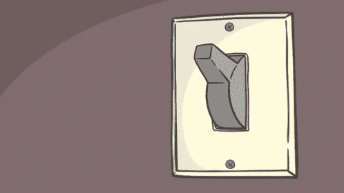

# 看看 SwitchMap

> 原文：<https://javascript.plainenglish.io/a-look-at-switchmap-99ef0ad26998?source=collection_archive---------8----------------------->

SwitchMap 是 rxjs 的一个操作符，它完成一个可观察对象并切换到一个新的可观察对象。

当订阅可观察对象时不再需要来自先前可观察对象的响应时，主要使用 SwitchMap。

当内部可观察对象长期存在以防止内存泄漏时，SwitchMap 是一个安全的选择。

SwitchMap 也非常适合用于只发出一个值的 HTTP 请求的短期流。

在请求完成需要完成的情况下，例如当您从远程服务器或数据库更新、写入或删除数据时，不应使用 SwitchMap。

SwitchMap 一次只有一个活动订阅，从该订阅开始，值被传递给观察者。一旦高阶可观测值发出一个新值，SwitchMap 就执行该函数以获得一个新的内部可观测流并切换这些流。

它取消订阅当前流，并订阅新的内部可观察对象。

操作员的工作方式如下:

1.  我们首先订阅第一个可观测值，并将其视为高阶可观测值。
2.  立即，第一个可观察对象被发出，有一个映射函数被调用到内部可观察对象。
3.  map 函数之后是对内部可观察对象的订阅。
4.  从内部可观察对象订阅的值然后被传递给观察者。
5.  然后，从较高阶的可观测值开始重复该过程
6.  取消订阅当前的内在可观察对象，订阅新的内在可观察对象
7.  只有在所有源观察完成后，才向观察者发送完成通知。
8.  如果任何内部源观察器抛出错误，就向观察器发送错误通知。

*更多内容请看*[***plain English . io***](https://plainenglish.io/)*。*

*报名参加我们的* [***免费周报***](http://newsletter.plainenglish.io/) *。关注我们上* [***推特***](https://twitter.com/inPlainEngHQ) ， [***领英***](https://www.linkedin.com/company/inplainenglish/) ***，***[***YouTube***](https://www.youtube.com/channel/UCtipWUghju290NWcn8jhyAw)***，以及****[***不和***](https://discord.com/invite/GtDtUAvyhW) *

****用*** [***电路***](https://circuit.ooo/?utm=publication-post-cta) *为你的科技创业建立认知和采用。**