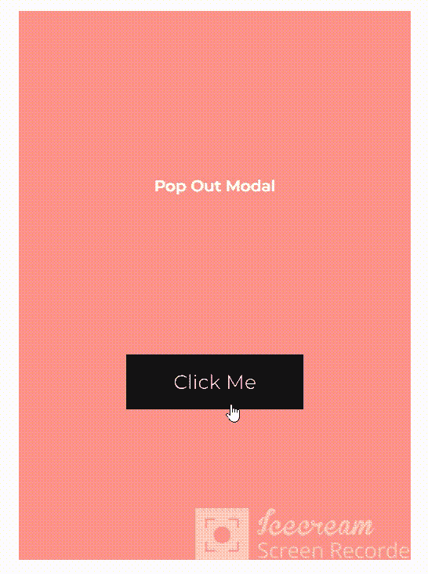

# 创建不带库的模型的实用指南(使用 HTML、CSS、JavaScript)

> 原文：<https://javascript.plainenglish.io/a-no-nonsense-guide-to-creating-modals-without-libraries-using-html-css-js-22dd215e10a2?source=collection_archive---------19----------------------->

有很多轻量级的库可以让你创建模型，而不需要为它们想出任何代码。使用提供的语法，您就有了一个现成的模型。

对于那些已经理解了模态如何工作并且有能力依赖他们的项目的人来说，这些库是一个很好的选择。然而，如果你是一个初露头角的开发人员，知道如何从头开始编写你自己的模型将帮助你成为一个天生的使用 web 开发基本工具的人。


让我们开始吧。

## 什么是模态？

Modal =这个小弹出窗口的技术术语，它在你现有的网页或应用程序上打开，让你做一些事情，比如填表、付款等。通常禁用它后面的主窗口。

## 创建模型

这是我们将要创造的:



Modal Demo GIF

## 让我们来设置 HTML。

你需要一些东西来包含你的模态的内容，然后你需要你的模态的任何内容。我们可以使用一个

作为我们的容器。

```
<div class="container_one">
    <p class="desc">Pop Out Modal </p>
  <button class = "custom_button" id = "modal_one">Click Me</button>
    <div class="modal scale_modal" id="modal_scale">
      <p class="modal_text">Hi There! I'm some important message</p>
      <button class='modal_button' id="close_modal_one">Okay</button>
</div>
```

最顶层的 div 充当我们的背景页面(主窗口)，具有“modal”类的 div 将充当我们的弹出 GUI。在模态 div 中，我们有一些文本和一个关闭模态的按钮。

我们添加“scale_modal”类的原因是为了添加自定义动画来显示和隐藏模式。

## 让我们对 HTML 应用一些样式:

我将在这里专门写与模态相关的样式，但是你可以在上面的 CodePen 链接中查看整体样式！

```
.modal{
  position:absolute;
  width: 10rem;
  height:12rem;
  background: #f2e8cf;
  color: #262730;
  padding: 2rem 3rem;
  display:flex;
  flex-direction:column;
  justify-content:space-evenly;
}.modal_button{
  cursor:pointer;
  border:0;
  font-size:1.3rem;
  padding: 0.5rem 2rem;
  font-family: 'Montserrat', sans-serif;
}
```

模态本身(类“modal”)是相对于页面的其余部分绝对定位的，因为我们通常希望它位于主窗口的中心。外观属性(高度、颜色、背景等。)是为示例项目设计的，最后，flexbox 使得将模型本身的内容居中变得很容易。

下一个规则集是用于模式中的按钮——只是给它一些特征。

modal 类也有一个默认显示“none ”,所以它不存在于主窗口中，也不推送任何其他内容。当单击模式的触发器时，我们将通过 JavaScript 更改显示属性——在我们的例子中，这是容器 div (id = "modal_one ")中的按钮

```
.modal{
  display:none;
}
```

最后，我们可以为我们的模型设置一个动画——你不需要这样做——你可以设置 JavaScript 来改变没有动画的模型的显示，但是微妙的动画会产生更有趣的 UX。

```
#modal_scale{
   animation: pop 0.3s linear;
}[@keyframes](http://twitter.com/keyframes) pop{
  0%{
    transform: scale(0);
  }
  25%{
    transform: scale(.45);
  }
  50%{
    transform: scale(.75);
  }
  75%{
    transform: scale(1.2);
  }
  100%{
    transform: scale(1);
  }
}[@keyframes](http://twitter.com/keyframes) reversePop{
  0%{
    transform: scale(1);
  }
  25%{
    transform: scale(1.2);
  }
  50%{
    transform: scale(.75);
  }
  75%{
    transform: scale(.45);
  }
  100%{
    transform: scale(0);
  }
}
```

这些关键帧通过将模态从 0 缩放到 1 来模拟“突出”效果，反之亦然。

现在我们有了我们的设置。我们有 HTML，也有我们需要的所有样式。我们现在需要做的就是将按钮连接到一些 JavaScript 上。

## 最后，补充一些 JS:

我们需要从 HTML 中获取元素，没有 jQuery，我们可以用文档对象模型来完成。

```
const modalOne = document.getElementById('modal_one')
const closeModalButton =document.getElementById('close_modal_one')const scaleModal = document.getElementById('modal_scale')modalOne.addEventListener('click',()=>{
  scaleModal.style.animation='pop 0.3s linear'
  scaleModal.style.display = 'flex'
})
```

modalOne 是启动模式的按钮。closeModalButton 用于关闭模式。我们将一个 click 事件侦听器附加到按钮上以启动模式，并对其应用我们之前编写的动画，我们将显示从“none”更改为“flex ”,以便它现在可见。

最后，我们需要向关闭模式添加一些代码。

```
closeModalButton.addEventListener('click',()=>{

 actualModal.style.animation = 'reversePop 0.3s linear'
   setTimeout(function(){ 
   actualModal.style.display = 'none'}, 300);
                                                                            }
  )})
```

当用户单击关闭按钮时，我们将反向弹出动画添加到模态中，几秒钟后(大约是动画完成所需的时间)，我们再次将显示更改为“none”。

该窗口中的第一个模态应该是我们生成的模态的样子:

就是这样！

*更多内容请看*[***plain English . io***](https://plainenglish.io/)*。报名参加我们的* [***免费周报***](http://newsletter.plainenglish.io/) *。关注我们关于*[***Twitter***](https://twitter.com/inPlainEngHQ)*和*[***LinkedIn***](https://www.linkedin.com/company/inplainenglish/)*。查看我们的* [***社区不和谐***](https://discord.gg/GtDtUAvyhW) *加入我们的* [***人才集体***](https://inplainenglish.pallet.com/talent/welcome) *。*