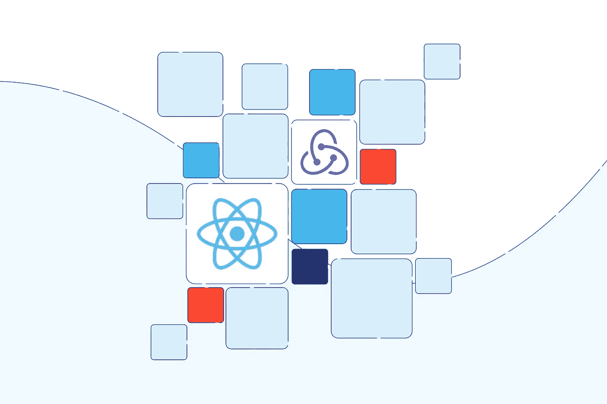

# React 应用程序中管理页面状态的实用方法

> 原文：<https://javascript.plainenglish.io/a-practical-way-to-manage-page-state-in-a-react-app-c542828076ab?source=collection_archive---------4----------------------->

## 通过使用历史 API 存储状态来管理 React 应用程序中的页面状态。



from tsh.io

## 前言

React 里有很多状态管理库，比如 Redux，Rematch，反冲，当然你也可以使用 React context 来管理页面状态。这些都很有用，但是有一个问题——当我们刷新页面的时候，页面状态会丢失，页面状态不可共享。例如，如果您在 React 应用程序列表页面中过滤一些数据，并希望与可以直接看到结果的人共享页面 URL，那么您不能只通过状态管理来实现它。

本文将介绍如何使用 History API 来增强 React 状态，以便可以共享状态，并且在刷新页面后页面显示不会改变。

## 具有 URL 的持久状态

大部分 npm 模块在 React 应用中使用 localStorage 来持久化页面状态，像【npmjs.com】redux-persist—NPM、【npmjs.com】use-persisted-state—NPM。通过使用 localStorage，我们可以存储复杂的数据或大型数据，并且在刷新页面时，我们可以恢复状态，这对用户来说是一种更好的体验，特别是在移动页面上。

对于大多数列表页面，我们只需要保存一些过滤动作的状态，我们可以使用一个 URL 来存储状态。假设我们只需要存储一个字段，我们可以使用这个 React 挂钩:

```
const useHistory = () => {
  const { pathname, search } = window.location;
  const queryParams = new URLSearchParams(search);
  const [filter, setFilter] = React.useState(queryParams.get("filter") || "");
  return [
    text,
    function setData(val) {
      setFilter(val);
      queryParams.set("filter", val);
      history.replaceState({}, "", `${pathname}?${queryParams.toString()}`);
    }
  ];
};
```

一旦使用钩子函数，它将获得 URL 查询`filter`来初始化过滤器变量，我们可以使用 setData 来存储状态，它会将状态存储到 URL。

有一个 React 应用程序演示:

通过使用 URL 来保持状态，我们可以共享链接(CodePen 不共享，因为它使用 iframe 来呈现结果页面)。

## 结论

我们可以使用 localStorage 来持久化状态，但也可以使用 URL 来实现。如果我们需要与一些预设的过滤器/选项共享页面 URL，使用 URL 来存储状态会很方便。如果状态数据非常大，我们可以用一个短 id 保存到后端 SQL，这样就可以和其他人共享了。

我们使用`URLSearchParams`来解析 URL 查询并设置字段，您可以通过参考这篇文章了解更多关于解析查询的信息:

[](https://levelup.gitconnected.com/4-ways-to-get-value-from-query-string-f11034f06148) [## 从查询字符串中获取值的 4 种方法

### URLSearchParams，Regex，Array.prototype.reduce，qs 包。

levelup.gitconnected.com](https://levelup.gitconnected.com/4-ways-to-get-value-from-query-string-f11034f06148) 

*更多内容请看*[***plain English . io***](https://plainenglish.io/)*。报名参加我们的* [***免费周报***](http://newsletter.plainenglish.io/) *。关注我们关于*[***Twitter***](https://twitter.com/inPlainEngHQ)[***LinkedIn***](https://www.linkedin.com/company/inplainenglish/)*[***YouTube***](https://www.youtube.com/channel/UCtipWUghju290NWcn8jhyAw)*[***不和***](https://discord.gg/GtDtUAvyhW) *。***