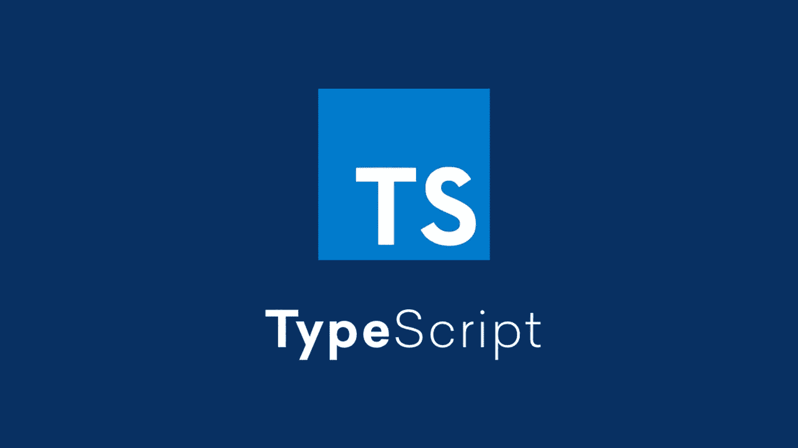

# 一种快速而简洁的解析字符串的方法

> 原文：<https://javascript.plainenglish.io/a-quick-and-clean-way-to-parse-strings-5015ea909aac?source=collection_archive---------10----------------------->

## 以下是如何快速解析字符串并一次将它们赋给多个变量。



假设您有一个字符串需要解析并赋给变量，忽略对您没有意义的数据。以一个日期字符串为例:`09/09/2022`。也许你有一个函数，它以字符串的形式接收这个日期，你想把月、日、年分配给不同的变量。

在我不太了解情况的时候，我会这样处理这个问题:

```
parseDateString(*date*: *string*) {
    *let* day = *date*.substr(0, 2);
    *let* month = *date*.substr(3, 2);
    *let* year = *date*.substr(6, 4);
    ...
}
```

这种方法很简单，但是有几个潜在的问题。首先，看起来和感觉上都像是多余的代码。其次，它假定格式一致。如果该函数接收到的年份只有 2 位数，该怎么办？显然，有完整的库来处理日期字符串，但这不是本练习的重点。

利用[析构](/destructuring-data-in-javascript-314efe817641)的能力，结合 regex 的多功能性，我们可以做以下事情:

```
parseDateString(*date*: *string*) {
    *const* [,day,,month,,year] = *date*.match(
        /([0-9]{1,2})(\/)([0-9]{1,2})(\/)([0-9]{2,4})/
    );
    ...
}
```

这种方法起初看起来有点混乱，但是一旦你理解了析构，它真的非常优雅。

我们有一个正则表达式，在不深入 regex 主题的情况下，它与`match()`函数一起使用，将模式匹配到给定的日期变量。模式本身用括号分成五个捕获组，所以`match()`函数将在一个数组中分别返回每一个捕获组。

在等式的左边，我们使用析构将三个变量赋给从`match()`函数接收的值。还要注意，我们通过在逗号之间使用空值来跳过返回数组的某些索引。从`match()`返回的第一个元素是匹配的字符串本身，所以我们可以跳过这段。

我们也跳过了索引 2 和 4，因为我们不关心斜线。这使得日、月和年成为独立的变量，分别对应于日期字符串的各个部分。

因为我们使用的是正则表达式，所以表达式本身可以根据您的需要进行修改。您可以修改表达式来检查月份名称，而不是数字、星期几等。使用这种方法，您可以通过让您的正则表达式更加努力地工作来避免使用一堆“if”语句来检查边缘情况。

感谢您的阅读。如需进一步阅读与本主题相关的主题:

[](https://developer.mozilla.org/en-US/docs/Web/JavaScript/Reference/Global_Objects/String/match) [## string . prototype . match()-JavaScript | MDN

### 方法检索字符串与正则表达式匹配的结果。正则表达式对象。如果…

developer.mozilla.org](https://developer.mozilla.org/en-US/docs/Web/JavaScript/Reference/Global_Objects/String/match) [](https://regexr.com/) [## 学习、构建和测试正则表达式

### 正则表达式测试器，语法高亮，PHP / PCRE & JS 支持，上下文帮助，备忘单，参考…

regexr.com](https://regexr.com/) [](https://developer.mozilla.org/en-US/docs/Web/JavaScript/Reference/Operators/Destructuring_assignment) [## 析构赋值- JavaScript | MDN

### 析构赋值语法是一个 JavaScript 表达式，它使得从数组中解包值成为可能，或者…

developer.mozilla.org](https://developer.mozilla.org/en-US/docs/Web/JavaScript/Reference/Operators/Destructuring_assignment) 

*更多内容请看*[***plain English . io***](https://plainenglish.io/)*。报名参加我们的* [***免费周报***](http://newsletter.plainenglish.io/) *。关注我们关于*[***Twitter***](https://twitter.com/inPlainEngHQ)*和*[***LinkedIn***](https://www.linkedin.com/company/inplainenglish/)*。加入我们的* [***社区不和谐***](https://discord.gg/GtDtUAvyhW) *。*