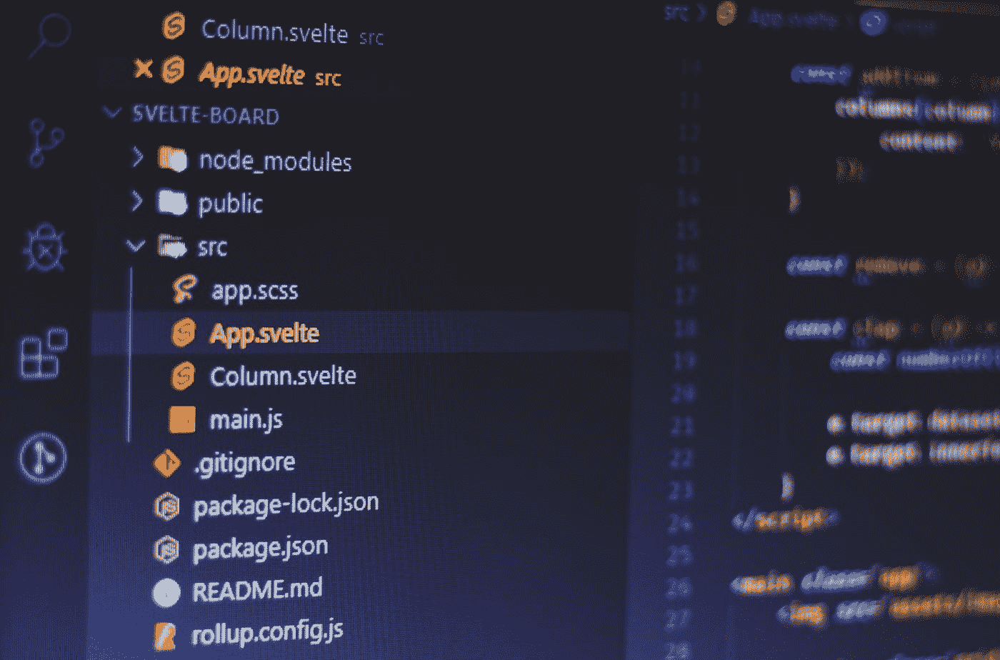

# 快速浏览 JavaScript 的未来

> 原文：<https://javascript.plainenglish.io/a-quick-look-into-the-future-of-javascript-ecdb966f464?source=collection_archive---------3----------------------->

## 简要介绍一些较新的框架和项目，它们可能会在不久的将来成为你的技术堆栈中的主要选择。

Photo by [Ferenc Almasi](https://unsplash.com/@flowforfrank?utm_source=medium&utm_medium=referral) on [Unsplash](https://unsplash.com?utm_source=medium&utm_medium=referral)

JavaScript 在其超过 25 年的历史中有很多创新。从 React 这样的前端框架到 Node.js 这样的运行时，甚至是 bundlers，都可以将 JavaScript 应用作为桌面或移动应用来运行，比如 Electron 或 React Native。

在本文中，我们将看到一些更新的框架和项目，它们可能会在不久的将来成为许多人的技术堆栈中的主要选择。

# 苗条身材&苗条身材

React 和 Vue.js 等框架使用 [vDOM(虚拟 DOM)](https://en.wikipedia.org/wiki/Virtual_DOM) ，而 svelte 的方法略有不同，它编译代码，发布时没有 JavaScript 框架。React 和 Vue 需要花费时间来渲染虚拟 DOM、计算更改并执行这些更改，而 Svelte 只需编译这些代码来进行所需的更改。

 [## 苗条的

### 控制论增强的网络应用

苗条的人](https://svelte.dev/) 

SvelteKit 是 Svelte 对服务器端渲染(SSR)和静态站点生成(SSG)的解决方案。它支持许多常见的服务，如 Vercel 和 Netlify。Svelte 还支持通用 Node.js 服务器和完全静态的站点生成，用于有意义的项目。如果您的特定平台或用例不被支持，它有编写新适配器的文档。Svelte 已经存在了几年，并开始获得更多的采用。谁知道呢，也许几年后你会看到它像 Next.js 或 Gatsby 一样发挥作用。

 [## 苗条套装

### SvelteKit 是官方的 Svelte 应用程序框架

kit.svelte.dev](https://kit.svelte.dev/) 

# **金牛座**

经过几个月的努力，Tauri 1.0 终于发布了。Tauri 是什么？Tauri 是一个框架，允许你使用 web 视图创建桌面应用程序(移动应用程序支持是[计划的](https://github.com/tauri-apps/tauri/issues/843) [)](https://github.com/tauri-apps/tauri/issues/843)) 。它比 Electron 之类的东西更有性能，因为 Electron 本质上在你的应用程序中包含了一个完整的 Chromium 实例，使得二进制文件比它需要的要大得多。根据 Tauri 基准测试，电子 hello world 应用程序的二进制大小为 127.47 MB，而 Tauri hello world 只有 1.9 MB。不仅如此，因为 Tauri 使用的是 webview 而不是 Chromium 的实例，所以它使用的 RAM 更少。

 [## 使用 web 前端| Tauri Apps 构建更小、更快、更安全的桌面应用程序

### Tauri 是一个为所有主流桌面平台构建微小、高速二进制文件的框架。开发人员可以集成…

tauri.app](https://tauri.app/) 

# **发髻**

现在是名单上最年轻的项目。Bun 是一个全新的 JavaScript 运行时和一体化工具，有望实现令人难以置信的性能提升。它是如何做到这一点的？与 Node.js 和 Deno 使用 V8 JavaScript 引擎不同，Bun 使用 WebKit 的 JavaScriptCore 引擎。这台发动机一般比 V8 发动机快。Bun 是用 Zig 编码的，这是一种为[“改进 C 语言”](https://en.wikipedia.org/wiki/Zig_(programming_language))而构建的新语言。它有内置的类型脚本支持，JSX 编译器，捆绑器和包管理器。

Bun 仍处于早期开发阶段，还不够稳定，不适合生产，但该项目正朝着可使用的方向快速发展。如果不使用 WSL，你还不能在 Windows 上安装 Bun，但是 Windows 支持已经在[计划中了](https://github.com/oven-sh/bun/issues/709#issuecomment-1186546110)。

 [## Bun 是一个快速的一体化 JavaScript 运行时

### 捆绑、传输、安装和运行 JavaScript & TypeScript 项目——全部在 Bun 中完成。Bun 是一个新的 JavaScript 运行时，带有…

bun.sh](https://bun.sh/) 

# **结论**

无论您是前端开发人员还是后端开发人员，在性能和软件包大小方面，您似乎都有所期待。在本文中，我只涉及了一些较大的项目。如果你有一些你认为对 JavaScript 的未来有影响的很酷的项目，请在下面留下你的回复。

*更多内容看* [***说白了。报名参加我们的***](https://plainenglish.io/) **[***免费周报***](http://newsletter.plainenglish.io/) *。关注我们关于*[***Twitter***](https://twitter.com/inPlainEngHQ)*和*[***LinkedIn***](https://www.linkedin.com/company/inplainenglish/)*。查看我们的* [***社区不和谐***](https://discord.gg/GtDtUAvyhW) *加入我们的* [***人才集体***](https://inplainenglish.pallet.com/talent/welcome) *。***