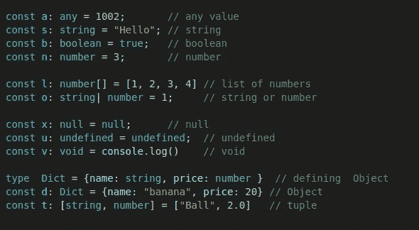

# Node.js 中的 TypeScript 快速入门

> 原文：<https://javascript.plainenglish.io/a-quick-start-to-typescript-in-node-f6d171909238?source=collection_archive---------9----------------------->

## 用 TypeScript 编写你的第一个程序


Photo by [Chris Ried](https://unsplash.com/@cdr6934?utm_source=medium&utm_medium=referral) on [Unsplash](https://unsplash.com?utm_source=medium&utm_medium=referral)

近年来，TypeScript 越来越受欢迎。根据 2021 年 StackOverflow 开发者调查，它是开发者最想使用的三种编程语言之一。

TypeScript 是微软在 2012 年 10 月开发的一种免费、开源、面向对象的编程语言。它提供了有助于类型安全和代码可读性的类型注释。TypeScript 是 JavaScript 的超集，因此任何有效的 JavaScript 语法也是有效的 TypeScript。TypeScript 编译器将编写的 TypeScript 编译成等效的 JavaScript。

在本文中，我们将在每个人最喜欢的运行时 Node.js 中动手编写和测试我们的 TypeScript 代码。

# 安装依赖项

## **创建项目结构**

让我们首先创建一个新文件夹:

```
**$ mkdir tsdemo
$ cd tsdemo**
```

现在初始化新项目。

```
**$ npm init -y**
Wrote to /home/umang/WORK_REPO/tsdemo/package.json:{
  "name": "tsdemo",
  "version": "1.0.0",
  "description": "",
  "main": "index.js",
  "scripts": {
    "test": "echo \"Error: no test specified\" && exit 1"
  },
  "keywords": [],
  "author": "",
  "license": "ISC"
}
```

在这里，`-y`将对所有问题填充答案默认值。

## 安装 TypeScript 编译器

使用以下命令在当前目录中安装 TypeScript。

```
**$ npm install --save-dev typescript**
```

要检查 typescript 是否正常工作:

```
**$ tsc -v**
Version 4.6.2
```

TypeScript 使用`tsconfig.json`在当前项目中配置编译器。

Refer [TypeScript Documentation](https://www.typescriptlang.org/docs/handbook/compiler-options.html) to go over the keys in the above JSON snippet.

我们将把 TypeScript 文件编译成 JavaScript，放在`dist`文件夹中。

# 打字稿中的 Hello World

创建一个文件`app.js`。

```
**$ touch src/app.js**
```

将下面的代码添加到`app.js`中。

我们将使用`tsc`命令传输代码。

```
**$ npx tsc**
```

编译后的代码可以在`dist/app.js`中访问。

```
**$ cat dist/app.js**
const greeting = "Hello, World!";
console.log(greeting);
//# sourceMappingURL=app.js.map
```

我们可以使用 node 运行编译后的代码。

```
**$ node dist/app.js**
Hello, World!
```

## 数据类型

下面给出了 typescript 的一些数据类型。



Refer [Typescript handbook](https://www.typescriptlang.org/docs/handbook/basic-types.html) for more information

TypeScript 的主要优点是静态类型检查。如果我们把一个无效的类型传递给一个给定的变量，编译器会让我们立刻意识到。

```
**$ npx tsc**
src/app.ts:1:7 - error TS2322: Type 'string' is not assignable to type 'number'.1 const greeting: number = "Hello, World";
        ~~~~~~~~Found 1 error in src/app.ts:1
```

## 例子

我们有一个二分搜索法，它返回目标在数组中的第一个位置。代码的时间复杂度为`O(log(n))`。该函数有两个参数:`dataArr`和`target`，它们分别是类型`number[]`和`number`。Typescript 还能够隐式推断数据类型。在上面的例子中，变量 start、end、result 和 mid 都是数字。

# 编写单元测试用例

使用任何语言的任何开发人员都必须编写单元测试用例。在本教程中，我们将使用 Jest 作为我们的测试框架。它很容易学习，不需要设置。

## 安装 Jest

转到项目的根目录，运行以下命令。我们将 Jest 作为包依赖项安装。

```
**$ npm install jest --save-dev**
```

我们将使用`ts-jest`来映射 Typescript 和 Jest。

```
**$ npm install ts-jest --save-dev**
```

现在我们将为 Jest 安装类型定义。

```
**$ npm install @types/jest --save-dev**
```

将以下配置添加到`jsconfig`。

Refer [Jest Configuration](https://jestjs.io/docs/configuration) for more information

## 添加测试用例

让我们为二分搜索法写一个基本的测试用例。

```
$ touch src/app.test.ts
```

运行测试用例:

```
**$ jest**
 PASS src/app.test.ts
 Testing Binary Search
 ✓ verify the the target returns output. (3 ms)
 ✓ verify -1 is returned if target is not found. (1 ms)
 ✓ verify -1 is returned for empty array. (1 ms)
 ✓ verify the first position is returned for duplicate elements. (1 ms)Test Suites: 1 passed, 1 total
Tests: 4 passed, 4 total
Snapshots: 0 total
Time: 2.483 s, estimated 3 s
Ran all test suites.
```

## 更新 package.json

记住每个项目和库的命令是没有用的。最好将命令集成到 npm 脚本中。

```
{
   "name": "tsdemo",
   "version": "1.0.0",
   "main": "dist/app.js",
   "scripts": {
 **"start": "npx tsc && node  dist/app.js",
       "test": "jest"**
   },
   "keywords": [],
   "author": "",
   "license": "ISC",
   "devDependencies": {
       "@types/express": "^4.17.1",
       "@types/jest": "^27.4.1",
       "jest": "^27.5.1",
       "ts-jest": "^27.1.3",
       "typescript": "^4.6.2"
   },
   "dependencies": {
       "express": "^4.17.1"
   },
   "description": ""
}
```

至此，我们对如何使用 TypeScript 有了基本的了解。希望这篇文章对你有用。

```
"express": "^4.17.1"},"description": ""}
```

*更多内容尽在* [***说白了. io***](https://plainenglish.io/) *。报名参加我们的* [***免费周报***](http://newsletter.plainenglish.io/) *。关注我们关于* [***推特***](https://twitter.com/inPlainEngHQ) *和***[***LinkedIn***](https://www.linkedin.com/company/inplainenglish/)*。加入我们的* [***社区不和谐***](https://discord.gg/GtDtUAvyhW) *。***