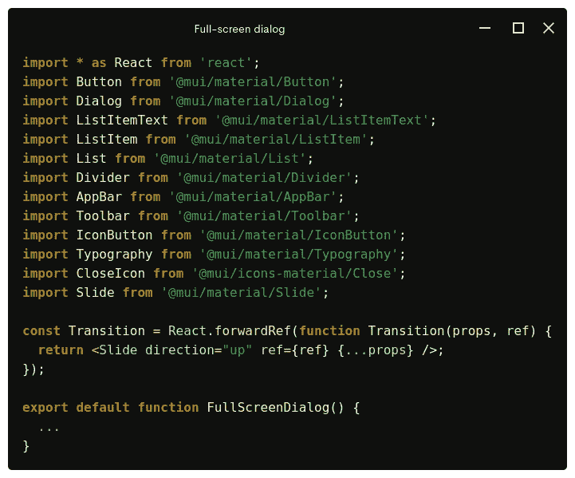
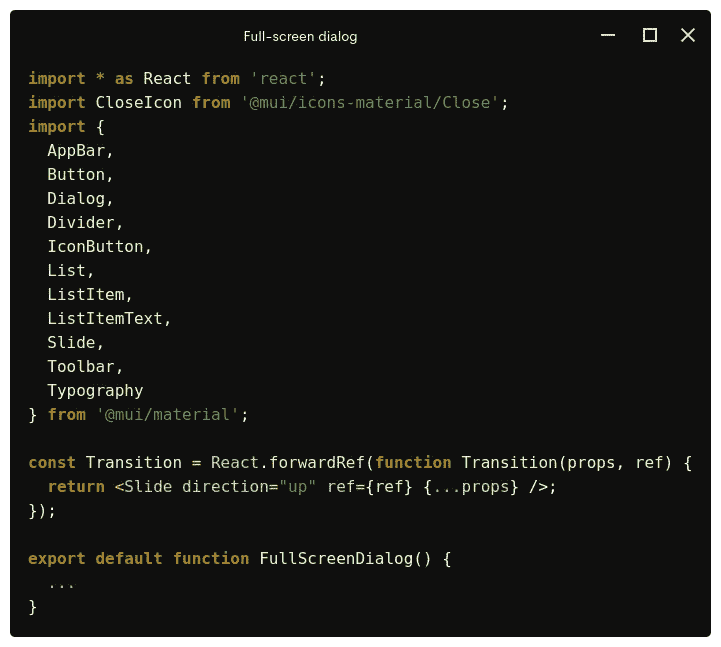

# 编写可读 React 代码的快速技巧

> 原文：<https://javascript.plainenglish.io/a-quick-tip-to-write-readable-react-code-84d3e1e12566?source=collection_archive---------16----------------------->

## 如何以简单的方式导入大量的 MUI 组件

Photo by [Lautaro Andreani](https://unsplash.com/@lautaroandreani?utm_source=unsplash&utm_medium=referral&utm_content=creditCopyText) on [Unsplash](https://unsplash.com/s/photos/reactjs?utm_source=unsplash&utm_medium=referral&utm_content=creditCopyText)

最近我一直在做一个 React 项目，该项目广泛使用了 [MUI 库](https://mui.com/)。如果您和我一样，那么您可能已经将官方文档中的许多源代码示例复制并粘贴到您的项目中了——不是吗？毕竟，有什么比看例子更好的方式来开始使用 [MUI React 组件](https://mui.com/components/)呢？在我看来，官方文件非常棒。

但是今天，我注意到官方源代码示例的可读性可以提高一点。基本上，文件可以按字母顺序导入，实际上没有必要为每个导入的文件输入一次单词`import`和`from`。

让我用一个例子来展示给你看，一个全屏对话框。

因此，下面是变戏法后的代码。

我希望这个简单的技巧也能帮助您提高代码的可读性。你怎么想呢?请在下面的评论区告诉我。非常感谢您的阅读。

 [## 用 Elvis 运算符替换三元运算符

### 因为猫王是摇滚之王

medium.com](https://medium.com/codex/replacing-ternary-operators-with-the-elvis-operator-f0a0d808bdfa)  [## 准备调试 React Redux 应用程序

### 一边听有助于你感到平静和快乐的音乐

javascript.plainenglish.io](/getting-ready-for-debugging-react-redux-apps-a1eefea535)  [## 用 PHP 实现 TDD 循环的一个例子

### 手头已经有不合格的样品

medium.com](https://medium.com/geekculture/an-example-of-tdd-cycle-with-php-489f56c4a135) 

*更多内容看* [***说白了。报名参加我们的***](https://plainenglish.io/) **[***免费周报***](http://newsletter.plainenglish.io/) *。关注我们关于*[***Twitter***](https://twitter.com/inPlainEngHQ)*和*[***LinkedIn***](https://www.linkedin.com/company/inplainenglish/)*。加入我们的* [***社区***](https://discord.gg/GtDtUAvyhW) *。***