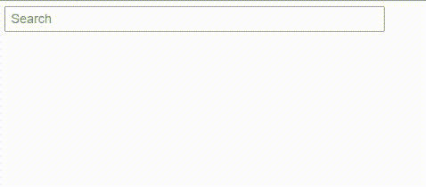

# 具有 RxJs 去抖功能的鲁棒角度搜索条

> 原文：<https://javascript.plainenglish.io/a-robust-angular-search-bar-with-rxjs-debounce-29a082d6816e?source=collection_archive---------5----------------------->

Photo by [Daniel Lerman](https://unsplash.com/@dlerman6?utm_source=medium&utm_medium=referral) on [Unsplash](https://unsplash.com?utm_source=medium&utm_medium=referral)

我们每天都会在互联网上遇到各种类型的搜索栏和搜索下拉列表。大多数搜索栏会调用后端 API 来查询基于我们输入的结果。

想象一个搜索栏，在你输入的时候显示国家的搜索结果。

假设用户想要搜索 Columbia，并且用户从键盘键入“col”。如果搜索功能在每次键盘输入时被触发，将会有三个单独的搜索请求“c”、“co”和“col”(见下文)。

但是，只需要搜索“col”的最后一个请求的结果。对“c”和“co”的搜索请求被发送到 API，但是它们的结果没有被使用。

Unwanted API request are being sent

为了防止搜索栏对用户输入的每一个字母发送这样的请求，我们可以在 RxJs 中使用**去抖**操作符。

***根据定义，只有在由另一个可观测对象确定的特定时间间隔过去而没有另一个源发射之后，去抖动算子才从源可观测对象发射通知。***

简而言之，它阻止向 API 发送请求，直到在一个输入之后经过了配置的时间(比如说 500 毫秒)，而没有另一个输入。由于用户键入“c”、“o”和“l”时字母之间的时间间隔小于该值，因此不会发送 API 请求。但是，当用户键入“col”后过了 500 毫秒，将发送 API 搜索请求。

我在 Angular 中创建了一个带有去抖功能的示例搜索栏。这里，我将去抖时间配置为 500 毫秒。

到达去抖时间后，使用搜索词调用 **searchRequest()** 方法。然后，它将查询 API，并将结果作为可观察结果返回。

你可以在下面看到搜索栏的 StackBlitz 演示。

Demo of the search bar

别忘了在 Github 上查看完整的源代码！

 [## github-PABA Sara-mahindapala/search-bar:由 StackBlitz ⚡️创建

github.com](https://github.com/pabasara-mahindapala/search-bar) 

## 参考资料:

1.  [https://rxjs.dev/api/operators/debounce](https://rxjs.dev/api/operators/debounce)

*更多内容请看*[***plain English . io***](https://plainenglish.io/)*。报名参加我们的* [***免费周报***](http://newsletter.plainenglish.io/) *。关注我们关于*[***Twitter***](https://twitter.com/inPlainEngHQ)[***LinkedIn***](https://www.linkedin.com/company/inplainenglish/)*[***YouTube***](https://www.youtube.com/channel/UCtipWUghju290NWcn8jhyAw)*[***不和***](https://discord.gg/GtDtUAvyhW) *。***