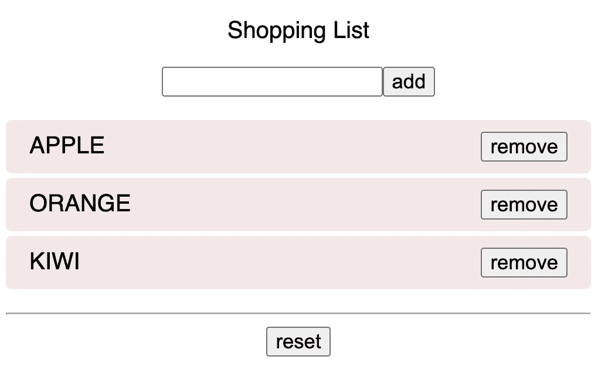
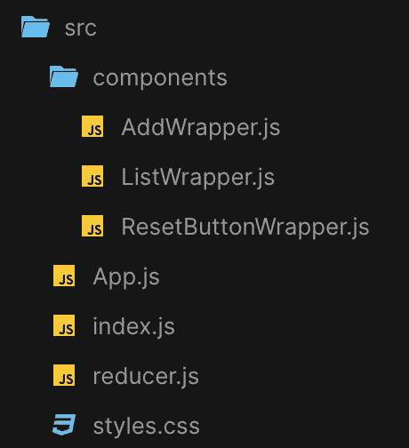
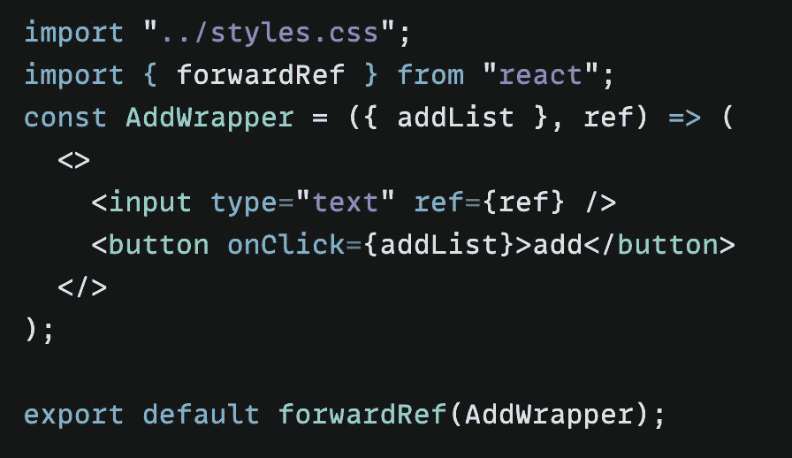
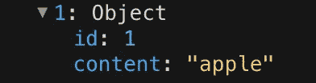

# 用 React Hook useReducer 创建购物清单

> 原文：<https://javascript.plainenglish.io/a-shopping-list-with-react-hook-usereducer-310a3b6578?source=collection_archive---------11----------------------->

## 带有 useReducer React 挂钩的购物清单——一个让 useReducer 更容易理解的小练习。


不学不成，不问不知 — no succeed without learn and ask

随着 **Redux** 作为 React 的状态管理解决方案的兴起， **Reducer** 的概念在 JavaScript 中流行起来。我对 Reducer 的理解一直是模棱两可的，既然 [*useReducer*](https://reactjs.org/docs/hooks-reference.html#usereducer) 是 React 作为高级钩子提供的，我决定用它做一点练习。

我见过的大多数 reducer 例子都与一些计数函数有关，以及增加或减少一个数字等。在本文中，我想一步一步地创建一个简单的购物清单来更好地理解这个钩子，而不是 *useState* ，我想试试 *useReducer* 。

**useReducer 不同于 useEffect、useState、useRef 等钩子。没有它，我们可以正常完成需求的开发，但是 useReducer 可以让我们的代码更具可读性、可维护性和可预测性。*

基本上，减速器用于管理应用程序中的**状态**。例如，如果用户在 HTML 输入字段中键入内容，应用程序必须管理这个 UI 状态(比如一个受控组件)。

本质上，reducer 是一个函数，它接受两个参数——当前状态****和动作**——并基于这两个参数返回新状态**。它可以表示为:********

```
****(state, action) => newState****
```

******第一个参数:**状态📍********

****一个 reducer 函数是一个没有任何副作用的纯函数，也就是说给定相同的输入(比如状态和动作)，期望输出(比如 **newState** )永远是相同的。****

***** *减速器处理的* ***状态*** *对象必须是***不可变的，这意味着从不直接修改参数中的状态，减速器函数每次都要返回一个新的状态。******

*****第二个参数:**动作📍*******

*****动作通常被定义为具有**类型**属性的对象，根据动作的类型，reducers 可以执行条件状态转换。如果动作类型不匹配任何条件，它将返回初始状态。*****

*****🤯文字解释可能会令人头疼，所以为什么不开始做我们的购物清单呢…*****

*****我们的购物清单非常简单，用户可以在输入字段中输入文本，通过单击**添加**按钮，每个清单将在下方显示一个**删除**按钮，允许用户轻松删除该清单。我们还有一个**重置**按钮来清理列表。*****

**********

*****shopping list result*****

*****为了使结构清晰，我们可以将页面大致分为三个组件: **AddWrapper** 包含添加按钮和输入字段， **ListWrapper** 显示最终购物清单和移除按钮，reset 按钮在 **ResetButtonWrapper** 内部。*****

**********

*****components structure*****

*******reducer.js** 文件将包含购物清单缩减器和初始购物清单作为初始状态，如下所示:*****

```
***const initialShoppingList = [ { id:'',content:'' } ]
const shoppinglistReducer = ( state, action ) => {...}export { shoppinglistReducer, initialShoppingList }***
```

*******App** 组件:*****

```
***export default function App() {
  const inputRef = useRef();
  ...
  return (
     <>
       ...
       <AddWrapper ... />
       <ListWrapper ... />
       <ResetButtonWrapper ... />
     </>
 )}***
```

*******AddWrapper** 组件:*****

****** *如果你不熟悉****forward ref****，可以看看* [*这篇*](https://xiaominzhu.medium.com/react-functional-components-using-refs-a5ad1d2817d4) *:)******

```
***import { forwardRef } from "react";const AddWrapper = ({ ... }, **ref**) => (
  <>
    <input type="text" ref={**ref**} />
    <button onClick={...}>add</button>
  </>
);export default **forwardRef**(AddWrapper);***
```

*******ListWrapper** 组件:*****

```
***const ListWrapper = ({ ... }) => {
 return (
   <ul>
    {newList?.filter(...).map(({ ... }) => {
       return (
         <li key={...}>
           <span>{content}</span>
           <button onClick={...}>remove</button>
        </li>
     )})}
   </ul>
)};export default ListWrapper;***
```

*******ResetButtonWrapper** 组件:*****

```
***const ResetButtonWrapper = ({ ... }) => 
  <button onClick={...}>reset</button>export default ResetButtonWrapper;***
```

*****结构清楚了，现在我们从**加**逻辑开始。*****

*****要添加一个列表，我们需要一个包含列表对象的初始列表数组，例如文本内容、id 等。我们已经在上面的 reducer.js 文件中创建了它。*****

```
***const initialShoppingList = [ { id:'',content:'' } ];***
```

*****我们的“添加”逻辑也在 reducer 文件内部，姑且将其命名为*shoppinglisteducer。*由于 reducer 接收当前状态和触发的动作(如添加、删除……)，它计算并返回新状态(如新购物清单)，我们可以这样理解 **u*s*e*R*e*d*u*c*e*r** :*****

********🦋使用*** *一个动作* ***键入*** *由* ***分派*** *来触发一个* ***动作*** *并将* ***初始*** *状态更新为******

*****因为我们的初始列表包含 **id** 和**内容**，这意味着我们可以实现添加逻辑:*****

```
***const shoppinglistReducer = (state, action) => {
  switch ( **action.type** ) {
   case "**ADD**":
    return [...**state**, {**id**: state.length, **content**: action.content}];
   case "REMOVE": return...;
   case "RESET": return...;
   default: throw new Error();
 }}***
```

*****使用动作类型“ **ADD** ”，我们向初始列表添加一个带有 id 和输入文本的新列表。*****

*****现在我们可以在 App 组件中使用这个逻辑，并向下传递 **props** :*****

```
***import { shoppinglistReducer, initialShoppingList } from "./reducer";
import { useReducer, useRef } from "react";export default function App() {
   const **inputRef** = useRef(); *// 👉 create input ref* const [**newList**, dispatch] = **useReducer**(shoppinglistReducer, initialShoppingList); // 👉 dispatch action from the reducer, update initial list and return new list
   const **addList** = () => {
      inputRef.current.value && dispatch({ type: "**ADD**", content: inputRef.current.value });
      inputRef.current.value = ""; // reset input value after click
      inputRef.current.focus();
   }; return (
   <**AddWrapper** addList={**addList**} ref={**inputRef**} />
   <**ListWrapper** newList={newList} />
   ...
 )
}***
```

*****更新 AddWrapper 组件:*****

**********

*****final AddWrapper component contains add function and ref props*****

*****现在，用户可以简单地输入和添加一个列表，新的购物列表数组从 reducer 返回，来呈现它。*地图()*:*****

```
***const ListWrapper = ({ newList, ... }) => {
  return (
    <ul>
    {**newList**?.map(({ id, content }) => {
      return (
        <li key={**id**}>
         <span>{**content**}</span>
         <button onClick={...}>remove</button> 
        </li>
      );
    })}
   </ul>
 )};export default ListWrapper;***
```

**********

*****the added list within console.log(newList)*****

*****下一步，创建**删除**逻辑。*****

*****因为我们已经创建了缩减器，所以我们可以添加这个逻辑:*****

```
***const shoppinglistReducer = (state, action) => {
  switch ( **action.type** ) {
   case "ADD":... //same
   case "**REMOVE**": return state.filter(list => list.id !== action.id);
   case "RESET": return...;
   default: throw new Error();
 }}export default function App() {
  const **remove** = (**id**) => dispatch({ type: "**REMOVE**", **id** });
   return (
     ...
     <ListWrapper newList={newList} remove={**remove**} />
 )}const ListWrapper = ({ newList, **remove** }) => {
  return (
    <ul>
      ... // same 
       <button onClick={() => **remove**(**id**)}>remove</button>
    </ul>
 )};***
```

*****上面的代码意思是:如果我们要“**移除**一个特定的列表，我们使用 **ID** 并过滤掉匹配的列表，剩下的渲染为“ **newList** ”。为了在单击按钮时调用这个 remove 函数，我们使用了新的列表 id。*****

*****现在，用户只需点击一下按钮就可以删除列表。*****

*****最后一步:创建**复位**逻辑。*****

*****这很简单，“重置”只是意味着不渲染任何东西，所以我们可以返回一个空数组[ ]:*****

```
***const shoppinglistReducer = (state, action) => {
  switch ( **action.type** ) {
   case "ADD": ...; 
   case "REMOVE": ...;
   case "**RESET**": return**[]**;
   ...
 }}export default function App() {
    const handleReset = () => dispatch({ type: "**RESET**" });
    return (
     ...
     <ResetButtonWrapper **handleReset**={handleReset} />
}const ResetButtonWrapper = ({ handleReset }) => 
   <button onClick={() => **handleReset**()}>reset</button>;***
```

# *******结论*******

> *****useReducer 是`[useState](https://reactjs.org/docs/hooks-reference.html#usestate)`的替代，当您有涉及多个子值的复杂状态逻辑或者当下一个状态依赖于前一个状态时，它通常更适合使用 State，它还允许您优化触发深度更新的组件的性能，因为您可以向下传递`dispatch`而不是回调。*****

*****在以下情况下使用它:*****

*   *****你的状态是一个数组或对象*****
*   *****你的状态变化很复杂*****
*   *****您希望构建自动化测试用例来确保程序的稳定性*****
*   *****您需要修改深层子组件中的某些状态*****
*   *****您有一个相对较大的应用程序，您希望 UI 和业务可以分开维护*****

*****就是这样！👐你可以在这里找到完整的代码，玩玩吧:)感谢你的时间！⏰*****

*****如果你也对我的其他文章感兴趣，这里有一些链接:*****

*****[](https://xiaominzhu.medium.com/react-functional-components-using-refs-a5ad1d2817d4) [## 使用引用对功能组件进行反应

### forwardRef 和 useImperativeHandle 的示例

xiaominzhu.medium.com](https://xiaominzhu.medium.com/react-functional-components-using-refs-a5ad1d2817d4) [](/create-a-simple-express-server-node-js-for-react-application-e2b2bd0c7e93) [## 为 React 应用程序创建一个简单的 Express 服务器(Node.js)

### 关于如何创建一个简单的 Express 服务器(Node.js)、将其连接到 React 应用程序以及解决错误的教程…

javascript.plainenglish.io](/create-a-simple-express-server-node-js-for-react-application-e2b2bd0c7e93) [](/use-session-storage-to-persist-state-within-a-react-component-206867ef2269) [## 使用会话存储来保持 React 组件中的状态

### 当页面会话结束时，sessionStorage 中的数据将被清除。

javascript.plainenglish.io](/use-session-storage-to-persist-state-within-a-react-component-206867ef2269) [](https://enlear.academy/create-responsive-iframe-embed-in-a-react-way-f52075bf3b04) [## 创建以反应方式嵌入的响应 iframe

### —令人惊讶的是，YouTube 没有相应的嵌入代码🦄，我们来玩 css 吧…

enlear .学院](https://enlear.academy/create-responsive-iframe-embed-in-a-react-way-f52075bf3b04) [](/create-a-simple-react-custom-hook-fc733d7b977a) [## 创建一个简单的 React 自定义挂钩

### 关于如何创建一个简单的 React 自定义钩子的教程

javascript.plainenglish.io](/create-a-simple-react-custom-hook-fc733d7b977a) 

*更多内容请看*[***plain English . io***](https://plainenglish.io/)*。报名参加我们的* [***免费周报***](http://newsletter.plainenglish.io/) *。关注我们关于*[***Twitter***](https://twitter.com/inPlainEngHQ)[***LinkedIn***](https://www.linkedin.com/company/inplainenglish/)*[***YouTube***](https://www.youtube.com/channel/UCtipWUghju290NWcn8jhyAw)*[***不和***](https://discord.gg/GtDtUAvyhW) *。对增长黑客感兴趣？检查* [***电路***](https://circuit.ooo/) *。********