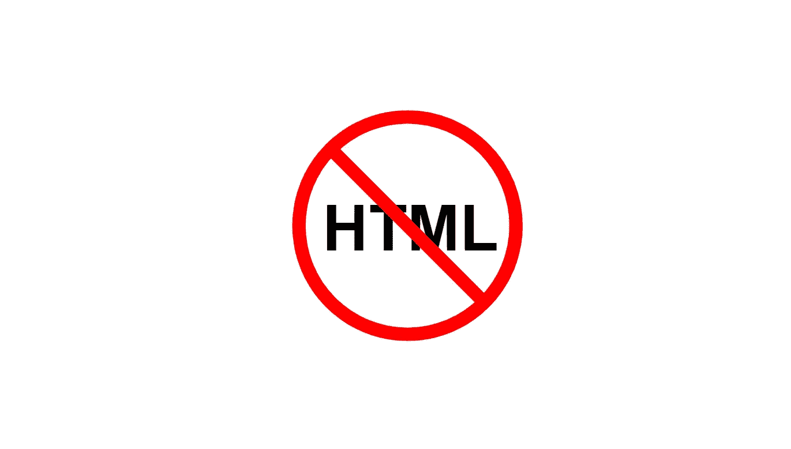
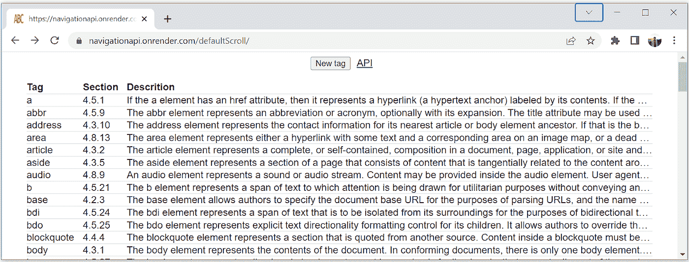
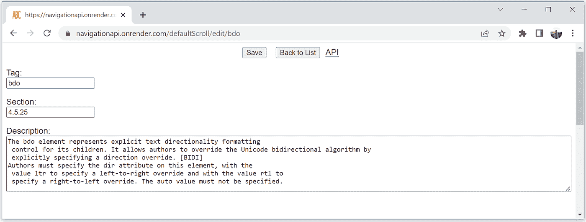
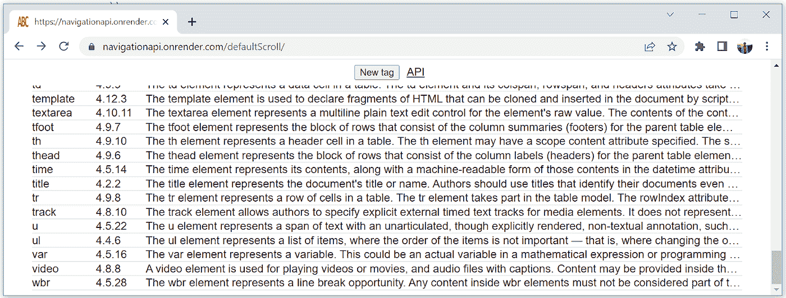
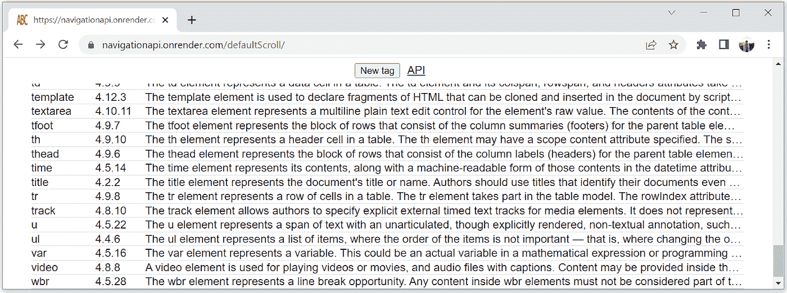
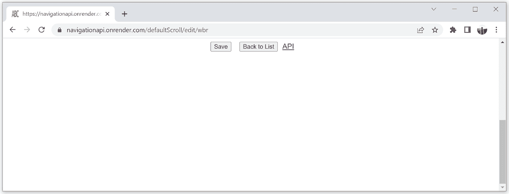

# 基于现代客户端路由 API 的简单而强大的路由器

> 原文：<https://javascript.plainenglish.io/a-simple-and-powerful-router-based-on-the-modern-api-for-client-side-routing-b40e9f6eb5bd?source=collection_archive---------4----------------------->

## 让我们探索一下直接开发单页面应用程序的最新 API



一般来说，将用户界面做成单页应用程序(SPA)比做成传统的多页应用程序更容易。当应用程序内容不必被 web 搜索引擎索引时(例如在机构内部网应用程序或公共互联网银行站点中)，开发服务器端呈现纯粹是浪费时间。

在传统的 web 应用程序中，每次点击链接时，浏览器都会向服务器请求一个新的 HTML 页面。相比之下，spa 只加载一个 HTML 页面。服务器为 SPA 处理的任何 URL 发送完全相同的 HTML 页面。例如，在本文的示例 SPA 中，服务器为具有三个不同 URL 路径的请求返回完全相同的 HTML、JavasScript 和 CSS 代码 [/defaultScroll/](https://navigationapi.onrender.com/defaultScroll/) 、 [/defaultScroll/edit/wbr](https://navigationapi.onrender.com/defaultScroll/edit/wbr) 和 [/defaultScroll/edit/](https://navigationapi.onrender.com/defaultScroll/edit/) 。

当加载 SPA 代码时，对当前 URL 的更改会被其路由器模块截获。当用户单击链接时，路由器会在地址栏中显示目标 URL，将目标 URL 保存在浏览器历史记录中，并调用显示目标 URL 内容的函数。该函数通常从服务器加载一些数据，将数据包装在 HTML 元素中，将它们插入到 DOM 中，并隐藏以前可见的元素。

按钮点击事件也可以由路由器处理。但是链接和按钮之间有一个重要的区别。由`<a>`标签形成的链接可以在新窗口中打开，从另一个网络应用程序引用，或者加入书签。链接的一个新颖的优点是，要被拦截，它们不需要点击事件监听器。

现代导航 API 提供了一个简单的机制来拦截任何即将到来的导航。可被拦截的导航事件最常见的触发器是链接、表单、*后退*或*前进*浏览器按钮、`location.href`或`location.assign()`。

导航 API 在[现代客户端路由:导航 API](https://developer.chrome.com/docs/web-platform/navigation-api/) 中有描述。这篇文章过于详细和不完整——它描述了通常不相关的细节，但没有实际的例子。在这篇文章中，我跳过了不可替代但很少需要的特性，旨在回顾导航 API 最常用的特性。

## 样本 SPA

在这篇文章中，我想探索导航 API 最实用的特性，尤其是滚动状态管理。为此，我使用了一个带有两个视图的示例 SPA，重用了我之前的文章中的示例数据。列表视图列出了 HTML 标签的描述。



表格中的每一行都是引用相应编辑视图的链接。当我单击标签名称时，我可以看到并修改它的完整描述。



在编辑视图中，我可以通过点击*返回列表*按钮返回列表。如果编辑视图是从列表视图打开的，我也可以使用浏览器的*后退*按钮。在任一视图中，我还可以单击一个外部链接 *API* 。然后，我可以通过单击浏览器的*后退*和*前进*按钮在已访问的视图和外部页面之间导航。

样本 SPA 中与路由相关的代码非常简单。 *main.js* 注册三个路由(列表视图、编辑视图、空编辑视图)并启动路由器。为了简化代码，我直接以正则表达式的形式使用路由。正则表达式允许使用它们的捕获组作为回调的参数。在示例 SPA 中，编辑视图需要参数。

```
// main.js
import { renderList } from '/js/views/list.js';
import { renderEdit, renderNew } from '/js/views/edit.js';
import { addRoute, start } from './router.js';**addRoute(/^$/, renderList);****addRoute(/^edit\/([a-z]+)$/, id => renderEdit(id));****addRoute(/^edit(\/)?$/, renderNew);****start();**
```

路由器的代码也一样简单。

```
// router.js
const handlers = [];export function addRoute(route, callback) {
    handlers.unshift({ route, callback });
}**export function start() {
    navigation.addEventListener('navigate', onNavigate);
    location.assign(location.href);
}****function onNavigate(e) {
    const callback = findHandler(e.destination.url);** **if (callback) {
        e.intercept({
            handler() {
                return callback();
            }
        });
    }
}**function argumentsInUrl(route, path) {
    return route.exec(path).slice(1);
}function findHandler(url) {
    const path = url.replace(document.baseURI, '').split('?')[0]; 
    const handler = handlers.find(o => o.route.test(path));
    if (handler)
        return () =>   handler.callback(...argumentsInUrl(handler.route, path));
}
```

`addRoute()`保存 URL 路径以及处理其渲染的函数。为了精确地处理滚动位置，处理程序必须返回仅在请求的视图被插入 DOM 后才解析的承诺。

`start()`首先在新的`navigation`对象上注册一个事件监听器`onNavigate()`，该对象在任何即将到来的导航之前触发一个`navigate`事件。然后，呈现第一个视图`start()`用加载 SPA 的 URL 触发一个`navigate`事件。

`onNavigate()`监听器为目标 URL 查找一个注册的处理程序，并与`intercept()`一起执行，后者是`preventDefault()`的专用替代。需要调用`intercept()`来指示浏览器不要向网络请求目的 URL。如果没有找到与目标 URL 匹配的处理程序，通常当点击外部链接时，`onNavigate()`不会调用`intercept()` ，浏览器会从网络上加载目标 URL。

路由器拦截由所有可能的触发器引起的导航。除了添加路由处理器的模块之外，任何应用程序模块都不需要知道路由器。

# 基于导航 API 的路由器的高效滚动状态管理

正确的滚动位置是视图中用户友好导航的一个重要方面。当用户点击*后退*按钮时，他们希望返回到先前访问过的视图中的相同位置。相反，当用户点击一个链接时，他们不想停留在页面的中间。

为了探索新的 API 如何处理滚动，我让两个视图都溢出窗口。列表视图有一个滚动条，因为带有标签的表格足够长。为了在任何标签的编辑视图中显示滚动条，我将其最小高度设置为窗口高度的 200%。因此，即使内容适合窗口，也会显示垂直滚动条。你可以在上面的截图中看到。

## 页面重新加载时，滚动位置会自动恢复

为了证明这一点，我滚动到带有标签的表格的底部。



我点击浏览器的*重新加载*按钮。页面从网络重新加载，列表视图重新呈现，然后被浏览器滚动到底部，就像上面的截图一样。



## 单击链接时，页面不会滚动到顶部

现在让我们看看导航 API 的一个限制。

我再次移动到列表视图的底部。然后我点击一个标签。带有所单击标签的编辑视图会滚动到页面底部。



因此，导航 API 不会在单击链接时自动将滚动位置重置到页面顶部。但是解决问题很容易。重置滚动位置的代码很简单。您可以在下面我的下一版本示例路由器中看到额外的三行代码。

## 在浏览浏览器历史记录的过程中，滚动位置得到恢复

单击链接引起的导航和浏览以前访问过的 URL 的历史记录之间有一个重要的区别。如果点击浏览器的*后退*或*前进*按钮，浏览器恢复到之前访问页面的滚动位置。因此，如果用户界面中的一个按钮，例如*返回列表*，指向先前访问的页面，则可以使用浏览器历史，以便用户返回页面上完全相同的位置。这种思想在编辑视图中的*返回列表*按钮的点击监听器中实现。

```
listBtn.addEventListener("click", () => {
    **if (navigation.entries()[navigation.currentEntry.index - 1]?.url === document.baseURI) {
        navigation.back();**
 **} else { 
        location.assign("");
    }**
});
```

方法`navigation.entries()`返回用户打开页面后浏览过的 URL。`navigation.currentEntry.index`返回当前 URL 在`navigation.entries()`返回的数组中的索引。当点击*返回列表*按钮时，监听器检查历史中的前一个条目是否是列表视图的 URL。如果是，监听器通过指示浏览器返回到历史中的前一个条目来触发一个`navigate`事件。或者，如果通过在新窗口中打开链接来打开编辑视图，则历史中没有列表视图。然后监听器通过用列表视图的相对 URL 调用`location.assign()`来触发`navigate`事件。

为了说明代码是如何工作的，我从上面的截图开始，继续对 *wbr* 标签进行不正确的滚动描述。如果我点击*返回列表*按钮或*返回*按钮，就会呈现正确滚动的列表视图。


示例页面很慢，因为它是免费的。但是对于这篇文章来说，这真的很棒，因为您可以观察到浏览器延迟恢复滚动位置，直到`intercept()`从路由处理器收到的承诺解决。

# 路由器完美地重置和恢复滚动位置

因此，使用导航 API 的开发人员需要提供代码，在单击链接后创建的视图中重置滚动位置。`navigation`事件的`navigationType`属性允许区分点击链接和浏览历史。当导航由链接引起时`navigationType`等于`push`。当浏览器在历史中后退或前进时，`navigationType`等于`traverse`。

在示例 SPA [的增强版本中，https://navigationapi.onrender.com/restoreScroll/](https://navigationapi.onrender.com/restoreScroll/)`onNavigate()`监听器等待路由处理程序返回，然后检查滚动位置是否必须归零。

```
function onNavigate(e) {
    const callback = findHandler(e.destination.url);if (callback) {
        e.intercept({
            async handler() {
                await callback();
                **if (e.navigationType === 'push')
                    document.scrollingElement.scrollTop = 0**
            }
        });
    }
}
```

# 结论

从我的样本 SPA 中，我得出了几个实用的结论。与基于历史 API 的传统路由器相比，现代路由器更易于使用，因为:

*   除了注册路由的主模块，其他模块都不需要导入路由器。路由器不需要有两个以上的公共方法— `addRoute()`和`start()`。路由器拦截所有导航触发，包括`location.href`或`location.assign()`，因此 `router.navigate()`没有意义。
*   如果链接上没有点击事件监听器，SPAs 的代码会更短。
*   无需任何额外的代码，在历史遍历和页面重新加载过程中，滚动位置会可靠地恢复。默认行为很容易修改。

示例代码可以从[https://github.com/marianc000/navigationAPI](https://github.com/marianc000/navigationAPI)下载或者在示例页面[https://navigationapi.onrender.com/](https://navigationapi.onrender.com/)查阅

*更多内容看* [***说白了。报名参加我们的***](https://plainenglish.io/) **[***免费周报***](http://newsletter.plainenglish.io/) *。关注我们关于* [***推特***](https://twitter.com/inPlainEngHQ) ， [***领英***](https://www.linkedin.com/company/inplainenglish/) *，以及* [***不和***](https://discord.gg/GtDtUAvyhW) *。***