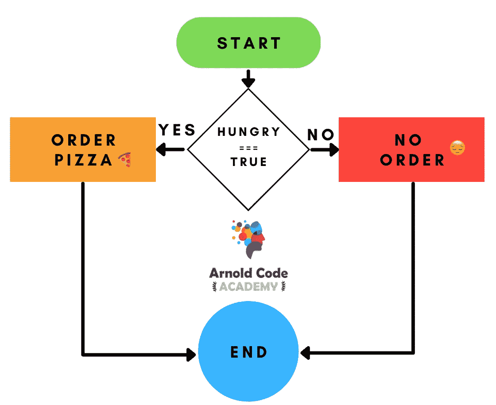
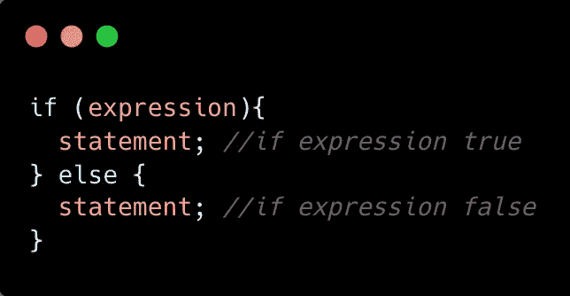
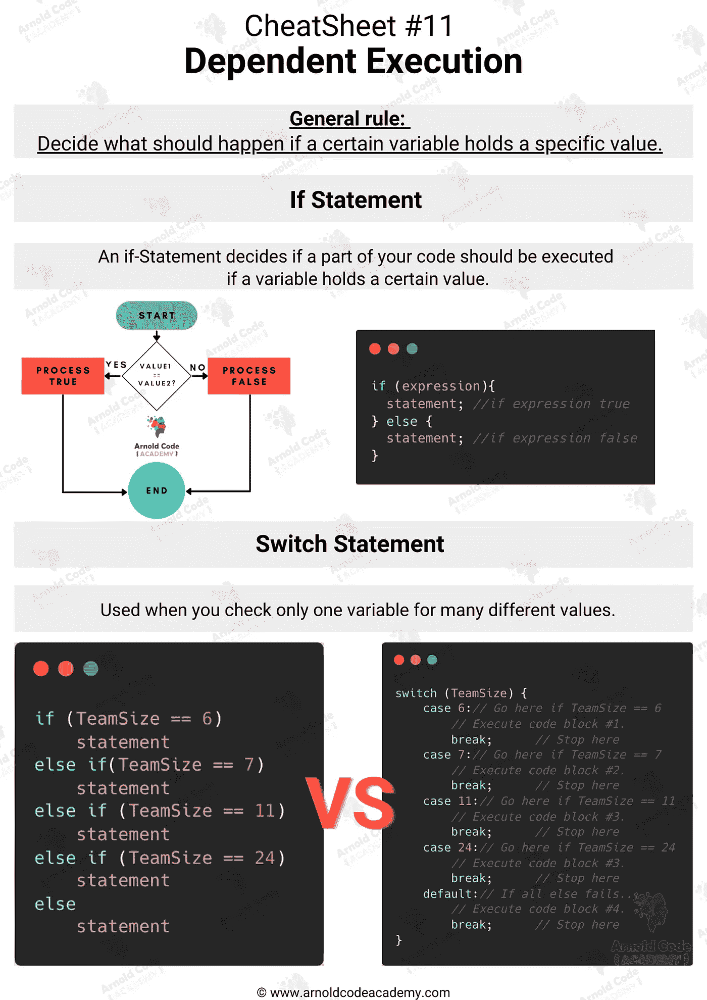

# JavaScript 中 If-Else & Switch 语句的简单解释，适合初学者

> 原文：<https://javascript.plainenglish.io/a-simple-explanation-of-if-else-switch-statements-in-javascript-for-beginners-1c6cfa1185c8?source=collection_archive---------17----------------------->

## 包括从属执行的备忘单。

Image Made By Author and Canva

每个程序的一个基本操作是操纵数据。但不只是随机的。谈论数据和不同的值导致决定如果一个特定的变量持有一个特定的值或者甚至不持有，应该发生什么。

想象两个你熟悉的案例:

*   你不饿→你什么也没点
*   你饿了→你点了披萨🍕

# If-Else 语句

用一个形象的概念来说:

您或您的程序通过比较两个值来决定采用哪条路径。这个叫做表达式，它要对`true`或者`false`求值。

> *🔥:*表达式是 JavaScript 的一个基本术语，它计算回一个值。请在我的文章中阅读更多内容:[初学者理解 JavaScript 代码结构的 5 个简单概念](/the-5-easy-concepts-to-understand-javascript-code-structure-for-beginners-d3f5b178a484)

以下是 if-else 语句的一般方案

如果评估为真，由 If 语句包围的部分被解锁并执行。下面是一个伪代码示例:

**一个 If-Else-Statement 可以看做是有一个箱子的钥匙，如果是对的，就可以得到内容。**

如果评估结果为 FALSE，您可以为该结果编写代码，或者跳过未执行的部分。这完全取决于你和你的需求。

## 链接 If-else-if-else

两箱对你来说不够吗？

今天是个好日子，你想庆祝一下—🍣！但是你请了几个人，还得数钱。您可以继续添加更多案例。下面是一个例子:

你可以想链接多久就链接多久。没有人会阻止你。

> *🔥:* `var`，`let` & `const`有差异，想象一下你第一次面试的时候没有准备好这个基础问题:[JavaScript Const vs . Var vs . Let:全时段综合指南](/javascript-const-vs-var-vs-let-a-comprehensive-guide-for-all-time-d6d836c8bbd7)。

但是这不是一个好的实践，主要是如果你依赖于一个单一的变量，就像我用`money`做的那样。那么您应该使用 switch 语句。

# Switch 语句

当您使用 if 语句并希望证明不同的值有不同的结果时，这是 If-else 语句的合适情况。

但是当您只检查一个变量的不同值时，switch-case 是更好的选择。

例如，你想知道你聚会的人数。它可能是 42 或 24，甚至是 6，也可能是 0，然后对这个事实做出反应。if 语句的相应代码如下所示:

想象一下上面的 if-else-if 语句:

突然不想再参加派对了。这个 if-else-if 语句是非常糟糕的代码，原因有二:

*   你必须阅读许多关键字来混淆这段代码的目的
*   你不能想当然地认为每个 if-else 都只用`partyPeople`

# 文件的备忘单

> 知道学什么是不可能的，如果你还在学习的话。想象有人创造了浓缩的备忘单。幸运的是，他们来了！

[26 Web Dev Cheatsheets for Every Beginner Must Have](https://arnoldcodeacademy.ck.page/26-web-dev-cheat-sheets)

*更多内容尽在* [***说白了. io***](https://plainenglish.io/) *。报名参加我们的* [***免费周报***](http://newsletter.plainenglish.io/) *。关注我们关于* [***推特***](https://twitter.com/inPlainEngHQ) *和*[***LinkedIn***](https://www.linkedin.com/company/inplainenglish/)*。加入我们的* [***社区***](https://discord.gg/GtDtUAvyhW) *。*