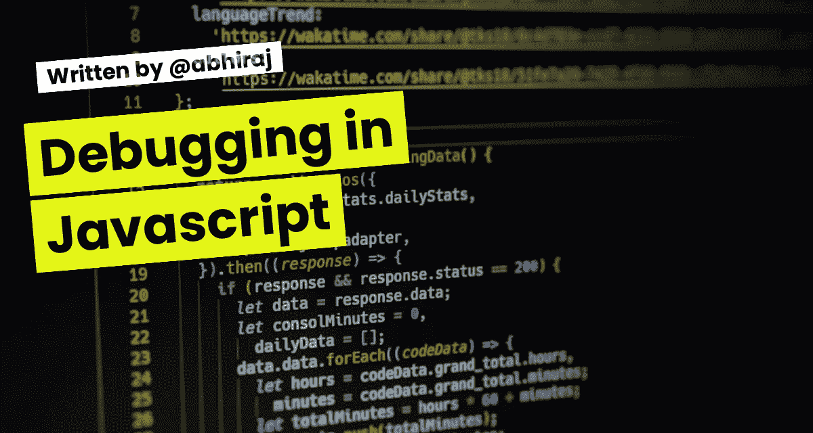

# JavaScript 调试简单指南

> 原文：<https://javascript.plainenglish.io/a-simple-guide-to-debugging-in-javascript-b38f81569563?source=collection_archive---------7----------------------->



程序员花大量时间诊断和纠正代码中的错误和遗漏。调试降低了 JavaScript 的执行速度，并显示了如何逐行修改数据。由于 JavaScript 在运行时被解释并在浏览器内部执行，所以调试是通过浏览器内置的工具来执行的。

## JavaScript 中的错误

1️⃣ **语法错误**
代码编写方式的错误会导致语法错误。JavaScript 引擎在运行时解释代码时会出现此错误。

2️⃣ **类型错误**t5】当使用了错误的数据类型时，就会出现这种错误。例如，将 string.substring 方法应用于数字变量。

3️⃣ **范围错误**

4️⃣ **URIError**
某些字母数字字符不允许在 URL 中使用。当由于使用了保留字符而导致 URI 编码或解码出现问题时，将引发 URlError。

5️⃣ **引用错误**
当代码引用一个不存在或不在执行代码范围内的变量时，就会出现此错误。

6️⃣ **EvalError** 较新版本的 JavaScript 不会抛出这个错误。

## 开发者工具

所有现代浏览器都包含一套开发工具，帮助程序员处理 HTML、CSS 和 JavaScript。开发人员工具包含调试 JavaScript 和查看浏览器中 HTML 元素状态的功能。要打开 Google Chrome 浏览器的开发者工具，请按 Command+Option+I(Mac)& Control+Shift+I(Windows、Linux)。

**控制台**

Web 开发人员可以将消息输出到控制台日志，以确保他们的代码按预期执行。“控制台”选项卡包含两个区域:

1️⃣控制台输出日志:显示 JavaScript 执行过程中的系统和用户消息。

2️⃣控制台命令行界面:接受任何 JavaScript 指令并立即执行。

JavaScript 调试器

JavaScript 调试器可以在源代码选项卡下找到。调试器可以一行一行地遍历代码，查看代码执行时变量发生了什么变化。左边是 HTML 文档使用的所有源文件的列表。从此列表中选择要调试的文件。

**范围**

在“源”选项卡中，右边的窗口包含范围。这下面的局部和全局部分显示了在当前作用域中定义的变量。只有在调试脚本时，范围窗格才会填充变量。

**断点**

JavaScript 引擎在遇到断点时暂停代码的执行。这允许程序员检查它。执行可以按照下列方式进行。

1️⃣恢复脚本执行:恢复执行，直到程序遇到另一个断点或程序结束。

2️⃣单步执行:单步执行下一行代码，然后在下一行暂停。它单步执行一个函数，而不调试该函数的单个步骤。

3️⃣单步执行:执行下一行代码，然后在下一行暂停。它将逐行进入一个函数。

4️⃣单步执行:执行当前函数中的剩余代码，并在调用函数后运行时返回到代码行时暂停。

**错误处理**

在 JavaScript 中，try…catch 语句允许程序员处理代码中的错误。通常，当 JavaScript 引擎抛出错误时，程序会停止执行。但是，如果代码被包装在 try 块中，当抛出异常时，执行将跳转到 catch 块，程序将照常继续运行。也可以使用“throw”语句手动引发错误。

**尝试…捕捉语句**

```
try{
 noSuchCommand(); // This function does not exist
}
catch (err) { // The code jumps to the catch block instead of stopping the program execution
 console.error(err.message)
}
console.log(“Script continues to run after the exception”); // The error message displayed in the console
```
```

**抛出声明**

```
throw(“Oops there was an error”); // The throw operator generates an error 
```

## 感谢您的阅读

如果你喜欢这篇文章，请订阅我的[时事通讯](https://abhirajbhowmick.substack.com)永远不要错过我的博客、产品发布会和技术新闻，并在 [Twitter](https://twitter.com/rainboestrykr) 上关注我关于网络开发资源的每日线程。

*更多内容看* [***说白了。报名参加我们的***](https://plainenglish.io/) **[***免费周报***](http://newsletter.plainenglish.io/) *。关注我们关于*[***Twitter***](https://twitter.com/inPlainEngHQ)*和*[***LinkedIn***](https://www.linkedin.com/company/inplainenglish/)*。查看我们的* [***社区不和谐***](https://discord.gg/GtDtUAvyhW) *加入我们的* [***人才集体***](https://inplainenglish.pallet.com/talent/welcome) *。***