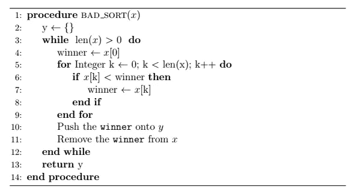
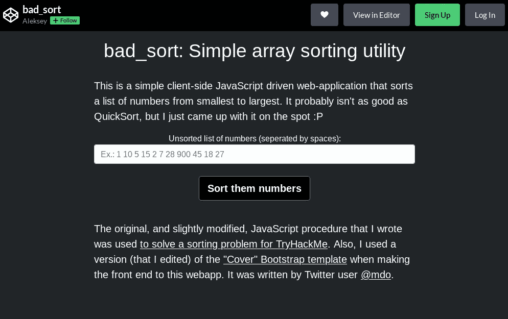

# 一个简单的 JavaScript 排序工具

> 原文：<https://javascript.plainenglish.io/a-simple-javascript-sorting-utility-bc08fb54134c?source=collection_archive---------14----------------------->

## 或者，尝试像程序员一样思考

TryHackMe (n.d.) 是一个在线平台，旨在向有抱负的网络安全专业人士传授进攻性和防御性安全方面的技术和理念。他们有一个“房间”，或实验室，向用户介绍 JavaScript([“ghost lypy”，2020](https://tryhackme.com/room/javascriptbasics) )，最终让用户实现自己的排序算法(同上，任务 10)。在本文中，我将讨论我对他们的“JavaScript 挑战”的解决方案


Image Base: [Lil i Put comic strip](https://www.picuki.com/media/2018458232566376517)

# 找出解决办法

出自[《幽灵特工》(2020，任务 10)](https://tryhackme.com/room/javascriptbasics) :

*“在我们的挑战中，我们将使用 JavaScript 方法对一组数字进行排序[……]我建议在查看[我的解决方案*][…][s]sort array[1，10，5，15，2，7，28，900，45，18，27]”*

我认为输出应该按照从最小到最大的顺序排序，而不是从最大到最小，事实证明我是正确的。我没有使用任何内置的 JavaScript 排序方法，也没有将现有的算法移植到 JavaScript 中，而是决定尝试实现自己的排序算法，尽管这种算法效率很低。

**房间的作者在这里发表了他们的解决方案:*

[](https://github.com/GhostlyPy/javascriptbasics/blob/master/code_challenges.js) [## JavaScript basics/code _ challenges . js at master HIFU mi 1337/JavaScript basics

### 此文件包含双向 Unicode 文本，其解释或编译可能与下面显示的不同…

github.com](https://github.com/GhostlyPy/javascriptbasics/blob/master/code_challenges.js) 

## 解决方案的抽象

我思考了一些策略，最终决定使用一种由 Boyer(1991)Moore(1991)设计的多数投票策略。最初的算法遍历一个数组或列表，并计算列表中不同种类项目的出现频率。“获胜者”被宣布并输出到屏幕上。

我做了一个排序算法，使用了类似的推理，我通过遍历一个列表(即“输入列表”)中的所有数字来声明一个“获胜者”，并将获胜者设置为最小的数字。然后，这个“获胜者”从输入列表中被删除，并被追加到另一个列表中，即“输出列表”这个过程一直重复，直到输入列表为空，然后输出列表被返回给调用它的函数。

下图概述了我打算写什么来解决手头的问题:



The sorting algorithm represented as pseudocode.

这只是我想用 JavaScript 做的一些高级的、类似伪代码的表示。我将在下一小节解释它的本质。

## 编写解决方案的实现

我首先用 ES6 符号定义了一个函数，它接受一个要转换的输入列表`x`:

```
// I call it "bad_sort" because it's not as efficient as QuickSort or JavaScript's built in methods :P
const bad_sort = (x) => {
    // sorting logic goes here
};
```

然后我定义了排序后要返回的输出列表`y`:

```
const bad_sort = (x) => {
    y = [];
    return y;
};
```

最后，我可以实现主要逻辑的第一部分:

```
**[... snip ...]**
**(1)** winner = x[0];
**(2)** for (let k = 0; k < x.length; k++) {
    **(3)** if (x[k] < winner)
        **(4)** winner = x[k];
**(5)** y.push(winner);
**(6)** x.splice(x.indexOf(winner), 1);
**[... snip ...]**
```

第一行(1)假设输入列表中的第一个数字最小。建立一个 for 循环(2)，遍历输入列表中的每个数字，并与`winner` (3)进行比较。如果输入列表中的数字确实小于获胜者，则`winner`被设置为该数字(4)。重复这个过程，直到遍历完整个列表。获胜者然后被推到输出列表(5)上，并从输入列表(6)中移除。

但是，这个 for 循环只会从输入列表中删除一个数字，并将其附加到输出列表中。我们需要对输入列表中的所有数字都这样做。为了实现这一点，一个`do…while`循环被用作主逻辑的第二部分:

```
**[... snip ...]**
do {
    // the first part of main logic
} while (x.length > 0);
**[... snip ...]**
```

这个`do…while`循环将确保排序算法至少运行一次，并将继续运行，直到列表中的所有数字都与最初的获胜者进行了比较。我最终的解决方案如下:

# 展示排序实现

我创建`bad_sort`部分是为了练习像程序员一样思考。工程就是寻找问题的解决方案，软件工程也不例外。此外，寻找问题的解决方案需要创造力和聪明才智，软件工程也不例外。

当然，程序员和软件工程师不应该过多地“重新发明轮子”( [Althoff，2016](https://www.amazon.com/Self-Taught-Programmer-Definitive-Programming-Professionally-ebook/dp/B01M01YDQA) )，应该在从事专业编程工作时使用其他库(同上)。这只是一个思考问题解决方案的案例研究，对于第一次学习如何编码的人来说，这个问题可能是新奇的。

尽管如此，我还是想通过添加一个前端 web 界面并将其托管在 *codepen* 上来展示我编写的这个小排序函数:



You can check it out [here](https://codepen.io/EpsilonCalculus/full/ZEXMxYr) (and [here](https://codepen.io/EpsilonCalculus/pen/ZEXMxYr) with side-by-side view of code)

为了使脚本能够与前端 web 表单一起工作，我编写了以下代码:

我首先定义函数`interface` (Ln。1 和 6)，然后得到一串用空格隔开的数字(Ln。然后用来自`bad_sort`函数(Ln。4 和 5)。

由于时间关系，我不会详细介绍 web 应用程序的 HTML 和 CSS 组件，但是我建议您查看 codepen 上的[并行代码比较和前端应用程序。希望读者熟悉 HTML 和 CSS😅](https://codepen.io/EpsilonCalculus/pen/ZEXMxYr)

# 摘要

这更像是一个像业余程序员一样思考的案例研究。遗憾的是，我无法详细说明导致我使用“多数表决”技术的思想过程，但希望我做了一个体面的工作，从头解释了我的排序算法是如何工作的。

# 引用的作品

阿尔托夫，C. (2016)。*自学程序员:专业编程权威指南(Kindle，第一版)*。三角连接有限责任公司。

Boyer R.S .，Moore J.S. (1991) MJRTY —一种快速多数表决算法。载于:博耶 R.S .(编辑)*自动化推理。自动推理系列，第 1 卷*。斯普林格，多德雷赫特。链接:[https://apps.dtic.mil/sti/pdfs/ADA131702.pdf](https://apps.dtic.mil/sti/pdfs/ADA131702.pdf)

《幽灵特工》(2020)。 *JavaScript 基础知识*。TryHackMe。2022 年 2 月 17 日检索自:[https://tryhackme.com/room/javascriptbasics](https://tryhackme.com/room/javascriptbasics)

TryHackMe(未注明日期)。 *TryHackMe 主页*。2022 年 2 月 16 日检索自:[https://tryhackme.com/](https://tryhackme.com/)

*更多内容看* [***说白了就是***](http://plainenglish.io/) *。报名参加我们的* [***免费每周简讯***](http://newsletter.plainenglish.io/) *。在我们的* [***社区不和谐***](https://discord.gg/GtDtUAvyhW) *获得独家获取写作机会和建议。*