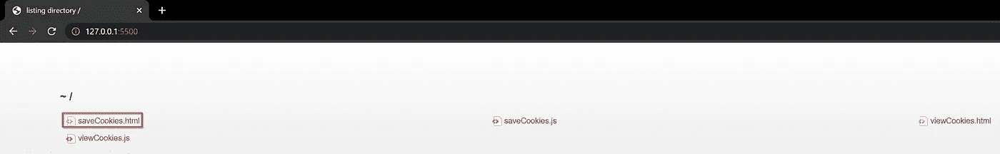

# 一个简单、快速和容易的 JavaScript Cookies 指南

> 原文：<https://javascript.plainenglish.io/a-simple-quick-easy-guide-to-javascript-cookies-8d71dfe2a64?source=collection_archive---------9----------------------->

## 了解如何使用 JavaScript cookies 在浏览器中保存数据

Photo by [Mockaroon](https://unsplash.com/@mockaroon?utm_source=medium&utm_medium=referral) on [Unsplash](https://unsplash.com?utm_source=medium&utm_medium=referral), I know, they are macaroon and not cookies

我一直认为 JavaScript 是一种“易变的”语言。这不是真的。仅仅因为一门语言是为 web 脚本而构建的，并不意味着你不能永久保存东西。

JavaScript 是一种庞大的语言，结合各种框架，你可以用它来编写数据库，这里我们将讨论最简单的方法。在浏览器中保存数据，特别是通过 cookies。

这项技术非常有用，因为它使您有可能保存数据，并在重新打开浏览器时检索这些数据。一个应用程序的例子可能是编写一个 Google Chrome 扩展，并将这一知识与使用 cookies 编写一些有用的扩展的可能性相结合。

 [## 如何编写 Google Chrome 扩展

### 两分钟内创建一个谷歌浏览器扩展

levelup.gitconnected.com](https://levelup.gitconnected.com/how-to-write-a-google-chrome-extension-c9dc2ec8ff85) 

## JavaScript 中 cookies 的工作原理

Cookies 很简单:选择一个名称和值，一切都设置好了。好吧，没那么快，他们甚至需要一个有效期！
你应该把 cookies 看作一个键-值对，你选择一个名字作为键和一个值来关联。
cookie 遵循这个结构`[nameOfYourCookie]=[valueOfYourCookie]; expires=[expirationDate]`。
如果您不设置到期日期，当您关闭浏览器时，cookie 将会丢失，因为它仅在会话期间有效。

## JavaScript cookies 的一个例子

我使用了 Visual Studio 代码和 Live Server 扩展来简化这个例子。这是一个快速设置本地服务器的好方法。如果您没有使用这个不错的扩展，请在您的环境中安装它，或者为您的文本编辑器/IDE 找到一个等效的替代方案。

Live Server

注意这一步，使用一个程序来模拟一个本地服务器，因为如果你直接用浏览器(例如 Google Chrome)打开`saveCookies.html`,这个例子将无法工作。如果你直接打开一个文件，你会看到一个类似于`file:///C:/Users/Loryn/Desktop/Coding/JavascriptCookiesTutorial/saveCookies.html` 的路径，在这种情况下，你的浏览器不会保存任何 cookie。
作为参考，您可以随时在以下链接查看该项目的 GitHub 资源库:[https://GitHub . com/Lorebitryo/cookies-JavaScript-tutorial-medium . git](https://github.com/Lorebitryo/cookies-javascript-tutorial-medium.git)

这个简单的例子将教你如何使用 cookies，我们将使用四个简单的文件:`saveCookies.html, saveCookies.js, viewCookies.html, viewCookies.js`。

The four files that we will use

## 创建 HTML 模板

`saveCookies.html`文件是一个`.html`页面，有两个输入字段、一个“保存”按钮和一个到您保存的 cookies 页面的链接。
我们将使用第一个输入字段保存 cookie 的名称，第二个字段保存值。

saveCookies.html page

下面是创建此页面的代码:

saveCookies.html code

现在，我们将创建模板来查看我们保存的 cookies。

viewCookies.html page

用下面的 HTML 创建`viewCookies.html`:

viewCookies.html code

这是一个带有空 div 的简单页面，我们将使用 cookies 动态填充这个 div。

## 如何用 JavaScript 保存 cookies

saveCookies.js file

在第 5–6 行中，我们从输入字段中检索了`cookieName`和`cookieValue`，并将它们用作`setCookies`函数的输入。
基础部分是第 10 行中的函数`setCookies`，它将 cookie 的名称、值和有效天数作为输入。为了实际设置 cookie，我们必须使用对象`document.cookie`，您可以在第 15 行看到一个例子。
我认为最烦人的部分是截止日期，这里有一个分解:
在第 11 行我们检索当前日期，在第 12 行我们使用`setTime()` 函数，它需要毫秒的输入，因为我们必须在`expirationDate`上调用`getTime()`函数(以毫秒为单位返回当前日期)，现在我们可以添加我们想要的所有日期。
你可以添加任何你想要的值，在这个例子中，我在输入中使用`days`乘以`ONE_DAY_MILLISECONDS`来设置到期日期。

## 如何用 JavaScript 检索所有 cookies

viewCookies.js file

我们可以通过使用`document.cookie`对象来检索所有保存的 cookies。
一个 cookie 和下一个 cookie 之间用分号隔开，所以在这个例子中，为了检索所有 cookie 并返回一个数组，我们使用了`split(";")`函数。我们将把检索到的 cookies 分配给 div `divSavedCookies`。

## 享受您的网站与保存和阅读 cookies 的功能

单击“Go Live”按钮激活您的本地服务器(如果您使用的是启用了 Live 服务器的 Visual Studio 代码)或启动您的本地服务器。

Go Live button

打开浏览器，连接到 [http://127.0.0.1:5500/](http://127.0.0.1:5500/) (使用 Live Server 可以读取右下角的端口号，在我的例子中是 5500)。

Port 5500

您应该会看到包含所有文件的目录

Directory localhost:5500

点击`saveCookies.html`并测试您的程序。

Save Cookies page

设置您的 cookie 并按“保存”，然后点击“查看 cookie”链接并阅读您的所有 cookie。

View Cookies page

学习如何使用浏览器中的开发工具是非常重要的。
在谷歌 Chrome 中，按 F12，你将打开 DevTools。从 DevTools 中，你可以读取你保存的所有 cookies，点击“应用程序”，“Cookies”，然后点击你的地址(在我的例子中是`http://127.0.0.1:5500`)

Google Chrome DevTools

## 结论

在本文中，我们学习了如何设置一个简单的页面来保存和读取我们的 cookies。

非常感谢您花时间阅读我的文章。

## 资源

[GitHub 项目库](https://github.com/Lorebitryo/cookies-javascript-tutorial-medium.git)
[Live 服务器扩展](https://marketplace.visualstudio.com/items?itemName=ritwickdey.LiveServer)
[Visual Studio 代码](https://code.visualstudio.com/)

*更多内容看* [***说白了。报名参加我们的***](https://plainenglish.io/) **[***免费周报***](http://newsletter.plainenglish.io/) *。关注我们上* [***推特***](https://twitter.com/inPlainEngHQ) ， [***领英***](https://www.linkedin.com/company/inplainenglish/) ***，***[***YouTube***](https://www.youtube.com/channel/UCtipWUghju290NWcn8jhyAw)***，以及****[***不和***](https://discord.gg/GtDtUAvyhW)*** *对成长黑客感兴趣？检查出* [***电路***](https://circuit.ooo/) ***。***