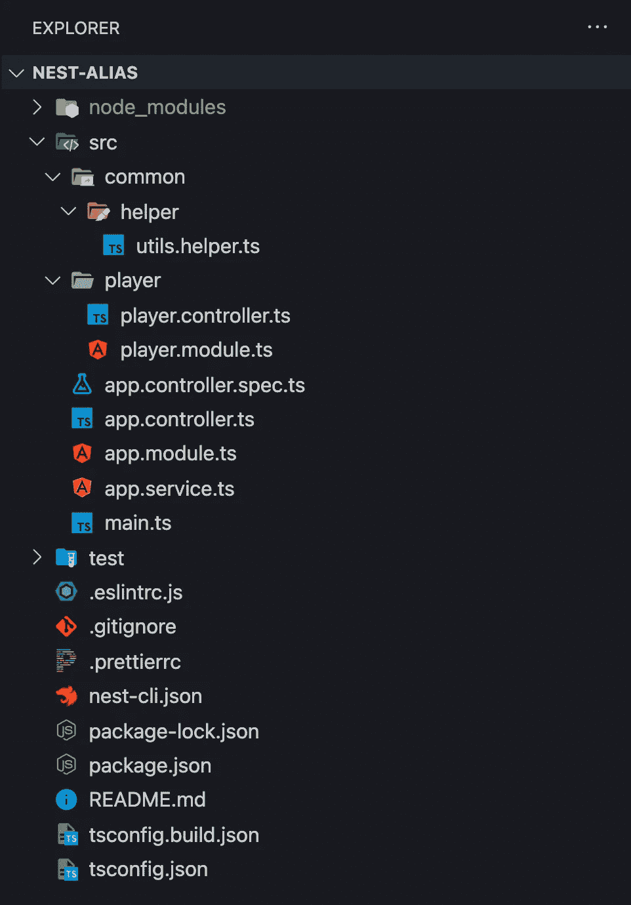

# 在 NestJS 中使用路径别名的简单方法

> 原文：<https://javascript.plainenglish.io/a-simple-way-to-use-path-aliases-in-nestjs-ab0db1be1545?source=collection_archive---------1----------------------->

## 使用 NestJS 的路径别名(2022)

在今天的文章中，我想简单解释一下如何在不破坏构建和测试的情况下在 NestJS 中使用路径别名。请记住，我会保持这个项目尽可能简单。


如果你不知道我在说什么:

```
**Original:**
import CatModule from '../../cat/cat.module.ts'**Alias Path:**
import CatModule from '@/cat/cat.module.ts'
```

正如你所看到的，进口的路径变得更加清晰。

# 先决条件

需要对 Node.js、TypeScript 和 PostgreSQL 有一个基本的了解，它们已经安装在您的机器上。我会选择 [Visual Studio 代码](https://code.visualstudio.com/)作为我的代码编辑器。你可以用你喜欢的任何东西。

# Nest.js 应用程序

还是继续 NestJS 吧！我们将安装 NestJS CLI，因此打开您选择的终端并键入:

```
$ npm i -g @nestjs/cli
```

我们用它的 CLI 初始化一个新的 NestJS 项目。这可能需要一分钟。“-p npm”标志意味着我们将选择 npm 作为我们的软件包管理器。如果你想选择另一个包管理器，只需去掉这个标志。

```
$ nest new nest-alias -p npm
```

此外，我们正在不同的目的地创建 PlayerModule、PlayerController 和 helper 函数。

```
$ nest g mo player && nest g co player --no-spec
$ mkdir src/common && mkdir src/common/helper
$ touch src/common/helper/utils.helper.ts
```

完成该命令后，您可以在代码编辑器中打开您的项目。由于我使用 Visual Studio 代码，我将通过键入以下命令打开项目:

```
$ cd nest-alias
$ code .
```

我的项目在 VSCode (Visual Studio 代码)中是这样的:



因此，在修改 PlayerModule 之前，我们需要分三步调整 Nest.js 应用程序的配置。

# 步骤 1:在 tsconfig.json 中添加路径

首先，我们需要添加路径到我们的`tsconfig.json`文件，您可以在我们的根文件夹中找到它。因此，我们将把这个文件从:

tsconfig.json

到

tsconfig.json

如你所见，我们只在底部添加了四行。现在我们需要为我们的测试配置做一些同样的事情。

# 步骤 2:将映射器添加到 jest 配置中

其次，我们需要调整我们的`package.json`文件。

> **注意:**我只给你看 package.json 文件的 JEST 部分！不要改变那里的任何东西。

到

# 步骤 3:将映射器添加到 jest e2e 配置中

最后但同样重要的是，我们需要调整我们的`test/jest-e2e.json`文件。让我们把它从:

到

很好，现在我们完成了配置。现在，让我们通过赋予我们的应用程序一点生命来测试它。

前面，我们已经创建了一个名为`src/common/helper/utils.helpers.ts`的文件，让我们添加两个函数。函数`wait`只是一个延迟函数，函数`randomInt`返回一个整数。

src/common/helper/utils.helpers.ts

现在，我们将在`src/player/player.controller.ts`中创造奇迹，这里我们以两种不同的方式添加两个助手函数，基于我们刚刚添加到 Nest.js 应用程序中的路径&映射器配置。

src/player/player.controller.ts

如你所见，随机函数的实际路径是这样的:

```
*import { randomInt } from '../common/helper/utils.helper';*
```

但现在是这样的:

```
import { randomInt } from '@Helper/utils.helper';
```

我们完了！别名路径更容易阅读，对吗？我已经在 [Github](https://github.com/hellokvn/medium-nest-alias-path) 上传了这个应用。

感谢你阅读我关于如何在 Nest.js 中添加路径别名的简短教程。我希望你能学到一些新东西。

干杯！

我希望你喜欢读这篇文章。如果你愿意支持我成为一名作家，可以考虑注册[成为](https://medium.com/@hellokevinvogel/membership)的媒体成员。每月只需 5 美元，你就可以无限制地使用 Medium。

想支持我？[给我买杯咖啡。](https://www.buymeacoffee.com/hellokevinvogel)

## 接下来阅读

[](https://blog.bitsrc.io/how-to-update-nest-js-ecd0e9466165) [## 如何更新 Nest.js

### 如何用你需要安装的两个包更新 Nest.js？

blog.bitsrc.io](https://blog.bitsrc.io/how-to-update-nest-js-ecd0e9466165) [](https://betterprogramming.pub/nest-js-project-with-typeorm-and-postgres-ce6b5afac3be) [## 用 TypeORM 和 Postgres 构建 Nest.js 应用程序

### 使用 Nest.js & TypeORM 创建可扩展的应用程序

better 编程. pub](https://betterprogramming.pub/nest-js-project-with-typeorm-and-postgres-ce6b5afac3be) [](https://betterprogramming.pub/how-to-use-data-transfer-objects-dto-for-validation-in-nest-js-7ff95309f650) [## 如何在 Nest.js 中使用数据传输对象(DTO)进行验证

### 知道 DTO 是如何工作的吗

better 编程. pub](https://betterprogramming.pub/how-to-use-data-transfer-objects-dto-for-validation-in-nest-js-7ff95309f650) [](https://blog.bitsrc.io/solid-principles-in-typescript-153e6923ffdb) [## 打字稿中的坚实原则

### TypeScript 对用 JavaScript 编写干净的代码产生了巨大的影响。但是总有办法…

blog.bitsrc.io](https://blog.bitsrc.io/solid-principles-in-typescript-153e6923ffdb) 

*更多内容看* [***说白了就是 io***](https://plainenglish.io/) *。报名参加我们的* [***免费周报***](http://newsletter.plainenglish.io/) *。关注我们关于*[***Twitter***](https://twitter.com/inPlainEngHQ)*和*[***LinkedIn***](https://www.linkedin.com/company/inplainenglish/)*。加入我们的* [***社区***](https://discord.gg/GtDtUAvyhW) *。*