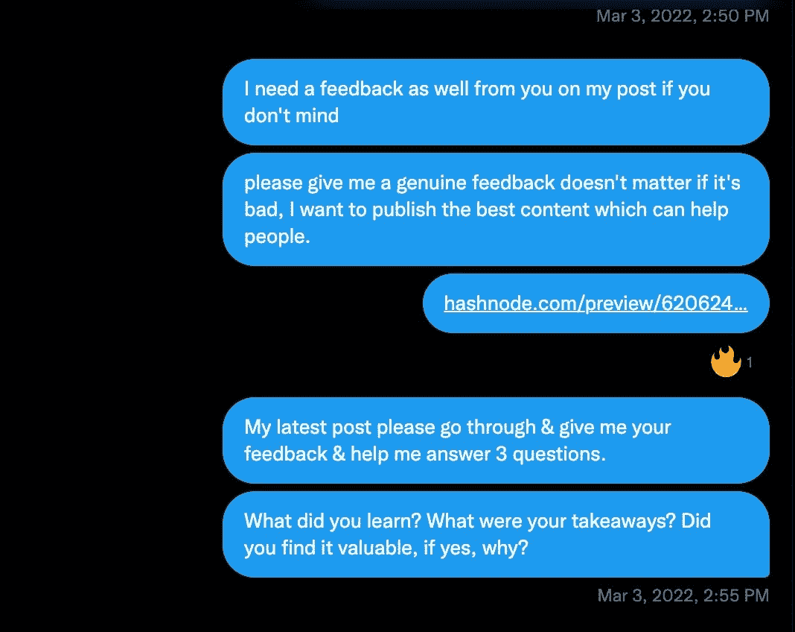

# 软件开发人员写作指南

> 原文：<https://javascript.plainenglish.io/a-software-developers-guide-to-writing-e8edd6ec5dd4?source=collection_archive---------12----------------------->

# 开发者科技写作终极指南。

我开始写作是因为我想与技术分享我的经历，并需要改变我的生活。我喜欢想法，但没有人可以谈论它们。因此，当我提出好的话题时，我典型的朝九晚五的同事都会嘲笑我。

> 三年后，我可以说，在互联网上写作是我做过的最好的职业决定之一。

这篇文章包含了在过去的 3 年里，我的写作效率得到了提高和增加的见解。

# 什么是技术写作？

技术写作是简洁明了地写复杂话题的能力。

在技术领域，作为一名软件开发人员，磨练你的写作技能可能是开启新机遇和推动你的职业生涯达到新高度的关键。

*   无论是给你的同事写一封引人注目的电子邮件。
*   为下一个重大项目起草提案。
*   清晰简洁地表达你的想法。
*   为您的首次会议发送 CFPs。
*   为您的经理起草年终评估。
*   发送一封冷冰冰的电子邮件或 dm 来寻找机会。

有效地写作可以打开大门，帮助你在你的组织中产生更大的影响。

**所以，如果你想让你的事业更上一层楼，别忘了掌握书面文字的重要性。**

> ***写作给了你翅膀。它为你的职业生涯释放了互联网的潜力。***
> 
> 当众写作是将你的想法传播到互联网上，成为吸引人和机会的磁石。

# 科技写作中的讲故事艺术

*   你的博客应该以这样一种方式来写，你的读者可以使用内容，并在阅读后感觉好像他们学到了一些新的东西。
*   你应该把这种复杂性分解成逻辑步骤和主题来引导读者。
*   我们在学校学到，每个故事都应该有开头、中间和结尾。博客也是如此。
*   人们从真实的故事中学到的比从别人那里学到的多。

> ***生活就是讲故事，我们都有一个，我们都很崇拜它。***

# 技术写作容易赚钱的神话

在我职业生涯的早期(科技写作之前)，我意识到大多数人不擅长用文字表达他们的想法。

> **好钱？绝对的。轻松赚钱？没门儿。**

在科技领域，许多初学者错误地认为写作的目标受众是一个单一的群体，而事实上它是多种多样的，因为好的写作比坏的写作多。

撰写或编辑博客文章需要考虑许多因素，包括语法、风格手册、可访问性、准确性和一致性。这是一种平衡行为。

语法上的完美是一回事，但是清晰地传达信息的能力——尤其是关于新产品的信息，与 X 和 Y 建立整合，或者分享你在一个新的副业项目中所构建的东西，需要多年的实践。

要有效地写一个主题，需要广泛的研究。需要很强的研究技能来提高你的理解能力，并与理解能力有限的人交流。

# 技术写作反馈请求

我在我的 Twitter 直接消息中使用了这个策略。我把我的草稿发送给 IT 领域的知名作家或开发者支持者。

请看这张今年我写的关于我作为开发者倡导者的旅程的截图。

# 写作对开发人员的重要性

随着远程工作变得越来越受欢迎，强大的写作技能对于软件工程中的许多角色都是必要的。

*   长篇写作将帮助你成为一个更好的思考者和开发者。
*   长篇写作可以帮助你建立个人品牌。

例如:想象一个开发人员，正在为一家受欢迎的咖啡连锁店开发一个新的移动应用程序。该应用程序允许客户直接通过手机点餐和支付饮料。开发人员花费了无数时间来编码和调试应用程序，以确保它能够顺利工作。然而，当应用程序发布时，很快就会发现一些主要的可用性问题正在引起客户的不满。

开发人员知道他们需要尽快解决这些问题。尽管如此，他们也意识到，在对问题没有清晰认识的情况下，不能盲目做出改变。因此，他们后退一步，写一份详细的报告，概述他们观察到的问题，以及如何解决这些问题的解决方案。

该报告是书面的，易于理解，它包括屏幕截图和其他视觉辅助工具，以帮助说明问题和拟议的解决方案。

在这个场景中，**开发人员的写作技巧**在清晰有效地与应用沟通问题并提出解决方案方面发挥了至关重要的作用。

如果没有**强大的写作能力**，发现和解决问题可能需要更长的时间。

做长期有价值的博客是吸引更多读者的绝佳策略。你也会发现潜在的客户和商业伙伴在你的工作中磕磕绊绊。

# 公开写作会产生一些二阶效应

*   对你的职业或个人品牌的影响
*   网络机遇
*   能见度提高
*   建立你的声誉
*   与更广泛的受众互动

# 为技术内容创建引人入胜的标题

假设你曾经试图通过一系列博客文章或文章来推广一种技术产品。那样的话，你就知道是什么感觉了。

*   许下**承诺**并**具体**。
*   **使用流行文化参考文献**:例如:**像老板一样加载:提高网站速度的技巧**
*   **使用强动词**:像“发现”、“解锁”和“转换”这样的动词可以给你的标题和副标题增加刺激和行动感。例如，“发现优化网站加载速度的秘密”
*   使用数字和列表:数字列表和项目符号更容易浏览，所以考虑在你的标题和副标题中使用它们。例如，“**提高网站加载速度的 5 大技巧**
*   **使用表情符号**:表情符号可以为你的标题和副标题添加有趣的视觉元素，有助于使你的内容更加引人注目和难忘。只是一定要谨慎适当地使用它们，以避免过多的干扰让你的读者负担过重。

> **例如，“⏱️时间加快速度:优化网站加载时间的技巧”**

# 更多示例

1.  《技术故障排除 101:解决常见计算机问题的初学者指南》
2.  “HTML 的 A-Z:web 开发基础综合指南”
3.  “掌握命令行:使用 Linux 和 Unix 的提示和技巧”

记住，专业人士不会创造一个标题。他们创造了许多头条新闻。

# 克服写作障碍的策略

*   把任务分成小块:不要一次处理整篇博文，而是把它分成更小、更容易处理的段落。

*例如:我如何写一本书**[**博客开发者指南:通过博客赚取额外收入的综合指南**](https://theankurtyagi.gumroad.com/l/blogging)*

**

*   *留出专门的写作时间:每天或每周划出一个特定的时间来写作。保持一贯的写作习惯可以帮助你保持专注并取得进步。*

*   *创造一个支持写作的环境:找一个安静、不受干扰的地方工作，考虑使用番茄工作法来帮助你保持专注。*
*   *需要的时候寻求帮助:如果你感到困难或不知所措，不要害怕寻求帮助。同事或导师可以提供有价值的反馈。*
*   *太多的开发者和作者认为营销超出了他们的能力范围。但是销售是生活中必不可少的一部分。*

> *无论你写得多好，建立一个好的观众群都需要时间。*

# *软件开发人员的写作技巧*

1.  ***明确你的受众:**在你开始写作之前，你必须知道你是为谁而写。这将有助于你根据听众的需求和理解水平来修改你的文章。*
2.  *使用简单明了的语言:避免使用你的听众可能听不懂的行话或复杂的语言。相反，使用简单明了的语言，易于阅读和理解。*
3.  ***组织你的信息:**确保以一种合乎逻辑且易于遵循的方式组织你的信息。使用标题、副标题和列表来分解文本，使其更易于阅读。*
4.  ***举例子:**举例子可以很好地说明一个概念，让它更容易理解。尽量在适当的地方加入例子来帮助你的听众理解你所展示的信息。*
5.  *简明扼要:技术写作应该简明扼要。避免包含不必要的信息或重复你自己。*
6.  *使用视觉效果:视觉效果，比如图表、图形和图像，可以很好地补充你的文字，使其更容易理解。在适当的地方使用视觉材料来增强你的文档。*
7.  ***审阅和修改:**在发表之前，一定要审阅和修改你的文章。这将帮助您捕捉错误，澄清任何令人困惑的信息，并提高文档的整体质量。*

> ***我强烈推荐你阅读 Gergely 关于“** [**成为一名软件工程师**](https://blog.pragmaticengineer.com/becoming-a-better-writer-in-tech/) **”的博文***

# *写作如何增加机会*

*   *技术写作可以帮助开发者向潜在的雇主或客户展示他们的专业知识和技能。*
*   *通过撰写技术文章、博客文章或教程，开发人员可以展示他们在各自领域的知识和经验。*

*   *技术写作帮助开发者建立个人品牌。*
*   *技术写作增加了他们建立关系网、合作和职业发展的机会。*
*   *技术写作可以帮助开发人员提高他们的沟通和协作技能。*

# *寻找写作机会的最好方法*

*   *与 DMs 中的人建立联系*
*   *展示你的专长*
*   *展示你的作品*
*   *提供最好的技术内容*
*   *询问你最喜欢的开发者倡导者他们是否需要一个好的作者，你可以帮助构建下一个集成、文档或待定的博客帖子。*

# *考虑以下真实世界的例子*

*一个全职的技术作家/开发者代言人/开发者关系在亚洲的平均收入是 3-9 万美元，在美国和 EMEA 是 2-4 倍。*

*这些企业中的大多数都不想花几周时间写内容。即使他们设法找到了一个很棒的人，并且每周从他们那里得到一篇好的内容，那也是每篇技术博客 1000-5000 美元。*

*在内部保持类似的数量/速度/质量是很困难的，因为最好的技术员工很快就会因为制作内容而筋疲力尽，并且/或者因为没有营销团队有足够的技术人员而被拉进其他项目。*

*在这里，你可以填补他们积压的工作，从外部成为一名优秀的玩家。*

# *结论*

*丹尼尔开始写作的想法非常棒。*

> *成功的关键是简单地开始写作。不需要技巧或捷径——只要开始创造。*

*问自己以下问题，帮助你集中注意力写更多。*

*   *我在哪些方面比其他科技作家做得更好？*
*   *在博客里能长期做些什么？*
*   *我想把我的博客技能带到哪里？*

***打不输；而是为了赢。***

> *作为一名技术写作者，你可以同时学习、帮助和赚钱。*

*当你开始写作之旅时，重要的是要记得跳出框框思考，尝试新事物。*

*不要害怕冒险和挑战自己。无论是尝试新的写作风格，探索新的主题，还是寻找独特的方式来吸引你的读者，关键是要保持开放的心态，并愿意尝试新事物。*

*如果你愿意走出舒适区，抓住机会，谁知道会有什么惊人的机会和经历降临在你身上呢？*

*所以不要害怕抓住机会，看看它会把你引向何方。*

*快乐写作！*

*如果你喜欢这篇文章，你会喜欢我的简讯:*

## *在此加入:[2–1–1 职业成长简讯](https://theankurtyagi.substack.com/)*

**原载于 2022 年 12 月 19 日 https://theankurtyagi.com***。***

***更多内容请看* [***说白了就是***](https://plainenglish.io/) *。***

***报名参加我们的* [***免费周报***](http://newsletter.plainenglish.io/) *。关注我们上* [***推特***](https://twitter.com/inPlainEngHQ) ， [***领英***](https://www.linkedin.com/company/inplainenglish/) ***，***[***YouTube***](https://www.youtube.com/channel/UCtipWUghju290NWcn8jhyAw)***，以及****[***不和***](https://discord.gg/GtDtUAvyhW) ***

*****用*** [***电路***](https://circuit.ooo/?utm=publication-post-cta) *为你的科技创业建立认知和采用。***