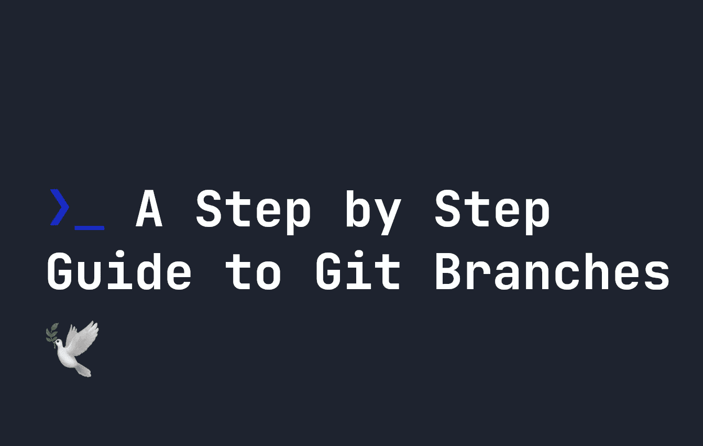
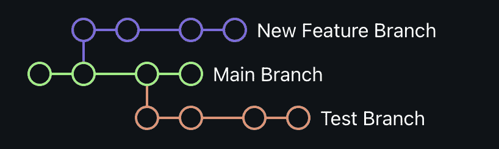

# Git 分支的分步指南

> 原文：<https://javascript.plainenglish.io/a-step-by-step-guide-to-git-branches-411baefd0104?source=collection_archive---------14----------------------->

## Git 分支让我们管理新特性、错误修复和测试，与我们的主代码分开。让我们看看它们是如何工作的。



在我之前的 git 入门指南中，我简要介绍了 git 分支是如何工作的。例如，您可以使用`git branch`命令创建新的分支。在本指南中，我们将深入探讨分支，以及如何有效地使用`git branch`。

# Git 中的分支是什么？

git 中的分支基本上是指向一项开发工作的指针。他们让你从当前的代码基础中分支出来，这样你就可以从已经存在的代码中独立工作。下面，每个圆圈代表一个提交。每个分支都可以有自己的提交，并且它们都可以彼此独立地开发:



上面，我们有两个分支，都是从主分支上的不同提交分支的。您的主分支是您在 git 项目中开始的第一个分支。分支基本上让你拿着你的工作，复制它，并单独工作。通过运行`git branch x`，可以在提交历史中的任何时间点创建分支，其中`x`是分支的名称:

```
git branch my-new-branch
```

在你发展的某个阶段，你可能会有很多分支。在这些情况下，您可以通过运行`git branch --list`找到您的所有分支:

```
git branch --list
```

**注意**通过创建一个分支，你不会自动进入那个分支。要切换到一个分支，您必须使用`git switch`显式地切换到它:

```
git switch my-new-branch
```

# 删除 git 中的分支

到最后，你可能会意识到你不再需要一个分支了。要删除一个分支，使用`-d`选项。比如`git branch -d my-branch`会删除`my-branch`。

```
git branch -d my-branch
```

# 在 git 中重命名分支

您可以使用`-m`命令重命名 git 中的一个分支。这将把当前的分支**重命名为`-m`之后的分支。例如，`git branch -m new-branch`将当前分支重命名为`new-branch`。**

# 设置和删除远程分支

当您创建一个新分支并试图使用`git push`推送到您的上游时，您可能会遇到问题，因为没有设置上游分支。您可以在这里做两件事:

*   添加一个新的上游分支，将您的分支推到您的远程存储库。
*   将本地计算机上的更改推送到已经存在的分支的上游。

这两种选择都适合你的情况。要在远程存储库上创建新的分支，只需运行`git remote add`:

```
git remote add my-remote-branch [https://github.com/smpnjn/effective-guacamole.git](https://github.com/smpnjn/effective-guacamole.git)
```

这将在您的远程存储库上创建一个名为`my-new-branch`的分支。如果您本地计算机上的分支叫做`my-branch`，您可以通过运行以下命令将`my-branch`推送到您的远程分支`my-remote-branch`:

```
git push --set-upstream my-remote-branch my-branch
```

您还可以通过运行以下命令来删除远程分支:

```
git push origin --delete my-remote-branch
```

# 将分支合并到主分支中

一旦您对您的分支进行了多次提交，您可能想要将它合并回主分支。为此，您应该首先使用`git add`和`git commit`向您的分支提交任何更改:

```
git add -A
git commit -m "My commit"
```

然后，切换或检查回到主界面:

```
git checkout main
```

你可能想从远程获取任何东西，首先使用`git pull`，但是最终在`main`上我们可以使用`git merge`合并代码。如果您的分支是`my-branch`，您可以这样做:

```
git merge my-branch
```

这可能会导致一些合并冲突，您需要检查并手动修复这些冲突，但是大多数现代代码编辑器(如 Visual Studio Code)都有一个 GUI 来帮助您完成这些工作。否则，如果遇到合并冲突，您可以运行`git diff`来诊断问题。有许多方法可以解决合并冲突，我们将在`git merge`中介绍。如果你对解决 [git 合并冲突感兴趣，你可以在这里](https://fjolt.com/article/git-merge-conflicts)了解更多。

*更多内容请看*[***plain English . io***](https://plainenglish.io/)*。报名参加我们的* [***免费周报***](http://newsletter.plainenglish.io/) *。关注我们关于*[***Twitter***](https://twitter.com/inPlainEngHQ)[***LinkedIn***](https://www.linkedin.com/company/inplainenglish/)*[***YouTube***](https://www.youtube.com/channel/UCtipWUghju290NWcn8jhyAw)*[***不和***](https://discord.gg/GtDtUAvyhW) *。对增长黑客感兴趣？检查* [***电路***](https://circuit.ooo/) *。***