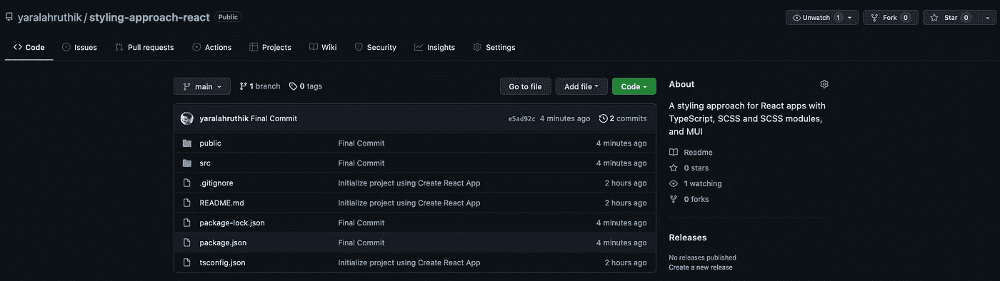

# React 应用程序的样式化方法

> 原文：<https://javascript.plainenglish.io/a-styling-approach-for-react-apps-c7010f2a54d0?source=collection_archive---------8----------------------->

## 带有 TypeScript、SASS 和可选的材质 UI。



Author’s Repo Screen Grab from GitHub.

对 React 应用程序进行样式化有多种方法。在尝试了所有这些之后，我想出了一个对我来说完美的方法。

简而言之，该方法结合了实用程序类、SASS 和 SASS 模块，如果需要，还结合了组件的材料 UI。

所有步骤都链接到文档。如果对任何依赖项进行更新，请查看官方文档以获得解决方法。整个项目也可以在我的 GitHub 上找到，可以在文章末尾找到链接。

# 项目设置

1.  [**用打字稿模板创建 React App**](https://create-react-app.dev/docs/adding-typescript/)

```
npx create-react-app@latest my-app --template typescript 
```

2.[**安装萨斯**](https://create-react-app.dev/docs/adding-a-sass-stylesheet)

一个非常强大的预处理器，可以编译成原生 CSS。SASS 基本上是通过添加嵌套、条件、混合、变量和导入等特性来扩展 CSS 的。

```
npm install sass
```

3. [**安装物料 UI 及其依赖关系**](https://mui.com/getting-started/installation/)

这是一个可选步骤，但是我发现大多数客户甚至您的公司可能都在使用像 MUI 这样的组件系统。如果您想使用 MUI 以外东西，只需确保为设计系统设置 10 倍的简化。请继续阅读，了解我们为什么以及如何进行 10 倍简化。

```
npm install @mui/material @emotion/react @emotion/styled
npm install @mui/icons-material// Add the below in the head of index.html
<link
  rel="stylesheet"
  href="https://fonts.googleapis.com/css?family=Roboto:300,400,500,700&display=swap"
/>
<link
  rel="stylesheet"
  href="https://fonts.googleapis.com/icon?family=Material+Icons"
/>
```

4.[**SASS 7–1 自定义架构**](https://sass-guidelin.es/#the-7-1-pattern)

对于 React 应用程序，不需要实施完整的标准 7–1 架构，因为大多数样式表位于组件或页面的子文件夹中，通过*.module.scss，但需要一些结构来存储供应商、基础、变量、混合和实用程序类。

在你的 src 文件夹中创建一个 styles 文件夹，并如下创建文件和文件夹:(带有下划线的文件名表示 SASS 部分)

```
|- styles
|- index.scss
|- abstracts/
|- |- _variables.scss
|- |- _mixins.scss
|- base/
|- |- _base.scss
|- |- _typography.scss
|- vendor/
|- |- _externalPackageStylesGoHere.scss
```

让我们也将所有片段导入到一个主文件中，在本例中是 index.scss。

```
// index.scss
@use './abstracts/variables';
@use './abstracts/mixins';
@use './base/base';
@use './base/typography';
@use './vendor/externalStyles';
```

5.**设置 10 倍简化**

对于像素到 rem 的工作流程，10 倍的简化是必须的，除非你同意每次使用 rems 时都用 16 来划分像素。默认情况下，您的浏览器将 16px 保持为 1rm。大多数开发人员或项目都将 10px 设为 1rem，这样很容易写出 rem 的大小，因为你只需要除以 10。

为此，我们只需要将我们的 html 字体大小设置为 62.5% (10/16 * 100)。

A simple reset and 10x simplification

现在，这样做会扰乱您的 MUI 组件。考虑到这种简化的重要性，MUI 提供了一种简单的方法来将它集成到您的项目中。

让我们设置一下，在你的 styles 文件夹中创建一个 theme.ts 文件(我喜欢这种方式，你可以把它放在其他地方，比如主题文件夹中)。

MUI 10x simplification

此外，在 index.tsx 上为您的应用程序提供主题，并在此处导入您的 index.scss。

MUI Theme Provided and primary SCSS stylesheet imported.

6.**样本组件结构**

我通常为我的组件或页面所做的，是通过模块文件来创建样式，这样它们对于组件或页面来说是本地的，从而消除了传统的全局样式冲突问题，并且从全局中组成了我的实用程序类。下面是一个样例组件的例子，包括样例混合、排版和变量。

模块文件作为对象导入，类作为属性。模块将永远不会与其他模块或全局文件冲突，因为它们向类添加了唯一的散列，因此您可以跨文件拥有相同的类名，同时基本上消除了 ***BEM 架构*** 和 ***全局冲突样式*** 的概念。

index.tsx which imports classes from index.module.scss

[***SASS 正在从常规的@import 语句转向@use 和@forwards。***](https://sass-lang.com/documentation/at-rules/import) 这也是为了消除由于全局文件引起的冲突。

我为排版甚至按钮编写了一些实用程序类，你只需要从全局或者各自的模块文件 中 [***即可。我更喜欢从全局，因为我的目录变得太嵌套，这使得从文件导入令人头痛。***](https://github.com/css-modules/css-modules)

This how my typical module file looks.

Mixins 基本上是可重用的 CSS 样式。需要多个厂商修复的 CSS 属性， [***一个媒体查询管理器***](https://eduardoboucas.github.io/include-media/) ，或者也许下面这样的东西也可以作为 mixin。

I usually do not make a mixin for flex center, as I feel it is better lived in the module file itself.

我的变量，我在这个演示中使用了直接的颜色名称，但是我通常在这里有一整套的颜色和大小。

Bonus, you can export variables with :export and sync it up with MUI theme. This is will keep a single file for all constant colors and sizes.

我通常为排版和按钮制作实用程序类。

感谢阅读，希望我减少了你的开发时间。

[](https://github.com/yaralahruthik/styling-approach-react) [## GitHub-yaralahruthik/styling-approach-react

### 用类型脚本、SCSS、模块和多用户界面设计 React 应用程序的风格

github.com](https://github.com/yaralahruthik/styling-approach-react) 

*更内容于* [***普通英语***](https://plainenglish.io/) *。报名参加我们的* [***免费周报***](http://newsletter.plainenglish.io/) *。* [***推特***](https://twitter.com/inPlainEngHQ) *和*[***LinkedIn***](https://www.linkedin.com/company/inplainenglish/)*追随我们。加入我们的* [***社群不和***](https://discord.gg/GtDtUAvyhW) *。*