# JavaScript 中 20 种主要的现代数组方法的总结

> 原文：<https://javascript.plainenglish.io/a-summary-of-20-main-and-modern-array-methods-in-javascript-880827918dda?source=collection_archive---------14----------------------->

## 你都认识吗？


[https://undraw.co/search](https://undraw.co/search)

在这篇短文中，我总结了 JavaScript 中处理数组的方法。希望你觉得有用！

在文章的最后，你会发现一个链接，链接到我为你准备的摘要。

## 1.shift()

Array.prototype.shift()

此方法从数组中移除第一个元素，如果数组为空，则返回移除的元素或 undefined。

```
const array1 = [2, 3, 4];
console.log(array1.shift());
console.log(array1);
```

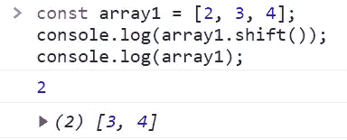

## 2.未移位()

Array.prototype.unshift()

此方法将一个或多个元素添加到数组的开头，并返回数组的长度。此方法更改数组的长度。

```
const array2 = [1, 2, 3];
console.log(array2.unshift(4, 5));
console.log(array2); 
```

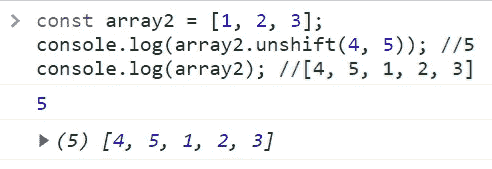

## 3.推送()

Array.prototype.push()

此方法将一个或多个元素添加到数组的末尾，并返回数组的长度。此方法更改数组的长度。

```
const array3 = [1,2,3,4,5];
console.log(array3.push(‘a’));
console.log(array3);
```

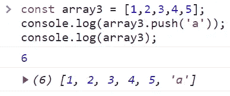

## 4.流行()

Array.prototype.pop()

此方法从数组中移除最后一个元素，如果数组为空，则返回未定义的元素。此方法更改数组的长度。

```
const array4 = [1,2,3,4,5];
console.log(array4.pop());
console.log(array4);
```

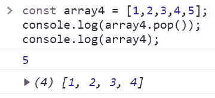

## 5.concat()

Array.prototype.concat()

此方法用于合并两个或多个数组。这个方法返回一个新的数组。

```
const array5= [1,2,’a’];
console.log(array5.concat('b'));
console.log(array5);
```

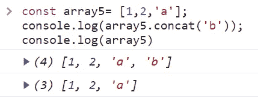

## 6.加入()

Array.prototype.join()

此方法通过连接数组中的所有元素来创建并返回一个新字符串。

```
const array6= [1,2,’a’];
console.log(array6.join('/'));
console.log(array6);
```

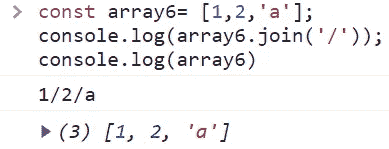

## 7.索引 Of()

Array.prototype.indexOf()

此方法返回可以找到给定元素的第一个索引，如果不存在，则返回-1。

```
const array7 = [‘a’,’b’,’c’,’d’];
console.log(array7.indexOf(‘b’));
console.log(array7);
```

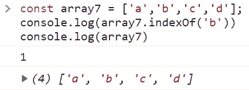

```
const array7_1 = [‘a’,’b’,’c’,’d’];
console.log(array7_1.indexOf(‘e’);
console.log(array7_1);
```

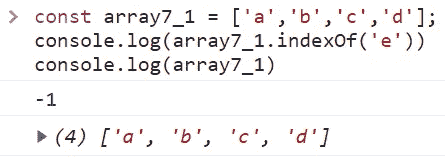

## 8.切片()

Array.prototype.slice()

这个方法将一个数组的一部分的[浅拷贝](https://developer.mozilla.org/en-US/docs/Glossary/Shallow_copy)返回到一个从头到尾选中的新数组对象中。原始数组不会被修改。

```
const array8 = [‘a’,’b’,’c’,’d’]
console.log(array8.slice(1));
console.log(array8);
```

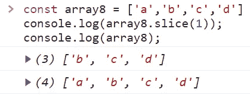

## 9.包括()

Array.prototype.includes()

此方法确定数组是否包含某个值。

```
const array9= [‘a’,’b’,’c’,’d’];
console.log(array9.includes('b'));
console.log(array9);
```

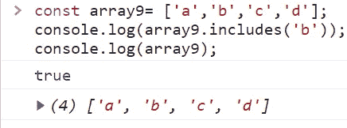

## 10.查找()

Array.prototype.find()

此方法返回数组中满足所提供的测试函数的第一个元素，否则未找到未定义的元素。

```
const array10= [1,2,3,4,5];
console.log(array10.find(n => n> 2));
console.log(array10);
```

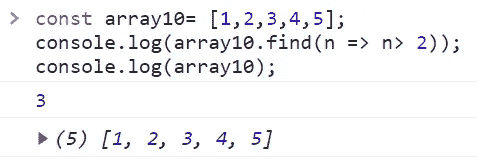

## 11.findIndex()

Array.prototype.findIndex()

此方法返回数组中满足所提供测试函数的第一个元素的索引。否则，它返回-1。

```
const array11= [1,2,3,4,5];
console.log(array11.findIndex(n => n> 2));
console.log(array11);
```

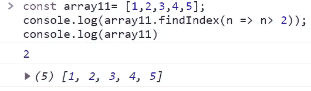

## 12.地图()

Array.prototype.map()

此方法创建一个新数组，该数组填充了对调用数组中的每个元素调用所提供函数的结果。

```
const array12= [1,2,3,4,5];
console.log(array12.map(n => n *2));
console.log(array12);
```

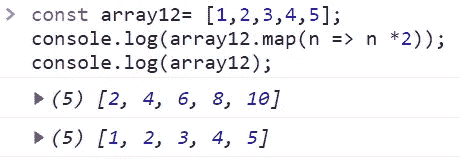

## 13.过滤器()

Array.prototype.filter()

此方法创建一个新数组，其中所有元素都通过了由提供的函数实现的测试。

```
const array13= [1,2,3,4,5];
console.log(array13.filter(n => n >2));
console.log(array13);
```

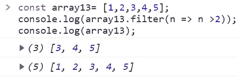

## 14.每隔()

Array.prototype.every()

此方法测试数组中的所有元素是否都通过了由提供的函数实现的测试。如果测试通过，则返回 true，否则返回 false。

```
const array14= [1,2,3,4,5];
console.log(array14.every(n => n >2));
console.log(array14);
```

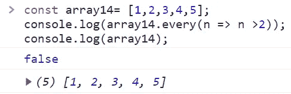

## 15.减少()

Array.prototype.reduce()

的。reduce()函数用于获取列表中的所有元素，对每个元素应用一个函数，并将结果累积到一个输出值中。

```
const array15= [1,2,3,4,5];
console.log(array15.reduce((acc,cur) => acc*cur));
console.log(array15);
```

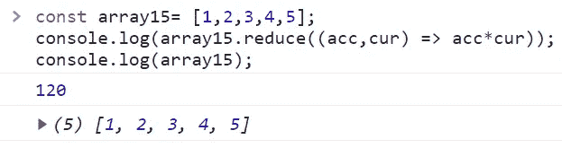

## 16.反向()

Array.prototype .反转()

此方法反转数组，对数组进行变异，并返回对数组的引用。

```
const array16= [1,2,3,4,5];
console.log(array16.reverse());
console.log(array16);
```

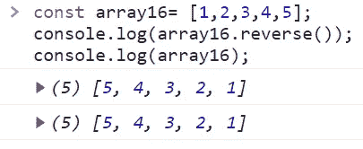

## 17.一些()

Array.prototype.some()

此方法测试数组中是否至少有一个元素通过了所提供函数的测试。如果找到所提供函数返回 true 的元素，则返回 true；否则返回 false。不像。反转函数，有些函数不修改数组。

```
const array17= [1,2,3,4,5];
console.log(array17.some(n => n>2));
console.log(array17);
```

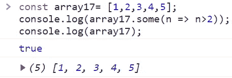

## 18.在()

Array.prototype.at()

此方法接受一个整数值，并返回该索引处的项。

```
const array18= [1,2,3,4,5];
console.log(array18.at(3));
console.log(array18);
```

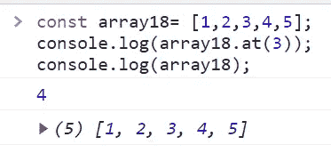

## 19.forEach()

Array.prototype.forEach()

forEach()方法为每个数组元素执行一次提供的函数。

```
const array19= [1,2,3,4,5];
console.log(array19.forEach( n => console.log(“counter:” +n)));
console.log(array19);
```

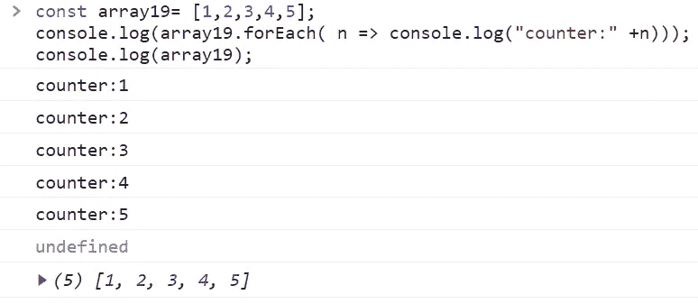

## 20.数组. from()

数组. from()

此方法从任何具有长度属性的对象中返回一个数组。它创建一个新的浅复制数组实例。

```
console.log(Array.from('My home'));
```

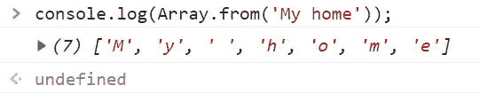

# 备忘单

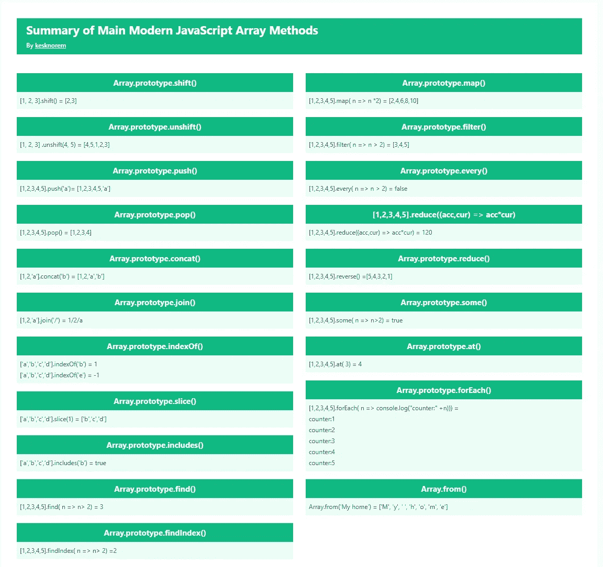

[https://cheatsheet-maker.herokuapp.com/sheet/62249d10d887d100153ca2f9](https://cheatsheet-maker.herokuapp.com/sheet/62249d10d887d100153ca2f9) by [kesk](https://medium.com/@kesk)

如果你喜欢这篇文章，考虑通过我的[个人资料](https://kesk.medium.com/membership)订阅 Medium。谢谢大家！

# 参考

[](https://developer.mozilla.org/en-US/) [## MDN Web 文档

### 记录网络技术，包括 CSS，HTML 和 JavaScript，从 2005 年开始。曼陀罗../../ ../../ ../../ ../../…

developer.mozilla.org](https://developer.mozilla.org/en-US/) 

*更多内容看* [***说白了。报名参加我们的***](https://plainenglish.io/) **[***免费周报***](http://newsletter.plainenglish.io/) *。关注我们关于*[***Twitter***](https://twitter.com/inPlainEngHQ)*和*[***LinkedIn***](https://www.linkedin.com/company/inplainenglish/)*。加入我们的* [***社区***](https://discord.gg/GtDtUAvyhW) *。***