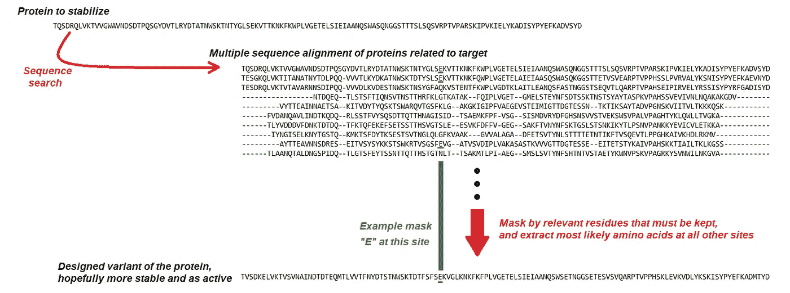
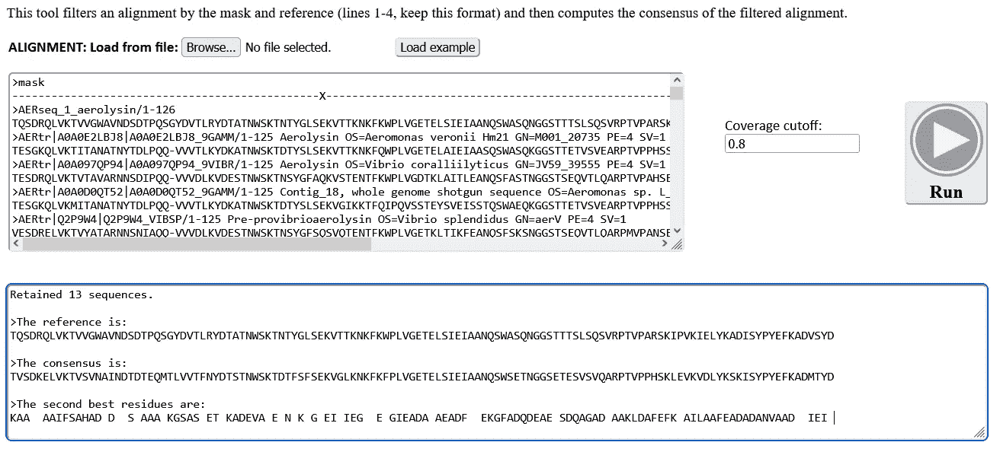
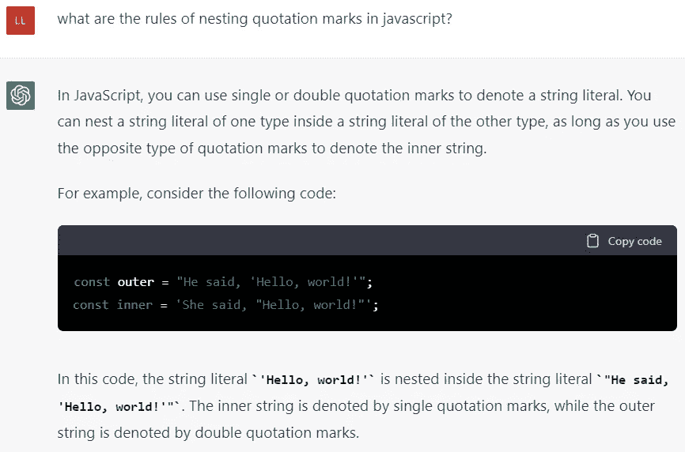
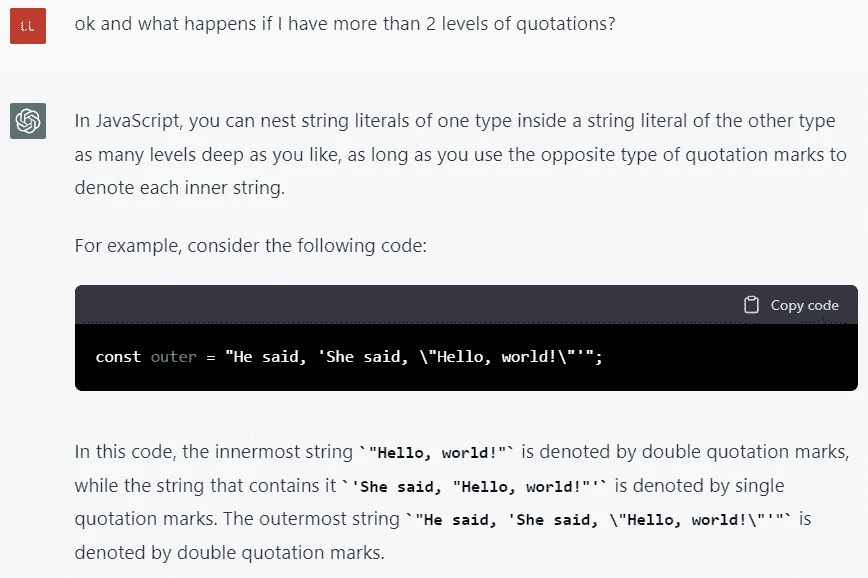
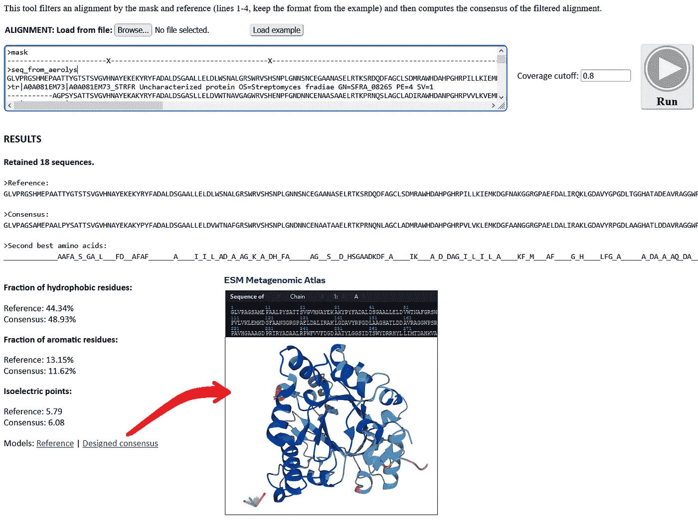

# 一个通过共识方法设计稳定蛋白质的 web 应用程序，由 JavaScript、ESMFold 和 ChatGPT 创建

> 原文：<https://javascript.plainenglish.io/a-web-app-to-design-stable-proteins-via-the-consensus-method-created-with-javascript-esmfold-and-d319d2441ae7?source=collection_archive---------7----------------------->

## 将现代技术和高效工作工具相结合，创建一个应用程序，实现最简单但当今最有效的酶稳定方法。


Photo modified from an original by [Carlos Muza](https://unsplash.com/@kmuza?utm_source=medium&utm_medium=referral) on [Unsplash](https://unsplash.com?utm_source=medium&utm_medium=referral)

# 介绍本文的目标

本文讨论了为特定问题构建一个 web 应用程序(使用“共识方法”设计稳定的蛋白质)，但这不是它的主要目标。相反，我只是将此作为一个测试案例来交流其他一些想法，并且有多个目标:

*   强调 JavaScript 和运行在客户端的 web 应用程序的强大功能，处理数据有很多好处——跨设备兼容性、数据隐私、易于编程、易于用户访问。
*   展示像 ChatGPT 这样的现代工具如何有效地帮助程序员的工作——事实上，我用它编写了这个 web 应用程序的一些部分。
*   还可以连接到其他现代技术，即用于精确和快速蛋白质结构预测的语言模型-这里使用 Meta 的 ESMFold。
*   特别是给定我选择的应用，如何建立一个非常完整的程序，用于计算蛋白质序列一致性的特定任务，以设计稳定的蛋白质。

# 生物学问题导论

由于这不是本出版物或文章的重点，因此无需详细说明，目前将热稳定性引入蛋白质的最简单方法是构建相关蛋白质序列的比对，然后从该比对中提取每个位置最常见的氨基酸:



Scheme summarizing the steps for protein stabilization through consensus design.

是的，就这么简单。

> 是的，在使用人工智能进行蛋白质结构预测和设计的超复杂、奇特方法的时代，今天设计现有蛋白质的稳定版本的最有效方法就是这个简单的程序。当然，关键在于排列和掩盖对功能或结构至关重要的正确氨基酸。

如果你想看到这种方法的实际应用，看看我和一些同事共同完成的这项工作，我们创造了一种工业用酶的稳定版本，然后验证了它(非常！)通过实验提高稳定性:

[](https://www.biorxiv.org/content/10.1101/2022.10.06.511049v1) [## 通过一致性设计获得高度稳定的依赖锌离子的磷脂酶 C

### 蛋白质在识别和催化方面的非凡表现使其在一系列应用中得到应用。但是…

www.biorxiv.org](https://www.biorxiv.org/content/10.1101/2022.10.06.511049v1) 

要从生物技术的角度了解更多关于蛋白质设计和工程的广泛话题，并且不涉及任何编程，请查看这篇文章:

[](https://medium.com/advances-in-biological-science/how-computer-modeling-simulations-and-artificial-intelligence-impact-protein-engineering-in-4d8473bd59ff) [## 计算机建模、模拟和人工智能如何影响蛋白质工程？

### 不同的复杂性，成功率和应用的计算方法的概述，与关键…

medium.com](https://medium.com/advances-in-biological-science/how-computer-modeling-simulations-and-artificial-intelligence-impact-protein-engineering-in-4d8473bd59ff) 

# 一个用于生成共有序列的 web 应用程序

因此，本文的重点是编写一个小的 **web 应用程序**，它将执行上述过程，通过屏蔽、比对过滤和一致性计算来设计稳定的蛋白质；然后对设计的蛋白质做一些元素分析。

我强调**网络应用**是为了说明这个过程如此简单，它可以在用户的网络浏览器中运行。这有多种优势:(1)不需要安装或更新，(2)在所有浏览器和设备上都可以使用，(3)尽管是在线托管的，但用户引入的数据永远不会离开浏览器，因此我无法窥视项目，也无法窃取想法或蛋白质序列。

## 超文本标记语言

首先是为这个应用程序设计 GUI 的 HTML。我们需要几个指令，几个按钮和控件，用户将粘贴开始对齐和遮罩的输入框，以及一个结果将去的输出框。在这里，您可以看到该过程运行并产生输出后的现成界面:



Core web app implementing consensus design calculation, that runs in the user’s web browser.

## Java Script 语言

**载入一个例子。**要加载一个示例，按钮只需在输入框中放置一个字符串(在我的示例中称为“ *datos1* ”):

```
function loadexample()
{
  document.getElementById(‘datos1’).value = “>mask\n — — — — — — — — — — — — X — — — — — — — — — — — — — — — — — — — X — — — — — — — — — — — — — — — — — — — — — — — — — — — — — — — — — — — — — — — — — — — — — — — — — — — — — — — — — — — — — — — — — — — — — — — — — — — — — — — -X — — — — — — — — — — — — — — — — — — — — — — — — — — X — — — — — — — — — — — — — — — — — — — — — — — — — \n>seq_from_PDB_PI_PLC\nGLVPRGSHMEPAATTYGTSTSVGVHNAYEKEKYRYFADALDSGAALLELDLWSNALGRSWRVSHSNPLGNNSNCEGAANASELRTKSRDQDFAGCLSDMRAWHDAHPGHRPILLKIEMKDGFNAKGGRGPAEFDALIRQKLGDAVYGPGDLTGGHATADEAVRAGGWPSRADLAGKFLFELIPGTVEEKNPFDKLWTDVEYAGHLKDLAAQGKLAQSTAFPAVHGAAPGDPRERYADPALRPWFVVFDGDAATYLNGSIDTSWYDTRHYLLIMTDAHNVPPVIDGTHPTEAEALARVRQLAAAHASFATADWYPLPSVLKTVVPRGA\n>tr|A0A081EM73|A0A081EM73_STRFR Uncharacterized protein OS=Streptomyces fradiae GN=SFRA_08265 PE=4 SV=1\n — — — — — -AGPSYSATTSVGVHNAYEKAKYRYFADALDSGASLLELDVWTNAVGAGWRVSHENPFGNDNNCENAASAAELRTKPRNQSLAGCLADIRAWHDANPGHRPVVLKVEMKDGFADNRGRGPDEFDALLGEKLGDALLRPADVRGGHATLDDAVRADGWPGRDELAGKFLVELIPGTVEEGNPLDSLWTDREYATHLRDLAAAGTLDRAGAFPAVHHAEAGDPRTRYGDASLRPWFVVFDGNAGDYAGGAIDTAWYDQRHYLLIMTAAHAVAPAIDAVNPSEAEARDRVTMLASRHASIVTSDWYPLPQVLSLVVPRG-\n>tr|A0A0A8EF68|A0A0A8EF68_9ACTN Phosphatidylinositol-specific phospholipase C1 OS=Streptomyces sp. 769 GN=GZL_01894 PE=4 SV=1\n — — — — — -TSSTYDTTTAVGVHNAYEKAKYPYFADALDSGAALVEVDVWTNGLGASWRVAHSNPLGNNSNCVGATTAAELRTKDRNQGFAGCLADMRAWHDAHPGHRPILVKVEMKDGFNAKGGRGPADFDALIRQKLGDAVYGPGELAAGHTTLDEAVRAGGWPSRADLAGKFLFELIPGTVEENNPLDKLWTDVEYAGHLKDLAARGQLGRATAFPAVHGAAPGDPRERYADPALRPWFVVFDGDAATYLDGTIDTSWYDARHYLLIMTDAHKVPPALDPTHPTEVEALARVGKLAAAHASFATADWYPLPSVLATVVPRG-\n>tr|D9W9J8|D9W9J8_9ACTN Putative signal peptide protein OS=Streptomyces himastatinicus ATCC 53653 GN=SSOG_00398 PE=4 SV=1\n — — — — — -AEPSYAATTGVGVHNAYEKAKYPYFADALDSGASLLELDVWTNAFGAGWRVSHGNPLGNDNNCENAASPAELRTKARNQSLAGCLADMRAWHDAHPGHRPIVIKTELKDGFYDKSGRGPDDLDALLSGTLGDALLRPADVVGDHADLDQAVRAGAWPARSALAGKFIVELIPGTVEENNPLDTLWTDREYATHLRDLSAAGQLRRAAAFPAVHTAASGDPRTRYQDAAIRPWFVFFDGDASAYVTKNIDTAWYDTRHYILIMTDAQNVAPAIDGTSPTEAQARARVNDLAARHASFATADWYPLPSVLSAVVPRG-\n>tr|S3ZJS9|S3ZJS9_9ACTN Uncharacterized protein OS=Streptomyces aurantiacus JA 4570 GN=STRAU_3938 PE=4 SV=1\n — — — — — -DDRPYAATTGVGVHNAYEKAKYPYFADALDSGAAMLELDVWTNVFGGGWRVSHSNPLGNDNNCANAQRPEELRTKARDQRLDGCLADMKAWHDAHPGHRPVLLKVELKDGFQGRAGRGPADLDALLRGKLGDALYRPGQLAEGSGSLDEAVRKKGWPTRSELAGKFIVELIPGTVEQGNPADTLWTDREYATHLRDLAAAGRLGDAAAFPAVLGAASGDPRTRYTDASIRPWFVLFDGDASVYAGGSVDTKWYADRRYLVVMSDAHNVPPAISATNPTEAQARDRVTLLAGRHASVVSSDWYPLPGVLSTVLPRG-\n>tr|A0A014LBR4|A0A014LBR4_9ACTN Uncharacterized protein OS=Streptomyces sp. PRh5 GN=Z951_38695 PE=4 SV=1\n — — — — — -DDPSYSATTSVGVHNAYEKAKYPYFADALDSGASLLELDVWTNAFGAGWRVSHSNPLGNDNNCENAASPGELRTKPRDQSLAGCLADMRAWHQAHPGHRPILVKVEMKDGFNGKKGRGPADLDALLGATLGDAVLRPADVVGGRATLDEAVQAGGWPSRSALAGKFVVELIPGTVEENNPLDTLWTDREYATHLRDLSTAGKLGQAAAFPAVHGAAPGDPRTRYTDAALRPWFVLFDGDASTYVTSGVDTAWYDDRHYLLIMTDAHNVAPPIDGTNPTEAQARNRVSELAGRHASFATADWYPLPSVLSTVVPRG-\n>tr|D7AWL5|D7AWL5_NOCDD Lipoprotein OS=Nocardiopsis dassonvillei (strain ATCC 23218 / DSM 43111 / IMRU 509 / JCM 7437 / NCTC 10488) GN=Ndas_2391 PE=4 S\n — — — — — -AEQALSRTTSVGVHNAYETATFPHFADALDSGAGLLELDVWTDEWFGTWRVNHE-LVGQHNNCAGATSPDELRRGG-DGDLADCLRDVRTWHEANPGHPPLLLKVEMKKGYHAEAGLGPAEFDALADHVLGDALFRPDDLLAAHATLDEAVRADGWPSRGALAGRVVVYLTPGTFEQGNPFDDLWTDEEQASRLRDLAAGGRLDEAATFPAVLGARGGDPRERYA-EELRPWFVVFDGSAPTYTG-GIDTSWYGENDYLLVMTDAHAVSPAIDARTPSPEEAAARVRELARAGATTVTSDWAGLPGVLSMVVPHG-\n>tr|A0A0G3AG22|A0A0G3AG22_9ACTN Lipoprotein OS=Streptomyces incarnatus GN=ABB07_11790 PE=4 SV=1\n — — — — — -AAPKFSETTAIGTHNAYDKAKYTYFAQALDSGASLLEIDIYADSITKRWRVSHSNPFGDDNNCEAAKTPGELYSKNRNQDFGSCLDNIAAWNQLHPDHPPIVFKIEMKVGFNNNAGLGPDEFDTLVQQKLGSSVYRPADLLGTYSTLDAAARANAWPSRDSLKGKFLFEVIPGTVEMNNPFDHYWTDQEYGDHLRDLYAAGQISRAEAFPAVLGAANGDPRSRWTDTSIRPWFVFFDGDAATYAGNGYDTSFYSTNHYISIMTDAAGVSPAISSTDPTDAEVAARLALLAKDHASIITSDWSAKPSVLSSVVTRS-\n>tr|A0A0B5DRB4|A0A0B5DRB4_9ACTN Lipoprotein OS=Streptomyces nodosus GN=SNOD_23145 PE=4 SV=1\n — — — — — -AGPSFSATTAIGTHNAYEKSKYAYLAQALDSGASLLELDVYADPLTRRWRVSHSNPLGNDNNCEAAKAPGELYGKSRDQDLGSCLDNIAAWHQLHPDHRPIVFKLEMKIGFNNTLGLGPAAFDTLVAQKLGSIVYKPSDLLGTYSSLDAAARAGAWPSRDDLTGKVIFELIPGTVEQANPFDHYWTDQEYGDHLRDRYTAGTIASAQAFPAVLGAAPGDPRTRY-DASIRPWFVFFDGDAATYVNQGYDTSFYAENHYILIATDAAAVSPPISSTSPTDDEVAARLSLLAGHHASVITSDWAAKSAVLGAVAPRG-\n>tr|V6KWJ5|V6KWJ5_STRRC Uncharacterized protein OS=Streptomyces roseochromogenus subsp. oscitans DS 12.976 GN=M878_13125 PE=4 SV=1\n — — — — — -AAPRFSETTAIGTHNAYEKAKYTYFAQALDSGASLLELDVYVDSISHRWRVSHSNPFGNDNNCEAAKTPGELYSKDRDQDLGSCLDNMAAWNQLHPGHPPIVIKVEMKVGFNNNAGMGPDEFDTLVSQKLGGSVYKPAELLGTYSTLDAAAKANAWPSRDSLKGKFVFEMIPGTVEMANPFDHYWTDQEYGDHLRDLYAAGNISQAEAFPAVLGAAGGDPRARWADTSIRPWFVFFDGDAATYVNIGYDTSFYSTNHYLSIMTDAYNVSPAISSTNPTDAEVAARLALLAKDHASIITSDWSAKSSVLSSTAARS-\n>tr|A0A0M8WQC6|A0A0M8WQC6_9ACTN Lipoprotein OS=Streptomyces sp. NRRL B-3648 GN=ADL04_36555 PE=4 SV=1\n — — — — — -ASPKFSETTAIGTHNAYDKSKYTYFAQALDSGASLLELDVYADTLSHRWRVSHSNPLGNDNNCEAAKTPGELYSKSRNQDLGSCLDNMAAWNQLHPDHPPILVKVELKVGFNNNAGLGPDEFDTLVAQKLGAGVYKPADLLGTYPTLDAAAKANAWPARDSLRGKFLFDLIPGTVEQSNPFDHYWTDEEYGDHLRDLSAAGNISAAQAFPAVLGAANGDPRTRY-DASIRPWFVFFDGDAAAYVNNGYDTSFYSANHYILIATDAHGVSPAISSTNPTDAEVAARLALLAGKHASLITSDWSAKSSVLSSVTTRS-\n>tr|S5UXH4|S5UXH4_STRC3 Uncharacterized protein OS=Streptomyces collinus (strain DSM 40733 / Tu 365) GN=B446_25625 PE=4 SV=1\n — — — — — -ASPKFSRTTAIGTHNAYDKAKYTYFAQALDSGASLLELDVYVDSLTHRWRVSHSNPLGNDNNCEAAKTPGDLYSKSRNQDLGGCLDNIAAWNQLHPDHPPIVFKVEMKVGFNNNAGLGPAEFDTLVSQKLGDSVFKPADLLGTYSSLDAAARADAWPARDSLRGKFLFELIPGTVEQSNPFDHYWTDKEYGEHLRDLYAAGNIGRAQAFPAVLGAANGDPRTRY-DASIRPWFVFFDGDAAAYVNNGYDTSFYSANHYILIATGADGVSPAISATNPTDAEVAARLALLAGDHASLITSDWSAKPSVLGAVTDRG-\n>tr|A0A0M9ZKN3|A0A0M9ZKN3_9ACTN Lipoprotein OS=Streptomyces sp. MMG1121 GN=ADK64_27135 PE=4 SV=1\n — — — — — -ASAKFSETTAIGTHNAYDKSKYTYFAQALDSGASLLEIDIYADSLSRRWRVSHSNPLGDDNNCEDAKTPGELYSKDRDQDFGSCLDNIAAWNQLHPDHAPIVFKIEMKVGFNNDVGLGPDEFDTLIGQKLGSSVYKPSDLLGSYSTLDAAAKANAWPGRDSLKGKFLFEVIPGTVEMNNPFDHYWTDQEYGDHLRDLYAAGNIARAEAFPAVLGAAGGDPRARWTDTSIRPWFVFFDGDAATYVNNDYDTSFYSTNHYISIMTDAYNVSPAISSTAPTDAEVAARLALLAKDHASIITSDWSAKSSVLGSVAGRS-\n>tr|C6W967|C6W967_ACTMD Uncharacterized protein OS=Actinosynnema mirum (strain ATCC 29888 / DSM 43827 / NBRC 14064 / IMRU 3971) GN=Amir_5318 PE=4 SV=1\n — — — — — -SAATATGATAVGVHNSYEKGTAPYLVDVLDKRPGLVEIDVWTNFLFNDFKVSHD — PGSNNNCANASTYEQLRTGARDQNLAMCLRNVRLWHDRNPNHPPVVLKLEFKNGFDGRGGFGAPQFDQVVANNLGDVVFGPSDLKGSHATLDAAARAGAWPSRSALAGKFVLLAETGTFEAGNPFDSYHTDLEVADHLISANAAGALGSTTVFPAINGASQTDPRTARG-GARAPWFVAFDGSASAYASY — PGDSYLGGHYLVVMTDAHSVAPAIDSRTPSVADAQARVRLLAGKGATIVSSDWVDP-AVVGYSA — — \n>tr|D2Q3S8|D2Q3S8_KRIFD Uncharacterized protein OS=Kribbella flavida (strain DSM 17836 / JCM 10339 / NBRC 14399) GN=Kfla_6962 PE=4 SV=1\n — — — — — -ADASIAGVTGVGVHNAYVQSTFPWLVDALESGASMLELDIWQNFLGRAYWVGHD — PGNANNCSSATTFAALRSGSRNQSLPACLRNLRLWHDQNPNHAPVILKLELKNGFDGRNGFGPAQFDALLTNALGGAILRPAEVKGSAATLDAAVRANGWPSRESLRGRFVVLVETGAFEAGNPLDHYDTDLEYADHLISLNAAGNLAGATMFTTVNGASATDPRTERG-GARAPWYVTFDGNASTWYAG — STAFYTANNYLLVMVDAHNVAPAIDARNPTVQQATDRVRQLAAHGATVVSSDWTNP-QIVSLTTPRS-\n>tr|A0A0N0XT91|A0A0N0XT91_9ACTN Lipoprotein OS=Streptomyces chattanoogensis GN=ADL29_33115 PE=4 SV=1\n — — — — — — ATTYDTSTSVGVHNAYEKDKYPYFADALDSGAALVELDVWANGLGRSWRVSHSNPLGNNNNCEGAANASELRTKDRDQNFGACLADMKAWHDAHPGHRPILVKIEMKDGFNAKGGRGPAEFDALVREKLGDAVYGPGDLTAGHATPDEAVRANGWPARSALSGKFLIELIPGTLEENNPLDKLWTDVEYASHLKDLAAQGRLAQSTAFPAVHGAAAGDPRDRYADPALRPWFVVFDGDAATYLNGSIDTAWYDTRHYLLIMTDAHKVSPEIDGTHPTEAEALARVNQLAAAHASFATADWYPLPSVLKTVVPRG-\n>tr|A0A0M8R6Q0|A0A0M8R6Q0_STRRM Lipoprotein OS=Streptomyces rimosus subsp. pseudoverticillatus GN=ADK70_34045 PE=4 SV=1\n — — — — — — AGSYGATTSVGVHNAYEKDKYPYLADALDSGASLIELDVWTNALGKSWRVSHSNPFGNNSNCVNAATAGELRTKKRDQDLGGCLADMKAWHDANPGHRPVTVKVEMKDGFNDKGGRGPAAFDALVRSRLGDAVYGPGDLAAGHRDLDEAVQANGWPTRSALNGKFLFELIPGTVEEGNPLDKLWTDREYATHLKNLAAQGMLNQATAFPAVHGAAAGDPRTRYTETALRPWFVVFDGDAATYLKNGIDTAWYDQRHYLLIMTDAHKVTPVIDGTRPTETEALARVNQLAAAHGSIVTADWYPLPKVLRTVVPRG-\n>tr|X0NXH2|X0NXH2_STRA9 Uncharacterized protein OS=Streptomyces albulus PD-1 GN=P354_05080 PE=4 SV=1\n — — — — — -APTTYGTSTAVGVHNAYEKAKYPYFADALDSGAALVEVDVWTNGLGGSWRVSHGNPLGNNNNCVGAATAGELRSKNRNQDFAGCLADLRAWHDAHPGHRPILVKVEMKDGFNAKGGRGPAEFDALIRQKLGDAVYGPGDLAQGHPTLDAAVRAGGWPPRAELAGKFLFELIPGTVEEKNPFDKLWTDVEYAGHLRDLAARGQLARATAFPAVHGAAPGDPRDRYADPALRPWFVVFDGDAATYLDGSIDTSWYDARHYLLVMTDAHKVPPALDPTRPTEADALARVGKLAAAHASFATADWYPLPSVLATVLPRG-\n>tr|B5SDN4|B5SDN4_RALSL Uncharacterized protein OS=Ralstonia solanacearum GN=CR47_0203525 PE=4 SV=1\n — — — — — -PASKLNNVTLAGSHNTYDKSDFEYLTYALDK-VQVIELDVWAAA — GKWYVSHSSPLGNVNNCPKSG — — VIGADRNQDLRSCIDSLRTWHDSHPQHELVIVKMELKAGLLN — — SPASLDDLISDISGSSIFKPSDLMCQYATPEEAARAGNWPTLQSLRGKFMFMMVPGTVSDSGPR — — — -TYAAALRTGQ — — — AQIVFPAVFANASADPRLYYTDAASRPWNVVFDMQSGVLDSGSVVTSWMAQNNFLIFVSDSTPGGSSVD — — -VTAGRARLRSLSQYRANVVDTDQETSG — IPYAFDRP-\n>tr|A0A0C2ZQW2|A0A0C2ZQW2_RHOER Lipoprotein OS=Rhodococcus erythropolis GN=QV65_25830 PE=4 SV=1\n — — — — — -RARSFSETTSVGVHNSYEKATFPYFADALDSGASLLELDLWTNGGGPDWRVSHMNPVASDSNCVGAQDASGLRSGQRDQGLRGCLADMRAWHEADPEHPPVMIKLELKDGFTTGYGRGPADLDALILGTLGDAVFTPSDLMGSYSTPDAAVTDRGWPTMSEMSGKFLFELIPGTIEEGNPLDTEWTDRQYATHLRDLSAAGLVQLGAAFPAVHRASPGDPRIRYADPGIRPWFVIFDGDALDYTSGVVDPQWYHDRGYLLVMTDAHKVAPQIDGAHATEVEASERLDRLAGDHASYITADWSRLPNVLSTVVPRR-\n>tr|A0A0N0MNN3|A0A0N0MNN3_9ACTN Uncharacterized protein OS=Actinobacteria bacterium OK074 GN=OK074_5852 PE=4 SV=1\n — — — — — -ATPKFSETTTIGTHNAYEKDKYTYWAQALDSGASLLELDVYADSISKRWRVSHASPLGNDNNCEYADTPSELYGQVRNQDLGSCLDNMAAWNQLHPDHAPIIVKVEMKVGFNNDAGLGPDEFDTLVSQKLGSSVYKPADLLGSYSTLDAAAKANAWPTRDALKGKFVFELIPGTVEEANPFDTYWTDEEYGDHLRDLYAAGDISAAEAFPAVLGAENGDPRTRY-DASIRPWFVFFDGDAATYVNNAYDTSFYSTNHYILIMTDAYNVSPAISSTTPTDAEVAARLALLAADHASVITSDWSTKSTVLSSVATRG-\n>tr|A0A0M2YXZ2|A0A0M2YXZ2_9ACTN Lipoprotein OS=Streptomyces sp. MUSC119T GN=AAW13_22160 PE=4 SV=1\n — — — — — -GAVKFSASTGIGTHNAYEKDKYTYWAQALDSGASLLELDVYADSITKRWRVSHSNPFGNDNNCEHADTPGELYSQSRNQDLGSCLDNMAAWEQSHPDHAPVVVKVEMKVGFNNNVGLGPDEFDTLVSQKLGSSVYKPADLLGSYPTLDAAAKADAWPTRDQLKGKFVFELIPGTVEQANPFDHYWTDQEYGDHLRDLYAAGNISAAQAFPAVLGAAGGDPRTRY-DSSVRPWFVFFDGDAATYVNNGYDTSFYATNHYILIMTDAYAVAPAISSTSPTDAEVAARLALLAADHASLITSDWSTKSAVLGELADRG-\n>tr|A0A0M2JSB8|A0A0M2JSB8_9ACTN Lipoprotein OS=Streptomyces mangrovisoli GN=WN71_03810 PE=4 SV=1\n — — — — — -DATAYAGTTAIGTHNAYDKSKYTYFAQALDSGASLLELDVYVDSLTKRWRVSHSNPLGNDNNCEHANTPSQLYSQSRDQDLGSCLDNIAAWNQLHPDHAPIVFKVEMKVGFNNNAGLGPDELDTLIASKLGSSVYKPSDLLGTYSSLDAAAKANAWPARDSLKGKFLFELIPGTVEEANPFDHYWTDQEYGEHLRDLYAAGSISSAEAFPAVLGAANGDPRTRY-DASIRPWFVFFDGDAATYVNNGYDTSFYSTNHYILIMTDAASVSPAISSTAPTDAEVAARLSLLAGDHASLITSDWSTKSSVLSSVVTRG-\n>tr|A0A0C1TJU2|A0A0C1TJU2_9ACTN Lipoprotein OS=Streptomyces pluripotens GN=LK07_00350 PE=4 SV=1\n — — — — — -ASPKFSETTAIGTHNAYEKSKYTYFAQALDSGASLLELDVYVDTISHRWRVSHSNPWGDNNNCEAAKNPDELYSKSRNQDLGSCLDNMAAWNQLHPDHPPIVIKVEMKVGFYDKGGLGPDEFDTLVSQKLGSSVYKPADLLDTYPSLDAAAKANAWPTRDSLKGKFLFELIPGTVEQANPFDHYWTDEEYADHLRNLYAAGDISAAEAFPAVLGAQNGDPRVRY-DSSIRPWFVFFDGDAATYVNNGYDTSFYSAHHYILITTDAAGVSPAISSTDPTDAEVAARLSLLAKDHASLITSDWATKPSVLGSVTTRG-\n>tr|A0A0M3QHD9|A0A0M3QHD9_STRPR Lipoprotein OS=Streptomyces pristinaespiralis GN=SPRI_1283 PE=4 SV=1\n — — — — — -GQLPYSATTGVGVHNAYEKSKYAYFADALDSGAAMLEIDVWTNAFGRSWRVSHSNPVGNDNNCVNAAVAAELRAKARNQDLGGCLADMRAWHDAHPGHRPILIKLELKDGFQGGQGRGPAALDSLLRARLGDALYRPADLAGGHPDLDTAVRADGWPARSALAGKFVVELIPGTLEEDNPFDSLWTDREYATHLRDLRAAGRLGEAGAFPAVHHAAAGDPRTRYADPSIRPWFVVFDGDAGAYAGGTVDTSWYDRNHYLVVMTDAHGVAPAIDGTNPTEQQARDRVALLAGRHASVVSADWYPLPQVLGSVVPRG-\n>tr|A0A0N0NHB8|A0A0N0NHB8_9ACTN Uncharacterized protein OS=Actinobacteria bacterium OV450 GN=OV450_6102 PE=4 SV=1\n — — — — — -EDTKLDRITFSGNHNAYEKSTYGRLTDGLDAGSRLLEIDVYTDPVS-GWVVSHSNPVSSDSNCTRKNV — -FGKQVRNGDLADCLTDMRRWSDAHPGHDPVYVKLEMKWGFYGRGDMAPEDLDRLIAHRLGDRVFAPGDLTGAYTDADTAARAGAWPTLARARGKFLFYVWPGTVEGKVFEDNVPTDVEYGRHVRDRAAAGRLPEVMAWPATRSLA — -TRSAY-EPSIAPWFVLFNDSAGAWLNG — DPLAYCRSHYLLTATSAQSVTPPG-TTDPTPGERLDYLG — EHVQPSVMTHDWTGGAGVFDTRARSC-\n>tr|V6JHE3|V6JHE3_STRNV Uncharacterized protein OS=Streptomyces niveus NCIMB 11891 GN=M877_37950 PE=4 SV=1\n — — — — — -EQLAYSSSTGVGVHNAYEKTTFPYFADALDSGAGMLELDVWTNVFGASWRVSHSNPLGSNSNCVNAANAGELRTKARDQGLPGCLKDMKAWHDANPGHRPILVKVELKDGFQNNGGRGPAALDALLTSTLGDALYRPAELVGGNADLDSAVRERGWPARSALAGKFIFELIPGTVEQANPLDTLWTDREYATHLRDLAAAGRLGQAAAFPAVLGAAAPDPRTRYADASIRPWFVVFDGSASTYAAAGFDSAWYDQRHYLVVMTDAHAVAPAIDGTNPTEAQARDRVALLAGRHASIASSDWNALPSVLSTVLERG-\n>tr|A0A0C2ABW5|A0A0C2ABW5_9ACTN Lipoprotein OS=Streptomyces sp. AcH 505 GN=HY68_32200 PE=4 SV=1\n — — — — — -DQLPYSATTGVGVHNSYDKAAFPYFADALDSGAGMLELDVWTNVFGASWRVSHENPTGNNNNCANATTPAQLRTNSQNRDLGGCLADIRTWHDAHPGHRPVVLKIEMKDGFLGTAGRGPVQFDTLLNTKLGDALFRPADLTGGHATLDEAVQAGSWPTRAQLAGKFIVELIPGTVEESNPFDSFWTDKEYATHLRDLKAAGTLSQATAFPAVHSVTAGDPRTRYPDTTLRPWFVFFDGDAAAFVNNGIDLAWYDQRHYFVLMTDAQNVAPAIDGTNPTEQQARDRLALLAADHASLISADWRSLPAVLSSVVPRG-\n>tr|A0A0C2B4L0|A0A0C2B4L0_9ACTN Lipoprotein OS=Streptomyces sp. 150FB GN=QR77_01235 PE=4 SV=1\n — — — — — -DQLPYSATTGVGVHNSYDKAAFPYFADALDSGAAMLELDVWTNAFGSSWRVSHDNPLGNNNNCANATTTAQLRTNAQNRDLAGCLTDIKTWHDANPGHRPIVLKIEMKDGFLGKSGRGPAAFDALVRSKLGDAVFGPADLTGSHADLDQAVQADGFPTRAELAGKFIIELIPGTVEEQNPLDNLWTDQEYATYLRDLKAAGKLGDATAFPAVHNVSTGDPRTRYADTTIRPWFVFFDGDASAWVADGIDTAWYDQRHYFVLMTDAQNVAPAIDGTNPTEQQARDRLTLLAQKHASLISADWRTLPAVLSSVVPRG-\n>tr|A0A0N1G126|A0A0N1G126_9ACTN Uncharacterized protein OS=Actinobacteria bacterium OK006 GN=OK006_5430 PE=4 SV=1\n — — — — — -ADLSYSASTSVGVHNSYDKAKYTYFADALDSGAGMLELDVWTNVFGASWRVSHSNPIGNDNNCENAANASELRTKSRNRDLAGCLSDIKAWHDAHPGHRPIQLKIEMKDGFQANNGRGPAQLDALLTAKLGDALLRPADIVGSHADLDSAVRADGWPARSALAGKFMVELIPGTVEESNPLDSLWTDREYATHLRDLAAAGRLRAGAAFPAVHNAATGDPRTRYTDPAIRPWFVIFDGDAATYVNGTIDTAWYDDRHYLVVMTDGQNVPPAIDATNPTQAQALDRVALLARQHASVVSADWYPLPAVLSTVVPRG-\n>tr|A4XCY1|A4XCY1_SALTO Uncharacterized protein OS=Salinispora tropica (strain ATCC BAA-916 / DSM 44818 / CNB-440) GN=Strop_4360 PE=4 SV=1\n — — — — — -NEMPFASATTVGIHNAYEQTAFDYLAEALDTGTSLIEIDIWPNIFTGKWKVSHDEPLSNNNNCTTGSALTDLYTGGRNKHFSDCLDNIRVWLDAHPDSGPLMIKVEPKLGLATVFGMGVNQVDNLVRSRLGDRVFRPADLLAWYDSLDEAARAGNWPTREELAGRVLLHVVPGTVENRNPFDWAPTNEQYAEHLRDLAAAGEIEKAQIFPTAKGTAGDDPRDQYK-ASIRPWFVVFDSGASGWINR — DTTWFAENNYLLVMTSAHSVDPAISRTNPTEEEARDRLLLLAAANASVITSDWTQLPQIQSMVVPRG-\n>tr|A0A0P7BXL2|A0A0P7BXL2_9ACTN Lipoprotein OS=Frankia sp. R43 GN=ACG83_03115 PE=4 SV=1\n — — — — — -SGSRVSQTTTVGIHNTYDPSTFTYLAQALDLRPGLIELDVWPNIITREWKVSHSNPLGNSNNCVAATTAAGLYTGGTNKNLEYCLDDIRLWLGAHPDAGPLILKLELKTGFSARTNQGPAQLDAAIAAHLGSAVFKPADLL-SYASLDDAAKANAWPTRAQLTGKVIIDVIPGTVEEANPTDTLRTDVEYAQYLNGLKAAGTLGKAQIFPVVHNAQAGDPRSRYSDTTLRPWFVLFDGDASTYAGGSVDTSWYDTNHYLLVMTDVQTIAPAVAAGDLA — AAQARVTQVAGLHASVASSDWASMPSVNATLLDRG-\n>tr|M2NSV3|M2NSV3_9PSEU Uncharacterized protein OS=Amycolatopsis azurea DSM 43854 GN=C791_4795 PE=4 SV=1\n — — — — — -DAAKVSHVTTVGVHNTYETGAYDYLARSLDAGTSLIELDVWPNIITREWKVSHSNPLGNNNNCVAASTPSQLYSGGRNKNLEHCLDDIRVWLGAHPDSKPVTLKLEMKTGFADNRGLGPDELDASIRAHLGSTVFRPADLL-GYATLDDAAKADNWPSLDALRGKVIIEIIPGTVEEGNPTDTLKTDVEYGRYLRSLKDAGRVGEVQIFPTVHGAAPGDPRTKYADAGLRPWFVVFDGDATAFLTQ-TGPGWYDDNHYYVVMTDAHNVAPAIDSRAPTVDQASARAALLAKNHASVLTSDWTGLTTVLPQVLPRG-\n>tr|A0A0D0X775|A0A0D0X775_9ACTN Lipoprotein OS=Micromonospora carbonacea GN=TK50_06830 PE=4 SV=1\n — — — — — -PGARVSATTAVGTHNAYDKGTYDYLAQALDARPGMIELDVWPDIVANQWRVSHSNPLGNNNNCVAATSATQLYTGTRNKNLEHCLDDIRLWLAAHPDAGPLHLKLELKTGFSARTGQGPAQLDALLAARLGSAVFRPADLL-GHASLDAAARADNWPTRQQLAGRVVVHLIPGTVEESNPTDKLWTDIEYAQHLAALAAAGTLGSAQAFPAVHRAQAGDPRTRYADTALRPWFVVFDGDASAYVTGGIDTAWYDTNHYVLVMTDAQNVPPAVGNTDPG — AAAARVAQLARAHASIASADWAALPSVVDDVLPRG-\n>tr|G8S0V1|G8S0V1_ACTS5 Uncharacterized protein OS=Actinoplanes sp. (strain ATCC 31044 / CBS 674.73 / SE50/110) GN=ACPL_3774 PE=4 SV=1\n — — — — — -SGSKVSQTTTVGIHNTYDPATFAYLAQALDQRPGLIELDVWPDVITREWKVSHSNPLGNANNCVAATSASGLYSGRANKNLEYCLDDIRLWLAAHPDAGPLVLKLELKTGFSGRTGQGPAQLDAAIAAHLGAAVFKPADLL-SYASLDAAAKANAWPTRAQLAGKVIIEVIPGTVEEGNPTDTLWTDTEYARYLASLKAAGTLSRAQIFPAVHNAAKGDPRTRYPDTSLRPWFVTFDGDANTYVTGGIDTAWYDTNHYLLVMTDVQNIAPVVTAGDTA — AAKARVAQVAAAHASVASSDWSSMPAVDAIVADRG-\n>tr|W7TD65|W7TD65_9PSEU Signal peptide protein OS=Kutzneria sp. 744 GN=KUTG_08375 PE=4 SV=1\n — — — — — -GSLRLSEATTVGIHNTYDTAAYQYLAQSLDAGANLIELDAWFNIFTHKWNVSHSNPIGSDNNCVQAKSTANLYSGTRNQNLNDCLDDINVWLGNHPTAGPLTVKIELKAGFDGNIGMGPASLDSYVHNSLGSRVFRPVDLL-SYPTLDDAAKANNWPTRSALAGRVLVEIIPGTVEEQNPTDHLWTDVEYAQYLKGLAAAGNLSQAQIFPAVHNAAAGDPRTRYADATLRPWFVVFDGDASGYIDGGIDTSFYVNNHYFLIMTDAENVKPAIDDVNPTVQQAQDRVALVASKGASVVGTDWRQLTTVLPEVLPRG-\n>tr|W5W5C1|W5W5C1_9PSEU Phosphatidylinositol-specific phospholipase C1 OS=Kutzneria albida DSM 43870 GN=KALB_3060 PE=4 SV=1\n — — — — — -GSLRLSEATTVGVHNTYDKGAYTYLADALDAGAGMIELDAWFNIFTRKWNVSHSNPLGSDNNCVQAKSTANLHTGNRDQNLNDCLDDVNVWLAQHPGAGPLTVKLELKAGFDATIGMGPAHLDDYVRTSLGSRVFKPADLM-KYATLDDAARANNWPSRSALAGKVIVEVIPGTVEEGNPTDHLWTDVEYARYLRDLAAAGHADQAQIFPAVHNSAAGDPRTRYSETNLRPWFVVFDGDASSYVDGGIDTSFYVNNHYYLVMTDAHNVKPAIDDTNPTEQQAKDRVALLAAKGASVVGTDWRKLTAVLPEVLPRT-\n>tr|W7SHD6|W7SHD6_9PSEU Signal peptide protein OS=Kutzneria sp. 744 GN=KUTG_04749 PE=4 SV=1\n — — — — — -ESLSLAHATTVGIHNTYDKAAYTYLSQALDAGAAMIELDTWVNVVTHKWNVSHGNPLASDNNCVQASTVSDLYTGNRSQNLDSCLDDIRIWLAAHPGHGPVMVKLEMKNGFDNSIGLGPAALDSYVKASLGGAAFRPADLL-GYPDLDTAVKAGAWPSRDSLAGKVIVEAIPGTFEEKNPFDHLWTDVEYAEHLRDLAAAGNIGSAEIFPAVLGATAGDPRTRYSDTTIRPWFVVFDGDAATYV-NGIDTSWYDTNHYLLVMTDAQGVSPAIDDTAPTVVQAQARVAQLAAAHASVVSTDWRGLNTVLPEVLPRG-\n>tr|F8JMX3|F8JMX3_STREN Phosphatidylinositol-specific phospholipase C1 OS=Streptomyces cattleya (strain ATCC 35852 / DSM 46488 / JCM 4925 / NBRC 14057 \n — — — — — -GTASLAAATTVGIHNTYDQAAYPYLADALDAGASMVELDSWFNVFTHKWNVSHGNPLGDDNNCVAATTAAGLHGGDRDQDLGACLDDIRLWLGAHPGHPPVVIKLELKAGFDATIGMGPAALDSYVAQHLGDIVFRPADLLAAYPDLDTAARAGNWPSRAALAGKVILEVIPGTVEESNPFDHLWTDVEYAGHLRDLAAAGTLGSAQIFPSVLGAAAGDPRTRYADAGLRPWFVVFDGDAATYL-GGIDTSWYDTNHYLLVMTDAQNVAPALDDTAPPVDQARARVAQLAAAHASVVSCDWRGLTTVLPEVLPRG-\n>tr|A0A0M8SCH4|A0A0M8SCH4_9ACTN Lipoprotein OS=Streptomyces sp. WM6372 GN=ADK52_12805 PE=4 SV=1\n — — — — — -ADLPYAGSTGVGVHNAYEKAKYPYFADALDSGAAMLELDVWTNFFGSSWRVSHDNPFGNDNNCENATSPAQLRTKSRNQNLAGCLSDIRSWHDAHPGHRPVVLKLELKDGFAANLGRGPAELDALLNSKLGDAVYRPGQLAAGHPDLDTAARAGAWPSRAAMAGKFLVELIPGTLEEGNAGDTLWTDREYAEYLRSLAAAGRLGQAAAFPAVHRAEAADPRARYADASLRPWFVVFDGDASAYAGGSIDTAWYDRNHYLLIATDAQGVAPAIDGVHPTEAQARDRVALMAAHHASIASADWYPLPSVLATVVPRG-\n>tr|A0A0C1VSB6|A0A0C1VSB6_9ACTN Lipoprotein OS=Streptomyces sp. RSD-27 GN=PL81_04585 PE=4 SV=1\n — — — — — -GDLPYSASTGVGVHNAYEKAKYPYLADALDSGAAMLELDVWTNFFGSSWRVSHDNPFGNDSNCENATTPAQLRTKSRNQNLAGCLSDIRSWHDAHPGHRPVVLKLELKDGFAANLGRGPAALDSLLTSRLGDALYTPGRLAAGHPDLDSAARAGAWPTRAQMAGTFLVELIPGTVEEGNSADKLWTDREYAEHLRD — — -HLATAAAFPAVHRAEAGDPRARYADPALRPWFVVFDGDAAAYASGSIDTSWYDRNHYLLIATDAHNVAPAIDAVHPTQAQARDRVALMAAHHASIASSDWYPLPSVLSTVLPRG-\n>tr|A0A0B5F3Y5|A0A0B5F3Y5_9ACTN Phosphatidylinositol-specific phospholipase C1 OS=Streptomyces albus GN=SLNWT_5914 PE=4 SV=1\n — — — — — -AQLPYASTTGVGVHNAYEKSTYPYFADALDSGAGMLELDVWANALGSSWRVSHSNPLGNDNNCENAQRPEDLRTGPTSHDLGGCLSDIRAWHEAHPGHRPVVLKLELKDGFLANRGRGPAALDTLLGEKLGDALFRPGDLAAGHADLDEASRAGAWPRRADLAGKFLVELIPGTVEESNPLDTLWTDREYAIHLRDLAAAGQLDRAAAFPAVHKAAAGDPRTRYTDASLRPWFVVFDGDAATYLGGSIDTDWYGRGNYLLIMTDAHNVPPVIDGTRPTEAQARERVALLAAHQATIASADWYPLPGVVSSVLPRG-\n>tr|A0A0M9Z9I7|A0A0M9Z9I7_9ACTN Lipoprotein OS=Streptomyces sp. H021 GN=ADK97_07580 PE=4 SV=1\n — — — — — -DGLPYAGSTGVGVHNAYEKAKYPYFADALDSGAAMLELDVWTNFFGSSWRVAHSNPFGNDNNCENATTPGQLRTKARNQPLAGCLADIRSWHDAHPGHRPVVLKLELKDGFAANLGRGPAELDALLTGALGDAVYRPGLLAAGHPDLDTAARAGAWPDRTALAGKFIVELIPGTLEEGNSSDTLWTDREYAVHLRSLAAQGLLDRAAAFPAVHRAEPGDPRTRYADASLRPWFVIFDGDASAYAGGSIDTGWYDRNHYLLIATDAHAVAPAIDSTRPTETQARDRLALLASRHATVVSADWYPLPQVLATVVPRG-\n>tr|A0A0F7FQU5|A0A0F7FQU5_9ACTN Phosphatidylinositol-specific phospholipase C1 OS=Streptomyces xiamenensis GN=SXIM_11360 PE=4 SV=1\n — — — — — -GALAFDAGTMVGVHNAYEKSTFPYLADGLDSGAGMLELDVWTNFFGGGWRVSHSNPLGNDNNCENASSPAELRTKARNQGLAGCLADLRAWHDGNPGHRPILIKVEMKDGFAANLGRGPAQFDALVNGILGDAVYRPGELAAGHATLDDAVRADGWPTRDELSGKFLFHLIPGTVEEGNPFDTLWTDVEYSRHLRDLAAAGDLDRAVAFPAVHHAEADDPRTRYADATLRPWFVVFDGNAPTYAGGTIDTGWYARNNYLLVMTDAHAVPPAISPTEPAESEALERVRQLAGTHASVVSSDWHTLPTVLGTVLPRG-\n>tr|A0A0L0I9U7|A0A0L0I9U7_STRAU Uncharacterized protein OS=Streptomyces aureofaciens GN=HS99_42725 PE=4 SV=1\n — — — — — -GDLPFGSATTVGLHNTYDPAAYQYLAQSLDTGTGMVELDLWTDVITKEWKVSHSNPLGNSNNCTAADNPGQLYGGGTNKNLEHCLDDIRVWLGAHPAAGPLVVKLELKGGFAANMGMGPDQLDALIAAHLGDAVLRPADLLVSYATVDEAVRAGNWPSRSALAGRVLLYAIPGTVEENNPFDTLHTDVEYGRHLRDLAAAGRIGQAQLFPAVHGAAAGDPRSKYTDTGIRPWFVVFDGDAATYLNG-IDTAWYDRSHYLVVMTDAQNVAPQISATDPTADQARARTEQLARAHASIVSSDWRKLPTVQSLVLSRG-\n>tr|A0A0F4JA43|A0A0F4JA43_9ACTN Lipoprotein OS=Streptomyces sp. NRRL S-495 GN=VR45_29035 PE=4 SV=1\n — — — — — -GELPFGSATTVGLHNTYDPAAFGYLAQGLDTGTGMIELDAWPNIVTKEWKVSHSNPLGNTNNCVSATTPSQLYSGSGNKNLDTCLDDVRVWLAAHPAAGPLVIKLELKPGFSGNRGMGPAQLDALIAAHLGSAALRPADLLASYPTLDDAARAGNWPTRAALAGRALVYVIPGTVELDNPFDTLHTDVEYGRYLRDLAAAGRIGEARMFPTALGAAAGDPRTRYSETSIRPWFVVFDGDASAYVNG-IDTSWYDTNHYLLTMTDAHNVAPAISGTDPTADQARARAEQLARAHASIVSSDWRKLPAVQSLVLPRG-\n>tr|R1G116|R1G116_9PSEU Lipoprotein OS=Amycolatopsis vancoresmycina DSM 44592 GN=H480_27631 PE=4 SV=1\n — — — — — -DSPKLSHVTTVGVHNTYDPAAYGYLAQALDAGSSLIELDVWPDFFTHEWKVSHSNPLGNNNNCVAATSASQLYSGGKNKNLEYCLDDIRIWLAAHPGHTPLTLKIEMKTGFSDNTGMGPDELDATFRSHLGSVAFRPAELL-SYGTLDDAAKADNWPSVDALRGRVITEIIPGTVEEQNPTDTLHTDVEYARYLVGLKNAGKLGDANIFPTVHGAAGGDPRDKYT-ADLKPWFVVFDGDANAWVTQ-TGPWWYDANHYYVVMTDGQNVAPAIDAHNPTVDQANQRVADLAKQHASVVTSDWTGLTTVLPQVLARG-\n>tr|A0A0Q6PI96|A0A0Q6PI96_9ACTN Uncharacterized protein OS=Kitasatospora sp. Root107 GN=ASC99_13755 PE=4 SV=1\n — — — — — -TELPFAGATTVGLHNTYDPAAFAQLARALDTGTGMIELDVWTDTVTKEWKVSHSNPLGNSNNCVAATDASQLYGGGANKNLEHCLDDIRLWLGAHPQSGPLVVKLELKGGFAGNRGMGPAQLDALIAAHLGSSVFRPADLL-SYATLDDAARAGNWPSRSALAGRVLVDIIPGTVEEQNPFDTLHTDVEYGRYLRDLAAAGRVGQAQAFPVVHGAAAGDPRGKYGETNLRPWFVVFDGDAATYLAGSIDTSWYQSRHYLLVMTDAHNVAPAISGTTPTADQARARVTQLAAAHASIATSDWRSLPEIQSLVLPRG-\n>tr|D9V3C8|D9V3C8_9ACTN Phosphatidylinositol-specific phospholipase C1 OS=Streptomyces sp. AA4 GN=SSMG_07002 PE=4 SV=1\n — — — — — -DSPKLSHVTTVGVHNTYDPAAYPYLAQALDNGSSLLELDVWPDFFTHEWKVSHSTPLGNGNNCVDAHSAADLYSGGTNKDLESCLDDIRIWLGAHPGRGPLTLKIEMKTGFSANTGLGPAQLDAAFRDHLGDAVFKPADLL-SHATLDEASKADNWPTLDALRGKVLTEIIPGTVEEGNPTDTLHTDVEYAGYLLAQKAAGKLNSVQIFPTVHGAAGGDPRDKYS-AEQKPWFVVFDGDASEWLAK-AGMSWYDDNHYYVVMTDAQNVAPAIDDHNPTVDQATQRVAELAKQHASVVTSDWTGLTTVLPTVDARG-\n>tr|C7Q522|C7Q522_CATAD Lipoprotein OS=Catenulispora acidiphila (strain DSM 44928 / NRRL B-24433 / NBRC 102108 / JCM 14897) GN=Caci_5111 PE=4 SV=1\n — — — — — -SSAPLSHSSVVGLHNTYDDSQFPHLANALDTGTSMIELDTWTDVFTTEWKVSHSNPLGNSNNCVNASKPADIYTGSANKDLRSCLDDVKYWLASHSTTGPLYIKLELKQGFEANSGLGPAQLDALINAHLGSLVYRPSDLLNTYPTLDAAAKADAWPARSALAGKVILYVIPGTVELGNPFDTLHTDVEYATYLKNLAAAGKASQAAVFPSVLGAQTGDPRSQYSDTSIRPWFVVFDGDANTYVTS-VDTSWYDTNHYLLTMTDAQNVAPALSDTAPSQSDAQARVALLASKHATVVSTDWTGLPPVLSEVLPRG-\n>tr|A0A0K2YGH0|A0A0K2YGH0_9NOCA Uncharacterized protein OS=Rhodococcus sp. RD6.2 GN=RHCRD62_30705 PE=4 SV=1\n — — — — — -GGLRYDQTTSVGVHNTYEKATYPFLVDALDAGAGLIELDVWTNAGGTGWRVSHENPLANENNCVGGGS-GDGR — — NGDLGACLTDLRTWHDANPAHPPVLVKIEMKDGFSAGIARGPAEFDALVRERLGDAVYAPADLLGAAATLDDAVRERGWPTRDELAGRFLIDLIPGTIEEVNPFDTVWTDSEYAAHLRDRAASGDLTSAVAFPAVNGAAPGDPRLRYADVSLRPWFVVFDGDASAYVDGDVDTGWYRDNNYLLVMTAAHAVVPAIDNRVPDPVAASARVSELAGRSANVITSDWATLPSVLSQVEPRR-\n>tr|E4WED8|E4WED8_RHOE1 Putative secreted protein OS=Rhodococcus equi (strain 103S) GN=REQ_11940 PE=4 SV=1\n — — — — — -AAPRLSDVTSVGVHNTFEKHRYPFLADALDAGAGLIELDVWTNAAGPDWRVSHSNPVANDNNCAGATSADRLRTGPRDQFLSGCLDDLRAWHDADPDHRPVVVKVEMKDGFTPPFGRGPREFDALVRSRLGEAVFGPADLLASAATLDDAVRSVGWPDVDDLRGRFLVELIPGTVQENNPLDTWWIDRAYATHLSDLSRVGALDLATAFPAVHRAQAGDPRIRY-DAVLRPWFVVFDVDAADFVGRDIDTGWYRDNGYLVVLTDAHKVLPALDAVAPSEADARTRVLDLAGRSASVVSTDWTPLPRILSMVTDRG-\n>tr|M2XE17|M2XE17_9NOCA Uncharacterized protein OS=Rhodococcus triatomae BKS 15–14 GN=G419_08264 PE=4 SV=1\n — — — — — -GGLRYDETTSVGVHNTYEKATYPRLVDALDAGAALIELDVWTNGAGAGWRVSHENPTANENNCVGDES-GGGRSGPRGGDLRACLTDLRTWHDANPAHRPVLVKIEMKDGFGAGVARGPADFDALVRERLGDAVYTPADLLGDAATLDDAVREHGWPMRDELAGRFLIDLIPGTVEKANPLDDLWTDREYAAHVRDLAASGDLASAVAFPAVNGAAAGDPRLRYADESLRPWFVVFDGDASAYIDGDVDTGWYRDNNYLLVMTAAHAVAPAIDDRVPDPAAASARVTELAGRSATVITSDWATLPTVLSQVDPRR-\n>tr|H9TEB7|H9TEB7_9ACTN Lipoprotein OS=Streptomyces flaveolus PE=4 SV=1\n — — — — — -DALPLSGATTSGLHNSYDPATFTYLAQALDTGTSMIELDVWDDFFTQEWKVSHSNPTGNSNNCVNASSASQLYTGGANKDLESCLDDVRLWLGAHPGHGPLYIKLEMKAGFQATFGMSPAKLDQSISAHLGGLVFKPSDLLDQYATLDAAASAGNWPTRQQLAGKVVLEIIPGTVEESNPTDSLWTDQEYAGYLRDLHNQGRTSQANVFPSVHNAQAGDPRSRYSDTSLRPWFVAFDGDAATYLNGSIDTGWYDTHHYLLFMTDAQNVPPALDDVNPSTADAQARVTQLAKAHATVASNDWKALPDVQSMVVPRG-\n>tr|A0A0M8SR55|A0A0M8SR55_9ACTN Lipoprotein OS=Streptomyces sp. WM6378 GN=ADK54_18490 PE=4 SV=1\n — — — — — -ETLPLSGATVSGLHNTYDPAAFPYLAQALDTGTSMIELDVWDDFITKEWKVSHSNPLGNSNNCVNASTPGQLYTGGANKNLESCLDDVRVWLAAHPGHPPLVIKLEMKAGFQATYGMGPAKLDQAISDHLGSAVFRPADLLAQYATLDEAANAGNWPTRAALAGKVMLEVIPGTVEEGNPTDSLWTDVEYARYLRDLAAAGRTGQAQVFPAVHNAQAGDPRSRYADTSIRPWFVVFDGDAATYTNGSIDTNWYDAHHYFVVMTDAQNVAPALDDKNPSPADAQARVARLAAAHASVASNDWTSLPQVQSLALPRG-\n>tr|O86673|O86673_STRCO Putative lipoprotein OS=Streptomyces coelicolor (strain ATCC BAA-471 / A3(2) / M145) GN=SCO6381 PE=4 SV=1\n — VPAGTAPGTGRLPFASATTAGLHNTYSPTAFRYLAQGLDTGTGMIEIDTWPDNTTKQWKVSHSHPHRNVNNCTPATTAAQLYSGTTHSNLETCLDDVRIWLRAHPGAGPLVVKLELKAGFATGQGMGPSQLDTLIAAHLGDMVFRPADLLPSYATASDAARADNWPTRSELAGRVLLYAIPGSH — — — -TPHPDIELGRHLRDLAATGNIGRAQVFPAVHGATAGDPRTAYKDTAIRPWFVVFDGDATTYLDG-LNTTWYDTNHYLLTMTDAHKVVPALSATRPSLAQARARTQQLATAHATIVSSDWHQLPNAQSLLLPRG-\n>tr|V7ZHK3|V7ZHK3_9XANT Uncharacterized protein OS=Xanthomonas hortorum pv. carotae str. M081 GN=XHC_0745 PE=4 SV=1\n — — — — -SHAAPRLTDLQYIGSHNSYHASEFAALTQQLDDGVRQLELDVFADANGGRY — — THPAIVAQIAKAPAPPQDVDQRSNCQPLIACLQEVRAWSKQHPKHVPIFILLETKQAAVKLPTVQPDALDAELRSVFQGEYLSPDQVRGTAATLNAAVLAHGWPSLQEARGKVVFLLDQRAA — — — — — — — — — -GASYLPGHLRGRVCFT — -NAVPGEDDAAFTEL — — — — NDGPVEKIN-Q — — — LVKAGYLVTRTDADLKEALH — — — -NDTTRRNSML-ASGAQLLSTDFPA — — — — — — -\n>tr|C1F5B6|C1F5B6_ACIC5 Uncharacterized protein OS=Acidobacterium capsulatum (strain ATCC 51196 / DSM 11244 / JCM 7670 / NBRC 15755 / NCIMB 13165 / 161\n — — — — -TDAQVRINQIQVIGTHNSYHASAYAKLAVQLNAGVRQIEIDVFADPKGGMY — — AHPYGKTLIAQAADPPQDVDYRSNCEPFTECLKEVRRWSHQHPRHLPVFILVETKEHKLHVPTVTPNNLDRAILSVFPREIITPDDVRGSYATLNEAVKADNWPTLAKARGKVVFLLDQKSV — — — — — — — — — -GPAYLAGHLRGRVLFT — -NATPGQPDAAFIEQ — — — — NSASASQIN-A — — — LVKQGYLITRTDEPGKQAPA — — — -DDTSRRDEVL-SSGAQILSTDYPA — — — — — — -\n>tr|A0A098K9I1|A0A098K9I1_XANCI Uncharacterized protein OS=Xanthomonas citri pv. citri GN=XACJK4_2200004 PE=4 SV=1\n — — — — -AQAAPRLTDLQYIGSHNSYHASEFTALTQQLNDGVRQLELDVFADAQGGRY — — AHPAIVAQIAKATAPAQDLDQRSNCQPLIACLQEIRAWSKQHPDHVPIFILLETKQAPIQLPSVQPDALDAEVRSVFQGEYISPDQVRGRAPTLNAAVLAHGWPSLAQARGKVVFLLDQRVA — — — — — — — — — -GASYLPGHLRGRVCFT — -NAVPGEDDAAFVEL — — — — NDGPADDIK-K — — — LVKAGYLVTRTDADLKEAQH — — — -NDTARRDAML-ASGAQLLSTDFPI — — — — — — -\n>tr|A0A099PZJ6|A0A099PZJ6_9XANT Uncharacterized protein OS=Xanthomonas sp. Nyagatare GN=NC00_12585 PE=4 SV=1\n — — — — -AQAAPRLTDLQYIGSHNSYHASEFAALTQQLDAGVRQLELDVFADAQGGRY — — AHPSIVARITKAAAPAQDLDQRSNCQPLIACLQDIRTWSKQHPGHVPIFILLETKQTPIALPTTQPDALDAELRSVFQGEYISPDQVRGSARTLNAGVLAHGWPSLDQARGKVVFLLDQRAA — — — — — — — — — -GASYLPGHLHGRVCFT — -NAVPGEDDAAFVER — — — — NDGPVDDIA-Q — — — LVKAGYLVTRTDADLKEAQR — — — -NDTSRRDAML-ASGAQLLSTDFPI — — — — — — -\n>tr|F0BFU5|F0BFU5_9XANT Uncharacterized protein OS=Xanthomonas vesicatoria ATCC 35937 GN=XVE_3109 PE=4 SV=1\n — — — — -LAAGPRLTDLQYVGSHNSYHASEFAPLTQQLDDGVRQLELDVFADAQGGRY — — AHPAIAAQIAKAPAPPQDVDQRSNCQPLVACLQQVRTWSRQHPGHVPIFILLETKQAPVQLPSVQPDALDAELRSVFRGEYVSPDQVRGSARTLNAAVLAHGWPSLAATRGKVVFLLDQRTA — — — — — — — — — -GASYLPGHLRGRVCFT — -NAVPGQDDAAFTEL — — — — NDGPADTIT-Q — — — LVNAGYLVTRTDADLKEAQQ — — — -HDTTRRDSML-ASGAQLLSTDFPA — — — — — — -\n>tr|Q8P5X5|Q8P5X5_XANCP Uncharacterized protein OS=Xanthomonas campestris pv. campestris (strain ATCC 33913 / DSM 3586 / NCPPB 528 / LMG 568 / P 25) GN\n — — — — -AQAEPRLTDLQYIGSHNSYHASEFAPLTQQLDDGVRQLELDVFADAHGGRY — — AHPAIVEQIAKAPAPAQDVDQRSTCQPLVTCLQEVRAWSQQHPGHLPIFILLETKQSPVQLPTVQPDALDAELRSVFRGEYVSPDTVRGTARTLNAAVLAHGWPALRATRGKVVFLLDQRAA — — — — — — — — — -GASYLPGHLRGRVCFT — -NAEPGQDDAAFTER — — — — NDGPAEDIT-R — — — LVQAGYLVTRTDADLKEPAR — — — -GDNRRRDAML-ATGAQLLSTDFPA — — — — — — -\n>tr|A0A023D198|A0A023D198_ACIMT Uncharacterized protein OS=Acidomonas methanolica NBRC 104435 GN=Amme_011_002 PE=4 SV=1\n — — — — -DPAALRLDQLQVIGSHNSYHAGVMPPLPVQLDRGIRQFELDIYADSRGGRFATPHR — — PGHPEEKPAEAPDIDQHANCEPLKACLLEIRDWSHAHPDHVPVFVILEVEQDNDV-PGGTPDALDATIRSVFAHDLLTPDDVRGDEASLAAAISAHGWPTLARSRGKIVFLLDQRSN — — — — — — — — — -GPLYLEGHLKGRVAFT — -NAAPDAPDAAFTELNDGP — — -DDQITTL — — — — — VRRHMLVRTADVNTI — — EARDGT — -IARRDAAL-ASGAQIVSTDYPN — — — — — — -\n>tr|A0A067Z2D4|A0A067Z2D4_GLUOY Putative phosphatase OS=Gluconobacter oxydans DSM 3504 GN=GLS_c12790 PE=4 SV=1\n — — — — -PQDSLRLDQIQIIGSHNSYHAGLRPPLAAQLDGGVRQLELDIYADTAGGRFASPHR — — PGVPEDVPSDQPDIDQHATCQPLLQCLSQIREWSVAHPGHVPVFVILEVEQHNDI-TGGTEDALDSAIRSVFSSQLLMPDDVRGEAPDLRSAILTKGWPSMGQARGKVVFLLDQRSD — — — — — — — — — -RSLYLRGHLRGRVAFT — -NADPNAPDAAFTEMNDGP — — -GGDIATL — — — — — VRRHFLIRTSDADTV — — EGRSGD — -VGRRDAML-ASGAQIVSTDYPD — — — — — — -\n>tr|D5QHW6|D5QHW6_KOMHA Uncharacterized protein OS=Komagataeibacter hansenii ATCC 23769 GN=GXY_13723 PE=4 SV=1\n — — — — -NPTSLRLDQLQVIGSHNSYHAGVLPSLATQLDLGVRQLELDVYADSHGGRFANPHR — — PGHPEEKPNEAPDIDQHANCQPFKACLQEIHDWSRAHPGHVPVFVILEIEQSNDI-PGATPDMLDSTIRSVFADELLTPDDVRGHEPTLATAIAAHGWPTLAGSRGRVVFLLDQRSN — — — — — — — — — -SLPYLKGHLMGRVAFT — -NAPPDASDAAFTELNDGP — — -ASQVTTL — — — — — VRRHLLVRTADVNTV — — EARSGD — -TVRRDVML-ASGAQIVSTDFPD — — — — — — -\n>tr|A0A0L0DRA9|A0A0L0DRA9_THETB Acid phosphatase OS=Thecamonas trahens ATCC 50062 GN=AMSG_01672 PE=4 SV=1\n — — — — -SNGGLPLNATMVHGSHNSFHLLPLETLANQLAHGARAFELDVHMRG — RSAAVFHIQL — — — — — — — -WDDQASCSCLVECLREMLEWSLAHEGHSPIFVQLELKIDLNVDAGVGMDAVEEMILSVWGNRVFRPDDLRGGYATLTEAVARAGWPSLDAMRSRIVFVLDDTGAV — — — — — — — — — RETYAAGSLENRVMFTLTDGELDGRDDLAYA-KFNDPQF — — — -GSLIAS — — — -AARRGLMIRTRGD — — VNEDFTPAEKESPARLANALASGAHFISLDWF — — — — — — — \n>tr|A0A0L0D3C1|A0A0L0D3C1_THETB Acid phosphatase OS=Thecamonas trahens ATCC 50062 GN=AMSG_03267 PE=4 SV=1\n — — — — -STPGIAFNHVIQRGNHNSAHLSVFPPLDVQLDKGNRVFEIDVHI — RGGAAAVFHVQL — — — — — — — -WDDQSACTCLADCLRILLAWSLRNPGHTPFVVGLEIKYDWQEDNGIGDVIIEDTFKSIWGDRIVTPDIIRGSHANLTHAVLTDGWPSLDAMRDKMIIFLDDEKE — — — — — — — — — LRDLYTSRSLENRVMFT — -ISKGQDPRPDMA — — — — VV-KINDPTDD-QGYDLIVSAVERGFIVRTRADSNEEYWDRDNPY — — — RLGRAVSSGAQIISFDWFV — — — — — — -\n>tr|K0G0X1|K0G0X1_BACTU Putative two domain protein OS=Bacillus thuringiensis MC28 GN=MC28_E065 PE=4 SV=1\n — — — — -IPDSRRVSELSIPGTHDSMALYDTMNLDIQLNSGIRYIDIRCRH — YYDSLQIHHGPV — — — — — — — — YQ — -HASFNDVLVSMKSFLTHNPREI-ILMRVKEEIPPVGN — — TRSFGETFKSYLRQYFWDFLKS — — — — — -QNPYNPTLGEARGKIILLQDFEATFLGIPWYSLFELGRDQIYAKWEKVREHFFNAMIYL — -NHLSATGKPSN-LWDPVPWFVA — — -SGYGGPGPSSQWPDNPR — — — SPTSGFVYYGGTNVL — -STRRIRERTFTHTGIVIADFPGKG — — — — — -\n>tr|K0G674|K0G674_BACTU Putative two domain protein OS=Bacillus thuringiensis MC28 GN=MC28_E071 PE=4 SV=1\n — — — — -IPDSRRIGELSIPGTHGSMALHGTMDLTTQLNSGIRYIDIRCRH — YHNNFAIHHGQI — — — — — — — — YQ — -HAFFGGVLEPVIRFLRQNPSET-ILMRIKEEYNPRGN — — TRTFSETFESFWNRYFWNLTS — — — — — — — -LNPTLGEVRGRIIVLQDFPGRNFGIGWGQLWDVAPNDIYNKWIAIRNHFHR-ILSI — -NHLSGTGGF-R-LGGPTPWFLA — — -CGYRSRPVLTGWLDFPR — — — DPTIGAVYWGGMNVL — -AAKRILDHRFTHTGIVAADFPGRG — — — — — -\n>tr|C3I9T1|C3I9T1_BACTU Phosphatidylinositol-specific phospholipase OS=Bacillus thuringiensis IBL 200 GN=bthur0013_55220 PE=4 SV=1\n — — — — -LPGTTKISELSIPGTHGSIALHGRMNIFTQLEAGNRFLDIRARRT — GSSFAMHHGAF — — — — — — — — YQ — -KIMFGDVLNQVQSFLRTYPYET-VLMRLKEEHDAES — — GAKSFEEIFKRYKNTLFWTPTS — — — — — — — -QNPTLDVIRGKIVLLQDFSASQFGIQYSSLNIQDQYSSTPDAMYSKNHLTKEQIYL — -NYLSGTGGSSAITKGTYPWFVA — — -SGYHFRESDSGWPDFRGYGQPMYGGTNV — — — — — — LTAKFIPELNLSHVGIIAADFPGA-HLINNV — — -\n>tr|R8F6B5|R8F6B5_BACCE Uncharacterized protein OS=Bacillus cereus BAG1X2–2 GN=ICK_06593 PE=4 SV=1\n — — — — -IPGNKKISELSIPGTHGSTALHGRMSITTQLNSGIRYLDIRARRT — GTSFALHHGMV — — — — — — — — YQ — -QKMFGDILNEMTNFLRQNPNET-ILMRLKEEHDAES — — GSLSFEEIFKRYWEQYFWQSGS — — — — — — — -QNPTLNEVRGKIVVLKDFSASRFGISYNNLRIQDNY-KSPDSMYARKYLDRQFIYL — -NHLSATEGLASITNGGYPWFVA — — -SGYRGRGTNDGWPDFRGYGQVFYGGMNL — — — — — — LTTQYIQQQSIHHTGIIAADFPGR-GLIDRV — — -\n>tr|R8TLL7|R8TLL7_BACCE Uncharacterized protein OS=Bacillus cereus VD184 GN=IKC_06128 PE=4 SV=1\n — — — — -IPGDKKISQLSIPGTHNSMSRYGLMDLSTQLNSGIRYLDIRLRKDS-NTSMSAYHGSV — — — — — — — — NQ — -NASFGDILDKVKAFLQANPNET-VVMRVKNECNGPGTGAPTSKTWAQVFDTYYNNYFWKGSS — — — — — — — -NNPTLNEVRGKIVVASNFPTGKFGIPYSQFNNQDQY-DTPDSMYGGNQLKGQSLFL — -NHLSGNGTWKFITQGAKPWFVA — — -SGYESKETGANWPDFRVIGHIFYGGMNI — — — — — — MATQYIRQWPINHAGIIAADFPGK-GLISTV — — -\n>tr|A0A081P213|A0A081P213_9BACL Uncharacterized protein OS=Paenibacillus sp. MSt1 GN=ET33_06560 PE=4 SV=1\n — — — — -LPGDTTMSRLSIPGTHNSMSLHGTMNLQTQLNSGIRYLDIRLRKAS-DTRLEAYHGSV — — — — — — — — NQ — -KAEFANILNTAKEFLRANPSET-ILMRVKNECTGSGAGASTSKTWAQVFDAYYNDYFWKGTS — — — — — — — -NDPQLKDVRGKIVVLPQFPTNKFGIPYGNLKVQDEY-QSANAMYSGNHLKGKNIYL — -NHLSGNGTWWFISHGAKPWFVA — — -SGYNTRSTGSSWPDFRTY-TIYYGGTNI — — — — — — LTAQYIQQWGLHHAGIIAADFPGK-TLIQQV — — -\n>tr|A0A0J5JEX6|A0A0J5JEX6_CLOBO Phosphatidylinositol-specific phospholipase C, X domain containing protein OS=Clostridium botulinum C str. Stockholm GN=CBCST_p3CbCSt0002 PE=4 SV=1\n — — — — -LNDNKLLSSISIPGTHDTMSIGWSKTLRNQLISGIRFLDIRLAAYPNSDLLYCYHGFI — — — — — — — — YL — -HSTFREVLDIVTSFLKEHPSET-ILIRIKQEYTNETN — — -KVFASLLKKILEDYVFKGK — — — — — — — GIYNPKLKELRGKFIILQNFDGIIEYLLYTENFNSTNWGLYNLQLFTANNLMTNTKFI — -NYLSGS — — — -GGVFPYFVA — — -SGHVNPGTSTGYPDFPRV — NWCG-VFATIAFEGTNNL — -AITYINKIKPLYVGIVVSDFPGQ-GLINTVI — — \n>tr|C3GCL8|C3GCL8_BACTU Uncharacterized protein OS=Bacillus thuringiensis serovar andalousiensis BGSC 4AW1 GN=bthur0009_56310 PE=4 SV=1\n — — — -ADIPDDTMFSDLSIPGTHNTMALYGTMSLNTQLYAGVRYLDIRCRHI — ENVFAIHHGPV — — — — — — — — YQ — -NAMFGDVCIIVRDFLRKNPSET-VFMRIKEEHTPENN — — TRSFSETFADYKSELFWNW — — — — — — — -SSDNPKLSGIRGKVVVLQNFSGDRFGISYNTLNINTNWDLYDKWLFVKDHLYAAQAYL — -NYLSGS — — — -GGSFPYFVA — — -SGHSSPGTNASWYDFPRV — — -NCFIGTIAFEGTNIL — -TSNWIEGSDFKYVGIIAADFPGG-GLIDN — — — \n>tr|W8XWV9|W8XWV9_BACTU Uncharacterized protein OS=Bacillus thuringiensis DB27 GN=BTDB27_005756 PE=4 SV=1\n — — — -KDIKDDVLLSQISIPGTHETMAMNGTLNLSTQLKAGIRYIDIRCKYESSKPSFSIYHGIINE — — — — — — — — — -NKALSGVLSVVTSFLQDNPSET-ILMRIKQEKSNEID — — -TTFSNTFQKYVDSYFWDSK — — — — — — -GCFCIPKLGEVRGKIVVLYDIGDQKFGLPFSTNWHSVKKLESADEQYHSNQIPKSSIFI — -NYLSGSGG — — — -SFPFFVA — — -SGHVDAGTNHKWPDFPRLFLGL — — -YSIYFEGINNL — -CGPRLN — NYSYVGIIAADFPGA-GLIDN — — — \n>tr|D3D9G3|D3D9G3_9ACTN FG-GAP repeat protein (Fragment) OS=Frankia sp. EUN1f GN=FrEUN1fDRAFT_6435 PE=4 SV=1\n — — — -SSLADSMRLSQLSVPGTHDSGASVQSMSLETQLNSGIRAWDIRLSTLTAAEPLTIWHGPA — — — — — — — — PQ — -LQTFKNVLGTADRFLAAHPTET-ILMRVKDEGSGG — — — TPNFAAKVQADLAPRVYSD — — — — — — — -TKDNPFLGDIRGKIVVLQNFDSENAGIPWSSLWKLKNWDLADKWHAVEAQLRGSTTYV — -NFLSGA — — — -TGSFPYFVA — — -SGHSSPQLATGWTRIPEYGLCFLGT — CTVFFEGTNIL — -TMKKMQQGAHHRYGIVYADFPGA-GLIQAVI — — \n>tr|A0A0P5MA04|A0A0P5MA04_9CRUS PI-PLC X domain-containing protein OS=Daphnia magna PE=4 SV=1\n — — — NREILGPVSIRQLFLPGTHNSGSYRPDEDIFHQLAYGIRYLDVRVGYYPEEDKFWLNHNY — — — — — — — — — AR — VNPLRFLIEDLKTFLEA-TQEV-VILDFHRFPGFSQNNRETHAQLVQLLLDKFGDFMVPSS — — — — — — — YGSMASLNDLWRTLIVVYADDWTRSSHPIPQEWGDKRNVDDL-HKYLSGILHKYLSGIDKKRYDSDYFWAAMAELTPSTMDVLFRPN — — — — — — — — -DGLRKLADN — V — — — -ARN — -VTAWYRDLWWKTTSMTAVDFFHSTDIIDVAID — -\n>tr|D6WAN5|D6WAN5_TRICA Putative uncharacterized protein OS=Tribolium castaneum GN=TcasGA2_TC001187 PE=4 SV=1\n-IQPAWMSN-FGDLRIGDMMIPGTHNSGAWRTDKSMWEQLVYGIRYFDIRVGRYGDSQSLYINHDFV — — — — — — — — K — — CTELVPELQSVAKFLQKSPKEV-VVLDFHRFPHPKDFLEGHHLELLRVVRDIFGDLIYPYSRFM — — — — — -HPKGPKLREFWKRVIISYRQDYFIRRNPVQRDWGNVQ — — -KLQNLENFVKT — KIS — -KPVRGNPLNLMAELTPNYRNFL — — — QYI — — — — — — — — — — NTNLKDLALMVNRE — -LTEWVIENFADNLNIIATDFFTGESPMINT — — -\n>tr|A0A0C9R5J2|A0A0C9R5J2_9HYME Plcxd1_1 protein OS=Fopius arisanus GN=plcxd1_1 PE=4 SV=1\n — — — RKSLLENLSLPQLFIPGTHDSGSYQRDTSIFEQLESGVRFLDIRPACTKICSTYYVNHGPV — — — — — — — — K — — MVPMSQVIHDIDLFLNI-TKEI-VIFSVKQFPSGFDN-ENDHRHFMHYLKKKLSHHIYQHSS — — — — — — AKRGWATLSKYWKRLIISYTSMDYLDSPGIEQRWCNCREFPTL — — -HDFLRSPAKWN — — -STVVPVADMAELTHNVGSVVTDLT — — — PLTD — — — -NSIRAWADE — — — — -AGGF — -IPKWYHEEFNSSANIVAVDFLHASGIVDLAI — — \n>tr|A0A0C9R1V7|A0A0C9R1V7_9HYME PHLC protein OS=Fopius arisanus GN=PHLC PE=4 SV=1\n — — — NKSILKYLSLPQLVIPGTHQSGAYDRDLSIEDQLTLGIRYIDVQPSCKRICQSFFMEYSLL — — — — — — — — E — — MLPMDAVFSEIKGFLNR-TNEI-VILSLSDFSSEFQS-DEDHARFMEFIKHELADDLFSFNT — — — — — — TSHGWSTLGKIWKRLIISYNYGGPVD-TGVQPFWCNCQRSDDL — — -HVFFADPQNWA — — -NRKIPSVDVVELIPGWQTVVPHDE — — — SSPP — — — -FSFKAWTEE — — — — -FSPK — -VCEWYHEQWNATSNVVVVDFFETTGVVDLAV — — \n>tr|A0A0B8NH84|A0A0B8NH84_9NOCA Uncharacterized protein OS=Nocardia seriolae N-2927 GN=NS07_v2contig00096–0011 PE=4 SV=1\n — — — — -HFANRPLHQLVIPGTHDSGTYGLDRDILTQLRSGIRFLDLRVENRPHQHRIHIVHSL — — — — — — — — -Y — — GPNVAEVLVPVEQFLSNHRKEV-VVLYFSTNVNRSMDPP-AWQGFADYVTALFGNRLAPA-S — — — — — — -LGTAVTLDILWHQVVVIWEDPATATTHPLDKFWYSNPS — — -LAGLKSNLETSLR — AKSNTKLSLTACKLIEAGQFP — — — — — — — -NIDSSQLGHPKSLHEV — — — — -AVQVTPA — -AMHWVQTDWNLPLNIVTSDFYQIGNEVDLAITRN-\n”
}
```

请注意，该字符串包含正确设置对齐格式所需的尽可能多的新行字符(\n)。此外，您可以看到它以掩码(第 2 行)开始，其构建使得标记为 X 的位置将被第一个序列(第 4 行)中发现的氨基酸所屏蔽，而标记为破折号的位点将简单通过并用于计算每个位点的氨基酸频率。

**从文件加载校准。**类似地，为了将文件中的校准加载到输入框中，我们使用 FileReader 对象读取文件的上下文，然后简单地将其放入上面用于设置示例的同一个 *datos1* 对象中。我从来不记得如何做到这一点，所以这里是第一次演示如何有效地与 ChatGPT 并行编码:

它在几秒钟内为我提供了正确的函数，作为提示问题“*创建 JavaScript 事件以将文件加载到文本框*”的答案(我只需更改文本框的名称以匹配我给它的名称， *datos1* ):

```
var openFile1 = function(event) {
 var input = event.target;
 var reader = new FileReader();
 reader.onload = function(){
 datos1.value=reader.result;
 };
 reader.readAsText(input.files[0]);
};
```

**实际计算。**这里是执行主要计算的函数:根据比对序列是否通过了屏蔽，即屏蔽中的所有氨基酸都存在，以及每个序列覆盖的目标序列的部分是否高于阈值，来过滤比对序列。

*   掩码是一个严格的过滤器:如果只有一个预期的氨基酸缺失，那么该序列就会被丢弃。这对于丢弃任何缺少关键重要残基的序列是至关重要的，例如活性位点部分。
*   关于覆盖范围，有一个由用户设置的截止值:如果序列至少覆盖了总长度中指定的最小部分，它们将被保留。

分析功能有几个模块，所以我将一步一步地介绍:

```
var textin = document.getElementById(“datos1”).value;
var lines=entra.split(“\n”);
var textout=””
for (i=0;i<lines.length;i++) {
 if (lines[i].substring(0,1) == “>”) {
     textout = textout+ “\n” + lines[i] + “\n”;
   } else {
     textout = textout + lines[i];
   }
 }
document.getElementById("datos1").value = textout.substring(1,textout.length);
```

第一个代码块只清理比对，将每个蛋白质序列放在一行中，这样输入框( *datos1* )最终只包含蛋白质名称(在常规 FASTA 格式中以>开头)和蛋白质序列的交替行。

接下来，我们再次读取清理后的数据，并准备一些变量，如注释所述:

```
textin = document.getElementById(“datos1”).value;   //the whole input text

var lines = textin.split(“\n”);   //we split the input by line
//next line just lists all possible amino acids
var aatypes = [“A”,”C”,”D”,”E”,”F”,”G”,”H”,”I”,”K”,”L”,”M”,”N”,”P”,”Q”,”R”,”S”,”T”,”V”,”W”,”Y”,”.”,”-”];

var seq_ref = lines[3].split(“”)   //vector containing the reference sequence
var seq_mask = lines[1].split(“”)  //vector containing the mask
var nletras = seq_ref.length;       //size of the reference in number of residues
var nseqs = lines.length/2–1;      //number of sequences (with -1 because we don't include the line with the mask)

var matriz=[];  // matrix that will hold all amino acid counts at all positions

//we initialize this matrix as having 0s for all amino acids, for all protein sites
for (i=0;i<nletras;i++) {
  matriz.push([0,0,0,0,0,0,0,0,0,0,0,0,0,0,0,0,0,0,0,0,0,0]);
}

var nretained = 0;  //Number of retained sequences, starts at 0
```

以下代码块扫描所有序列，以填充每个位点的氨基酸计数矩阵(上面已经设置了 *matriz* ，全为零):

```
for (i=3;i<lines.length-1;i=i+2) {
  if (lines[i].replace(/-/g,’’).length/lines[3].replace(/-/g,’’).length > parseFloat(document.getElementById(‘coveragecutoff’).value)) {
    var line=lines[i].split(“”);
    var maskok = 1
    for (j=0;j<nletras;j++) {
      if (seq_mask[j] === ‘X’ && line[j] != seq_ref[j]) {
        maskok = 0
        break
      }
    }

    if (maskok == 1) {
      nretained++
      for (j=0;j<nletras;j++) {
        tmp=linea[j];
        tmp2=tmp.toUpperCase();
        for (k=0;k<22;k++) {
          if (aatypes[k]==tmp2) {
            matriz[j][k]=matriz[j][k]+1;
          }
        }
      }
   }
  }
} 
```

从填充的矩阵中，最后一个代码块计算共识，并将其放入输出框中，称为“*输出*”:

```
var consensussequence = ””
var sequencewithsecondbests = “”

var lastindex = 20

for (i=0; i<nletras; i++) {
  best = 0
  bestAA = “X”
  secondbest = 0
  secondbestAA = “Z”
  for (j=0;j<lastindex;j++) {
    if (matriz[i][j] > best) {
      secondbest = best
      best = matriz[i][j]
      secondbestAA = bestAA
      bestAA = aatypes[j]
    }
  }
  consensussequence = consensussequence + bestAA
  sequencewithsecondbests = sequencewithsecondbests + secondbestAA
}

document.getElementById(“output”).value = document.getElementById(“output”).value + “Retained “ + nretained + “ sequences.\n\n>The reference is:\n” + lineas[3] + “\n\n>The consensus is:\n” + consensussequence + “\n\n>The second best residues are:\n” + sequencewithsecondbests.replace(/X/g,’ ‘) + “\n\n\n”
}
```

# 使用 ChatGPT 添加序列分析——以及一个您可以立即尝试的 web 应用程序

在这一节中，我们将继续介绍该应用程序的一个版本，您可以在线试用，它包括一个预设示例和一些附加功能:与参考序列相比，对共有序列的基本分析，以及两种蛋白质的 3D 建模。

序列分析检查:

*   疏水性氨基酸的比例，通常在更稳定的蛋白质中更高，因此你会期望它从参考设计到共有设计增加。这种计算是通过简单地计算疏水性氨基酸的数量，并将该数量除以蛋白质长度来完成的。写起来并不难的函数，但是细节很多，我就让 ChatGPT 写了([此处](https://medium.com/javascript-in-plain-english/creating-javascript-functions-and-web-apps-with-gpt-3s-free-code-writer-4c3a0a70f01f))！代码如下:

```
function countHydrophobicAAs(str) {
  // Initialize a count variable to 0
  let count = 0;

  // Loop through the string
  for (let i = 0; i < str.length; i++) {
    // Check if the current character is one of the target characters
    if (str[i] === 'A' || str[i] === 'F' || str[i] === 'I' || str[i] === 'L' || str[i] === 'M' || str[i] === 'P' || str[i] === 'V' || str[i] === 'W') {
      // If it is, increment the count
      count++;
    }
  }

  // Return the count
  return count;
}
```

*   起始(参照)和设计(共有)蛋白质的等电点。除非你想明确地改变它，否则设计的蛋白质的等电点不应该与参照的等电点相差太远。计算这个函数会花费我相当多的时间。ChatGPT 无法从头开始正确地写出来(注意:要小心，因为它确实给了你答案，但它们是错误的！).然而，正如我在这里解释的那样，ChatGPT 完全能够将这个函数从 C 翻译成 JavaScript(在这里可以看到代码，这里展示的代码很长):

[](/creating-javascript-functions-and-web-apps-with-gpt-3s-free-code-writer-4c3a0a70f01f) [## 使用 GPT 3 的免费代码编写器创建 JavaScript 函数和 web 应用程序

### 强大的编写函数，语言之间的转换，甚至起草网络应用程序。所有示例都可以运行…

javascript.plainenglish.io](/creating-javascript-functions-and-web-apps-with-gpt-3s-free-code-writer-4c3a0a70f01f) 

web 应用程序的最后一个功能是快速建模和查看设计序列的 3D 结构，为什么不也是参考蛋白质的 3D 结构呢？这很重要，因为我们需要确保设计的蛋白质保留预期的结构。

蛋白质建模现在可以通过 ESMFold 轻松完成，ESM fold 是 Meta 开发的一个高度准确和快速的工具，我在这里讨论过:

[](https://towardsdatascience.com/how-huge-protein-language-models-could-disrupt-structural-biology-6b98193f880b) [## 巨大的蛋白质语言模型如何破坏结构生物学

### 结构预测的准确性与 AlphaFold 相似，但速度快 60 倍，并且开发了新的人工智能方法…

towardsdatascience.com](https://towardsdatascience.com/how-huge-protein-language-models-could-disrupt-structural-biology-6b98193f880b) 

在 ESMFold 上调用建模工作非常简单。您只需要将目标序列附加到这一行:

```
https://esmatlas.com/resources/fold/result?fasta_header=%3EProteinName&sequence=
```

在 JavaScript 代码中，这很简单:

```
= "Models: <a target='_blank' href='https://esmatlas.com/resources/fold/result?fasta_header=%3EReference&sequence=" + lineas[3] //or consensus sequence
```

(也添加了蛋白质名称，作为 FASTA 标题。)

注意双引号中单引号的使用，它遵循嵌套引号的规则。我经常对此感到困惑 ChatGPT 再次非常有效地帮助了我:



(而且还会继续提供更多的细节和例子)。

> 关于建模的技术说明:关于建模的一个重要警告是，即使是最好的蛋白质建模方法也不能检测到由突变引起的异常效应。但是这超出了本文的讨论范围。

## 为输出调整 GUI，并链接到 web 应用程序

以上增加的内容需要在标题、数据呈现和 ESMFold 结构预测的链接中进行一些格式化。这就是为什么与上面显示的第一个应用程序相比，在最终的应用程序中，我将输出重新路由到 HTML，而不是发送到文本框。

下面是运行一个示例的最终结果:



A fully-fledged app that computes consensus sequence from an alignment applying masks for relevant residues, and analyzes the obtained sequence, all in-place and running in the user’s web browser. (Note the structure prediction actually opens in a separate page at Meta’s ESMFold website.)

> 您可以在此处使用此应用程序:

[**http://lucianoabriata . alter vista . org/protein engineering/calc-consensus-protein . html**](http://lucianoabriata.altervista.org/proteinengineering/calc-consensus-protein.html)

# 结束语

我希望这篇文章已经表达了我的意图:首先，展示 JavaScript 允许将多个元素粘合在一起是多么容易——这是我支持 JavaScript 或更一般的基于 web 的编程的基础。第二，在编写代码时亲身体验 ChatGPT 作为“副驾驶”的强大功能。第三，向您展示如何轻松地将强大的工具带到潜在用户的设备上。

概括地说，现代技术和工具的使用(例如作为现代编程语言的 JavaScript，作为代码编写助手的 ChatGPT，以及作为非常先进的系统的 ESMFold，可以通过编程轻松访问)可以极大地帮助开发成熟的 web 应用程序，以简单的方式带来先进的工具。

回想一下，这一切都是凭借客户端 web 编程的独特优势。用户只需要访问一个 URL 来使用这个工具，因为所有的计算都发生在网页上，所以数据永远不会进入我的 web 应用程序(当然，如果用户点击按钮来用 ESMFold 建模结构，那么蛋白质序列就会被发送到 Meta 的服务器)。

共识方法是目前设计稳定蛋白质最有效的方法，我展示的 web 应用程序允许用户轻松实现这一方法。通过提供简单直观的界面，该应用程序使用户可以轻松输入数据并获得结果。然而，请注意，通过共有设计稳定蛋白质的方法的成功依赖于两个关键点:起始比对，和保留残基的适当模板。这些都需要我有丰富的蛋白质方面的经验。如果你需要帮助，请联系我。

www.lucianoabriata.com*[***我写作并拍摄我广泛兴趣范围内的一切事物:自然、科学、技术、编程等等。***](https://www.lucianoabriata.com/) **[***成为媒介会员***](https://lucianosphere.medium.com/membership) *访问其所有故事(我免费获得小额收入的平台的附属链接)和* [***订阅获取我的新故事***](https://lucianosphere.medium.com/subscribe) ***通过电子邮件*** *。到* ***咨询关于小职位*** *查看我的* [***服务页面这里***](https://lucianoabriata.altervista.org/services/index.html) *。你可以* [***这里联系我***](https://lucianoabriata.altervista.org/office/contact.html) ***。******

*更多内容请看*[***plain English . io***](https://plainenglish.io/)*。报名参加我们的* [***免费周报***](http://newsletter.plainenglish.io/) *。关注我们关于*[***Twitter***](https://twitter.com/inPlainEngHQ)[***LinkedIn***](https://www.linkedin.com/company/inplainenglish/)*[***YouTube***](https://www.youtube.com/channel/UCtipWUghju290NWcn8jhyAw)*[***不和***](https://discord.gg/GtDtUAvyhW) ***。*****

*****对缩放您的软件启动感兴趣*** *？检查* [***电路***](https://circuit.ooo/?utm=publication-post-cta) *。***