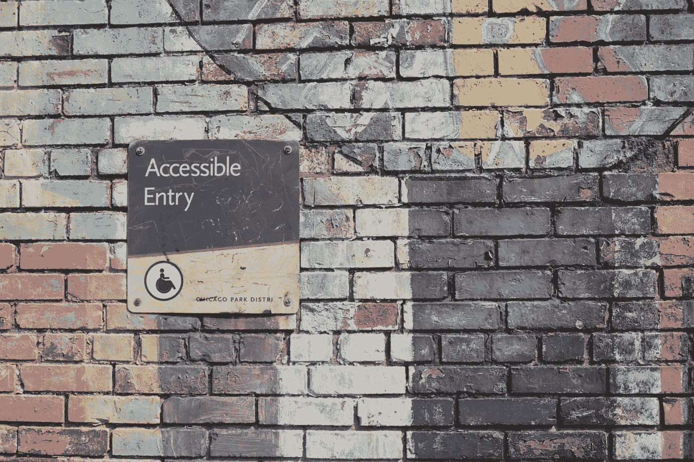

# 可访问性备忘单

> 原文：<https://javascript.plainenglish.io/accessibility-cheat-sheet-5e615151439d?source=collection_archive---------13----------------------->

## 概述可访问性的最重要方面

Photo by [Daniel Ali](https://unsplash.com/@untodesign_?utm_source=unsplash&utm_medium=referral&utm_content=creditCopyText) on [Unsplash](https://unsplash.com/s/photos/accessibility?utm_source=unsplash&utm_medium=referral&utm_content=creditCopyText)

你知道 *a11y* 是什么意思吗？如果没有，这可能意味着您在可访问性这个主题上还有一些工作要做。这篇文章的想法是概述可访问性的最重要的方面，这就是为什么请把它看得更像一个小抄而不是纲要。在文章的最后，我添加了一些资源，希望能鼓励你在这个主题上做更多的研究。尽情享受吧！

# 什么是可访问性？无障碍是什么意思？

**可访问性**可被视为“访问能力”并受益于某些系统或实体。在建筑、景观设计、产品设计、平面设计、运输、网络开发和数字解决方案等领域，这是一个重要的概念。

**无障碍=包容**

**记住！**易访问性的目标不是创建一个单独的解决方案，而是让主解决方案适应尽可能多的人。如果我们牢记这一点，结果将是一个对每个人都更好的解决方案！想想电梯——它主要是为那些不能爬楼梯的人设计的，但却让我们所有人的生活变得更加轻松。

**可访问性=质量**

网页内容可访问性指南，通常被称为 WCAG，是一套由国际开发的标准，其目标是创建一套被世界各地的组织和个人认可的单一指南。

WCAG 2.0 和 WCAG 2.1 是稳定的、可参考的技术标准。他们有 12-13 条指导方针，这些方针被组织在 4 个原则之下:可感知的、可操作的、可理解的和健壮的。对于每个指南，都有可测试的成功标准，分为三个级别:A、AA 和 AAA
👉[https://www.w3.org/WAI/WCAG21/quickref/](https://www.w3.org/WAI/WCAG21/quickref/)

# 无障碍问题

让我们考虑一下用户在网上冲浪时可能面临的可访问性问题(我确信我们都不止一次地经历过其中的一个问题！)

# 👉视觉的

1.  失明
2.  低视力
3.  色盲
4.  在阳光明媚的日子里使用手机

我们能做什么？

*   使用原生 HTML 元素
*   对图形使用替代文本
*   使用高对比度的颜色
*   启用键盘导航
*   将相关内容放在一起
*   扩展缩写和首字母缩略词

# 👉听力

1.  聋人
2.  重听的
3.  不想打扰的人

我们能做什么？

*   对所有视频使用字幕
*   不要只放视频和音频内容，也要添加文本
*   不要让电话成为与用户联系的唯一方式(例如在表格中或在公司网站上)
*   用简单的英语写

# 👉发动机

1.  无法使用鼠标
2.  缓慢的响应时间
3.  有限精细运动控制
4.  被困在摇晃的公交车上的用户
5.  使用小型手机的用户

我们能做什么？

*   启用键盘导航
*   创建大的可点击空间
*   让信息清晰简洁
*   滑块很酷，但也很难使用，最好有一个输入选项
*   不要有短暂的超时窗口
*   不要把太多的交互元素放在一起

# 👉认知的

1.  学习障碍
2.  容易分心的人
3.  难以集中注意力的人
4.  有小孩的父母

**我们能做什么？**

*   可理解的内容:适当的结构，(标题、列表和分隔)
*   简洁明了的信息
*   让用户可以理解错误，这样他就可以很容易地纠正它们
*   给出用户期望的响应
*   保持简洁(例如，不要使用斜体)
*   使用自动更正并提供建议
*   给出提醒和提示

希望这篇短文对你有所帮助，并希望你能继续拓宽关于可访问性的知识。现在，你能猜出 *a11y* 是什么意思吗？

# 工具和资源

Chrome 的扩展，帮助你通过不同能力和残疾的极端用户的眼睛体验网络和界面。
👉[https://www.funkify.org](https://www.funkify.org/)

**Wave:** 一套评估工具，帮助作者使他们的网页内容对残疾人来说更容易访问
👉[https://wave.webaim.org/](https://wave.webaim.org/)

👉包容性组件设计:[https://inclusive-components.design/](https://inclusive-components.design/)👉a11y 成本:bit.ly/a11ycasts
👉BBC a11y 指南:[http://www.bbc.co.uk/accessibility/guides/](http://www.bbc.co.uk/accessibility/guides/)

*更多内容请看*[***plain English . io***](https://plainenglish.io/)*。报名参加我们的* [***免费周报***](http://newsletter.plainenglish.io/) *。关注我们关于*[***Twitter***](https://twitter.com/inPlainEngHQ)*和*[***LinkedIn***](https://www.linkedin.com/company/inplainenglish/)*。查看我们的* [***社区不和谐***](https://discord.gg/GtDtUAvyhW) *加入我们的* [***人才集体***](https://inplainenglish.pallet.com/talent/welcome) *。*