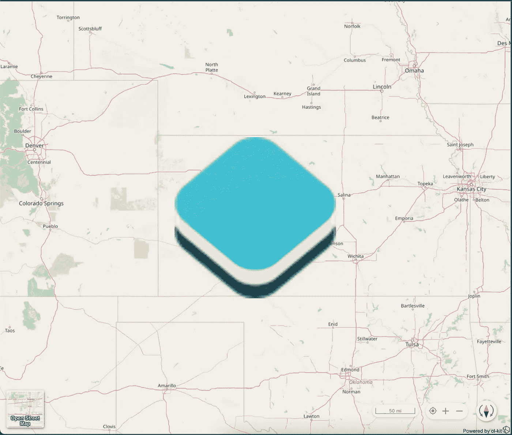
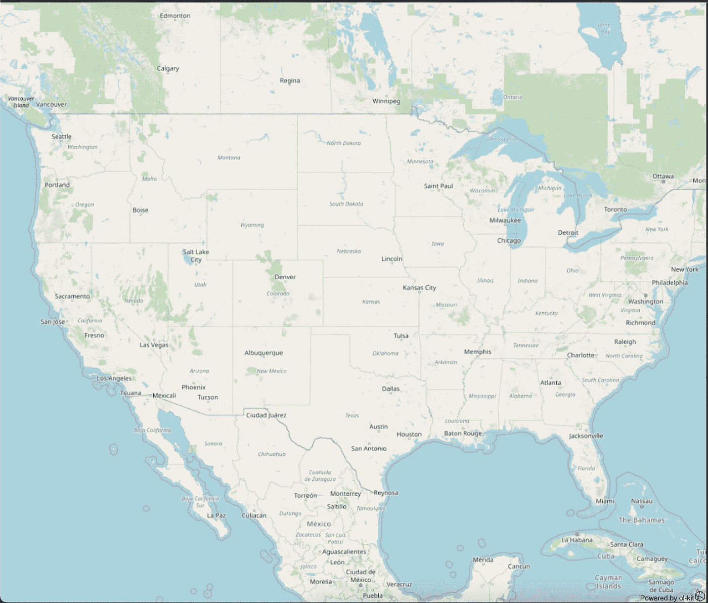

# 将带有点的地图添加到您的网站

> 原文：<https://javascript.plainenglish.io/add-a-map-with-a-point-to-your-website-677bfc3bbd59?source=collection_archive---------26----------------------->

## 关于如何将带有点的地图添加到您的网站的指南。

因为谷歌让它变得如此简单，许多网站都包含只有一个点的地图。然而，失败之处包括需要一个 API 密钥，以及一旦进行了指定次数的调用就要付费。不过，好消息是——因为你已经运行了一个 web 应用程序，你可以自己完成这项工作，而不会增加成本。

幸运的是，除了免费之外，将带有点的地图添加到您的网站相当简单，无论您是想要 HTML 的基本插件，还是想要在 React 中构建自己的插件。

# 基本顺便访问

这种相对简单的解决方案适用于诸如 [WordPress](https://wordpress.com/) 、单页应用程序(例如 Angular、Vue.js 和 React)和基本的 HTML 页面。首先将这个`iframe`粘贴到 HTML 源代码中。

```
<iframe src="[https://one-point-map.herokuapp.com/?lat=0&long=0](https://one-point-map.herokuapp.com/?lat=0&long=0)" width="800px" height="800px" />
```

更改`src` URL 中的值会改变地图小部件的位置和外观。要自定义 URL 中包含的查询参数，请尝试以下选项:

```
|  Param Name   |       Description        | Default |
|---------------|--------------------------|---------|
| lat*          | Latitude of point        |         |
| long/lon*     | Longitude of point       |         |
| zoom          | Desired zoom level       | 14      |
| icon_url      | URL of icon              |         |
| icon_scale    | Scale factor of icon     | 1       |
| show_popup    | Shows/hides popup        | true    |
| show_controls | Shows/hides controls     | true    |
| show_context  | Shows/hides right click  | true    |
| show_basemap  | Shows/hides map switcher | true    |
| title         | Text displayed in popup  |         |* required query params
```



自定义图标、缩放和比例的示例:`[https://one-point-map.herokuapp.com/?lat=38.477783&long=-99.728264&zoom=7&icon_url=https://openlayers.org/assets/theme/img/logo70.png&icon_scale=5](https://one-point-map.herokuapp.com/?view=38.477783,-99.728264,7.00,0.00&lat=38.477783&long=-99.728264&zoom=7&icon_url=https://openlayers.org/assets/theme/img/logo70.png&icon_scale=5)`

# 自定义反应构建

对于自定义 React 构建，请查看 [ol-kit](https://ol-kit.com/) ，这是一个包装了 [React](https://reactjs.org/) 和 [OpenLayers](https://openlayers.org/) 的库。

要创建一个空白的 React 项目(一旦安装了节点)，请使用`react-scripts`的`4.0.3`版本，因为 ol-kit 不提供自己的 webpack v5 polyfills。将此粘贴到您的终端中:

```
npx create-react-app@4.0.3 point-map
cd point-map
npm install --save --save-exact react-scripts@4.0.3
```

接下来，运行以下命令来安装 ol-kit 及其对等依赖项:

```
npm i @bayer/ol-kit ol react react-dom styled-components @material-ui/core @material-ui/icons @material-ui/styles --save
```

用以下文件替换`App.js`的内容。它包括使用查询字符串数据在地图上渲染一个点所需的一切。



Note the lack of child UI components when a console error is thrown.

这个大纲用最基本的代码展示了默认的地图样式。参数化前需要回答的几个基本问题是:

1.  **什么时候** `**onMapInit**` **被调用？** OpenLayers 贴图初始化后。因为 map 实例是向下传递的，所以可以对其进行修改，并对其调用方法，比如添加一个点。这种初始化地图的简化是 ol-kit 最有价值的特性。
2.  **地图上的点怎么样？OpenLayers 框架将所有特征(在这种情况下，是一个点)放到地图的图层上(因此，名为 Open **图层**)。层次结构是这样工作的:`map`拥有一个或多个`layers`，每个`layer`只拥有一个`source`，而后者又可以拥有多个`features`(点)。如果你想要一个更完整的图片，查看这些 [OpenLayers 文档](https://openlayers.org/en/latest/apidoc/module-ol_source_Source-Source.html)上的子类。**
3.  **`**map.getView()**`**是做什么的？** 默认情况下，ol-kit 将美国 48 个相邻州的地图居中。如果您将一个点添加到世界上的任何其他地方，您可能希望地图重新以该点所在的位置为中心。`Null` Island(一个气象浮标，不是一个真实的岛屿)是测试这个的好地方，因为它的值`lat = 0, long = 0`非常容易记住。**

# **编辑地图子组件**

**这段代码结合了 [ReactHooks](https://reactjs.org/docs/hooks-intro.html) `useState`和`useEffect`来控制 React 子组件的可见性。以下是对上述代码片段的一般修改:**

```
const [showBasemapContainer, setShowBasemapContainer] = useState(true)
const [showContextMenu, setShowContextMenu] = useState(true)
const [showControls, setShowControls] = useState(true)
const [showPopup, setShowPopup] = useState(true)
```

**`...`**

```
useEffect(() => {
  const queryParams = window.location.search.split(/([?&])/g).filter(e => e.length > 1).reduce((acc, str) => {
    const stringSplit = str.split('=')
    acc[stringSplit[0]] = stringSplit[1]
    return acc
  }, {})
  if (queryParams.show_basemap && queryParams.show_basemap === 'false') {
    setShowBasemapContainer(false)
  }
  if (queryParams.show_popup && queryParams.show_popup === 'false') {
    setShowPopup(false)
  }
  if (queryParams.show_context && queryParams.show_context === 'false') {
    setShowContextMenu(false)
  }
  if (queryParams.show_controls && queryParams.show_controls === 'false') {
    setShowControls(false)
  }
}, []) // [] it will run on mount, but at no other time; URL params won't change without a refresh
```

**`...`**

```
<Map onMapInit={onMapInit} fullScreen>
  {showBasemapContainer && <BasemapContainer />}
  {showContextMenu && <ContextMenu />}
  {showControls && <Controls />}
  {showPopup && <Popup />}
</Map>
```

**添加对一些其他查询参数的支持会产生以下 React 组件。图标及其大小、缩放级别和弹出窗口中显示的标题都是可定制的；覆盖地图的每个组件都可以用查询参数隐藏。**

**一些需要注意的事项:**

*   **`**point.setStyle()**` **改变点的外观:**
    调用`setStyle`允许无限数量的样式应用于点；这个例子仅仅演示了如何将默认的点样式改变为图标/图像。有关 OpenLayers 中样式特性的更多信息，[请查看本文档](https://openlayers.org/en/latest/apidoc/module-ol_style_Style.html)。**
*   **`**olFeature({ ... })**` **接受任何自定义属性:**
    向弹出窗口添加数据非常简单——某种类型的`geometry`(如点或线串)定义所有特征，然后可以应用其他值。尽管 ol-kit 预先配置为在弹出窗口中突出显示`title`属性，但不同的配置会修改弹出窗口的行为。**

**大多数需要地图的项目可能不会使用 URL 查询参数来控制数据或组件的可见性，但这应该是一个很好的起点。**

**停止为谷歌的 API 付费；托管自己的软件，保持敏捷，有任何问题都可以随时联系我们。**

**感谢您的阅读😃**

***更多内容请看* [***说白了。报名参加我们的***](http://plainenglish.io/) **[***免费周报***](http://newsletter.plainenglish.io/) *。在我们的* [***社区不和谐***](https://discord.gg/GtDtUAvyhW) *获得独家获取写作机会和建议。*****