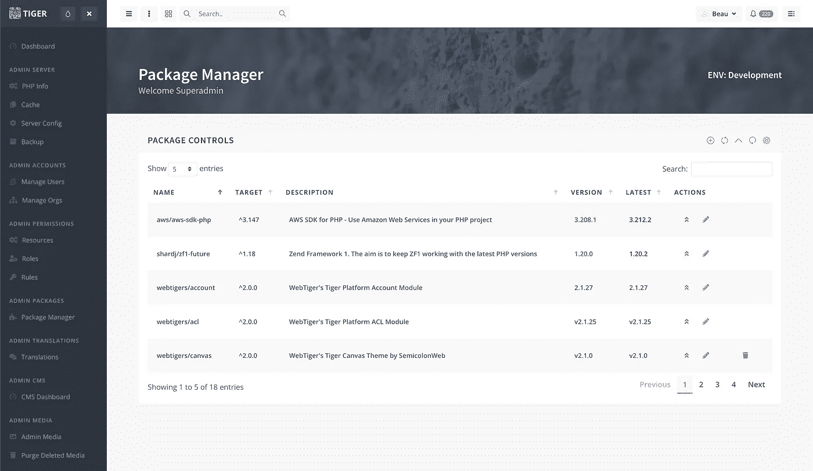
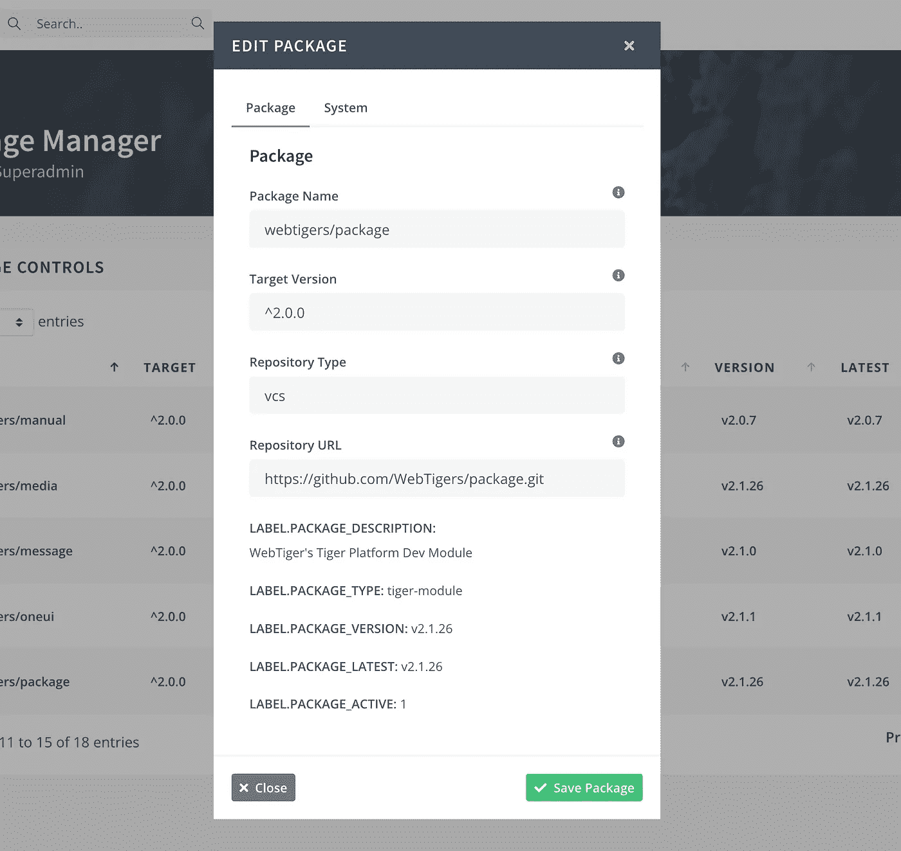
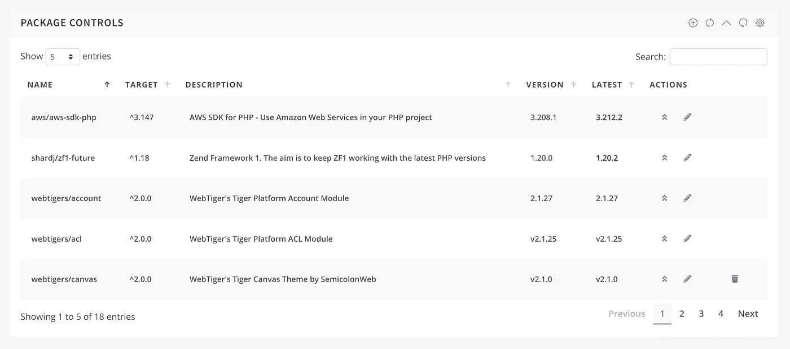
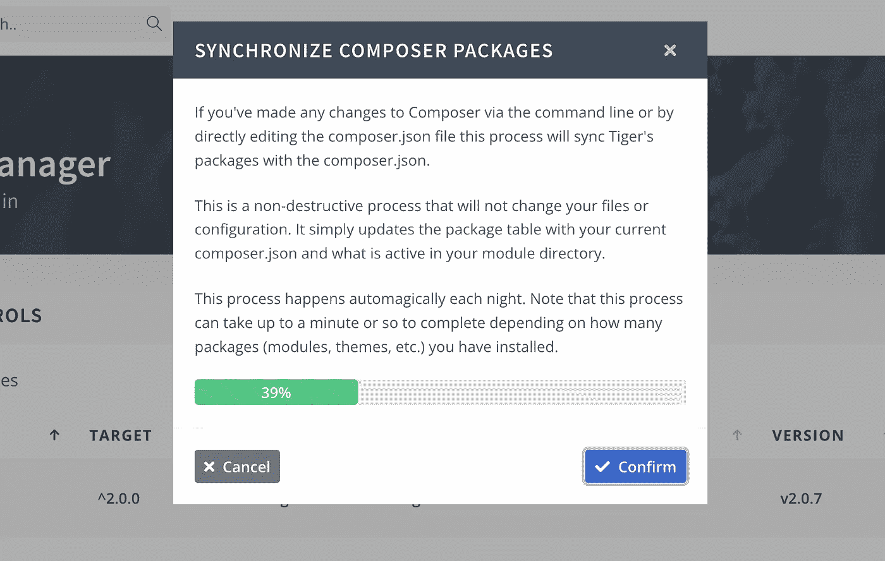

# 给任何应用程序添加一个 WordPress 风格的更新工具

> 原文：<https://javascript.plainenglish.io/add-a-wordpress-style-update-utility-to-any-application-48bd33d9b3ff?source=collection_archive---------19----------------------->

## WebTigers 的一个收费工具

## 使用 JavaScript、PHP、Composer 和 GitHub，一键更新您的最终用户应用程序


Image by GaudiLab via DepositPhotos

如果您可以将代码推送到 GitHub 并自动更新您安装的数百万个应用程序，这不是很酷吗？您的用户会得到通知，有新的插件、模块或应用程序更新可供下载和安装——只需点击鼠标！

现在，您可以使用一个使用 JavaScript、PHP、Composer 和 GitHub 的 WordPress 风格的更新工具，为您的可下载应用程序添加自我更新的优雅。

# 老虎来了

自我更新的应用程序并不是一件小事，但是 Tiger 为您提供了所有必要的构建模块，让您可以立即建立并运行自己的应用程序包管理器！

WordPress 为他们的插件使用了一个封闭的 Subversion 库(ewww！).这个回购是用来更新 WordPress 本身和几万个插件的。但是 WordPress repo 不做的是管理依赖、冲突或者更新你的应用程序需要的其他库。事实上，WordPress 将允许你下载会破坏你的安装的插件，让你手动删除表现不好或互不兼容的插件。

Tiger 的更新功能非常不同。

利用 Composer 的依赖管理和 GitHub，Tiger 向您展示了如何轻松地向您的应用程序添加一个全面服务的 UI 驱动的包管理器。

这不是 Tiger 的商业广告，代码是公开的，您可以在自己的应用程序中根据自己的需要使用。如果你想看的话，它正好在 Tiger 中运行。

要查看 Tiger 的运行情况，您可以[免费启动 AWS Tiger 实例](https://aws.amazon.com/marketplace/pp/prodview-wixkz63qgutes)并导航到包管理器。



# 安装

Tiger 的包管理器是 [Tiger 平台](https://WebTigers.com)的一个模块，你可以用它轻松地将你自己的自我更新功能构建到你可下载的应用程序中。

还是那句话，不一定要用老虎平台。 [Tiger 的包模块](https://github.com/WebTigers/Tiger/tree/master/application/modules/package)给了你创建自己的更新功能所需的所有类和函数方法。

唯一真正的依赖是您需要在您的主机上安装并运行 is Composer。在共享主机环境中，这会增加一些设置步骤，因为 cPanel 还没有提供将 Composer 安装到用户目录中的功能。我发现这篇[博客文章](https://www.freecodeblog.com/posts/install-composer-on-shared-hosting-cpanel)对运行在 cPanel 这样的共享托管环境中的应用程序很有帮助。

一旦 PHP 通过 PHP 的`shell_exec()`函数访问 Composer，您就可以自由地使用应用程序的自动更新功能了！

# 在后台

Tiger 的包管理器充当 Composer 的 GUI 包装器，允许您使用简单的 HTML 表单和 MariaDB (MySQL)表来管理应用程序的可更新特性，如:插件、模块或任何您想要更新的代码。

*“我为什么需要 GUI？只需从命令行运行 Composer。*

因为最终用户对命令行一无所知。这就是为什么我们作为工程师必须为他们建立图形用户界面。

*“哦。”*

另一个原因是 Composer 并没有把它的库文件写到应用程序文件夹结构中你可能需要它们的地方。它可以把它们写到你想写的任何地方，但这可能不是一个最佳实践。我宁愿从我的应用程序中复制或符号链接到这些文件。我们越少干扰作曲家的自然行为，越好。

这种复制和链接也允许我们*激活*和*去激活*没有使用的模块和插件，就像 WordPress 对其插件所做的一样。

好消息是 Tiger 的 Composer 服务处理了所有繁重的工作，比如使用 Composer，甚至用兼容 Composer 的、人类可读的 JSON 修改应用程序的`composer.json`文件。


Image by yacobchuk1 via DepositPhotos

# 创建可安装/可更新的模块或插件

假设您已经创建了一个类似于 Tiger 使用的模块化应用程序或插件结构，那么您可以用您的插件或模块代码填充 GitHub repo。

请注意，对于您想要为其提供安装和更新功能的每个插件或模块，您将需要一个公共或私有的 GitHub repo。

如果您的回购是私人的，您将需要提供一个[个人访问令牌](https://docs.github.com/en/authentication/keeping-your-account-and-data-secure/creating-a-personal-access-token)，允许 Composer 访问您的私人回购进行读取。Tiger 的许多模块都是私有的，Tiger 使用嵌入在其配置中的个人访问令牌来读取这些私有的回购协议。个人访问令牌的这种特殊使用并不意味着任何形式的绝对安全，它只是为了防止私人回购被盗用或其他版权内容被下载到 Tiger 之外。当您发布自己的公共或私有代码时，请记住这一点。

为了使您的模块与 Composer 兼容，您需要创建一个微小的`composer.json`文件，作为您的模块或插件代码的一部分。Tiger 的包模块的`composer.json`文件是这样的:

```
{
   "name":"webtigers/package",
   "type":"tiger-module",
   "description":"WebTiger's Tiger Platform Package Module",
   "license":"proprietary",
   "minimum-stability":"stable",
   "keywords":[
      "package",
      "tiger",
      "webtigers"
   ],
   "homepage":"https://webtigers.com"
}
```

非常简单，但是 Composer 需要这个文件，主要是为了告诉 Composer，*“嘿，我是一个 VCS 控制的存储库，您可以使用它。”* VCS 是“版本控制系统”。Tiger 的包管理器使用这些参数中的一些来通知 Tiger 这是什么类型的包，在这种情况下，包管理器知道这是一个将要自我更新的`tiger-module`，因为它是`webtigers/package`。

现在，让我们看看如何向 Tiger 添加一个新模块，或者您可以在自己的应用程序中使用什么:



添加一个新的插件或包很简单，只需用一些设置填写表单，这些设置告诉 Composer 什么包、版本首选项、存储库类型以及下载和安装新代码(在本例中是模块)所需的 URL。

你也可以为你的应用程序创建一个各种插件和模块的集中数据库，让你像 WordPress 一样一键安装。Tiger 还没有这样的产品，但它肯定会出现在绘图板上。

# 在 GitHub 中发布版本

告诉 Composer 使用哪个版本的插件或模块是由 GitHub 的发布管理控制的。每次您将新提交的代码推送到 GitHub 时，您都需要对该提交进行“发布”,并对其进行版本化。然后，GitHub 会维护您每个版本的完整版本历史。

GitHub 最喜欢的版本语法是这样的:

```
v2.4.0
```

请注意版本号前面的“v”。我不太清楚为什么要这样做，但作曲家也更喜欢这样。

使用 Composer 胜过 WordPress 的一个很酷的地方是，如果有必要，你可以使用旧版本的软件包。WordPress 只允许你升级，不允许降级。

# 检查更新的软件包

Tiger 每天检查是否有更新的包，然后用版本中的任何变化更新数据库。这可以通过一个简单的 CRON 作业在后台完成。



您也可以从 GUI 中手动运行该作业。该作业在每个 libraries Composer 控件中循环运行，最多需要一分钟左右的时间。



如果出现问题，Composer 通常会超时，或者出现其他错误，不会出现任何问题。您可以多次运行扫描，直到它无错误地完成。

# 结论

创建可自我更新的应用程序并不困难。

使用 Tiger 作为您的应用程序平台，这项工作已经为您完成了。但是如果你已经有了一个运行的应用程序，你可以随意劫持、借用、复制或者从 Tiger 的包管理器和 Composer 服务中获得灵感。GitHub 上的公开回购正是为了这个目的。

这是我为 Tiger 编写的非常酷的代码，它也可以帮助完善您的可下载终端用户应用程序！

____________________

Beau Beauchamp 是一名 web 应用程序架构师，拥有 20 多年在云中开发企业级应用程序的经验；他是[*WebTigers*](https://webtigers.com/)*的创始人，也是老虎平台背后的首席开发者。*

*更多内容看* [***说白了。报名参加我们的***](https://plainenglish.io/) **[***免费周报***](http://newsletter.plainenglish.io/) *。关注我们关于*[***Twitter***](https://twitter.com/inPlainEngHQ)*和*[***LinkedIn***](https://www.linkedin.com/company/inplainenglish/)*。加入我们的* [***社区***](https://discord.gg/GtDtUAvyhW) *。***