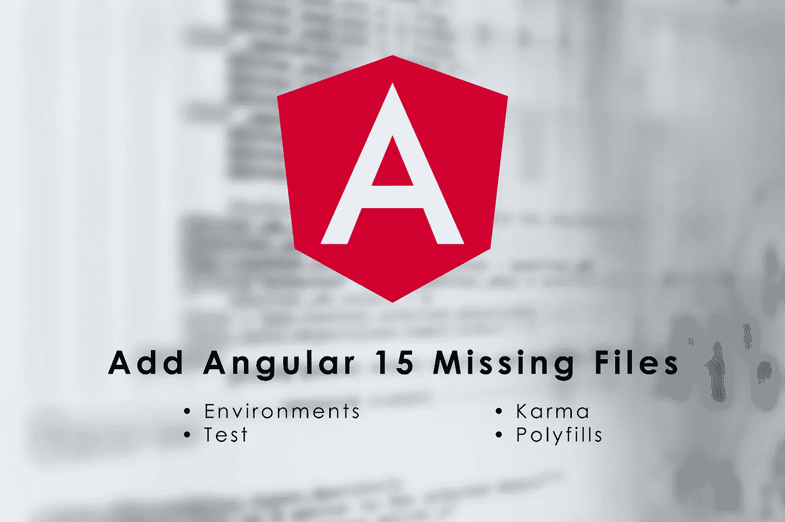

# 添加 Angular 15 缺失文件

> 原文：<https://javascript.plainenglish.io/add-angular-15-missing-files-b90a1dbcea89?source=collection_archive---------2----------------------->



Add Angular 15 Missing Files (Enviroments, Karma, Test, And Polyfills)

Angular 15 已经发布了大量有趣的新功能

但我发现人们抱怨的一件事是，当你使用`ng new`或`npm init @angular@latest`时，现在有一些文件丢失了，虽然这是一个很好的理由——为了使新项目简单——有些人需要恢复其中的一些或全部，在这篇文章中，我将帮助你恢复每个文件，但请只在你需要时这样做

# 1.环境文件

*注意:*开始用**角度 15.1** 可以用`ng g environments`自动调至

这可能是最显著的变化，因为每个人都将它们用于 API URL，在我们讨论如何恢复它们之前，这里的问题是，您是否有一个用于生产和本地(或多个，本地、开发、stg、生产…)的 API URL

如果您的答案是否定的，并且您总是只使用一个链接，那么不用担心，只需创建一个简单的`environment.ts`文件并导出您正在使用的所有变量，但是忽略那里的`production: false | true`

如果答案是肯定的，那么你将需要更多的努力，但仍然很容易

像以前一样创建你的`environment.ts`和`environment.prod.ts`，再次忽略`production: false | true`

然后在`angular.json`文件的`project/projects/project-name/architect/build/configurations/production`里面添加这几行

```
"fileReplacements": [
  {
    "replace": "src/environments/environment.ts",
    "with": "src/environments/environment.prod.ts"
  }
]
```

这一直是`environment`在构建时被其产品版本取代的原因

要了解更多信息，请访问[角度文档](https://angular.io/guide/build#configuring-application-environments)

# 2.karma 文件

*注意:*从**角度 15.1 开始**你可以用`ng g config`然后选择`karma`来自动进行

`karma.conf.js`文件也不在那里——人们通常会更改它以添加代码覆盖率——所以在添加它之后，您需要再次更改`/projects/project-name/architect/test/options`中的`angular.json`文件并添加

```
"options": {
  ...
  "karmaConfig": "karma.conf.js"
}
```

这是一个代码覆盖率为 80%的样本文件

```
// Karma configuration file, see link for more information
// https://karma-runner.github.io/1.0/config/configuration-file.html

module.exports = function (config) {
  config.set({
    basePath: '',
    frameworks: ['jasmine', '@angular-devkit/build-angular'],
    plugins: [
      require('karma-jasmine'),
      require('karma-chrome-launcher'),
      require('karma-jasmine-html-reporter'),
      require('karma-coverage'),
      require('@angular-devkit/build-angular/plugins/karma')
    ],
    client: {
      jasmine: {
        // you can add configuration options for Jasmine here
        // the possible options are listed at https://jasmine.github.io/api/edge/Configuration.html
        // for example, you can disable the random execution with `random: false`
        // or set a specific seed with `seed: 4321`
      },
      clearContext: false // leave Jasmine Spec Runner output visible in browser
    },
    jasmineHtmlReporter: {
      suppressAll: true // removes the duplicated traces
    },
    coverageReporter: {
      dir: require('path').join(__dirname, './coverage/learn-ngrx'),
      subdir: '.',
      reporters: [
        { type: 'html' },
        { type: 'text-summary' }
      ],
      check: {
        global: {
          statements: 80,
          branches: 80,
          functions: 80,
          lines: 80
        }
      }
    },
    reporters: ['progress', 'kjhtml'],
    port: 9876,
    colors: true,
    logLevel: config.LOG_INFO,
    autoWatch: true,
    browsers: ['Chrome'],
    singleRun: false,
    restartOnFileChange: true
  });
};
```

要获得最新的配置版本，请访问[角度文档](https://angular.io/guide/testing#configuration)

# 3.测试文件

`test.ts`文件很少被修改，在某些情况下，最好添加一个脚本而不是修改它，以防万一，比如你想让它失败，如果有任何错误，你应该添加一个文件(如`fail-on-error.js`)

```
console.error = function(message?: any): void {
    fail(`Test contained console error:\n${message}`);
};
```

然后在里面`/projects/project-name/architect/test/options`

```
"options": {
  ...
  "scripts": ["fail-on-error.js"]
}
```

但是如果你想替换`test.ts`而不是添加到它，那么不要添加`scripts`而要添加`main`

```
"options": {
  "main": "src/test.ts",
  ...
}
```

要实现这一点，还需要做一个改变，就是在`tsconfig.spec.json`中添加新的`test.ts`,如下所示

```
/* To learn more about this file see: https://angular.io/config/tsconfig. */
{
  "extends": "./tsconfig.json",
  "compilerOptions": {
    "outDir": "./out-tsc/spec",
    "types": [
      "jasmine"
    ]
  },
  "files": [
    "src/test.ts"    <-----
  ],
  "include": [
    "src/**/*.spec.ts",
    "src/**/*.d.ts"
  ]
}
```

采样`test.ts`以启用`errorOnUnknownElements`和`errorOnUnknownProperties`

```
// This file is required by karma.conf.js and loads recursively all the .spec and framework files

import 'zone.js/testing';
import { getTestBed } from '@angular/core/testing';
import {
  BrowserDynamicTestingModule,
  platformBrowserDynamicTesting
} from '@angular/platform-browser-dynamic/testing';

// First, initialize the Angular testing environment.
getTestBed().initTestEnvironment(
  BrowserDynamicTestingModule,
  platformBrowserDynamicTesting(),
  { 
    errorOnUnknownElements: true,
    errorOnUnknownProperties: true
  }
);
```

# 4.多填充物

`polyfills.ts`也被删除，我相信这是修改最少的文件，但是 Angular 团队给了我们一个更好的选择，将多填充路径直接添加到`angular.json`文件中

例如，如果你想要`core-js/actual/array/from`，你可以修改`/projects/project-name/architect/build/options/polyfills`为

```
"polyfills": [
  "zone.js",
  "core-js/actual/array/from"
],
```

就这些，阅读[角度文档](https://angular.io/guide/browser-support#polyfills)了解更多信息

# 5.browserslistrc

*注意:*开始用**角度 15.1** 你可以用`ng g config`然后选择`browserslist`来自动调

实际上这很简单，只需在项目的根目录下创建它的`.browserslistrc`文件就可以了，阅读 [Angular 文档](https://angular.io/guide/build#configuring-browser-compatibility)了解更多信息

你可以在[GitHub 回购](https://github.com/robertIsaac/add-angular15-missing-files)中看到回购示例

*更多内容请看*[***plain English . io***](https://plainenglish.io/)*。报名参加我们的* [***免费周报***](http://newsletter.plainenglish.io/) *。关注我们上*[***Twitter***](https://twitter.com/inPlainEngHQ)[***LinkedIn***](https://www.linkedin.com/company/inplainenglish/)*[***YouTube***](https://www.youtube.com/channel/UCtipWUghju290NWcn8jhyAw)**和* [***不和***](https://discord.gg/GtDtUAvyhW) *对成长黑客感兴趣？检查* [***电路***](https://circuit.ooo/) ***。*****