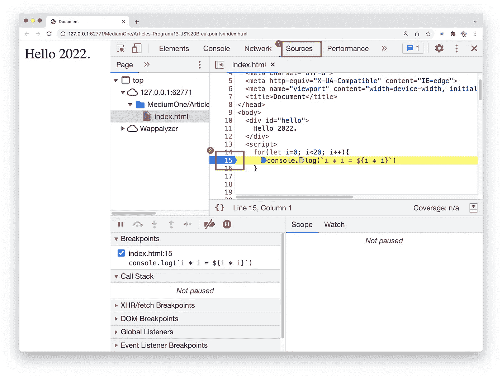

# 在 Chrome Devtools 上添加断点的 5 种方法

> 原文：<https://javascript.plainenglish.io/add-breakpoints-on-chrome-devtools-238bc490ebc0?source=collection_archive---------6----------------------->

## 每个 JavaScript 开发人员都应该知道这些调试技巧。


调试是每个开发人员必须掌握的技能，在代码中添加断点是调试的基础。本文将分享 5 种在 Chrome DevTool 中添加断点的方法。

# 1#直接添加断点

转到 Chrome Devtools 的 Source 标签，点击代码所在的行号添加断点。



这应该是大家添加断点最常见的方式。

# 2#条件断点

但有时，我们希望断点仅在特定条件下生效。这时，我们可以采取以下方法。

*   右键单击“行号”列
*   选择**添加条件断点**
*   在对话框中输入您的条件

例如，当 I 大于 10 时，我们希望暂停代码，

```
for(let i=0; i<20; i++){
     console.log(`i * i = ${i * i}`)
}
```

我们可以:


# 3# DOM 更改断点

在某些情况下，我们不希望在某个位置暂停代码，而是只在 DOM 元素发生变化时暂停。这时，我们可以这样做:

1.  点击**元素**选项卡。
2.  转到要在其上设置断点的元素。
3.  右键单击该元素。
4.  将鼠标悬停在上的 **Break 上，然后选择**子树修改**、**属性修改**或**节点移除**。**

例如，我们想在`hello`元素改变时暂停代码:

```
<div id="hello">
    Hello 2022.
</div>
<script>
    document.getElementById("hello").onclick = (event) => {
      event.target.innerText = new Date().toString()
    }
</script>
```

我们可以:


注意:

*   **子树修改**。当当前选定节点的子节点被移除或添加，或者子节点的内容被更改时触发。子节点属性更改或当前选定节点的任何更改不会触发。
*   **属性修改**:在当前选择的节点上增加或删除属性，或者属性值发生变化时触发。
*   **节点移除**:移除当前选中的节点时触发。

# 4 # XHR/获取断点

如果您想在 JavaScript 试图向 URL 发出 HTTP 请求时暂停代码，我们可以这样做:

1.  点击**信号源**选项卡。
2.  展开 **XHR 断点**窗格。
3.  点击**添加断点**。
4.  输入要断开的字符串。当这个字符串出现在 XHR 的请求 URL 中的任何地方时，DevTools 就会暂停。
5.  按回车键确认。

例如，当脚本试图请求`api.github.com`时，我们想要暂停代码。

```
<body>
  <div id="hello">
    Hello 2022.
  </div>
  <script>
    fetch("[https://api.github.com](https://api.github.com)")
     .then(res => {
       console.log(res)
     })
  </script>
</body>
```

我们可以:


# 5#事件侦听器断点

当然，我们也可以在某个事件被触发时暂停代码。

```
<body>
  <div id="hello">
    Hello 2022.
  </div>
  <script>
    document.getElementById("hello").onclick = (event) => {
      console.log('hello 2022')
    }
  </script>
</body>
```

如果你想在点击`hello`元素后暂停代码，我们可以这样做:

