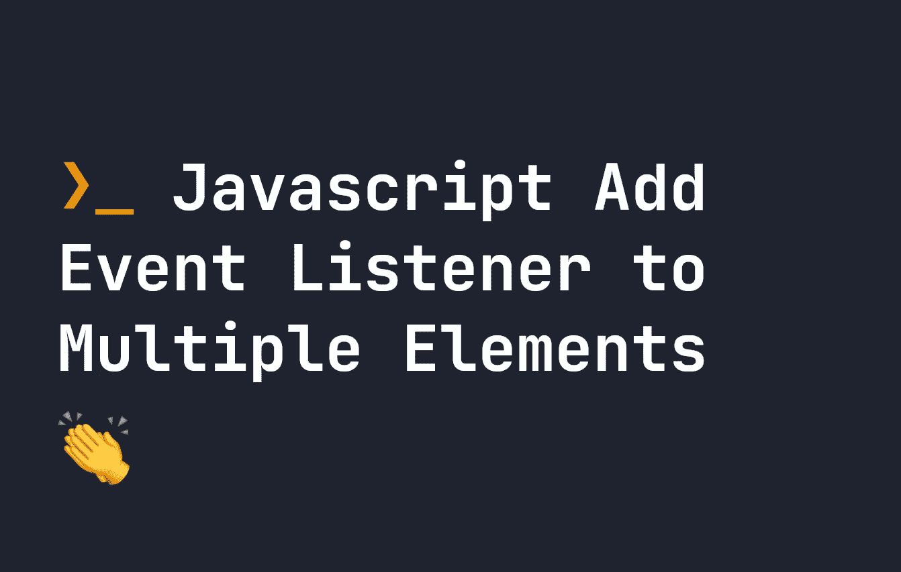

# 向 JavaScript 中的多个元素添加事件监听器

> 原文：<https://javascript.plainenglish.io/add-event-listener-to-multiple-elements-in-javascript-e9ff28411992?source=collection_archive---------4----------------------->

## 默认情况下，addEventListener 仅向一个 HTML DOM 元素添加事件。让我们看看如何向多个 DOM 元素添加事件。



如果您曾经使用过普通的 Javascript，您可能熟悉使用以下公式向元素添加事件侦听器:

```
let element = document.querySelector('#button');element.addEventListener('click', () => {
    console.log('some event content here...')
})
```

当然，上面的代码会触发一个函数，这个函数在`#button`被触发时触发。但是，有时您需要向多个元素添加一个事件侦听器——比如，页面上存在的每个按钮。您可能会发现，即使一个页面上有多个元素，上面的方法也只是将事件添加到一个元素中——第一个元素。怎么回事？

问题是`addEventListener`只适合向一个 DOM 元素添加事件，而`querySelector`也只匹配一个元素。那么，如何向页面上的多个元素添加事件侦听器呢？我们来看看解决方案。

# 向多个元素添加事件侦听器

我们将使用`querySelectorAll`来匹配页面上的所有元素，而不是使用`querySelector`。下面的代码返回一个类型为`NodeList`的项目，由所有匹配`.button`的 DOM 元素组成。**为了给每个元素**添加事件，我们需要遍历来自`querySelector`的每个匹配元素，并给每个元素添加事件:

```
let elements = document.querySelectorAll('.button');
```

Javascript 很奇怪，因为它不将 DOM 元素作为简单的数组返回——而是作为`NodeList`返回。[如果你想更详细地了解节点列表，请在这里阅读我的指南。](https://fjolt.com/article/javascript-foreach-on-queryselectorall)

在现代浏览器中，`NodeList`的行为很像数组，所以我们可以使用`forEach`遍历每个数组。为了给每个`.button`添加一个事件，我们需要使用`forEach`遍历它。所以向所有的`.button`元素添加一个`click`事件看起来像这样:

```
let elements = document.querySelectorAll('.button');elements.forEach((item) => {
    item.addEventListener('click', () => {
        console.log('some event content here...')
    })
});
```

**然而**，在像 Internet Explorer 这样的老浏览器中，`forEach`在`NodeList` s 上是不存在的，虽然这在当今并不是问题，但你可能会找到将`querySelectorAll`的结果转换成数组并循环的代码。这实现了同样的事情，但是这意味着我们在数组中循环，而不是在。

```
let elements = document.querySelectorAll('.button');
Array.prototype.forEach.call(elements, (item) => {
    item.addEventListener('click', function(e) {
        console.log('some event content here...')
    });
});
```

*更多内容请看*[***plain English . io***](https://plainenglish.io/)*。报名参加我们的* [***免费周报***](http://newsletter.plainenglish.io/) *。关注我们关于*[***Twitter***](https://twitter.com/inPlainEngHQ)[***LinkedIn***](https://www.linkedin.com/company/inplainenglish/)*[***YouTube***](https://www.youtube.com/channel/UCtipWUghju290NWcn8jhyAw)*[***不和***](https://discord.gg/GtDtUAvyhW) *。对增长黑客感兴趣？检查* [***电路***](https://circuit.ooo/) *。***