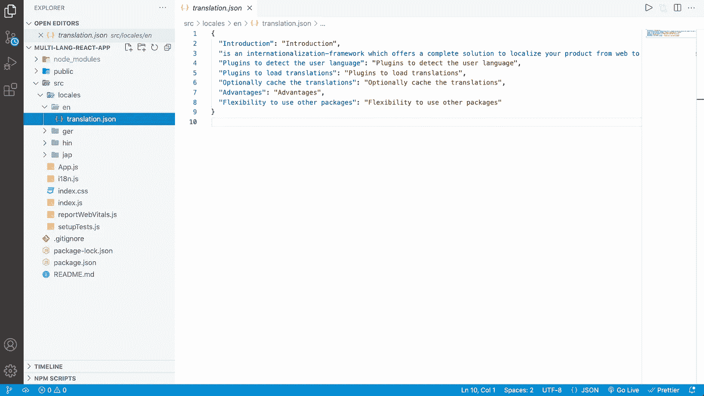

# 向您的 React 应用程序添加多语言支持

> 原文：<https://javascript.plainenglish.io/add-multi-lingual-support-to-your-react-app-b64a3256e487?source=collection_archive---------13----------------------->

多语言网站是一个以多种语言提供内容的网站。如今，让访问者能够用一种语言访问您的网站及其内容至关重要。

**多种语言**可以改善用户的应用体验。当你开始一个新项目时，这是一个你应该经常留意的特性。

> **react-i18next** 包允许您在应用程序中轻松支持多种语言。

那么就来说说实现吧。我们需要的包如下:

## NPM I i18 下一个

i18next 是一个非常流行的浏览器或任何其他 javascript 环境的国际化框架。

## npm 我的反应-i18 下一个

*react* - *i18next* 是 *React 强大的国际化框架。*

## NPM I i18 下一个浏览器语言检测器

这是一个 i18next 语言检测插件，用于**检测浏览器中的用户语言**。

## npm i i18next-xhr-backend

这是一个将在浏览器中使用的简单 i18next 后端。它**将使用 XHR API 从后端服务器**加载资源。

因此，我们将从创建一个名为 **locales** 的文件夹开始。该文件夹将包含我们要添加的所有语言。

现在我将添加英语、**德语**和**日语**。因此，我将用<键>为每种语言创建一个文件夹，命名为 **en** 、 **ger** 、 **jap** ，在每个文件夹中，我将创建一个 **translation.json** 文件。

在这个文件中，您将在一个**键-值**对中存储该语言的翻译。

现在转到主文件，在根文件夹中创建一个名为 **i18n.js** 的文件，这个文件将包含所有语言的配置。

我正在导入我们已经创建的所有语言的所有包和 **translation.json** 文件。然后我只是用资源初始化 **i18n** 。

resources 对象将包含每个带有 translations 属性的语言对象，我们将使用指定的 **JSON** 文件来设置该属性。

此外，还有一些其他属性，如**调试**、 **lng** 、**回退 Lng** (如果检测到的 lng 不可用，则使用默认值)、**键分离器**和**插值**。之后，我将把这个文件导入到主 **index.js** 文件中。

现在让我们使用这个特性。

我们可以从 **react-i18next**
使用**use translain**轻松获得翻译，然后我们将从 **useTranslation** hook 获取 **t** 和 **i18n** ，并可以使用 **t('key')** 函数和 **key param** 显示内容。

我们还可以使用**i18n . change language(" LNG ")**函数轻松更改语言。

现在，您可以轻松地将多语言特性添加到 React 项目中。

如果你喜欢我的文章，请关注我。谢谢你。

*更多内容看* [***说白了就是***](http://plainenglish.io/) *。报名参加我们的* [***免费每周简讯***](http://newsletter.plainenglish.io/) *。在我们的* [***社区***](https://discord.gg/GtDtUAvyhW) *获得独家获得写作机会和建议。*