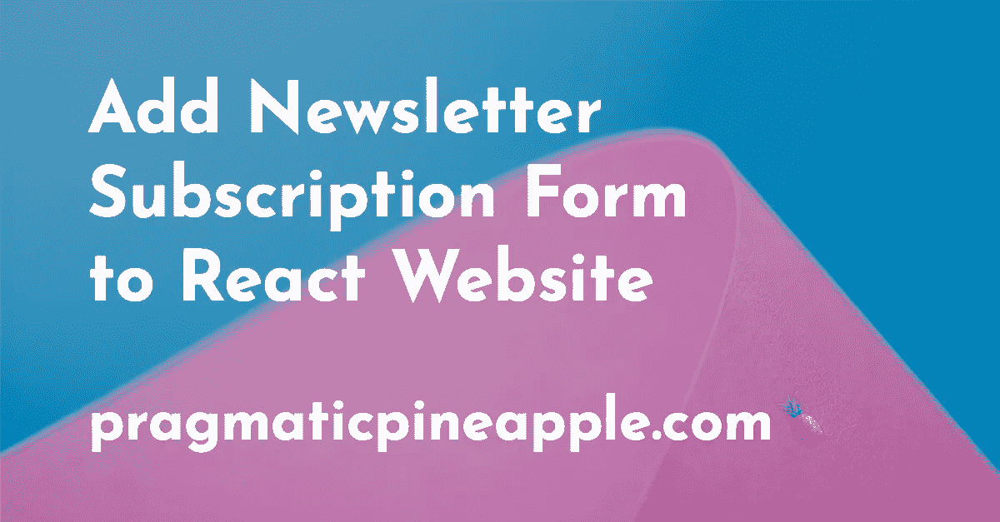
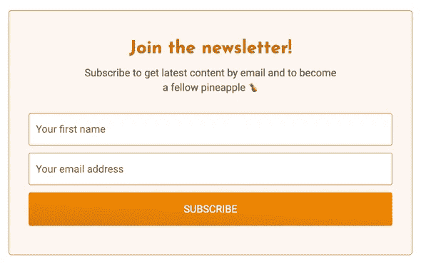
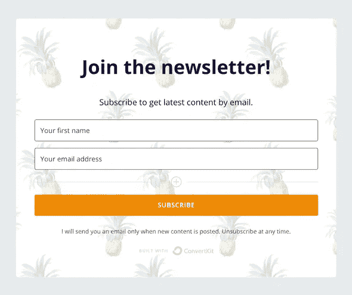
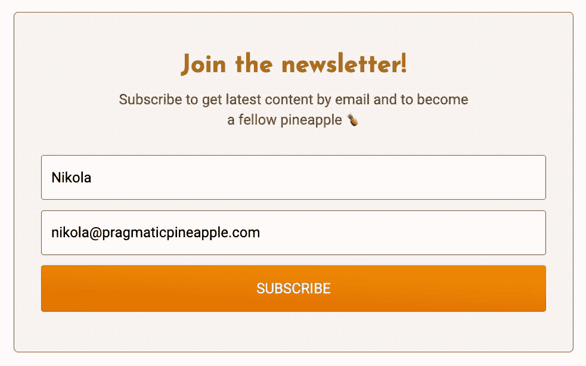
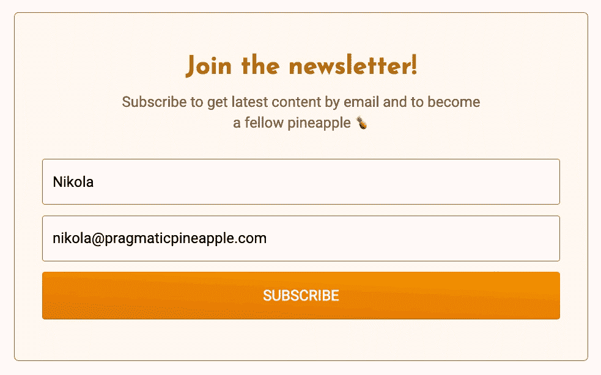

# 向 React 网站添加时事通讯订阅表格

> 原文：<https://javascript.plainenglish.io/add-newsletter-subscription-form-to-react-website-2ce6091ec906?source=collection_archive---------7----------------------->



如果你是一个开发者，不喜欢在你的网站上毫无意义地嵌入第三方代码，这是一篇非常适合你的文章。我们将为您的网站建立一个定制的电子邮件注册表单，这样您就可以增加您的受众。我们将使用 React，但同样的原则适用于任何库或框架，如 Gatsby 或 Next.js。

如果你是一个回到我博客的人，你可能会注意到几乎任何页面底部都有一个小表格。这是一个你可以注册订阅我的时事通讯的表格，这些年来我已经改变了一些。下面是写作时表单的外观:



起初，我使用了各种提供商提供的一些现成的解决方案。我最满意的是 [ConvertKit](https://convertkit.com?lmref=EVgZiQ) ，它的形式看起来，所以我用了一段时间。我在 [ConvertKit](https://convertkit.com?lmref=EVgZiQ) 的 UI 中设计了表单，并将其 HTML 嵌入到我的博客中。这是它早期的样子:



他们的表单生成器给我留下了深刻的印象，但是作为一名开发人员，我不太喜欢复制很多我不太了解的代码和样式。当然，我本可以一头扎进 CSS 里想出来的。每当我想调整表单外观时，我都必须这样做。但是我总是希望用我的风格和行为创建一个适合我的自定义表单。

所以，事不宜迟，让我们来看看如何设计和放置一个允许用户订阅的定制表单。

# 表单布局

如果你想扩大你的时事通讯，你可能只需要一个注册人的名字和电子邮件。当然，你可以疯狂地创建这种超级长表格，但人们填写它并注册你的简讯的机会可能会下降。但是，嘿，我有什么资格阻止你？请自便。

首先，我们可以构建一个简单的 HTML 表单，包含两个输入字段和一个提交按钮。为了提醒您，我将展示如何在 React 上下文中实现这一点，但是如何在原始 HTML 或其他一些库/框架中实现这一点应该非常直观。这是 JSX 的版本:

```
const SubscribeForm = () => {
  const [email, setEmail] = useState("")
  const [name, setName] = useState("")

  const handleSubmit = async (event: React.FormEvent) => {
    // TODO
  }

  const handleEmailChange = (event: React.ChangeEvent<HTMLInputElement>) => {
    const { value } = event.target
    setEmail(value)
  }

  const handleNameChange = (event: React.ChangeEvent<HTMLInputElement>) => {
    const { value } = event.target
    setName(value)
  }

  return (
    <form onSubmit={handleSubmit}>
      <input
        aria-label="Your first name"
        name="fields[first_name]"
        placeholder="Your first name"
        type="text"
        onChange={handleNameChange}
        value={name}
      />
      <input
        aria-label="Your email address"
        name="email_address"
        placeholder="Your email address"
        required
        type="email"
        onChange={handleEmailChange}
        value={email}
      />
      <button>SUBSCRIBE</button>
    </form>
  )
}
```

恭喜你，你刚刚在 React 的实现中看到了一个经典的 HTML 表单。一个`form`标签，由两个`input`和一个`button`绑在一起。但是，我们不要跳过它。当我们向 [ConvertKit](https://convertkit.com?lmref=EVgZiQ) 提交数据时，有一些重要的信息会对我们有所帮助。请回头看一下两个输入字段及其名称。`fields[first_name]`和`email_address`很快就会证明它们的价值。

# 发送数据

好了，我们得到了表单呈现，但是如果您发布这个表单，没有用户能够订阅并显示在 [ConvertKit](https://convertkit.com?lmref=EVgZiQ) 中。为了允许用户订阅，我们需要自己发送数据给 [ConvertKit](https://convertkit.com/?lmref=EVgZiQ) 。下面是我们如何在我们的`handleSubmit`函数中实现它:

```
const SubscribeForm = () => {
  ...
  const FORM_URL = `your form URL, we will describe it in a sec`

  const handleSubmit = async (event: React.FormEvent) => {
    event.preventDefault()

    const data = new FormData(event.target as HTMLFormElement)

    try {
      const response = await fetch(FORM_URL, {
        method: "post",
        body: data,
        headers: {
          accept: "application/json",
        },
      })
      const json = await response.json()

      if (json.status === "success") {
        return
      }
    } catch (err) {
      console.log(err)
    }
  }

  ...
}
```

很好，我们添加了向带有表单数据的`FORM_URL`发出 POST 请求的逻辑，并且我们考虑了在这个过程中发生的任何错误。作为一个完整的解决方案，我们还缺少一个合适的`FORM_URL`值。您可以通过[在 ConvertKit](https://help.convertkit.com/en/articles/3860348-how-to-create-your-first-form-in-convertkit?lmref=EVgZiQ) 上创建一个表单来创建自己的表单。

创建表单后，从 [ConvertKit](https://convertkit.com?lmref=EVgZiQ) 的表单编辑器 URL 中复制表单 ID。例如，编辑表单的 URL 可以是这样的`https://app.convertkit.com/forms/designers/123456/edit`。`123456`是你的表单 ID。然后，你就可以把`FORM_URL`用胶带粘在一起成为`[https://app.convertkit.com/forms/123456/subscriptions](https://app.convertkit.com/forms/123456/subscriptions.)` [。](https://app.convertkit.com/forms/123456/subscriptions.)

当你试图嵌入你的表单时，你也可以从 [ConvertKit](https://convertkit.com/?lmref=EVgZiQ) 得到它。转到 HTML 选项进行嵌入，在那里你会发现类似这样的东西:

```
<form action="https://app.convertkit.com/forms/123456/subscriptions" ...>
  ...
</form>
```

`action`值是您需要在自定义表单中获取和使用的值。

现在，您还记得我们之前提到的那些输入名称属性吗？我要提醒你—我们在输入字段中添加了`fields[first_name]`和`email_address`。这些名称将构建 ConvertKit 期望的适当的 FormData 对象。所以我们只是模仿了嵌入式 ConvertKit 表单为我们做的事情。现在，当用户点击“订阅”按钮时，他们将作为订阅者出现在 [ConvertKit](https://convertkit.com/?lmref=EVgZiQ) 中。多整洁啊。

我们现在可以在下一部分升级用户体验。请继续阅读。

# 个人风格

为什么我们要构建一个与第三部分一样的自定义表单呢？是的，我们可以更好地定义它的风格，并且我们可以更好地控制向用户显示什么。但是我这样做的原因是为了给表单添加更多的功能。例如，当你订阅我的时事通讯时，你会得到一个甜蜜的过渡，说谢谢你并提到你的名字。这肯定不是必要的，但我发现它很有魅力，并认为这是一个很好的用户体验。

你也可以自己做，让我们在下面的例子中尝试一下:

```
const SubscribeForm = () => {
  const [status, setStatus] = useState<string | null>(null)
  const [email, setEmail] = useState("")
  const [name, setName] = useState("")

  const FORM_URL = `the URL you created in the previous section`

  const handleSubmit = async (event: React.FormEvent) => {
    event.preventDefault()

    const data = new FormData(event.target as HTMLFormElement)

    try {
      const response = await fetch(FORM_URL, {
        method: "post",
        body: data,
        headers: {
          accept: "application/json",
        },
      })

      setEmail("")
      const json = await response.json()

      if (json.status === "success") {
        setStatus("SUCCESS")
        return
      }
    } catch (err) {
      setStatus("ERROR")
      console.log(err)
    }
  }

  const handleEmailChange = (event: React.ChangeEvent<HTMLInputElement>) => {
    const { value } = event.target
    setEmail(value)
  }

  const handleNameChange = (event: React.ChangeEvent<HTMLInputElement>) => {
    const { value } = event.target
    setName(value)
  }

  return (
    <div>
      {status === "SUCCESS" && (
          <p>
            Welcome aboard{name ? `, ${name}` : ""}{" "}
            <span role="img" aria-label="Ship">
              🚢
            </span>
          </p>
          <p>Please check your inbox to confirm the subscription!</p>
      )}
      {status === "ERROR" && (
          <p>Oops, something went wrong...</p>
          <p>
            Please,{" "}
            <button onClick={() => setStatus(null)}>try again.</button>
          </p>
      )}
      {status === null && (
          <form onSubmit={handleSubmit}>
            <input
              aria-label="Your first name"
              name="fields[first_name]"
              placeholder="Your first name"
              type="text"
              onChange={handleNameChange}
              value={name}
            />
            <input
              aria-label="Your email address"
              name="email_address"
              placeholder="Your email address"
              required
              type="email"
              onChange={handleEmailChange}
              value={email}
            />
            <button>SUBSCRIBE</button>
          </form>
      )}
    </div>
  )
}
```

我们正在做和以前类似的事情，除了我们添加了一个表单的`STATUS`。可以是`null`、`SUCCESS`或`ERROR`。我们基于这三个值为用户呈现不同的输出。当用户订阅时，我在博客上是这样做的:



当不好的事情发生时是这样做的:



但是不要相信我发的 gif。自己试试吧，在这篇博文的底部注册[我的简讯](https://pragmaticpineapple.com/newsletter)，让我知道你对注册体验的看法。

# 总结

对你放在网站上的内容拥有控制权和最终决定权是很棒的。它可以帮助您定制它的显示和行为方式，这并不是一件不常见的事情。在这篇博客文章中，我们展示了如何为时事通讯建立自己的表单，这样用户只需稍加修改就可以注册。

我的博客是开源的，你可以在[博客回购这里](https://github.com/nikolalsvk/blog/blob/master/src/components/subscribe-form.tsx)找到这个表格(但是有样式)。欢迎和鼓励拉请求、明星和建议。

如果你喜欢它，我敢说你可以在你的网站上这样做，但是如果你喜欢的话，可以加入一些动画。如果你有兴趣看到更多类似的内容，可以考虑订阅我们提到过几次的新闻简报。

我想做一个类似的博客帖子，创建一个推文的自定义显示。通常，你从 Twitter 上复制代码并粘贴到你的网站上以嵌入推文。我计划自己构建一些东西来显示 tweets，所以我不会加载很多 Twitter 代码。敬请关注。

总之，感谢你收听并关注这篇博文。如果你觉得有用，可以在 Twitter 上与你的朋友和同事分享:

直到下一个，干杯。

*原载于 2022 年 1 月 23 日 https://pragmaticpineapple.com*[](https://pragmaticpineapple.com/add-newsletter-subscription-form-to-react-website/)**。**

**更多内容请看*[***plain English . io***](https://plainenglish.io/)*。报名参加我们的* [***免费周报***](http://newsletter.plainenglish.io/) *。关注我们关于*[***Twitter***](https://twitter.com/inPlainEngHQ)*和*[***LinkedIn***](https://www.linkedin.com/company/inplainenglish/)*。加入我们的* [***社区不和谐***](https://discord.gg/GtDtUAvyhW) *。**