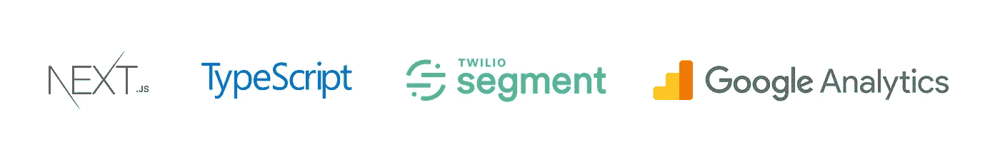
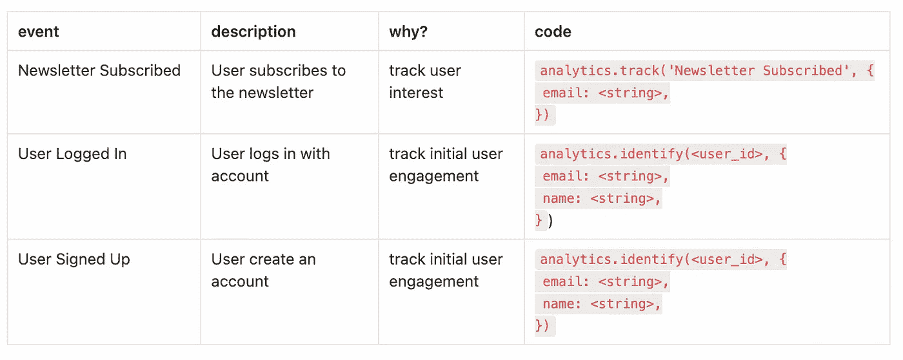
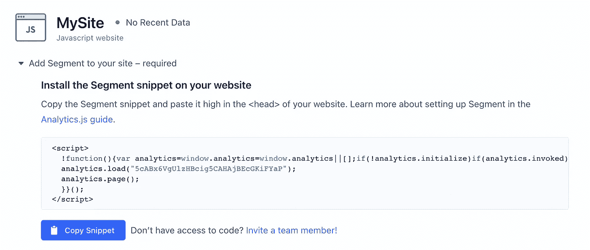
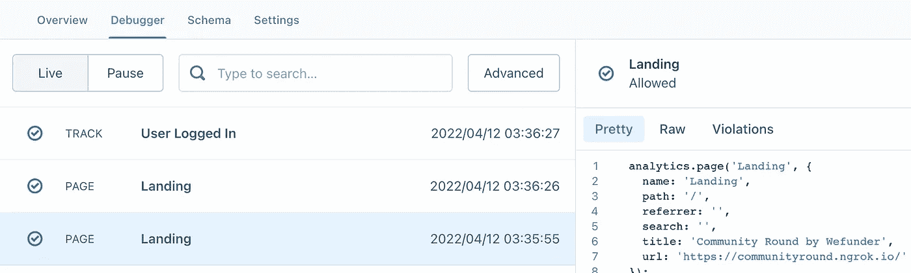

# 将 Segment & Google Analytics 添加到您的 TypeScript Next.js 应用程序

> 原文：<https://javascript.plainenglish.io/add-segment-google-analytics-to-your-typescript-next-js-app-af9fc7cd83a9?source=collection_archive---------1----------------------->

## 第 1 部分:将 Segment 和 Google Analytics 与您的 TypeScript Next.js 应用程序集成的教程。

没有关于使用 Segment 和 Google Analytics 创建 TypeScript Next.js 站点的教程或示例，所以我破解了它并编写了一个分步教程。这种实现可能效率低下或者大错特错— *但它确实有效*。



# 在开始之前

首先，如果你像我一样是数据收集新手，请阅读[分部学院文档](https://segment.com/academy/)。

我们将使用 Segment 的 [Analytics.js 2.0 source](https://segment.com/docs/connections/sources/catalog/libraries/website/javascript/) —一个 javascript 库，为 javascript 网站提供基本的跟踪方法。(移动应用和服务器端跟踪有不同的库)。

您可以查看[跟踪规范](https://segment.com/docs/connections/spec/)了解每种跟踪方法的详细描述。

您将需要一组标准的事件&您想要发送给它们的属性。如果你的营销团队为你制定了一个活动跟踪计划——很好，如果没有的话——没问题，你可以想出来。

> 创建事件跟踪计划:
> 
> 1.你的商业目标是什么？KPI？(例如，用户对 x 感到兴奋)
> 
> 2.什么样的用户流将表明每个目标的成功或失败？(例如，用户访问页面，然后用户加入电子邮件列表)
> 
> 3.什么样的奇异事件构成了这些流动？(例如 page_view:“登录页面”，event_name:“用户订阅”)



Example of a simple Event Tracking Plan

# 设置细分市场

进入您的细分工作区，创建一个新的 Javascript 网站源。



Example of a newly created Javascript Website Source

您可以使用提供的脚本段来呈现 analytics.js 片段，或者安装这个将使您的代码更干净的包。

```
yarn add @segment/snippet
```

将您的段写键存储在您的 env 文件中——确保您的 env 变量名带有 NEXT_PUBLIC 前缀，以便我们可以在我们的客户端页面和组件中访问它。

```
// @ .env or .env.localNEXT_PUBLIC_SEGMENT_WRITE_KEY=<your write key here>
```

在 custom _app.tsx 文件中初始化您的脚本—这将在您的浏览器窗口中创建一个全局分析对象。

**注意:**我将 page 设置为 false，因为我想自己手动调用 page()(您将在本文后面的 useEffect()中看到)。如果需要，将页面保留为默认页面。

# 跟踪页面浏览量和事件

你需要[标准化的事件名称](https://segment.com/academy/collecting-data/naming-conventions-for-clean-data/)来确保你的分析保持干净和准确。如果没有人给你一个事件跟踪计划，你可以创建自己的事件列表。

**跟踪页面浏览量**

您可以向每个页面添加一个 page({})调用，也可以在 your _app.tsx 中添加一次，Typescript 会抓狂，因为浏览器窗口类型不包含 analytics 对象，所以我们会忽略它。

```
// @ _app.tsxuseEffect(() *=>* {
 // @ts-ignore
 window?.analytics?.page(Component.displayName)
}, [])
```

注意:要使用 Component.displayName，您必须向每个导出的页面组件添加一个 displayName。

```
export default *function* SamplePage() {...}SamplePage.displayName = "Sample Page"
```

**声明您的事件名称常量**

创建事件跟踪计划后，我将事件名称转换成一个单独文件中的常量字典。这是为了避免我的组件中的错别字。我还对页面名、对象名以及我希望在数据收集中保持一致的任何其他内容进行了同样的处理。

```
// @ eventNames.tsexport *const* EVENT_NAMES = {
 NEWSLETTER_SUBSCRIBED: "Newsletter Subscribed",
 USER_LOGGED_IN: "User Logged In",
 USER_LOGGED_OUT: "User Logged Out",
 USER_SIGNED_UP: "User Signed Up",
};
```

**追踪事件**

我在一个不同的文件中声明了我的跟踪事件——主要是为了把我的 ts 忽略放在一个地方。

在任何地方添加你的跟踪事件函数，比如点击按钮，表单提交，回调函数等等。

```
// example codeconst handleSubmit = (email: string) => {
 axios.post(<endpoint>, { email: email })
  .then((res: AxiosResponse) => 
    trackNewsletterSubscribed({email: email})
  ).catch((err: AxiosError | any) =>
    setShowError(true)
  )
}
```

**跟踪识别**

我不打算详细介绍，但我会在用户登录或创建帐户后跟踪这个事件。

# 检查它是否工作

转到**调试器**选项卡，查看您站点的实时输出。您可以在调试器页面的右侧看到事件、属性、上下文、IP 地址、设备信息等等。



Example of the Debugger Tab

一个警告是，你可能会注意到“referrer”不会填充 SPAs，因此无论何时你使用 Next Link(而不是  )或 Next Router，referrer 都不会被填充。

# **感谢阅读！**

本文的 Google 分析教程(第 2 部分)将很快上线——请关注我的更新，或者稍后再回来查看。

请随时留下关于如何改进这些步骤或代码的评论。

*更多内容看* [***说白了。报名参加我们的***](https://plainenglish.io/) **[***免费周报***](http://newsletter.plainenglish.io/) *。关注我们*[***Twitter***](https://twitter.com/inPlainEngHQ)*和*[***LinkedIn***](https://www.linkedin.com/company/inplainenglish/)*。加入我们的* [***社区***](https://discord.gg/GtDtUAvyhW) *。***