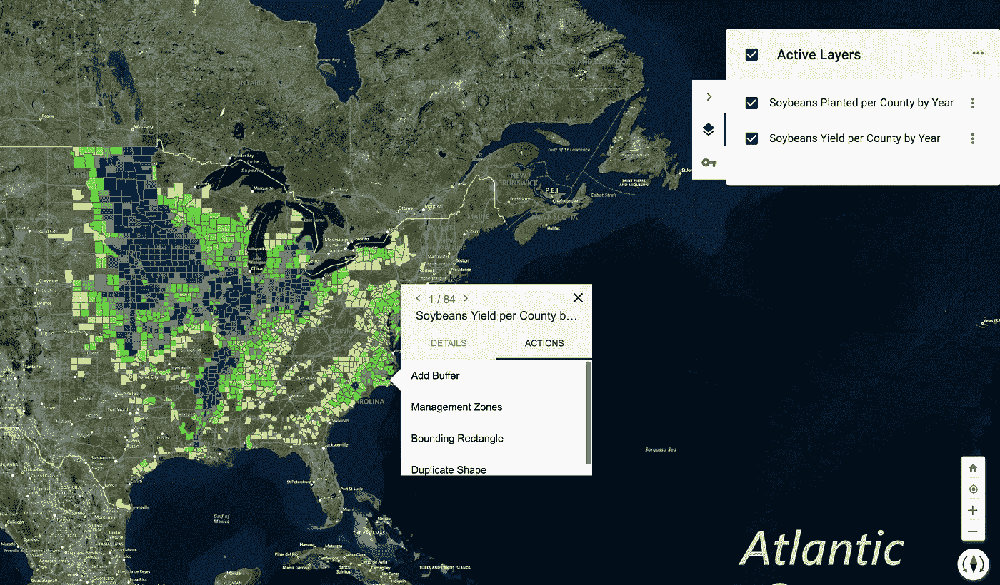
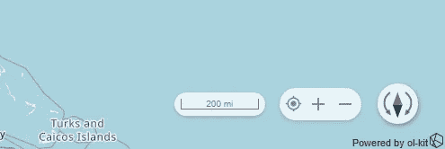
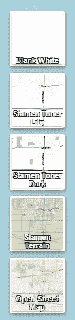
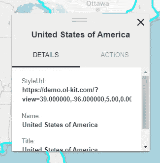

# 免费向 React 应用程序添加地图

> 原文：<https://javascript.plainenglish.io/adding-a-map-to-your-react-app-for-free-eaa1599f492?source=collection_archive---------9----------------------->

## 使用开源 React 和 OpenLayers 制图组件工具包 ol-kit 免费向 React 应用程序添加地图。



[ol-kit](https://ol-kit.com/) 是一个复杂度最低的开源 [React](https://reactjs.org/) 和 [OpenLayers](https://openlayers.org/) 映射组件工具包。它达到了组件库的完美三结合——简单、好、便宜。大多数只能达到这三种品质中的两种，但 ol-kit 通过以下方式实现这一点:

1.  将 OpenLayers 抽象成熟悉的 React 组件和实用函数(简单)
2.  提供通用、灵活且经过测试的包装(良好)，以及
3.  开源(免费=越便宜越好)。

# 添加到现有应用

将`@bayer/ol-kit`及其对等依赖项添加到您的应用程序中。

```
npm i @bayer/ol-kit ol react react-dom styled-components @material-ui/core @material-ui/icons @material-ui/styles --save
```

然后使用`Map`组件呈现一个简单的地图。

```
import React from 'react'
import { Map } from '@bayer/ol-kit'

const myComponent = () => <Map />
export default myComponent
```

就这么简单！

# 引导新应用

基于[create-react-app](https://create-react-app.dev/)bootstrapper，ol-kit 提供了一行 bootstrap 命令(运行需要一两分钟)。

```
npx @bayer/ol-kit create-map
```

你需要在你的机器上安装 [Node.js](https://nodejs.org/en/) 来让它工作。

# 加载地图数据

如果地图上没有数据，看地图就没什么用了。ol-kit 附带一个数据加载器，可以处理大多数不同类型的数据:GeoJSON、KML、shapefiles、矢量切片等。

```
import React from 'react'
import { Map, loadDataLayer } from '@bayer/ol-kit'

const App = () => {
  const onMapInit = async map => {
    // nice to have map set on the window while debugging
    window.map = map
    // find a geojson or kml dataset (url or file) to load on the map
    const data = {
      url: 'https://data.nasa.gov/api/geospatial/7zbq-j77a?method=export&format=KML',
      id: 'world_country_boundaries',
      name: 'World Country Boundaries'
    }
    const dataLayer = await loadDataLayer(map, data.url)

    // set the title and id on the layer to show in LayerPanel
    dataLayer.set('title', data.name)
    dataLayer.set('id', data.name)
  }

  return <Map onMapInit={this.onMapInit} fullScreen />
}
export default App
```

注意`onMapInit`的回调。这是一个异步回调，将阻止地图(和其他子地图)渲染，直到承诺得到解决，以帮助防止其他可能依赖于该数据的组件使应用程序崩溃。

如果你想在地图上显示一些独特的数据，查看这些[免费维护的数据源](https://github.com/geocatz/open-geodata)。

# 添加地图控件



Default basemap controls

有几个 UI 组件可以为您的地图添加工具，其中最基本的是地图控件。通过在`Map`中添加`<Controls />`组件将它们包含在您的地图中。实际的 OpenLayers map 实例通过上下文传递给`Map`的所有子节点，因此不需要手动传递。

```
import React from 'react'
import { Map, Controls } from '@bayer/ol-kit'const App = () => {
  return (
    <Map>
      <Controls />
    </Map>
  )
}
export default App
```

默认的 OpenLayers 缩放控件要难看得多，用处也小得多。

# 更改底图

为此，您有两个选择:1 .预构建的底图切换器，或 2。效用函数。首先，组件选项:



Basemap options included in the BasemapContainer

```
import React from 'react'
import { Map, BasemapContainer } from '@bayer/ol-kit'const App = () => {
  return (
    <Map>
      <BasemapContainer />
    </Map>
  )
}
export default App
```

或者，使用该实用程序:

```
import React from 'react'
import { Map, loadBasemapLayer } from '@bayer/ol-kit'

const App = () => {
  const onMapInit = async map => {
    loadBasemapLayer(map, stamenTonerLite')
  }
  return <Map onMapInit={this.onMapInit} fullScreen />
}
export default App
```

# 启用弹出窗口



弹出窗口是一种简单的方法，可以根据每个功能提供上下文信息。ol-kit 允许您使用默认的`Popup`(如上所示)显示特性的所有信息，以及可定制的操作，或者您可以使用`PopupBase`构建自己的完全定制的弹出窗口。

以下是在地图上包含弹出窗口的方法:

```
import React from 'react'
import { Map, Popup } from '@bayer/ol-kit'

const App = () => {
  return (
    <Map>
      <Popup />
    </Map>
  )
}
export default App
```

# 外卖食品

ol-kit 提供了许多可定制的组件和工具，同时保持了即插即用的易用性。这简要地涉及了它们的一些即插即用组件；请随时订阅以了解更复杂实现的最新信息。

这是演示应用程序的代码，包括`Map`、`Popup`、`BasemapContainer`、`Controls`和一些更酷的东西。

```
import React from 'react'
import {
  Map,
  BasemapContainer,
  ContextMenu,
  Controls,
  LayerPanel,
  Popup,
  loadDataLayer
} from '@bayer/ol-kit'

const App = () => {
  const onMapInit = async map => {
    console.log('we got a map!', map)
    // nice to have map set on the window while debugging
    window.map = map

    // find a geojson or kml dataset (url or file) to load on the map
    const data = 'https://data.nasa.gov/api/geospatial/7zbq-j77a?method=export&format=KML'
    const dataLayer = await loadDataLayer(map, data)
    // set the title on the layer to show in LayerPanel
    dataLayer.set('title', 'NASA Data')
  }

  return (
    <Map onMapInit={this.onMapInit} fullScreen>
      <BasemapContainer />
      <ContextMenu />
      <Controls />
      <LayerPanel />
      <Popup />
    </Map>
  )
}

export default App
```

同样，查看 [ol-kit 文档](https://ol-kit.com/docs.html)了解更多信息——如有任何问题，请随时联系我们。

感谢您的阅读。

*更多内容看* [***说白了。报名参加我们的***](http://plainenglish.io/) **[***免费周报***](http://newsletter.plainenglish.io/) *。在我们的* [***社区不和谐***](https://discord.gg/GtDtUAvyhW) *获得独家获取写作机会和建议。***