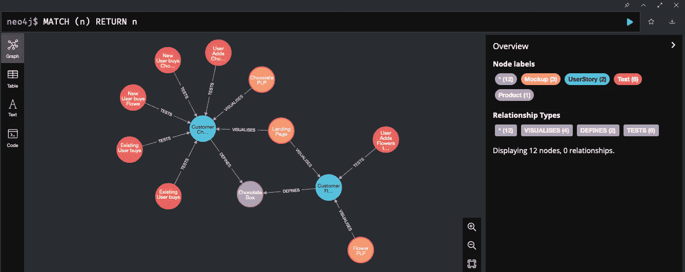
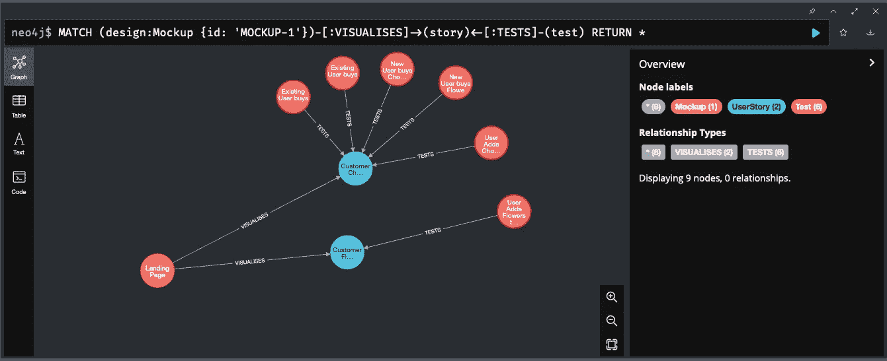

# 如何用@neo4j/graphql 给你的 Neo4J 图添加 API

> 原文：<https://javascript.plainenglish.io/adding-an-api-to-your-neo4j-graph-with-neo4j-graphql-3d4908def8d2?source=collection_archive---------3----------------------->

## 使用@neo4j/graphql 库向 Neo4J 图添加 API 的指南。

为了证明[我的新产品——Clime(一款连接多种工具产品知识的应用)](https://clime-app.com)背后的概念在技术上是可行的，[我使用 Neo4J](https://gitlab.com/colinfwren/neo4j-and-graphql-example) 创建了一个概念验证，因为这个问题非常适合图形数据库。

在创建了一组基本节点并建立了它们之间的关系之后，我能够执行查询，允许一个节点使用两组节点都相关的节点来查找不直接相关的链接节点。

The example data I used

Query showing the Tests linked to UserStorys that a single Mockup is linked to

这验证了我想法的技术方面，所以我继续进行下一步[验证我的想法，即建立一个登录页面来激起对产品的兴趣。](https://colinwren.medium.com/iterating-my-way-to-a-product-landing-page-via-user-testing-with-maze-4f80c0cecec2)

登录页面上线后，我决定重新进行概念验证，因为有些事情困扰着我——图形数据库提供了查询产品知识图的方法，但我还没有计划好如何在它的基础上构建应用程序。

我对 Clime 的愿景是成为一个集中的知识库，通过我自己或用户社区构建的一系列插件和集成，从团队使用的工具中访问产品知识(例如，你可以右键单击 Figma 中的一个设计，并获得它链接到的用户故事列表)。

虽然构建一个库来直接处理对 Neo4J 的查询可能很容易，但我觉得 REST 或 GraphQL API 对其他人来说更容易使用，如果我想构建一个人们可以为之构建自己的程序的产品，这一点很关键。

经过一番研究，我非常兴奋地看到 Neo4J 已经有了一个解决方案，可以围绕图形数据库构建一个 GraphQL 包装器——`@neo4j/graphql`包。

这个包与 Neo4J 驱动程序(一个用于访问 Neo4J 实例的库)结合使用时，允许您为 Neo4J 图中的节点创建 GraphQL 模式，并提供一些方便的 GraphQL 指令，使查询关系易于定义。然后，GraphQL 模式可以与 Apollo 或您选择的 GraphQL 服务器一起使用。

Setting up the Neo4J GraphQL server isn’t that different from setting up a standard Apollo server

# 为 Neo4J 创建 GraphQL 模式

在我们可以构建一个 API 之前，我们需要有一个我们希望通过该 API 公开的数据模型。对于图形数据库上的 API，该模型需要包括节点和边，因为边表示的关系将是返回链接数据的关键。

为了简单起见，我将重复使用我在 Clime 概念验证中使用的模型

*   `Mockup`——(一个设计，`:VISUALISES`一个`UserStory`)
*   `UserStory`——(系统行为的定义，`:DEFINES` a `Product`)
*   `Product` —(产品，顶层对象)
*   `Test` —(为确保系统正常运行而执行的测试，`:TESTS` a `UserStory`)

基于这个模型，下面是一个 Cypher 查询，它将向 Neo4J 添加一个样本数据集:

Test Data used to create the Graph shown above

为了为这个模型创建 GraphQL API，我们需要创建类型定义，这样`Neo4jGraphQL`构造函数就知道如何将 Neo4J 中的节点映射到 GraphQL 对象。首先，我们可以只包含这些对象将公开的字段(我们稍后将讨论链接节点)。

A basic GraphQL schema containing fields for the properties on the nodes. The @id directive means that the ID field is a unique reference for when we need to connect nodes (more on that later)

一旦在 Apollo 中设置了模式，就可以像使用 GraphQL 一样查询这些类型和字段。

Query for the basic schema objects

# 返回链接的节点

当前返回的基本字段足以看到节点的值，但是使用图形数据库的主要原因是能够找到相关的节点，并且`@neo4j/graphql`库提供了一些 GraphQL 指令来简化设置。

`@relationship`指令允许您为直接链接到正在定义的源节点的节点添加字段。它需要两个参数:`type`是链接两个节点的边的类型，而`direction`是关系的方向(对于定义边的另一个节点为`IN`，如果源节点定义边为`OUT`)。

## 从链接节点的边返回数据

使用`@relationshipProperties`指令可以扩展`@relationship`字段，以包含在定义两个节点之间的边时设置的属性。`@relationship`字段定义是一个`properties`参数，它匹配实现`@relationshipProperties`接口的类型。

查询连接字段时，您将无法从字段内访问边数据，而是需要查询包含边数据和节点的`[FIELD NAME]Connection`(例如`userStoriesConnection`)对象

## 从非直接链接的节点返回数据

如果源节点和您想要返回的另一个节点之间没有明确的关系，因为它们共享一个公共的相关节点，那么您可以使用`@cypher`指令来执行一个 Cypher 查询，并将结果作为一个字段返回。

下面是如何在您的模式中使用这些指令:

Basic schema updated with fields for getting directly linked and indirectly linked nodes as well as properties from the edges linking UserStory to Product

以及获取关系的示例查询:

In order to access the edge fields you need to query the connection, not the linked node but you can access the linked node via the connection

# 通过 GraphQL 向 Neo4J 写入数据

`@neo4j/graphql`库创建了一组有用的突变，用于对我们已经介绍过的 GraphQL 模式中定义的类型执行创建-读取-更新-删除(CRUD)操作，但这里是如何创建、更新和删除节点和边。

## 添加节点和边

要创建一个新节点，您可以调用`create[TYPE NAME]`(例如`createTest`)变异，它将接受一个输入对象，该对象是该类型的非 ID 字段。这方面的一个例子是:

The input object is essentially the same as the type but without the ID field as this is set automatically. You can return the ID after the new node is created

## 更新节点和边

要更新一个节点，您可以调用`update[TYPE NAME]`(例如`updateTest`)变异，它将接受一个 where 对象(用于查找要更新的节点)和一个包含该节点上要更新的字段的 update 对象。

In order to update a node you need to define a where the object which will help Neo4J find the node to update, the update object defines the fields to change on the node

您可以使用相同的`update[TYPE NAME]`变异来创建节点之间的新边，方法是定义一个`connect`或`connectOrCreate`对象，用一个`where`对象来查找源节点，用一个`where`对象来查找目标节点(不同之处在于`connectOrCreate`将创建所链接的节点，如果它不存在)。

Similar to the update mutation but instead of ‘update’-ing a node we ‘connect’ a node based on its field that has the relationship directive on it.

## 移除节点和边

如果您想要移除两个节点之间的边，您可以使用相同的`update[TYPE NAME]`变异，但是您可以使用一个`where`对象来定义一个`disconnect`对象，而不是一个`connect`对象，以找到要移除链接的节点。

The disconnect operation is basically the same as the connect operation but with the disconnect name

使用带有`where`对象的`delete[TYPE NAME]`(例如`deleteTest`)变异来找到要删除的节点，从而删除节点。

Deleting a node, similar to updating nodes requires a where object. Because the node will be deleted the only fields that can be returned are the number of nodes deleted and the relationships that were deleted

# 在应用程序中使用 API

有许多 GraphQL 客户端可以在您的应用程序中使用，以便使用 GraphQL 从 Neo4J 图形中提取数据。

页面顶部链接的概念证明 repo 包含一个我为使用 GraphQL API 而创建的基本 Figma 插件，它使用 Apollo client for React，该客户端通过 React 上下文公开 Apollo 客户端，并具有`useQuery`和`useMutation`挂钩来执行较低级组件内的操作。

这些钩子执行与上面列出的相同的查询和变异，所以通过使用 Apollo 沙箱并复制它们，很容易构建这些调用。

# 摘要

`@neo4j/graphql`库在 Neo4J 的基础上创建了一个非常强大的 API，使得那些没有什么图形数据库经验的人(比如我自己)可以很容易地构建应用程序，在处理记录之间的关系时，可以利用图形数据库提供的好处。

我提到的 CRUD 例子和指令实际上只是这个库的表面功能，所以我强烈推荐阅读[Neo4J graph QL 库文档](https://neo4j.com/docs/graphql-manual/current/)，因为它组织得很好，很有见地。

您可以找到我的概念验证代码，其中包含 Neo4J 测试数据、GraphQL 服务器和我在 Gitlab 上创建的示例 Figma 插件，以证明我的想法:

 [## Colin Wren / Neo4J 和 GraphQL 示例

### 15.0 主要版本即将发布！该版本为 GitLab 带来了许多令人兴奋的改进，但也删除了一些…

gitlab.com](https://gitlab.com/colinfwren/neo4j-and-graphql-example) 

*更多内容看* [***说白了就是 io***](https://plainenglish.io/) *。报名参加我们的* [***免费周报***](http://newsletter.plainenglish.io/) *。关注我们关于*[***Twitter***](https://twitter.com/inPlainEngHQ)*和*[***LinkedIn***](https://www.linkedin.com/company/inplainenglish/)*。加入我们的* [***社区不和谐***](https://discord.gg/GtDtUAvyhW) *。*