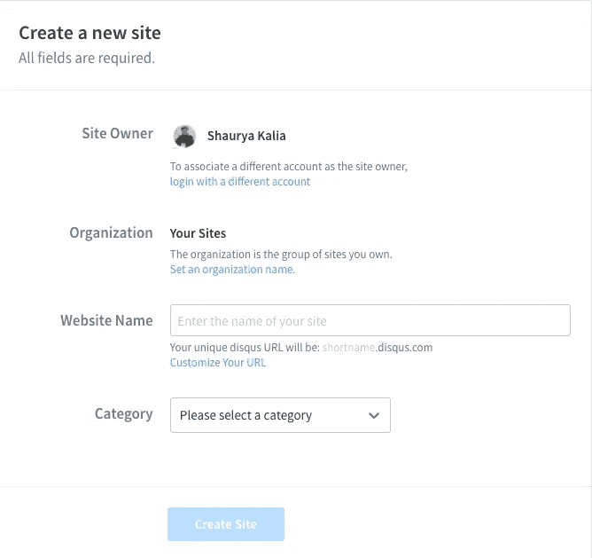
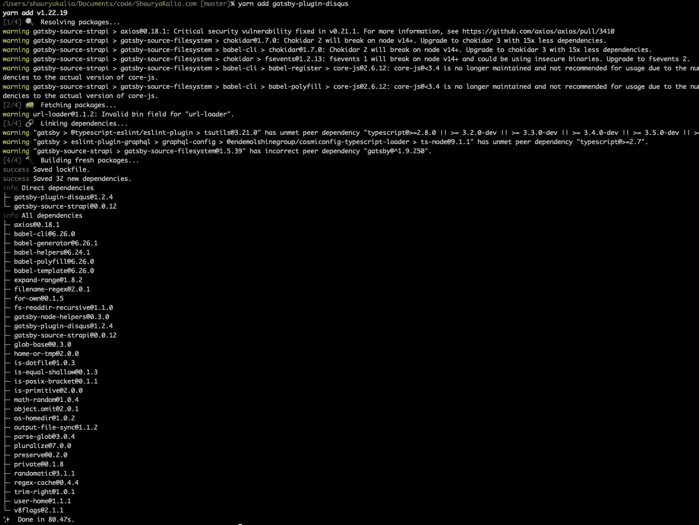
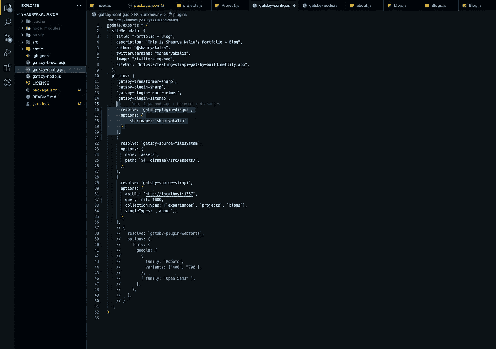
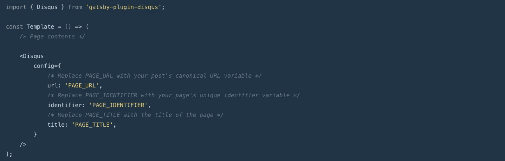
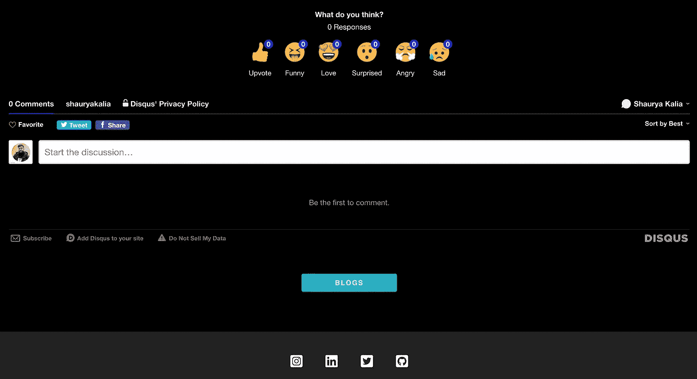

# 如何添加 Disqus 到盖茨比博客

> 原文：<https://javascript.plainenglish.io/adding-disquss-to-gatsby-blog-aed26acad519?source=collection_archive---------13----------------------->

## 如何在你的盖茨比博客上添加 Disqus 的简短指南。


Photo by [Anete Lūsiņa](https://unsplash.com/@anete_lusina?utm_source=medium&utm_medium=referral) on [Unsplash](https://unsplash.com?utm_source=medium&utm_medium=referral)

自从恢复我的博客以来，我一直计划给它添加一个论坛。发现 [**Disqus**](https://disqus.com/) 是目前正确的选择，虽然我会选择开源替代方案，但在评估了其他选择后，我最终添加了 Disqus，只是为了暂时试用免费试用版。如果这不适合我，我甚至可能很快自己构建一个开源的替代方案。

首先也是最重要的，你需要一个 **Disqus** 账户，并注册一个网站，这样你就可以通过这个简称访问它。简称是分配给 Disqus 站点的唯一标识符。所有张贴到网站上的评论都用简称引用。这个短名称告诉 Disqus 只加载你网站的评论，以及在你的 Disqus 管理面板中指定的设置。

1.  在这里注册你的网站
2.  输入要用作参考的站点名
3.  查看下图



下一步是打开你的 Gatsby 应用程序的代码库并安装 **gatsby-plugin-disqus**

```
yarn add gatsby-plugin-disqus
```



一旦成功完成，更新您的 **gatsby-config.js** 以包含以下内容

```
module.exports = { 
    plugins: [
        { 
            resolve: `gatsby-plugin-disqus`, 
            options: { 
                shortname: `your-disqus-site-shortname` 
            } 
        }, 
    ] 
}
```



最后，使用下面的代码示例修改您的博客组件，并根据您的喜好设置 **Disquss** 。



就这样了，伙计们。在你的盖茨比博客上建立并运行一个简单流畅的讨论平台大约需要 10 分钟。如果您面临任何问题或有任何疑问，请联系我。



*原载于*[*https://www.shauryakalia.com*](https://www.shauryakalia.com/blogs/adding-disquss-to-gatsby-blog)*。*

*更内容于* [***普通英语***](https://plainenglish.io/) *。报名参加我们的* [***免费周报***](http://newsletter.plainenglish.io/) *。在*[***Twitter***](https://twitter.com/inPlainEngHQ)[***LinkedIn***](https://www.linkedin.com/company/inplainenglish/)*[***YouTube***](https://www.youtube.com/channel/UCtipWUghju290NWcn8jhyAw)*以及*[**T42 不和**](https://discord.gg/GtDtUAvyhW) *上跟随我们。**