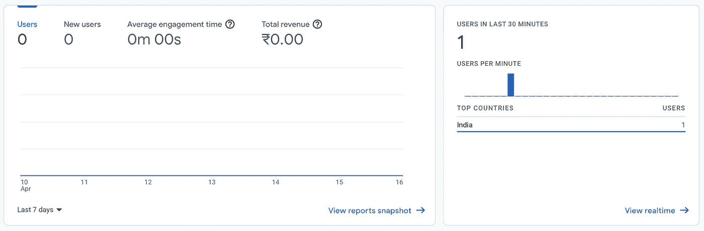
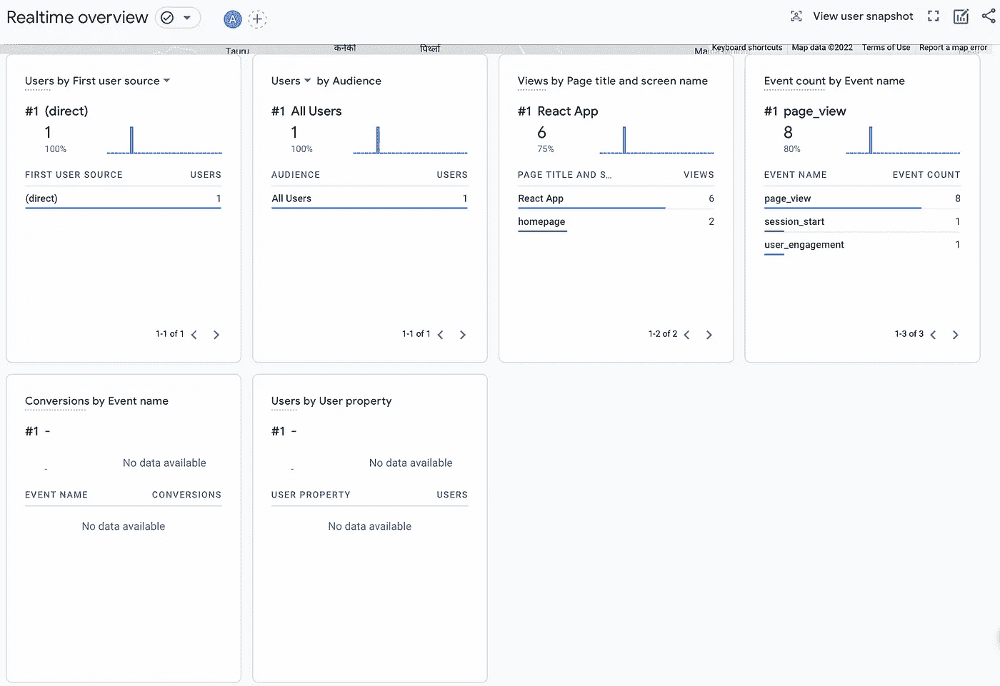

# 添加 Firebase 分析来应对应用程序—简单的方法

> 原文：<https://javascript.plainenglish.io/adding-firebase-analytics-to-react-application-the-simple-way-fdfa6767bd24?source=collection_archive---------2----------------------->

## 使用 Firebase Analytics 测量 React 应用程序的性能等等。

数据无处不在。能够实时看到你的网站或应用程序的运行情况是一件幸事。否则，人们如何知道改进、添加或删除什么，以使他们的产品和服务更好？

我一直想在我的几个项目中加入(Firebase)谷歌分析，看看哪些可行，哪些不可行。但这是一个令人沮丧的过程，直到现在。这是真的；当你在大量令人难以置信的研究、尝试和错误之后，自己想出一些东西时，那感觉真的很棒！

# 入门指南🏃‍♂️

为了将 Firebase Analytics 添加到 React 应用程序中，我们将使用`ga-4-react`包。该软件包可用于将 Google Analytics 跟踪代码包含在使用 React 作为其前端代码库的网站或应用程序中。

## 先决条件✏️

1.  这是不言而喻的，但是当然，我们需要一个 react 应用程序来开始。如果你已经有了自己的项目，你可以使用它，或者简单地用`npx create-react-app <app-name>`引导一个新的 react 应用。
2.  一个 Firebase 帐户和一个添加 react 应用程序的应用程序。你可以在这里开始使用 Firebase。如果你不知道如何创建一个新的 Firebase 应用程序，你可以参考这里的[官方文档](https://firebase.google.com/docs/guides)。

# 安装依赖项💻

1.  我们需要的唯一依赖项是`ga-4-react`模块。运行`npm i — save ga-4-react`将其安装到您的项目中。
2.  如果你打算使用 Firebase 提供的其他服务，你应该使用`npm I --save firebase`为 JS 安装 Firebase。当您创建 web 应用程序并将其添加到 Firebase app 时，系统会提示您添加此项。

# 使用 GA4React 模块🚀

*   将分析添加到 Firebase 应用程序后，您需要将 React 应用程序连接到 Firebase 的只是**测量 ID** 。您将在 Firebase 网站上看到这一内容——轻松找到您的测量 ID。

> 要开始收集数据，请确保您的网站使用**测量 ID: G-0SPQ2Z9EE2** 进行标记

*   一旦你有了这些，我们需要做的就是，每当用户访问某个页面时，如何触发分析向 Firebase 发送数据。为此，可以在`<App>`组件中添加一个函数，该函数将在应用程序的每个渲染上运行。
*   跟踪的最基本的东西是用户访问的页面。让我们开始吧！

Snippet for the **trackPageForAnalytics** function and **<App>** component

*   在上面的要点中，`App`组件调用并使用一个名为`trackPageForAnalytics()`的函数。这个函数的唯一目的是跟踪路径并将其发送到 Firebase。
*   为了跟踪用户的位置，利用`useLocation()`钩子将是一个好主意。这就是我们所做的！
*   一旦我们导入了`GA4React`，用我们的 Firebase app measurement ID 初始化了一个新的实例，我们就可以调用它的`initialise()`方法，返回一个承诺；于是有了`.then()`。
*   在获取响应对象时，我们调用它的`pageview()`方法，并为页面传递三个参数——`path`、`location`和`title`。标题将是您稍后在分析仪表板上看到的内容。

# 斗牛中的最后一剑🤞

希望我们所做的一切都是正确的，刷新几次 React 应用程序并重新加载 Firebase Analytics 仪表板。仪表板上的数据更新可能需要一些时间，但您会在那里看到应用程序的页面访问数据。您也可以点击**查看实时数据**来查看实时数据。

Firebase Analytics dashboard view

Firebase Analytics Realtime Data View

# 结论

在 React 应用上追踪用户的移动可能是理解用户行为的良好开端。当然，使用 Firebase Analytics 可以实现更多功能，比如人口统计、事件等等。官方文件总是一个很好的开始和理解它如何工作的地方。

感谢您花时间阅读这篇文章。我希望你觉得有趣和有帮助。请务必查看我的其他文章，其中我谈到了 React、Node.js 以及相关的内容。

结束！

*更多内容看* [***说白了。报名参加我们的***](https://plainenglish.io/) **[***免费周报***](http://newsletter.plainenglish.io/) *。关注我们*[***Twitter***](https://twitter.com/inPlainEngHQ)*和*[***LinkedIn***](https://www.linkedin.com/company/inplainenglish/)*。加入我们的* [***社区***](https://discord.gg/GtDtUAvyhW) *。***