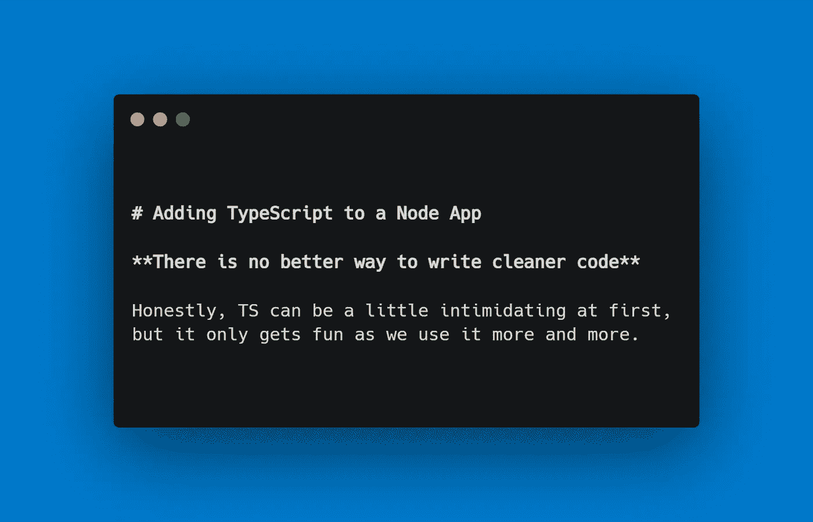
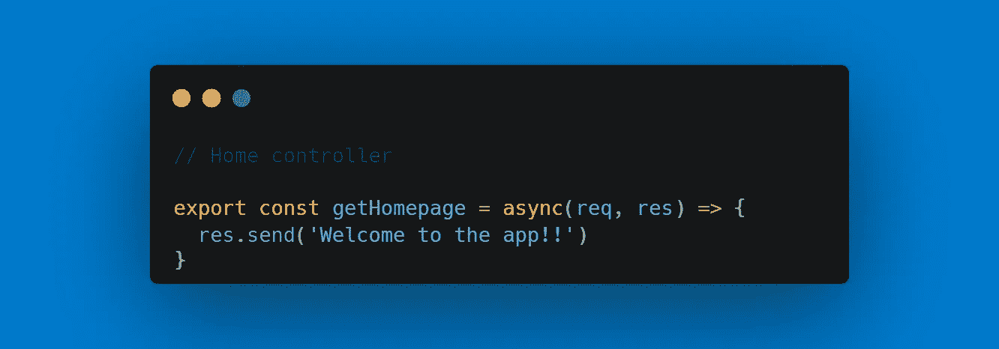
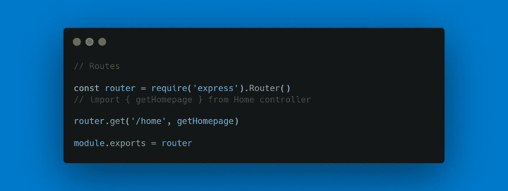
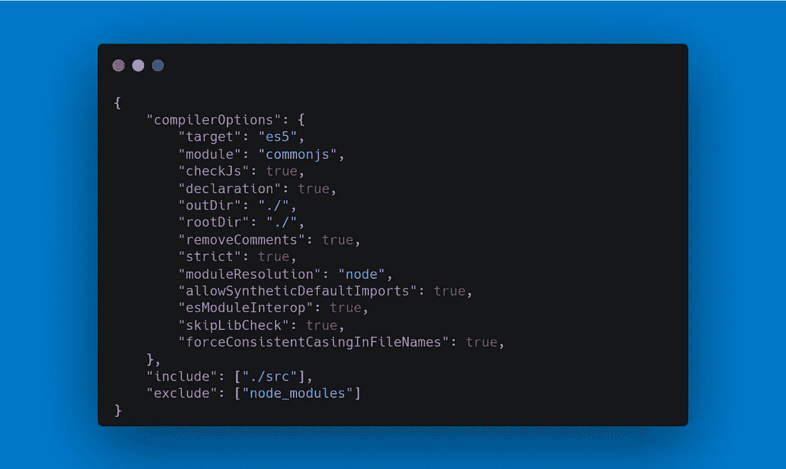
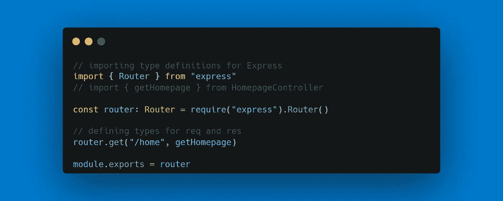
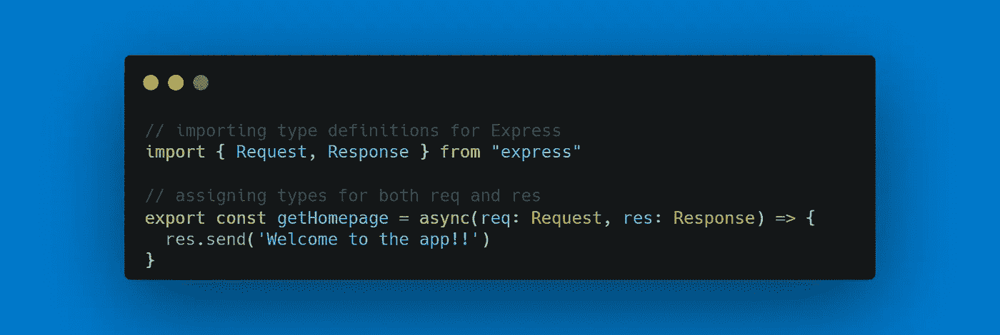

# 如何向 Node.js 应用程序添加 TypeScript

> 原文：<https://javascript.plainenglish.io/adding-typescript-to-a-node-app-2e8294f9476c?source=collection_archive---------12----------------------->

## 如何将 TypeScript 添加到现有 Node.js 应用程序的简要演练；简单的方法。

> 从零开始创造东西无疑是一个挑战，但更具挑战性的是在已经做出的东西上进行改进，而且效果很好。

# 何必呢？

就像往常一样，在我们开始之前，问一个最重要的问题是很重要的，那就是， ***我为什么要这么做？为什么要将 TypeScript 添加到 Node.js 应用程序中，这个应用程序运行良好，并且正在完成我的工作？嗯，总有改进的余地，不是吗？***

一如既往，本文的代码可以在我的 GitHub 上找到

 [## GitHub-the-dev designer/node-ts-API:我在 Medium 上的文章的支持库。环👇

### 此时您不能执行该操作。您已使用另一个标签页或窗口登录。您已在另一个选项卡中注销，或者…

github.com](https://github.com/the-devdesigner/node-ts-api.git) 

假设您的 web 应用程序或任何其他应用程序有一组 API 端点，在过去的 1 个月中，它们已经启动并运行，可能是 Heroku 或 AWS，没有出现任何问题。这难道不是软件开发的咒语之一吗:

> ***如果能用，就不要碰。***

但是我们肯定不会不碰它😉。

# 入门指南

请随意使用您自己的项目，您可能想将 TypeScript 添加到其中，或者简单地克隆附加的 repo 做最适合你的事。该项目是一个简单的节点/快速应用程序，有几个简单的 API 端点。尽管端点并不真正做很多事情，但它仍然是开始理解如何使用 TypeScript 并将其添加到现有项目中的好地方。

# 路线和控制器(没有类型脚本)

我们这里的路由和控制器是一条简单的`/home`路由，当用户访问这条路由时，它会简单地向用户显示一条消息`Welcome to the api`。

Controller for homepage route

Route for homepage — /home

任何使用 Node/Express 应用程序的人肯定会习惯并熟悉制作这些路线和控制器。虽然这很简单，但我们不会研究进入控制器的逻辑，而只是将 TS 添加到我们的节点应用程序中。我稍后会在本文附带的 repo 中添加更多的路由和控制器；控制器稍微复杂一点的——比如《T2》的动作。

# 引进打字稿

## 安装和初始化 TypeScript

TypeScript 以及所有相关的 express、node 或其他类型的定义都将作为`devDependencies`放入。

1.  运行`npm i -D typescript @types/node @types/express`将这些添加到项目中。
2.  运行`tsc — init`来生成`tsconfig.json`，它将负责我们的`.ts`文件如何被转换为 JavaScript，以及是否要生成`.d.ts`地图；还有更多。
3.  在`tsconfig.json`中打开或关闭配置。作为参考，我的配置如下:

tsconfig.json for this project

## 重构路线和控制器

有了 TS，立即增加的一件事就是定义类型。这意味着如果我们需要告诉 TS*这个*是字符串类型。或者是一个遵循特定蓝图的物体。简而言之，这确保了当变量投入使用时，它获取或发送正确类型的数据。

Refactoring route with TS; adding type for router

Refactoring controller with TS; adding types Request and Response for req and res, respectively.

我们来分析一下这是怎么回事。

1.  在比较旧的控制器和添加了 TypeScript 的控制器时，从一开始，我们就看到类似于`req: Request`的东西。这里，我们显式地将 req 定义为由@types/express 提供的 Request 类型。
2.  假设我们有一个名为`validateInput(userInput)`的函数，它接受单个参数。在 TS 中，我们将该函数写成`validateInput(userInput: String)`只是为了确保在任何情况下参数都不应该是 String 以外的任何其他数据类型。

## 最后一档

有了所有这些变化，我们现在可以运行`tsc`并让 TypeScript 发挥它的魔力。本质上，将要发生的是，基于我们的`tsconfig.json`，TS 代码将被转换为普通的 JavaScript，同时生成一些类型定义文件。这些类型定义将非常有用，并在我们使用代码时提供智能感知。

一如既往，祈祷好运。如果我们做的一切都是正确的，我们会看到我们拥有的每个`.ts`文件都有一个`.js`和一个`.d.ts`文件。

而且，仅此而已！

我们完了！

我们刚刚在 Node/Express 应用程序中添加了 TypeScript，以使它比以前更好，并防止我们亲爱的旧 JS 编译器出现错误。我们现在得到的最大优势是编译时检查，而不是 JavaScript 提供的运行时检查。

我希望这篇文章对你有帮助，并且容易理解。请务必查看我的其他文章。

结束！

*更多内容请看*[***plain English . io***](http://plainenglish.io/)*。报名参加我们的* [***免费周报***](http://newsletter.plainenglish.io/) *。在我们的* [***社区***](https://discord.gg/GtDtUAvyhW) *获得独家获得写作机会和建议。*