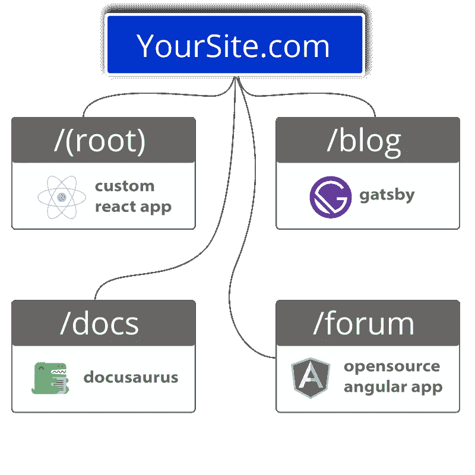

# 解决微型前端的批评:有效载荷大小

> 原文：<https://javascript.plainenglish.io/addressing-micro-frontends-criticisms-payload-size-f19dcd5771ea?source=collection_archive---------13----------------------->

## 微前端中有效载荷大小问题的解决方案。

很多年前，我们采用了微前端。甚至在这个术语被创造出来之前。

现在，证据就在布丁里。

2022 年，许多大公司都在使用微前端——宜家、Spotify、hello fresh——这让其他人更加好奇这种架构是否也适合他们的公司。Fathym 的微前端平台是未来的趋势。

首先，让我们快速定义一下微前端。然后，我们将检查它们何时合适。最后，我们将解决对微前端的批评之一，有效载荷大小和加载时间。

就其核心而言，微前端仅仅意味着获取一个单一的前端——刚性的、不可移动的、不可分割的——并将它分解成更小的部分。这些较小的部分然后由小团队处理，小团队朝着共同的目标自主工作。

使用微前端的好处有很多。人们可以将较大的代码库分解成较小的部分，这意味着更快的构建和修复。可以在站点的一部分执行更新，而不需要整个站点停机。此外，在一个项目中可以使用多个不同的 JavaScript 框架。

在这个例子中，主页是在 React 中构建的，React 是目前最流行的框架之一。论坛创建于 Angular。同时，博客是在 Gatsby 中创建的，静态站点生成器 Docusaurus 运行技术文档。

除了能够使用这些不同的框架之外，想象每一条路由都是由不同的团队构建和维护的。这又使得网站的某个方面的更新变得更容易、更快，因为每个团队不一定要等另一个团队完成后才能更新。

微前端也意味着更小的代码库，这意味着快速修复错误和更快的构建。

老实说，使用微前端并没有什么不好。对于一个小团队或一个人的表演来说，这似乎是不必要的，但关注未来也是有意义的。因为如果一个团队的规模扩大了，其他人可以加入进来，并被赋予特定的任务或目标。

在一个网站上工作的团队越大，将工作量分成更小的、可以由更小的团队管理的小块就越有意义。

对微前端的一个主要批评如下:如果一个人使用一个框架的多个实例，那么每次打开一个站点时，每个实例都必须被加载。

正如马丁·福勒解释的那样:

*“例如，如果每个微前端都包含自己的 React 副本，那么我们就强迫我们的客户下载 React n 次。页面性能和用户参与度/转化率之间有着直接的关系，而且世界上许多地方的互联网基础设施运行速度比高度发达的城市慢得多，因此我们有很多理由担心下载量。”*

虽然这是真的，但我们通过创建轻量级微前端来解决大下载量的问题，只包含必要的内容。

我们想说明的是，作为开发者，你有自由创建你的网站，只要你觉得合适。你*可以*使用 React 来构建每一个页面。然而，我们对此提出警告，不仅是因为有效载荷的大小，还因为它在那方面仍然与*单片前端*密切相关。

相反，我们邀请您使用 React(或 Angular 等。)作为网站的一部分，并使用静态的站点生成器，或者甚至是像 Vue.js 或 Svelte 这样的轻量级框架用于其他页面。

React 是众所周知的流行 JavaScript 库，但它的包大小更大，这意味着用户端的网站更慢。Vue 和 Svelte 要小得多，但仍然包含大量定制内容来创建令人瞠目的网站。

当我们能够为网站的某些方面使用静态站点生成器时，我们的前端是轻量级的。在 Fathym，我们专注于包容性，降低构建网站所需的编码体验的门槛，其中一部分是使用低代码和无代码的网站构建器。

Docusaurus 就是一个例子，我们用它来写博客和技术文档。[另一个是 Gatsby](http://fathym.com/blog/articles/2022/march/2022-03-24-headless-wordpress-made-easy-with-gatsby) (我们上面的博客例子)然后是 Plasmic，这是一个极好的表演性和易于使用的站点生成器。事实上，我们非常喜欢它，目前我们在主页上使用它。

站点生成器不仅加载量少，而且还可以预生成/预加载，以提高速度和避免下载。

所以，在 Fathym 上开发时，选择权在你。你可以用任何你喜欢的或者训练有素的框架来建立一个网站，或者你可以使用静态网站构建器在几分钟内快速建立一个网站，如下图所示:

 [## Flashup 使用案例| Redwood Crystals，小型企业| Fathym

### 2022 年 2 月 23 日作者:Rich Kurtzman，品牌传播@ Fathym

www.fathym.com](https://www.fathym.com/blog/articles/2022/february/2022-02-23-flashup-use-case-redwood-crystals) 

Fathym 的微前端平台[允许使用 Angular、React、Vue.js、Svelte](http://fathym.com/blog/articles/2022/february/2022-02-28-angular-vs-react-vs-vue-you-choose) 等流行框架。考虑到这些框架对不同能力的重视，这是一个惊人的灵活性。

Fathym 目前正处于免费增值阶段，我们鼓励您今天就加入！在 Fathym 上托管一个微前端站点是简单、快速和免费的。

[我们邀请你现在就注册 fat hym](https://auth.fathym.com/fathymcloudprd.onmicrosoft.com/oauth2/v2.0/authorize?p=b2c_1_sign_up_sign_in&client_id=98f014f1-2547-4bcc-a583-3edc8f1190f2&redirect_uri=https%3A%2F%2Fwww.lowcodeunit.com%2F.oauth%2FB2C_1_SIGN_UP_SIGN_IN&response_type=id_token&scope=openid%20profile&response_mode=form_post&nonce=637789907534834707.OWNhMWZkZGMtODQ2NC00YTg0LWFjZWQtYjlkNzg0YTIzMDhkYTcxMzVkZmYtN2E2Mi00ZDRlLWIxODQtZjMxMjBkNWI2OTEx&state=CfDJ8C5COa2dn0dMrEVjdLxcXm-FCakeBxrXIOHa_lF_u0ckh9rvLFuKJ30MWBprExUQA_N5HmWWWPdxqWlni-KFqpg_jVjPahrQdGw79U0sMBN8dTvgrlAMeT9--L-7VgMBsZfFPAho9dcKUN1jO6lAaxL13PM1_vGer-vJc6tcpigRpNr5jcHtitGIKjexLmQqkIslp3MFKCKAi-5IiVd3JbpibPm4gbmDQpYtgstmG9SSlpjvEqJk_2AIqtMHkiojK3kE4WSc5mcYS3FQ3hiRqVQRPlL3jI7U3bUsqGYtLuoJr_St6mGBbHvGmB6M0MCeFn_G5LDsRzyHZhBWf9a1qo6dktz_kEcsAahYPLWjAI_2&x-client-SKU=ID_NETSTANDARD2_0&x-client-ver=6.11.1.0)，不仅是为了实现你的目标，也是为了在你注册的时候享受一点乐趣。

【https://www.fathym.com】最初发表于**。**

**更多内容看* [***说白了。报名参加我们的***](https://plainenglish.io/) **[***免费周报***](http://newsletter.plainenglish.io/) *。关注我们*[***Twitter***](https://twitter.com/inPlainEngHQ)*和*[***LinkedIn***](https://www.linkedin.com/company/inplainenglish/)*。加入我们的* [***社区***](https://discord.gg/GtDtUAvyhW) *。****