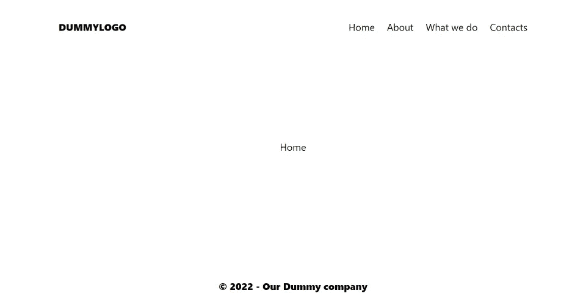

# Next.js 中带有路由器事件和 GSAP 的高级页面过渡

> 原文：<https://javascript.plainenglish.io/advanced-page-transitions-in-next-js-with-router-events-and-gsap-e8435d2410bb?source=collection_archive---------0----------------------->


页面转换很酷，此外，页面转换在 Next.js 网站中也很有用。正如我们所知，静态生成的网站(比如用 Next.js 制作的网站)非常快，这意味着从一个页面转到另一个页面几乎是即时的；但是如果你在你的站点中混合了 SSG、SSR、ISR，一些页面会比其他的更快，有时检索数据或者重新生成一个页面会花费更多的时间，给用户一种有什么地方不能正常工作的印象(你让你的用户习惯了快速的页面切换！).

## 如何在 Next.js 中实现转换

Next.js 允许您监听其 Router 对象中的各种事件，这些事件发生在页面到页面路由操作的生命周期中。例如，`routeChangeStart()`在路由开始改变时被触发(例如当您单击一个链接时),而`routeChangeCompleted()`在路由完成时被触发(例如新页面被完全加载)。获取这些事件并使用它们来显示/隐藏组件(例如加载的)是 Next.js 转换的方法。

## 我们将如何在应用中实现过渡

我们利用 Next.js 的基本布局功能将我们的转换逻辑保存在一个共享的 *Header* 组件中，当路由器从一个页面移动到另一个页面时，我们将使用 GSAP 来制作动画。我们将只为“缓慢”的页面到页面路由激活动画(在我们的例子中，我们将模拟一个缓慢加载的页面)

## 我们将建造什么

我们将创建一个有四个虚拟页面(主页，我们做什么，关于，联系)的网站，所有这些页面将共享一个页眉(与菜单链接)和页脚。从一个页面传递到另一个页面将触发一个动画(如果页面加载时间超过 300 毫秒),该动画将隐藏当前页面，并显示目标页面。


## 先决条件

要学习本教程，您需要:

*   Next.js 的基本知识，它的文件结构，它的路由，它使用布局的方式
*   React、NPM、模块安装等基础知识
*   可选地，你需要对 GSAP 有一个基本的了解(但是你可以使用任何种类的动画包或者只使用 CSS 动画)和 Tailwind CSS(我们首选的 CSS 框架)

您也可以下载这个项目的源代码:

[](https://github.com/popeating/transition) [## GitHub-pop eating/过渡

### 这是一个用 create-next-app 引导的 Next.js 项目。首先，运行开发服务器:打开…

github.com](https://github.com/popeating/transition) 

## 设置项目

创建新的 Next.js 项目:

```
**npx create-next-app transition**
```

进入`**transition**` 文件夹，安装需要的动画模块(我们这里是 GSAP):

```
**npm i gsap**
```

按照官方指南安装和配置顺风 CSS [:](https://tailwindcss.com/docs/guides/nextjs)

[](https://tailwindcss.com/docs/guides/nextjs) [## 用 Next.js - Tailwind CSS 安装 Tailwind CSS

### 顺风 CSS 框架的文档。

tailwindcss.com](https://tailwindcss.com/docs/guides/nextjs) 

让我们构建我们的四个页面，在`pages`文件夹中创建 4 个文件(index.js、about.js、contacts.js 和 whatwedo.js)，并按照该模式对每个文件进行编码(根据页面更改函数的名称和文件的内容，在下面的示例中，我有 index.js 的代码):

唯一不同的页面是:

它将模拟一个需要 2 秒钟才能完成的服务器请求。

## 构建布局

我们现在正在构建页面的布局，每个页面都将有一个页眉，一个页脚，以及在这两者之间的页面内容。

首先，创建一个名为`**components**` 的文件夹，在这个文件夹里面添加一个名为`**header.js**`的文件:

这真的是一个基本的页眉，左边有一个 logo，右边有一个到我们页面的链接菜单，页眉绝对定位居中；链接是用`**next/link**` **Link** 实现的，这样我们就可以使用 Next.js 内置路由器了。

然后我们创建一个页脚:

这是更基本的，但仍然是绝对的。

我们创建包含页眉和页脚的主布局:

我们通过这样修改 Next.js 应用程序的`_app.js`来实现布局系统:

此时，如果您使用

```
**npm run dev**
```

你把浏览器指向:`**http://localhost:3000**`你应该有一个工作菜单的基本网站:



页面之间的导航是即时的(这非常好！)但是当您导航到“我们做什么”时，需要 2 秒钟(我们在服务器请求模拟中设置的时间)。因为一切都很快，一个缓慢加载的页面可能会破坏我们的用户体验。这就是为什么我们现在添加一个过渡，如果页面加载超过 300 毫秒，单击菜单链接就会触发这个过渡。在这种情况下，过渡将由 4 个彩色条组成，它们将覆盖屏幕(来自顶部)，然后再次显示屏幕(移回底部)。点击 300 毫秒后，覆盖动画将开始播放，如果目标页面未加载，一旦目标页面完全加载(如果页面被覆盖)，打开动画将开始播放。我们将在 Header 组件中保留动画逻辑和所有动画元素(动画 Div ),以便它们在页面之间共享，并且不需要重新加载。

## 构建动画

首先，我们将创建覆盖屏幕的“外观”(第一个动画完成后页面的外观，第二个动画准备开始)。正如我们之前提到的，有 4 个不同颜色的条(每个 25%宽)，覆盖整个屏幕，绝对位于所有内容的顶部:


此时，我们的 header.js 将如下所示:

因为我们希望条从顶部向下，所以我们在我们的`**global.css**`文件中添加了一个 CSS 规则

```
**.cover {
   transform: translateY(-100%);
}**
```

以便条在屏幕外向上移动。

现在我们要监听路由器事件，我们感兴趣的事件是在我们离开页面之前触发的`**routeChangeStart**` (这样我们就可以开始我们的“覆盖”动画)和一旦目的页面完全加载时触发的`**routeChangeCompleted**` (这样我们就可以播放动画以显示页面)。我们还检查错误(例如双击链接)。

我们将使用 useEffect 钩子在 Header 组件上实例化这些事件侦听器。目前(而不是动画)，我们控制台记录事件。让我们通过添加以下逻辑来修改 header.js 文件:

如您所见，我们有两个函数(`aniStart()`和`aniEnd()`)用作事件监听器的回调函数，每次路由器改变时，事件监听器都使用 useEffect 钩子连接(并清理)到我们的应用程序。

如果您现在测试应用程序并在页面之间移动，如果您打开控制台，您将看到`aniStart()`和`aniEnd()`功能的记录。

在这一点上，只是一个在适当的时间动画酒吧的问题。当用户点击一个链接(`aniStart()`)时，我们将使用 GSAP 一个接一个地将条形 Y 移动到 0%，然后一旦加载了目标页面(`aniEnd()`)，我们就将它们发送回 Y -100%。我们还将启用延迟 300 毫秒的动画(将其包装在一个`setTimeout()`)，如果动画开始，我们将设置一个状态，通知我们的应用程序在加载完成后播放动画。最后，我们重置计时器和我们的状态。

在 GSAP 构建动画会将 header.js 修改为:

除了动画的技术方面(这主要与 GSAP 的工作方式有关)主要的概念是从点击开始有一个 300 毫秒的延迟(或多或少，取决于你的情况)如果动画被触发，我们设置一个状态`**isActive**` 为真，一旦目标页面被加载，如果`**isActive**`被设置为真，我们动画显示页面，否则，我们除了重置计时器什么也不做。

如果您现在运行您的项目，您可以看到导航到“我们做什么”将触发一个动画，覆盖屏幕，然后显示新页面。尽管如此，其他页面导航不需要动画，因为加载是即时的:


## 下一步是什么

使用这种技术，您可以使用 GSAP 或您喜欢的动画方法/包来实现任何类型的过渡(甚至可以使用路由器事件在单个页面上实现任何类型的动画)。

您还可以在所有页面之间实现动画(但是我更喜欢延迟的方法，让快速加载的页面没有过渡)。

由于我们使用路由器，我们的应用程序总是知道我们要离开的页面和我们要去的页面，您可以使用这些信息来实现基于路由的不同动画。

你可以通过[请我喝咖啡](buymeacoffee.com/popland)来支持我的工作

## 进一步阅读

[](https://blog.bitsrc.io/next-js-13-what-do-the-new-bleeding-edge-features-actually-do-d3e5fd418563) [## Next.js 13:新的前沿特性实际上是做什么的？

### 你听说过 Next.js 13 是一个游戏改变者，但是为什么？让我们看看有哪些新功能，有哪些变化，以及它们…

blog.bitsrc.io](https://blog.bitsrc.io/next-js-13-what-do-the-new-bleeding-edge-features-actually-do-d3e5fd418563) 

*更多内容请看*[***plain English . io***](https://plainenglish.io/)*。报名参加我们的* [***免费周报***](http://newsletter.plainenglish.io/) *。关注我们关于*[***Twitter***](https://twitter.com/inPlainEngHQ)[***LinkedIn***](https://www.linkedin.com/company/inplainenglish/)*[***YouTube***](https://www.youtube.com/channel/UCtipWUghju290NWcn8jhyAw)*[***不和***](https://discord.gg/GtDtUAvyhW) *。对增长黑客感兴趣？检查* [***电路***](https://circuit.ooo/) *。***