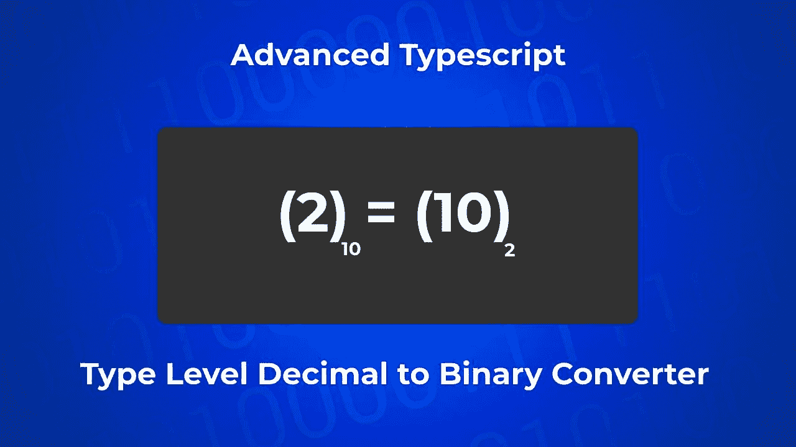
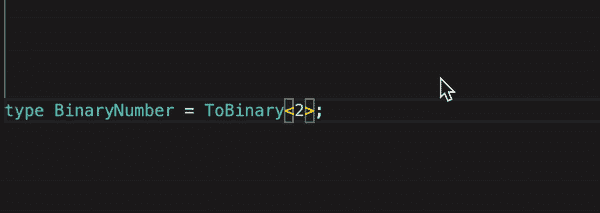
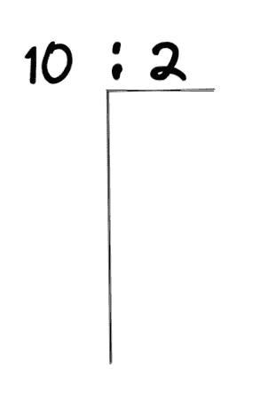
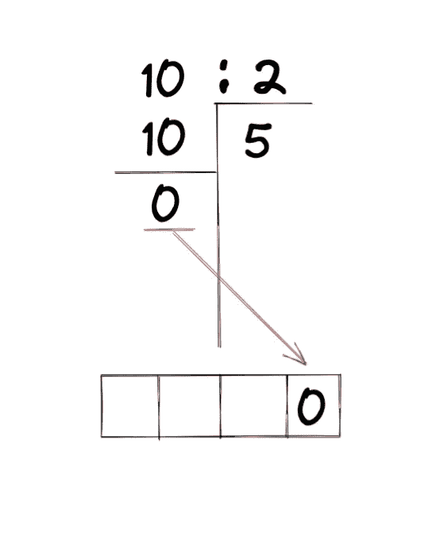
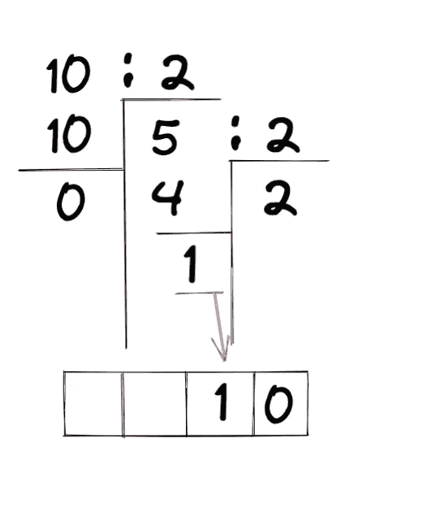
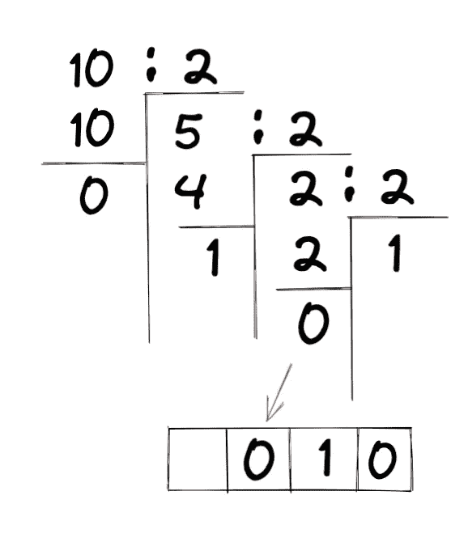
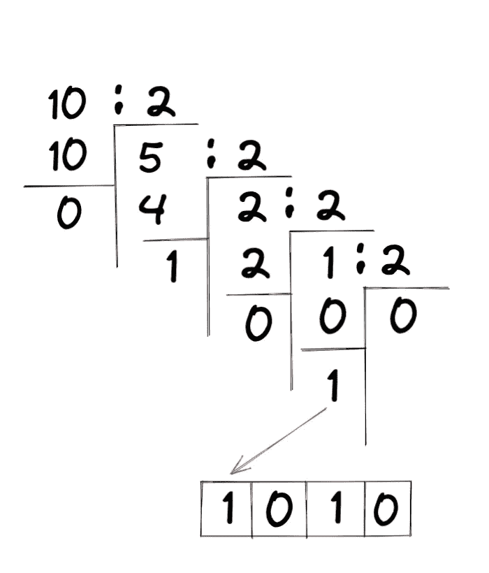
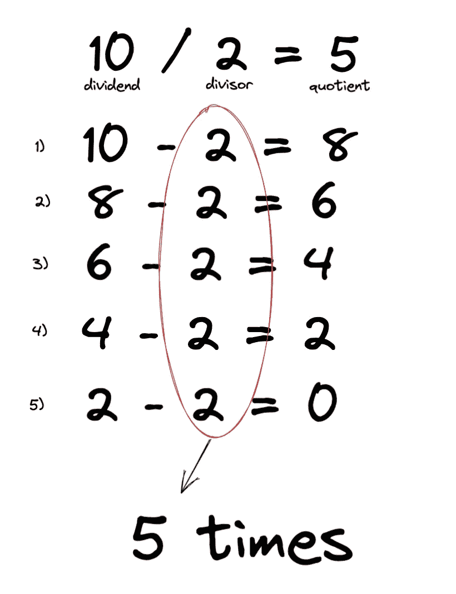
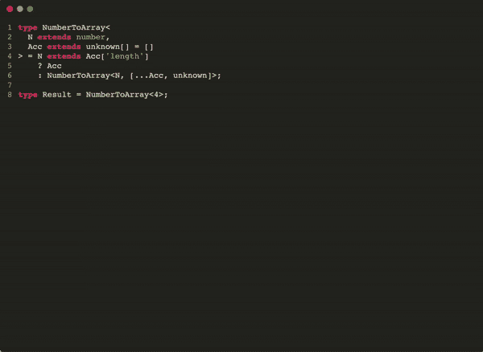
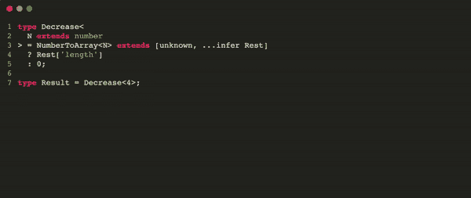

# 高级类型脚本:类型级十进制到二进制转换器

> 原文：<https://javascript.plainenglish.io/advanced-typescript-type-level-decimal-to-binary-converter-337375531a80?source=collection_archive---------2----------------------->

## 我如何只使用类型实现了从基数 10 到基数 2 的转换器！



我总是想提高我的打字技能，最好的方法就是挑战自己，所以几天前我想:我能在 Typescript 中做一个类型级的十进制到二进制转换器吗？

这个简单的问题让我开始了一段不可思议的旅程，我想与你分享，但首先，让我们看看结果:



如果你和我一样，现在你已经在考虑如何自己做这件事，也许你已经打开了你的 IDE 或者[Typescript Playground](https://www.typescriptlang.org/play)——在这种情况下，现在就停止阅读，或者注意会有**剧透**。
试着自己去做，然后，如果你在努力，回来看看我的解决方案，或者把你的和我的进行比较——看到一些不同的方法会很棒。

# 🎉结果

如果您只是对解决方案感兴趣，这里是:

```
type CastNumber<N extends unknown> = N extends number ? N : never;

type Length<A extends unknown[]> = CastNumber<A["length"]>;

type NumberToArray<
  N extends number,
  Acc extends unknown[] = []
> = N extends Length<Acc> ? Acc : NumberToArray<N, [...Acc, unknown]>;

type Increment<N extends number> = Length<[...NumberToArray<N>, unknown]>;

type Decrement<N extends number> = NumberToArray<N> extends [
  unknown,
  ...infer Rest
]
  ? Length<Rest>
  : 0;

type Sub<L extends number, R extends number> = R extends 0
  ? L
  : Sub<Decrement<L>, Decrement<R>>;

type DivBy2<
  Dividend extends number,
  Quotient extends number = 0
> = Dividend extends 0
  ? [0, Quotient]
  : Dividend extends 1
  ? [1, Quotient]
  : DivBy2<Sub<Dividend, 2>, Increment<Quotient>>;

type ToBinary<N extends number, Result extends string = ""> = N extends 0
  ? Result
  : N extends 1
  ? `1${Result}`
  : DivBy2<N> extends [
      infer Remainder extends 0 | 1,
      infer Quotient extends number
    ]
  ? ToBinary<Quotient, `${Remainder}${Result}`>
  : never;

type BinaryNumber = ToBinary<2>; // 10
```

请随意复制粘贴这个解决方案，并使用它。尽管如此，如果你不明白发生了什么，在本文的其余部分，我会解释我是如何想出这个解决方案的。

# 🗒解解释道

在开始解释之前，为了清楚地理解它，您需要对一些概念有一个基本的了解，特别是:

*   [条件类型](https://www.typescriptlang.org/docs/handbook/2/conditional-types.html)
*   [推断](https://www.typescriptlang.org/docs/handbook/2/conditional-types.html#inferring-within-conditional-types)
*   [元组](https://www.w3schools.com/typescript/typescript_tuples.php)
*   一点数学知识

如果您熟悉这些概念，就可以开始了——否则，我希望这些例子能帮助您理解正在发生的事情，但是我强烈建议您跟随这些链接并阅读文档，这不是火箭科学😉

## 理论

你知道如何将基数为 10 的数转换成基数为 2 的数吗？

这其实很简单，我们只需要尽可能地除以 2，然后存储所有除法的余数。
让我们举个例子，把数字 10 从基数 10 转换成基数 2:



10 : 2

10 除以 2 等于 5，没有余数:



让我们存储余数，这将是以 2 为基数的数字的最后一位。
现在，让我们继续将商除以 2:



5 除以 2 等于 2，并带有 1 的提示。
就像我们之前做的一样，我们存储提醒并将其作为基数 2 中的倒数第二位数字。
现在让我们进入下一步:



2:2

2 除以 2 等于 1，没有余数，我们再次存储余数，并继续进行最后一步:



10 (base 10) = 1010 (base 2) 🎉

我们终于有号码了！最后一个除法的商是 0，这意味着我们可以停在这里。

尽管如此，我们仍然没有准备好编码！在编程中，最重要的事情之一是将大问题分解成小问题，因此在开始之前，我们必须了解要做什么:

如您所料，真正的问题是:如何仅使用 Typescript 类型进行数学运算？

答案不是那么简单，因为有很多方法可以做到这一点。
在本文中，我将向您展示一种基于数组的方法，它仅涵盖**自然** **数字**——但是让我们回到问题上来:

我们需要有一种方法来做除法，但是什么是除法呢？我们可以把它看作是**被除数减去除数达到零的次数 *(*** *)如果它们不能被整除就不是这样了，而是来吧...你知道怎么做除法吗😀我就开门见山吧！)*:



为了**除以**，我们需要知道如何做两件事:**增加**(用于计算我们减去的次数)和**减去**。
**但是减法如果不是递减的序列又是什么呢？**


所以要做除法，我们只需要知道 2 个基本运算:**增**和**减**。

现在我们知道了背后的数学原理，我们可以开始编码了🤓。

不幸的是，我们不能对类型进行数学运算:

```
type Three = 3;
type Four = 4;
// Error: 'Four' only refers to a type, but is being used as a value here.
type Seven = Three + Four;
```

相反，我们可以做的是更接近于"[集合论](https://en.wikipedia.org/wiki/Set_theory)"的东西，所以我们必须找到另一种方法来做像加法、减法等运算。

我的解决方案全部基于数组( [*元组，更具体地说是*](https://www.w3schools.com/typescript/typescript_tuples.php) )，特别是它们都具有的一个属性，`length`:

```
type MyArray = ['hello', 'world'];

type MyArrayLength = MyArray["length"]; // 2
```

`length`也是在类型级别，表示数组的大小。

另一件需要知道的重要事情是，我们可以通过使用`extends`在类型级别比较数字——我们无法知道一个是否大于另一个，但至少，我们可以知道它们是否相等:

```
type AreNumbersEqual<
  L extends number,
  R extends number
> = L extends R ? true : false;

type Test_1 = AreNumbersEqual<2, 3>; // false
type Test_2 = AreNumbersEqual<3, 2>; // false
type Test_3 = AreNumbersEqual<3, 3>; // true
```

开始之前要知道的最后一件事是，spread 运算符也适用于类型级！

```
type Array1 = ['Hello'];
type Array2 = ['World'];

type Result = [...Array1, ', ' , ...Array2]; // ['Hello', ',', 'World'];
```

注意，因为我们可以合并元组，所以我们可以做一些数学计算:

```
type Array1 = ['Hello'];
type Array2 = ['My', 'Friend'];

type Length1 = Array1['length']; // 1
type Length2 = Array2['length']; // 2

type Merge = [Array1, ...Array2]; // ['Hello', 'My', 'Friend'];
type MergeLength = Merge['length']; // 3 = 1 + 2
```

我们可以用这三个概念做任何事情，信不信由你！

## 增量

让我们从创建第一个版本的`Increment`类型开始，给定一个大小为 *N* 的数组，它将定义一个等于 *N+1* 的类型:

```
type Increment<A extends unknown[]> = [...A, unknown]['length']; 

type Result = Increase<['Hello']>; // 2;
```

这并不是我们真正想要的，但是我们已经很接近了…我们缺少的是将一个数字**转换成一个与该数字的值大小相同的数组**的方法，如果我们能做到这一点，那么类型`Increment`的定义将会很简单:

```
type Increment<N extends number> = [...NumberToArray<N>, unknown]['length'];

type Result = Increase<2>; // 3 --> [...[unknown, unknown], unknown]['length']
```

所以…让我们建立这种新的类型！

```
type NumberToArray<
  N extends number,
  Acc extends unknown[] = []
> = N extends Acc['length']
    ? Acc
    : NumberToArray<N, [...Acc, unknown]>;

type Result = NumberToArray<4>; // [unknown, unknown, unknown, unknown]
```

让我们用一个小动画来想象它是如何工作的:



基本上，我们将一个“项目”添加到`Acc`(累加器)数组中，直到它的长度等于数字 *N* 。

## 减量

我们将在类型推理的帮助下构建类型`Decrement`，其思路如下:

给定一个长度为 *N* 的非空数组，我们可以把它看作一个长度为 1 的数组和一个长度为 *N-1、*的数组的并集，除非 N = 1，在那种情况下，我不能把数组拆分成 2 个非空数组。

让我们把这个想法翻译成打字稿:

```
type Decrement<
  N extends number
> = NumberToArray<N> extends [unknown, ...infer Rest]
  ? Rest['length']
  : 0; // In case N is 1 the result is 0 (1 - 1)
```

万一有些事情不清楚，我希望一个小动画能帮助你理解正在发生的事情:



## 减法

这种类型很简单，因为我们知道如何减少:

```
type Sub<
  L extends number,
  R extends number
> = R extends 0
  ? L
  : Sub<Decrement<L>, Decrement<R>>;
```

它是这样工作的:

给定两个数 *L* 和 *R* ，如果 R 等于 0，我们返回 L，如果不等于 0，我们将两个数都减，然后递归调用该类型。
例如:

```
type Result = Sub<4, 1>;
```

会这样解决:

```
// 1st step
type Result = 1 extends 0 ? 4 : Sub<Decrement<4>, Decrement<1>>;
// 2nd step
type Result = 1 extends 0 ? 4 : Sub<3, 0>;
// 3rd step
type Result = 1 extends 0 
  ? 4 
  : 0 extends 0 // this is true
     ? 3  // <---
     : Sub<Decrement<3>, Decrement<0>>;
// 4th step
type Result = 1 extends 0 ? 4 : 3;
// 5th step
type Result = 3; // 4 - 1
```

## 除以 2

我们已经接近最终解了，我们缺少最后一个基本运算:除法，特别是**除以 2** 。

要将基数为 10 的数转换为基数为 2 的数，我们需要余数(只能是零或一)和除法的商。
知道了这一点，让我们以一种能提供这两者的方式来制作类型`DivBy2`:

```
type DivBy2<
  Dividend extends number,
  Quotient extends number = 0
> = Dividend extends 0
  ? [0, Quotient]
  : Dividend extends 1
  ? [1, Quotient]
  : DivBy2<Sub<Dividend, 2>, Increment<Quotient>>;
```

为了阐明它的实现，让我们举一个例子:

```
type Result = DivBy2<5, 2>;
// 1st step
type Result = 5 extends 0
  ? [0, 0]
  : 5 extends 1
    ? [1, 0]
    : DivBy2<Sub<5, 2>, Increment<0>>;
// 2nd step
type Result = 5 extends 0
  ? [0, 0]
  : 5 extends 1
    ? [1, 0]
    : 3 extends 0
      ? [0, 1]
      : 3 extends 1
        ? [1, 1]
        : DivBy2<Sub<3, 2>, Increment<1>>;
// 3rd step
type Result = 5 extends 0
  ? [0, 0]
  : 5 extends 1
    ? [1, 0]
    : 3 extends 0
      ? [0, 1]
      : 3 extends 1
        ? [1, 1]
        : 1 extends 0
          ? [0, 2]
          : 1 extends 1 // This is true
            ? [1, 2] // Here we stop
// 4th step
type Result = [1, 2] // Where 1 is the remainder and 2 is the quotient.
// In fact 5 : 2 = 2 with a remainder of 1.
```

## 转换器

我们终于有了创建转换器所需的所有类型:

```
type ToBinary<
  N extends number,
  Result extends string = ""
> = N extends 0
  ? Result
  : N extends 1
  ? `1${Result}`
  : DivBy2<N> extends [
      infer Remainder extends 0 | 1,
      infer Quotient extends number
    ]
  ? ToBinary<Quotient, `${Remainder}${Result}`>
  : never;
```

这种类型是如何工作的:

给定任意数 *N*

*   如果 N 等于零，它返回累加器的值
*   如果 N 等于 1，它返回以 1 为前缀的累加器值
*   否则，计算给定数字的`DivBy2`的结果，得到元组[ `Remainder`，`Quotient` ]
*   该类型在`Quotient`上被递归调用，累加器以`Remainder`为前缀

让我们也举一个例子:

```
type Result = ToBinary<3>;
// Step 1
type Result = 3 extends 0
  ? ''
  : 3 extends 1
    ? '1'
    : DivBy2<3> extends [1, 1]
      ? ToBinary<1, `${'1'}${''}`>
      : never;
// Step 2
type Result = 3 extends 0
  ? ''
  : 3 extends 1
    ? '1'
    : DivBy2<3> extends [infer Remainder, infer Quotient]
      ? 1 extends 0
         ? '1'
         : 1 extends 1 // This is true
           ? `1${'1'}` // Will stop here
           : DivBy2<1> extends [1, 0]
             ? ToBinary<0, `${'1'}${'1'}`>
             : never;
      : never;
// Step 3
type Result = '11'; // ToBinary<3>
```

让我们把所有东西放在一起:

```
type CastNumber<N extends unknown> = N extends number ? N : never;

type Length<A extends unknown[]> = CastNumber<A["length"]>;

type NumberToArray<
  N extends number,
  Acc extends unknown[] = []
> = N extends Length<Acc> ? Acc : NumberToArray<N, [...Acc, unknown]>;

type Increment<N extends number> = Length<[...NumberToArray<N>, unknown]>;

type Decrement<N extends number> = NumberToArray<N> extends [
  unknown,
  ...infer Rest
]
  ? Length<Rest>
  : 0;

type Sub<L extends number, R extends number> = R extends 0
  ? L
  : Sub<Decrement<L>, Decrement<R>>;

type DivBy2<
  Dividend extends number,
  Quotient extends number = 0
> = Dividend extends 0
  ? [0, Quotient]
  : Dividend extends 1
  ? [1, Quotient]
  : DivBy2<Sub<Dividend, 2>, Increment<Quotient>>;

type ToBinary<N extends number, Result extends string = ""> = N extends 0
  ? Result
  : N extends 1
  ? `1${Result}`
  : DivBy2<N> extends [
      infer Remainder extends 0 | 1,
      infer Quotient extends number
    ]
  ? ToBinary<Quotient, `${Remainder}${Result}`>
  : never;
```

您可以看到，这里我们有另外两种类型:

```
type CastNumber<N extends unknown> = N extends number ? N : never;

type Length<A extends unknown[]> = CastNumber<A["length"]>;
```

`Length`只是我用来代替每次写`Array["length"]`的一个实用程序类型。用
`CastNumber`代替，是因为*为* *某种原因*编译器抱怨`Array[“length”]`可能不是一个数字(真的无法想象什么时候 tbh)，所以通过使用类型`Length`我确信我总是收到一个数字。将军打字稿。

# 还有一件事。

我想在这篇文章中再补充一点。
有了我们创建的类型，我们可以构建更多——让我给你举几个例子:

## **追加**

```
type Add<L extends number, R extends number> = Length<
  [...NumberToArray<L>, ...NumberToArray<R>]
>;

type Result = Add<8, 2>; // 10
```

## **乘法**

```
type Mul<
  L extends number,
  R extends number,
  Result extends number = L
> = R extends 0
  ? 0
  : R extends 1
  ? Result
  : Mul<L, Decrement<R>, Add<Result, L>>;

type Result = Mul<10, 2>; // 20
```

## 分开

```
type GTE<L extends number, R extends number> = L extends R
  ? [true, 0]
  : R extends 0
  ? [true, Sub<L, R>]
  : L extends 0
  ? [false, Sub<R, L>]
  : GTE<Decrement<L>, Decrement<R>>;

type Div<
  L extends number,
  R extends number,
  Result extends number = 0
> = GTE<L, R> extends [infer IsGreater, infer Diff extends number]
  ? IsGreater extends true
    ? Diff extends 0
      ? [Increment<Result>, 0]
      : Div<Diff, R, Increment<Result>>
    : [Result, L]
  : never;

type GTEResult = GTE<3, 2>; // [true, 1] <-- [isGreter: true, Diff: 1]
type Result = Div<10, 3>; // [3, 1] <-- [Quotient: 3, Remainder: 1]
```

## **电源**

```
type Pow<
  Base extends number,
  Exp extends number,
  Result extends number = Base
> = Exp extends 0
  ? 1
  : Exp extends 1
    ? Result
    : Pow<Base, Decrement<Exp>, Mul<Result, Base>>;

type Result = Pow<4, 2>; // 16
```

## 检查一个数字是否是偶数

```
type IsEven<N extends number> = ToBinary<N> extends `${string}0`
  ? true
  : false;

type Result = IsEven<4>; // true
```

# 警告

正如我在文章开头所说的，在 Typescript 中有其他方法可以进行类型级数学运算，在我看来，我为本文选择的方法是最容易阅读和理解的，但是它也有一些缺点:

您将会看到，我们的一些类型，即使它们是正确的，也标有下面的错误:`Type instantiation is excessively deep and possibly infinite.`为了改进这些类型，我们需要以稍微不同的方式编写它们，但是为了可读性，我更喜欢在本文中保持它们的原样。
以下是我们如何改进`Increment`和`Add`类型的一些例子:

```
type Increment<N extends number> =
  NumberToArray<N> extends infer A extends unknown[]
    ? Length<[...A, unknown]>
    : never;

type Add<
  L extends number,
  R extends number
> = NumberToArray<L> extends infer LA extends unknown[]
  ? NumberToArray<R> extends infer RA extends unknown[]
    ? Length<[...LA, ...RA]>
    : never
  : never;
```

正如你所看到的，它们和以前差不多，但是数组的计算被延迟了，因为我们正在推断结果。

无论如何，即使进行了这些优化，对大数字类型的解析也会很慢——Typescript 的类型不应该以这种方式使用，这是一种黑客行为。

此外，我们所做的一切都不适用于非自然数。

# 👋结论

我真的希望你喜欢读这篇文章，我想知道你对它的看法，所以请留下评论，让我知道❤️

当我做这些高级类型时，我通常会尝试提供一个真实世界的场景，但这一次，我认为，没有，这只是对我的一个有趣的挑战，希望对你也是如此。

我对替代解决方案和不同的方法感兴趣，所以如果你有任何想法，请随时给我发短信或写评论。

# 🙆🏻‍♂️关于作者

我是 [VLK 工作室](https://www.linkedin.com/company/vlk-studio/?source=about_page----------------------------------------)的软件工程师，目前正在从事一个名为 [Morfeo 的开源项目。](https://morfeo.dev/?source=about_page----------------------------------------)

只要我能，我就在媒体上分享一些我知道的东西。

如果你喜欢我做的事情，请随时支持我的工作:[https://medium.com/@mauro.erta/membership](https://medium.com/@mauro.erta/membership?source=about_page----------------------------------------)

或者在[推特](https://twitter.com/mauro_erta)上关注我。

*更多内容看* [***说白了就是***](https://plainenglish.io/) *。报名参加我们的* [***免费周报***](http://newsletter.plainenglish.io/) *。关注我们关于* [***推特***](https://twitter.com/inPlainEngHQ) ， [***领英***](https://www.linkedin.com/company/inplainenglish/) *，*[***YouTube***](https://www.youtube.com/channel/UCtipWUghju290NWcn8jhyAw)*，以及* [***不和***](https://discord.gg/GtDtUAvyhW) *。对增长黑客感兴趣？检查* [***电路***](https://circuit.ooo/) *。*