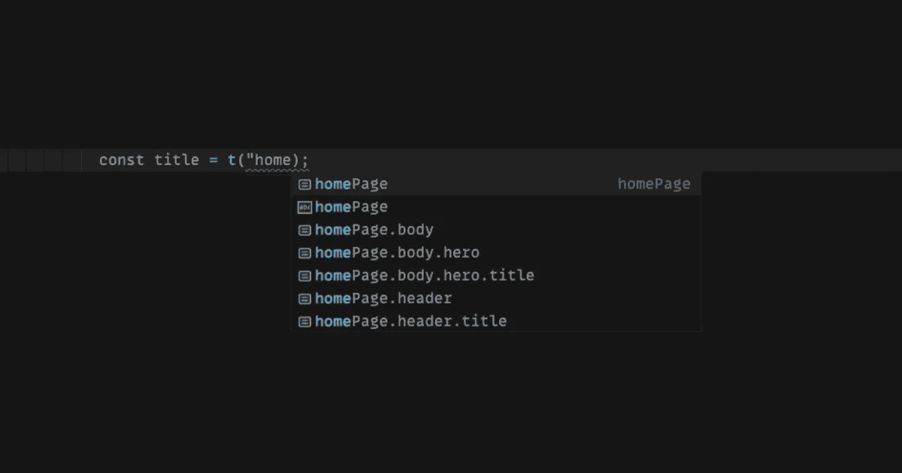

# 高级类型脚本:类型级嵌套对象路径

> 原文：<https://javascript.plainenglish.io/advanced-typescript-type-level-nested-object-paths-7f3d8901f29a?source=collection_archive---------0----------------------->

## 条件类型、类型推理、模板文字类型和递归的真实用例。



Nested Object Paths

# 目录

[❓问题](#7501)
[✅结果](#4b40)
[📝解释](#4d33)
∘[nested paths](#762c)
∘[typefrompath](#0bdf)
[💡用例](#1915)
∘ [翻译](#278a)
∘ [Redux 选择器](#65f9)
[👋结论](#6aac)
[🙆🏻‍♂️关于作者](#866a)

# ❓的问题

对于*对象路径*，我指的是一个*点格*字符串，它表示对象内部某个值的路径，例如:

```
const object = {
  a: {                     // <-- 'a'
    b: "My path is 'a.b'", // <-- 'a.b'
    c: "My path is 'a.c'", // <-- 'a.c'
  },
  d: "My path is just 'd'" // <-- 'd'
}
```

到`My path is ‘a.b’`的路径是`a.b`，这个对象所有可能路径的集合是:`'a', 'a.b', 'a.c' and ‘d’`。

我经常需要一种方法来了解类型级对象的所有可能路径，例如，下面的例子有助于理解一个真实世界的场景，在这个场景中，了解类型级的所有可能路径可以帮助我们避免无用的情况或可能的错误:

我如何知道`*homepage.header.title*`路径是否存在？即使它存在，我怎么能确定它指的是一个字符串呢？

当然，我可以简单地放一个 *if* 语句，但是我想要更智能的**、**自动**和**类型检查**！**

**我没有找到任何准备好的可以以适当的方式解决这个问题的东西，所以我决定自己来做，我会告诉你怎么做！**

# **✅结果**

**下一章，我会给你一个我想出的解决方案的**详细** **解释**，但首先，我要给你看结果！— *如果你对解释不感兴趣，你可以在这里停下来，复制&粘贴片段，你就可以开始了！***

****

**引擎盖下使用的类型有:**

**你没想到会这么复杂，是吗？我也是，说实话——但是**这样是有原因的！欲知缘由，且听下回分解。****

# **📝解释解决方案**

## **嵌套路径**

**让我们从类型*嵌套路径*开始——我不得不说**可以用更简单的方式制作**，比如这样:**

**这种方法更短、更简洁，但是……这种方法有一个警告:**

**两种解决方案都使用了`[Conditional Types](https://www.typescriptlang.org/docs/handbook/2/conditional-types.html)`、`[Template Literal Types](https://www.typescriptlang.org/docs/handbook/2/template-literal-types.html)`和`[Recursive Type Reference](https://www.typescriptlang.org/play#example/recursive-type-references)`——尽管有一点点但很关键的区别，这个更简单的版本不是 [**尾递归**](https://en.wikipedia.org/wiki/Tail_call) **。****

**简而言之，一个函数(*或者，在这种情况下，一个类型*)是尾递归的**，如果它通过返回递归调用**的值而结束；
在这个更简单的版本中，事实上，我们不是直接调用递归，而是在一个*模板文字类型*内调用一个*联合类型*内的递归:**

```
K | `${K}.${***NestedPaths***<T[K]>}`
```

**为什么类型是尾部递归的很重要？**

**因为 Typescript 对类型可以递归调用自身的次数设置了一个**限制**，如果不是尾递归的，这个限制相当小！**

***有多小？以前是 9 个，现在大概是 20 或 50 个，我不记得具体数字了，但不是很多；如果你知道，请发表评论，我会更新文章！***

**如果类型是**尾递归**而不是**，这个限制就高多了！**([*官方打字稿文档*](https://www.typescriptlang.org/docs/handbook/release-notes/typescript-4-5.html#tail-recursion-elimination-on-conditional-types) *他们只是说它“比较大方”*)。**

**现在一切都清楚了，让我们看看尾部递归版本。**

***联合*和*连接*是实用程序类型，可以避免*字符串*和*未定义*之间不必要的联合或连接，并使类型更具可读性:**

```
Union<'a', 'b'>;      // --> 'a' | 'b'
Union<undefined, 'b'> // --> 'b'
Union<'a', undefined> // --> 'a'Join<'a', 'b'>        // --> 'a.b'
Join<undefined, 'b'>  // --> 'b'
Join<'a', undefined>  // --> 'a'
```

**知道了这一点，我将把它们从下一个代码片段中去掉，这样我们可以更好地关注 *NestedPaths* 类型:**

**让我们通过一个例子来看看它是如何工作的:**

```
type Paths = NestedPaths<{
  a: {            // <-- a
    b: {          // <-- a.b
      c: string;  // <-- a.b.c
    }
    d: string;    // <-- a.d
  }
}>
```

**我们预计该对象的可能路径是:**

```
"a" | "a.b" | "a.b.c" | "a.d"
```

****第一轮****

**在递归的第一个循环之后，这是该类型的样子:**

```
type Paths = {
  a: NestedPaths<{
   b: { c: string },
   d: string
  },  undefined, "a">
}['a']
```

**这是因为`keyof T`在这种情况下，仅仅是`a`——对于键`a`我们有:**

```
T['a'] = { b: { c: string }, d: string }
// Which means that
T['a'] extends GenericObject ? **yes**
```

**我们在条件的第一个分支中，所以:**

```
// Prev = undefined
// Path = undefinedNestedPaths<T['a'], Union<Prev, Path>, Join<Path, 'a'>>// Is equal to:
NestedPaths<T['a'], Union<undefined, undefined>, Join<undefined, 'a'>>// Which is just:
NestedPaths<T['a'], undefined, 'a'> // Prev = undefined, Path = 'a'
```

****第二轮****

**在递归的第二个循环中，我们得到:**

```
type Paths = {
  a: {
   b: NestedPaths<{ c: string },  "a", "a.b">,
   d: "a" | "a.d",
  }['b' | 'd']
}['a']
```

**在这个循环中，`keyof T`就是`b | d`。
对于子对象`a`下的关键点`b`，我们可以重复之前的相同过程(我们在条件的第一个分支:`T['b'] extends GenericObject`)；
对于键`d`相反，条件`T['d'] extends GenericObject`为**假**，所以我们有:**

```
// Prev = undefined
// Path = 'a'd: Union<Union<Prev, Path>, Join<Path, 'd'>>;d: Union<Union<undefined, 'a'>, Join<'a', 'd'>>;d: Union<'a', 'a.d'> --> 'a' | 'a.d'
```

****第三轮****

**现在事情开始变得有趣了…我们基本上拥有了所需的一切:**

```
type Paths = {
  a: {
   b: { c: "a" | "a.b" | "a.b.c" }["c"],
   d: "a" | "a.d",
  }['b' | 'd']
}['a']
```

**`b`下的`c`键是这样解析的:**

```
c: T['c'] extends GenericObject ? nope!c: Union<Union<Prev, Path>, Join<Path, 'c'>>// Where:
// Prev = 'a'
// Path = 'a.b'c: Union<Union<'a', 'a.b'>, Join<'a.b', 'c'>>
c: Union<'a' | 'a.b', 'a.b.c'>
c: 'a' | 'a.b' | 'a.b.c'
```

****终于****

**递归完成后，我们只需以不同的方式编写类型:**

```
type Paths = {
  a: {
   b: { c: "a" | "a.b" | "a.b.c" }["c"],
   d: "a" | "a.d",
  }['b' | 'd']
}['a']// Is equal to:
type Paths = {
  a: {
   b: "a" | "a.b" | "a.b.c",
   d: "a" | "a.d",
  }["b" | "d"]
}['a']// Which is also equal to:
type Paths = {
  a: "a" | "a.b" | "a.b.c" | "a.d"
}["a"]// 🎉 Which is just what we expected 🎉:
type Paths = "a" | "a.b" | "a.b.c" | "a.d"
```

**使用类型 *NestedPaths，*我们可以获得任何对象的所有路径！**

**…但这只是我想解决的第一个问题！**

## **TypeFromPath**

**事实上，除了获取一个对象的所有路径，我还想找到一种方法来获取这些路径引用的类型，我是这样做的:**

**让我们通过一个具体的例子来看看这种类型是如何工作的:**

```
type Result = TypeFromPath<{
  **a**: {
    **b**: {
      **c**: { foo: 'bar' }; // <-- 'a.b.c'
    }
    d: string;
  }
// We are asking for the type referred by the path 'a.b.c'
}, **'a.b.c'**>
```

**我们预计`type Result`将等于`{ foo: 'bar' }`。**

****第一轮****

**这是我们在第一轮递归中得到的结果:**

```
type Result = {
 'a.b.c': *TypeFromPath*<{
    b: {
     c: { foo: 'bar' };
    }
    d: string;
  }, 'b.c'>
}['a.b.c']
```

**让我们看看发生了什么:**

```
// The generic type Path is equal to 'a.b.c' so
// Path = 'a.b.c'{
  [K in Path]: ???
}[Path]// Is just
{
 [K in 'a.b.c']: ???
}['a.b.c']
```

**我们有什么来代替`???`？
知道`K`等于*‘a . b . c’，*我们有:**

```
// T = { a: { ... }, d: string }
// Does *K* extends keyof *T*?
// No it doesn't, the keys of T are '*a*' and '*d*' and *K* is '*a.b.c*'
// so we are in the second branch of the condition{
 [K in 'a.b.c']: K extends `${infer P}.${infer S}` ? TypeFromPath<T[P], S> : never
}['a.b.c']
```

*****K 延伸什么` ${infer P}。${infer S}`*** 是什么意思？
我们询问 Typescript 是否 *`a.b.c`* 扩展了一个类似于`{Prefix}.{Suffix}`的字符串；
在我们的例子中是**真**，事实上，K 是` a.b.c `,我们可以把` a.b.c `看成`${'a'}.${'b.c'}`。**

**所以，最后，我们得到了:**

```
{
 ['a.b.c']: TypeFromPath<T['a'], 'b.c'>;
}['a.b.c']
```

****第二轮****

**在递归的第二个循环中，我们得到:**

```
type Result = {
 'a.b.c': {
   'b.c': *TypeFromPath*<{
      c: { foo: 'bar' };
   }, 'c'>
 }['b.c']
}['a.b.c'];
```

**在这个周期中，我们拥有的东西与之前基本相同，因此:**

```
// Path = 'b.c'
// T = { b: { c: { foo: 'bar' } } }; {
  [K in 'b.c']: TypeFromPath<T['b'], 'c'>;
}['b.c']// All together:
{
  ['a.b.c']: {
    ['b.c']: TypeFromPath<T['b'], 'c'>;
  }['b.c']
}['a.b.c']
```

****第三轮****

**这里我们终于有了不同的东西:**

```
type Result = {
 'a.b.c': {
   'b.c': {
      c: { foo: 'bar' };
   }['c']
 }['b.c']
}['a.b.c'];
```

**我们是这样得到它的:**

```
// Path = 'c'
// T = { c: { foo: 'bar' } };{
  [K in 'c']: K extends keyof T ? **yes!**
}['b.c']{
  [K in 'c']: T['c'] --> { foo: 'bar' }
}// All together:
{
  ['a.b.c']: {
    ['b.c']: {
      ['c']: { foo: 'bar' }
    }['c]
  }['b.c']
}['a.b.c']
```

****第四轮****

**我们现在已经拥有了获取“a.b.c”所引用的类型所需的一切:**

```
type Result = {
 'a.b.c': {
   'b.c': { foo: 'bar' };
 }['b.c']
}['a.b.c'];**// Which is equal to**
type Result = {
 'a.b.c': { foo: 'bar' };
}['a.b.c'];**// And finally**
type Result = { foo: 'bar' };
```

**正如我们所料，`type Result = { foo: 'bar' };`！**

# **💡用例**

**我认为这些类型在不同的场景中都很有用，例如，**翻译**和**冗余选择器**:**

## **翻译**

**通常，我们将翻译存储在如下所示的对象中:**

```
const translations = {
  homePage: {
    title: 'Hello!',
    ...,
  },
  profilePage: {
    menu: {
      settings: 'Settings',
      ...,
    },
  },
  ...,
}
```

**然后我们通常通过一个钩子来使用这个对象，比如下面的`useTranslations`，它返回`t`函数——这个函数以一个路径作为参数，并返回相应的翻译:**

```
const HomePageTitle = () => {
  const { t } = useTranslation();

  return <h1>{t('homePage.title')}</h1>;
}
```

**这是大多数 i18n 库的工作方式，例如`i18next` ( `react-i18next`)或`react-intl`。**

**我们可以将`useTranslation`包装到一个自定义钩子中，并使用类型 *NestedPaths* 和 *TypeFromPath* 来正确地对传递给 *t 函数的路径进行类型检查:***

**useTranslations custom hook**

**就这样，通过使用这个新的钩子，我们将**始终**确保传递给 t 函数的路径是 translations 对象的**有效路径**，并且返回的类型是一个字符串:**

```
const ***HomePageTitle*** = () => {
  const { t } = useTranslation();

  // Looks good
  return <h1>{t('homePage.title')}</h1>;
}const ***WrongHomePageTitle*** = () => {
  const { t } = useTranslation();

  // We will have an error saying that **homePage.wrongPath**
  // is not a valid path
  return <h1>{t('homePage.wrongPath')}</h1>;
}const ***AnotherWrongHomePageTitle*** = () => {
  const { t } = useTranslation();

  // We will have an error saying that **t('homePage')**
  // is not a valid React child (*because is an object*)
  return <h1>{t('homePage')}</h1>;
}
```

## **冗余选择器**

**另一个很好的用例是将这些类型与`react-redux`的钩子`useSelector`结合起来，例如:**

**usePathSelector custom hook**

# **👋结论**

**感谢你阅读这篇文章，我希望它对你有用。我对构建这些类型的其他方法很感兴趣，如果你知道其中一些，或者你认为它们可以改进，请留言告诉我你会怎么做。**

# **🙆🏻‍♂️关于作者**

**我是 [VLK 工作室](https://www.linkedin.com/company/vlk-studio/?source=about_page----------------------------------------)的一名软件工程师，目前正在从事一个名为 [Morfeo 的开源项目。](https://morfeo.dev/?source=about_page----------------------------------------)**

**只要我能，我就在媒体上分享一些我知道的东西。**

**如果你喜欢我做的事情，请随时支持我的工作:[https://medium.com/@mauro.erta/membership](https://medium.com/@mauro.erta/membership?source=about_page----------------------------------------)**

***更多内容请看*[***plain English . io***](https://plainenglish.io/)*。报名参加我们的* [***免费周报***](http://newsletter.plainenglish.io/) *。关注我们关于*[***Twitter***](https://twitter.com/inPlainEngHQ)*和*[***LinkedIn***](https://www.linkedin.com/company/inplainenglish/)*。加入我们的* [***社区不和谐***](https://discord.gg/GtDtUAvyhW) *。***