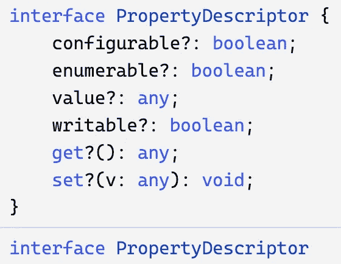
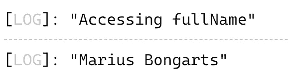
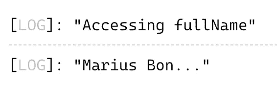
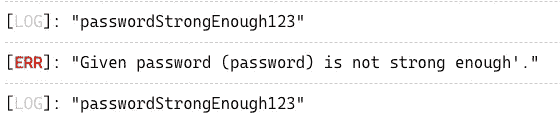

# 具有代码挑战的高级类型脚本:访问器装饰器

> 原文：<https://javascript.plainenglish.io/advanced-typescript-with-code-challenges-accessor-decorators-88c757cd3435?source=collection_archive---------6----------------------->

## 装饰器提供了一种为类声明和成员添加注释的方法。

Photo template by [Rachel Claire](https://www.pexels.com/de-de/@rachel-claire?utm_content=attributionCopyText&utm_medium=referral&utm_source=pexels) from [Pexels](https://www.pexels.com/de-de/foto/natur-feld-trocken-tier-4577793/?utm_content=attributionCopyText&utm_medium=referral&utm_source=pexels)

在本文中，我们将了解类型脚本**访问器** **装饰器**。Decorator 遵循同名结构软件[的设计原则 **Decorator** 和](/software-design-patterns-with-typescript-examples-decorator-cb6160ddbeb9)为扩展功能提供了子类化的灵活替代方案。

要了解关于高级 TypeScript 特性的更多信息，请查看我的其他文章。以下是一个概述:

Overview TypeScript Features

 [## Web 亮点— PDF 和 Web 荧光笔

### Web Highlights 是一个在 Web 上突出显示文本的工具，可以更有效地组织您的研究。提升你的…

web-highlights.com](https://web-highlights.com/) 

# 装饰者

**结构** **装饰**模式非常强大，帮助我们防止子类的**爆炸。**

装饰模式的目的是动态地给一个对象附加额外的责任，并为扩展功能提供一个灵活的子类化替代方案。

装饰模式在许多用例中被广泛使用和应用。只要您想，就使用该模式:

*   创建大量的子类。有时太多的子类是不切实际的，并导致子类**的爆炸式增长**来支持每一种组合。
*   在不影响其他对象的情况下，动态地为单个对象**添加职责**。
*   在运行时给对象分配额外的行为，而不破坏使用这些对象的代码。

 [## 带有类型脚本示例的软件设计模式:装饰器

### 装饰模式为扩展功能提供了子类化的灵活替代方案

javascript.plainenglish.io](/software-design-patterns-with-typescript-examples-decorator-cb6160ddbeb9) 

# 打字稿装饰者

由于类是在 Typescript 和 ES6 中引入的，Typescript 也想提供支持用 Decorators 注释或修改类和类成员的可能性。

实验性的类型脚本装饰器特性帮助我们装饰**类**、**方法**、**属性**、**访问器**和**参数**。

> 注释装饰器是一个实验性的特性，在未来的版本中可能会改变。——[typescriptlang.org](https://www.typescriptlang.org/docs/handbook/decorators.html)

由于这个特性仍然是实验性的，我们首先需要通过在我们的`tsconfig.json`的`compilerOptions`中设置`experimentalDecorators`到`true`来启用它:

一旦这个额外的设置完成，我们就可以创建可以在访问器前面使用`@`的 decorators。

> 装饰者使用形式`*@expression*`，其中`*expression*`必须计算出一个函数，这个函数将在运行时用被装饰声明的信息来调用。—[typescriptlang.org](https://www.typescriptlang.org/docs/handbook/decorators.html#method-decorators)

对于初学者来说，这里有一个非常简单的例子，说明如何创建一个名为`logMessage`的**访问器** **装饰器**函数，它将返回一个内部函数，以便在函数被调用后简单地打印出一个`message`。

外部函数`logMessage`是我们的装饰工厂，它使我们能够传递一些参数。我们的装饰工厂简单地接受一个`message`参数，并将其传递给内部函数，该函数将在运行时被装饰器调用。

> **装饰工厂**是一个返回装饰者的函数。—[blog . log rocket . com/a-practical-guide-to-typescript-decorators/](https://blog.logrocket.com/a-practical-guide-to-typescript-decorators/)

装饰器接受三个参数:

1.`**target**` = `User`类

2.`**propertyKey**`是“更新电子邮件”

3.`**descriptor**`是我们的`PropertyDescriptor`

`PropertyDescriptor`界面如下所示:

PropertyDescriptor interface

我们现在可以使用`@logMessage('some Message')`注释任何访问器。关于访问器装饰器的一个特殊之处是，我们只能将它们用于成员的`get`或`set`——不能同时用于两者。

> **注意** TypeScript 不允许修饰单个成员的`get`和`set`访问器。——[typescriptlang.org](https://www.typescriptlang.org/docs/handbook/decorators.html#accessor-decorators)

假设我们有一个`User`类，我们像这样使用装饰器:

Accessor Decorator

每次我们访问`fullName` getter 时，我们都会在控制台中看到一条新消息:

Logs

[这里是上面例子的打字稿操场](https://www.typescriptlang.org/play?ts=4.4.4#code/GYVwdgxgLglg9mABAGzgcwLIFMDOOCGaWAFALa4FEBciOUATjGGgJSIDeAUIovVlCHpJQkWAkTEo+ekSg18YAJ4AaRAAd6cNVnpRFAaSyKadRs1UATXBEZqocejQAKm7bsUARa7fv02XHh4IBBw4ZCwAOlQ0MgpCLBYAbm5EAF9k1M5OCGR8PEQAVRwdDhTgsFMQaAdiDRgAN3woLERgGHo6ADl8chMGJjRVOsbmlDyobt7afuZ-TJSAAWjsPHjiAHIAQQgICgHWkGRkSax1lhS1EAAjZBgIRFkDo5PifxSePgEhRAADABJ2FAABYwHARNodCY9LCpRAA4GgqLjE6pH7JHiZeblOiIEDFeiIAC8iDAWAA7oV8cQAEQYaQwPHU1TUgBCCDQ0igOGpSSy2LCkWixDxOnBh2O0N5QA)。

这是一个非常简单的例子。但是 Typescript decorators 可能更有用，也更复杂。有五种装饰者:

*   [**类装修工**](/advanced-typescript-with-code-challenges-class-decorators-afd9043d41f6)
*   [**方法装饰者**](/advanced-typescript-with-code-challenges-method-decorators-dd87b0897d5e)
*   **访问器装饰器**
*   **物业装修工**
*   **参数装饰器**

在我看来，详细查看每种类型的装饰器是有意义的，因为 Typescript 装饰器是更复杂的特性之一。在这篇文章中，我们将仔细观察**访问器装饰器**和做一个代码挑战来内在化这个特性。

在接下来的文章中，我们将会看到我在这里链接的其他类型的装饰者。你也可以只 [**订阅**](https://medium.com/subscribe/@mariusbongarts) 我的故事，以免错过。

# 访问器装饰器

在前面的例子中，我们已经看到了一个非常简单的**访问器**装饰器。让我们创建一个更有用的。

假设我们想要将我们的`fullName`访问器值调整到一个特定的字符数。我们将构建自己的`@trimString(maxLength)`装饰器来检查给定的值是否比给定的长度长，并返回一个经过修整的版本:

在这个例子中，我们再次用一个**装饰工厂**包围了原始的访问器。这一次，它包含了给定字符串的`maxLength`参数。

这里棘手的部分是我们通过访问`PropertyDescriptor`的`get`属性来修改原始的`fullName`访问器。现在，我们用修改后的函数覆盖原来的`get`访问器。在这个函数中，我们访问访问器的原始`fullName`值，并检查它是否比允许的`maxLength`字符长。如果没有，我们简单地返回原始值，否则我们修剪字符串，并在它的末尾放三个点。

现在，我们可以通过像这样注释我们的`fullName`访问器来使用装饰函数:

每当我们在任何`User`对象上访问`fullName`时，它会将返回值修剪为 10 个字符。另外，请注意，将多个 decorators 分配给一个访问器没有问题。

在这个例子中，调用`user.fullName`时，日志看起来是这样的:

Logs

[这里是访问器装饰器示例的类型脚本 playground](https://www.typescriptlang.org/play?ts=4.4.4&ssl=32&ssc=4&pln=28&pc=1#code/GYVwdgxgLglg9mABAGzgcwLIFMDOOCGaWAFALa4FEBciOUATjGGgJSIDeAUIovVlCHpJQkWAkTEo+ekSg18YAJ4AaRAAd6cNVnpRFAaSyKadRs1UATXBEZqocejQAKm7bsUARa7fv02XHh4IBBw4ZCwAOlQ0MgpCLBYAbm5EAF9k1M5OEWh4JAYYUgBlAuYyfAAPABksZigACxowEFIAIx1-FL4BIUQcsSRJaVl5JVUNLR09Q2NaUrRLbxg7B2dXKc8llb8OFJ49xGCwOkQHGDQmfGQAcX5EAF5EKxwbZd8I2WSD59ftj7vHv08hJOoFAgcgiEoKdGBcwFcAGIgZDIABy+HIDxh50uN34AH4IhArshJPUYDgklkwTwYMAJGc4YjkWiMZFwnV6ogAHyIUiVGqc0E0njdQRIAAGABJ2IzcUiUejyBEcCBWqZiAAGVT86q1NANFipCImiUQtLmsW9OXw5AK1nkL5g9IpF2ZTgQZD4PCIACqOB0u0hxwYIGgDmIGhgADd8FAsH0YPQ6EqsCZ5uNGLH4yhvVBU+mzKwOO6eAABaLYPDxYgAcgAghAIBQmGg+izU7WWCkywVivNiABGTXdnhqNXIGAQRCyduKtnEYWi-jixDS9gNCkRYBJlNs1KIGWbnBRPOp1IS5I8TLuo4nEAB+hYsBYADufsfxAARBhpDAH1+qhfgAQggaDSFAOBflSHohGE7LoMQD46NuHZslSQA) 。

# 代码挑战💻

我们已经为我们的`User`类创建了一个`trimString`装饰器。现在我们向类中添加了一个新的`password`访问器。对于这个属性，我们想要创建一个`@validatePassword(minLength)`装饰器，每当调用我们的`password`属性的`set`访问器时，它简单地检查给定的密码是否具有最小字符长度。

User.ts

因此，如果我们执行上面的代码，并且正确地实现了我们的`@validatePassword(minLength)`装饰器，输出应该是这样的:

Expected log output

**小旁注**:在生产环境中存储密码时，有两个简单的规则:

1.  不要以纯文本格式存储密码
2.  不要以纯文本格式存储密码

总是在数据库中散列密码。但是让我们忽略这个简单的例子。继续，创建`validatePassword` decorator 函数并解决所有的 Typescript 错误。

## 密码

下面是本次练习的 [**起始码**](https://www.typescriptlang.org/play?ts=4.4.4#code/GYVwdgxgLglg9mABAGzgcwLIFMDOOCGaWAFALa4FEBciOUATjGGgJSIDeAUIovVlCHpJQkWAkTEo+ekSg18YAJ4AaRAAd6cNVnpRFAaSyKadRs1UATXBEZqocejQAKm7bsUARa7fv02XHh4IBBw4ZCwAOlQ0MgpCLBYAbm5EAF9k1M5OEWh4JAYYUgBlAuYyfAAPABksZigACxowEFIAIx1-FL4BIUQcsSRJaVl5JVUNLR09Q2NaUrRLbxg7B2dXKc8llb8OLMDEYLA6RAcYNCZ8ZABxfkQAXkQrHBtl3wjZZJSeJ5ft99uHv08hJOl9AodjqdzmBLgAxEDIZAAOXw5HuJ0Y0MuNygAH4IhBLshJPUYDgknt9ogYMAJFCLsh4YiUeQorU0A1EAA+RCkSo1Or1TpUwLdQRIAAGABJ2PSYYyEcjUZEcCBWqZiAAGVR86rshosVIRY0SsE8TIisW9OVwxUsrCffbpFLOzKcCDIfB4RAAVRwOl2PA0MAAbvgoFhEPUvfUsBYnAB3CwmebogDkacdBxCDBA0AcxGDYYjfRg9Do9pTZgW6kYxcjnoryqrTFYHDSlIAAtFsHh4sQ0wBBCAQCitvp25VplgpTsFYrzYgARk1M6DauQMAgiFkE+ZyuIwtF-HFiGl7AaZIiwDLTfIqUQMsvOCiXqg9tSEuS5spag3W53W41C9HAEwcCxD0DY8enyUkX2jHBY3jJNvw7Wcw03CxwywJwQLA+gIJXNd1H-bd-SgdQ8PAwskxbZgjx4Z8IgQpDEwsdE1BQl1ODdCEKJAf16HRMAsATX1BOIAAiDBpBgATJNUSSACEEDQaQoBwSSKU4ASdAiYC8Hw9iHjTAzQPAkpNGYABRMA4BANB6iXAAmABmTN3RCMJImiYhdPofSqII7SAHoQsQIp6ns5B2MQuAxOs+hNCE9pCV06kKLJRB7DgWgot0HTBMCwzwPTMyjI8iFvKidA-KK8rwIpIA) :

Starter Code

## 解决办法

下面是 [**解**](https://www.typescriptlang.org/play?ts=4.4.4#code/GYVwdgxgLglg9mABAGzgcwLIFMDOOCGaWAFALa4FEBciOUATjGGgJSIDeAUIovVlCHpJQkWAkTEo+ekSg18YAJ4AaRAAd6cNVnpRFAaSyKadRs1UATXBEZqocejQAKm7bsUARa7fv02XHh4IBBw4ZCwAOlQ0MgpCLBYAbm5EAF9k1M5OEWh4JAYYUgBlAuYyfAAPABksZigACxowEFIAIx1-FL4BIUQcsSRJaVl5JVUNLR09Q2NaUrRLbxg7B2dXKc8llb8OLMDEYLA6RAcYNCZ8ZABxfkQAXkQrHBtl3wjZZJSeJ5ft99uHv08hJOl9AodjqdzmBLgAxEDIZAAOXw5HuJ0Y0MuNygAH4IhBLshJPUYDgknt9ogYMAJFCLsh4YiUeQorU0A1EAA+RCkSo1Or1TpUwLdQRIAAGABJ2PSYYyEcjUZEcCBWqZiAAGVR86rshosVIRY0SsE8TIisW9OVwxUsrCffbpFLOzLZcC5cQAN0uMAs+CgWCc+DwAHcHBYyEwBRzGohmm0OrseFbhB6BhIpDJ+KMVOp1u4ZiZ5otnj5VogXJN3F4y68HMLwSEoBizgzsA04BZ0T9y-QIjh+I7Ar36-3By3AengcRjRFhjgaABtUxMNAAXUb+whLbUIZw4fo3YeC6XmvXw+3zfU+8PFgAkjgAGq+483sMRtmC7kPUjR-X1JegQ0hIACEe4fkej4vsgfpblSEJhJEOiaPQxASlcMBerU74HhGEgyhBeFHqkbBkvGcAtqYCBoIgtRwCAaD1AA5BEEoUiKKb8OKyQihaVKpq2WLIB29Rdvi+BqGoyCKCSZKqAuFJgs65oZFkEDIPuiAAKqDvQyb5lhAZYIg9QhvUWAWE4oYWMWZi0Q8zHMcOO70CA0AOMQGhGYGfQwPQdD2nZa7jIwPq+ZpgXKsFzD+GklIAALRNgeDxMQzEAIIQBAFBrn0drKsxLApAlBTFPMxAAIyasVPBqGqsEQIgsj5cyyrEPBgnSuwDRkhEwD+VF5CpIgMq9TgUQhlA9qpBKvHxSk9WtI1zW3ERd4dQZXE9PkpITWZOAWVZNnzW6PAJT6sH+oGwaQZG1W1eoDUwE1E64Rtag2TFrBbYg40RAdR3WW+n0WKdnBujuiAgHp6JgFgoY6XpxAAEQYNIMAwyjqgowAQjR0hQDgKNKTDOgROt+GOZTR4lJozAAKJgAxTGVQATAAzM5nCIeEUToMQZP9jTFhKQA9GLiBFGJCLdodcCIwz9CoYg7SEmT1ItuR9hwLQYm6JwQsU7eVOIMxIvc7zkTRILenG3dFJAA) 为练习题:

Solution Code

# 最后的想法

我希望你喜欢阅读这篇文章。我总是乐于回答问题，并乐于接受批评。随时欢迎联系我！通过**[**LinkedIn**](https://www.linkedin.com/in/marius-bongarts-6b3638171/)**，**关注我**[**Twitter**](https://twitter.com/MariusBongarts)或 [**订阅**](https://medium.com/subscribe/@mariusbongarts) 通过电子邮件获取我的故事。****

****[**这里是无限制访问介质上每一个内容的链接**](https://medium.com/@mariusbongarts/membership) 。如果你注册使用这个链接，我会赚一小笔钱，不需要你额外付费。****

**** [## 通过我的推荐链接加入 Medium-Marius bong arts

### 作为一个媒体会员，你的会员费的一部分会给你阅读的作家，你可以完全接触到每一个故事…

medium.com](https://medium.com/@mariusbongarts/membership)**** 

## ****关于作者****

****我是埃森哲软件工程分析师宋。我们一直在寻找最好的开发人员，所以如果你有兴趣加入我们，请随时联系我们！****

****最驱动我的是我想创造一些对他人有帮助和改变生活的东西的冲动🙌比如你是否厌倦了浏览自己的历史来寻找前几天看到的信息？我的 [**网站重点介绍 Chrome 扩展**](https://chrome.google.com/webstore/detail/web-highlights-%20-bookmark/hldjnlbobkdkghfidgoecgmklcemanhm) 覆盖了你，并将通过以结构化和高效的方式组织你的研究来提高你的生产力。就像你在书和文章上做的那样，突出显示任何网页或 PDF 上的文本。你的精彩片段会直接同步到 web-highlights.com[的网络应用上，你可以在任何地方找到它们。](https://web-highlights.com/)****

## ****进一步阅读****

**** [## 具有代码挑战的高级类型脚本:类装饰器

### 装饰器提供了一种为类声明和成员添加注释的方法。

javascript.plainenglish.io](/advanced-typescript-with-code-challenges-class-decorators-afd9043d41f6)  [## 我的第一个 9.99 美元之旅与我的副业

### Chrome 扩展带来的被动收入

medium.com](https://medium.com/@mariusbongarts/my-journey-to-the-first-9-99-with-my-side-project-3edc13dd1f2d) 

*更多内容看* [***说白了就是 io***](https://plainenglish.io/) *。报名参加我们的* [***免费周报***](http://newsletter.plainenglish.io/) *。关注我们关于* [***推特***](https://twitter.com/inPlainEngHQ) ， [***领英***](https://www.linkedin.com/company/inplainenglish/) *，*[***YouTube***](https://www.youtube.com/channel/UCtipWUghju290NWcn8jhyAw)*[***不和***](https://discord.gg/GtDtUAvyhW) *。对增长黑客感兴趣？检查* [***电路***](https://circuit.ooo/) *。******